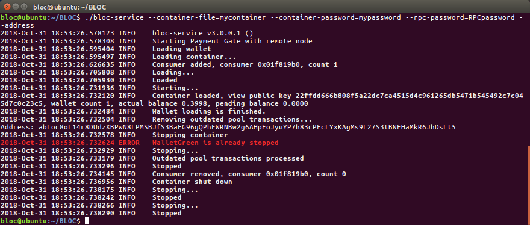

# What is BLOC-Service

This section describes **BLOC** integration process into your service with **BLOC e-commerce** solution called **bloc-service**.
bloc-service is the substitue of old **walletd** a HTTP server which provides JSON 2.0 RPC interface for [BLOC](https://bloc.money) payment operations and address management. **bloc-service** allows you to accept incoming payments, generate an address for each user via a robust API and much more features explained as follow.

## **Getting ready**

To start integration process you should follow this easy steps:

## **Downloading**

If you wish to compile **bloc-service** and **BLOCd** yourself you can download the [source Code](https://github.com/furiousteam/BLOC.git).

Binary distributions can be found: [here](https://github.com/furiousteam/BLOC/releases/latest).

Select the appropriate file for the target platform (Windows, Mac, Linux).

Binaries are provided in `.zip` format, while source code is provided in `.zip` and `.tar.gz` format.

## **Installing**

### Installing on Windows

Extract the *.zip* file (`BLOC-...-windows.zip`).

### Installing on Mac

Extract the *.zip* file:

```bash
unzip BLOC-...-mac.zip
```

### Installing on Linux

Extract the *.zip* file:

```bash
unzip BLOC-...-linux.zip
```

## **Synchronizing the Blockchain**

Here's a quick image of `BLOCd MAIN NET` in action:


Here's a quick image of `BLOCd TEST NET` in action:


Running `BLOCd` will start the **BLOCd** network daemon, which will connect to the network and begin downloading and verifying the BLOC blockchain.  

Because the blockchain is constantly growing, the file size always increases (the blockchain is currently over 2 GB), and **BLOCd must verify every block**, which is both CPU and disk intensive. An SSD with at least this much free disk space is recommended, unless you plan to use [remote nodes](../Using-remote-nodes). 

### Using Checkpoints

You can sync a fresh chain from block 0 much quicker by using checkpoints. Follow [this guide](../Using-checkpoints) to learn more.

### Windows

Run the `BLOCd.exe` executable extracted from the Windows binary zip:

### Mac / Linux

Run the `BLOCd` binary extracted from the `.zip` download:

```bash
./BLOCd
```

## **Ready to work with bloc-service**

Once **BLOCd** has been successfully synchronised we are ready to operate with **bloc-service**

The following exemples are made using a Linux system but the concept is the same for all the OS supported by the **bloc-service**.

bloc-service screenshot:


## **Command line options:**

This is the command line options available since the bloc-service v3.0

```
  Common Options:
  -c [ --config ] arg                configuration file
  -h [ --help ]                      produce this help message and exit
  -v [ --version ]                   Output version information
  --bind-address arg (=127.0.0.1)    payment service bind address
  --bind-port arg (=8070)            payment service bind port
  --rpc-password arg                 Specify the password to access the rpc 
                                     server.
  --rpc-legacy-security              Enable legacy mode (no password for RPC). 
                                     WARNING: INSECURE. USE ONLY AS A LAST 
                                     RESORT.
  -w [ --container-file ] arg        container file
  -p [ --container-password ] arg    container password
  -g [ --generate-container ]        generate new container file with one 
                                     wallet and exit
  --view-key arg                     generate a container with this secret key 
                                     view
  --spend-key arg                    generate a container with this secret 
                                     spend key
  --mnemonic-seed arg                generate a container with this mnemonic 
                                     seed
  -d [ --daemon ]                    run as daemon in Unix or as service in 
                                     Windows
  -l [ --log-file ] arg              log file
  --server-root arg                  server root. The service will use it as 
                                     working directory. Don't set it if don't 
                                     want to change it
  --log-level arg                    log level
  --SYNC_FROM_ZERO                   sync from timestamp 0
  --address                          print wallet addresses and exit
  --enable-cors arg                  Adds header 'Access-Control-Allow-Origin' 
                                     to walletd's RPC responses. Uses the value
                                     as domain. Use * for all.
  --scan-height arg                  The height to begin scanning a wallet from
```

## **Remote Node options:**

```
Remote Node Options:
  --daemon-address arg (=localhost)  daemon address
  --daemon-port arg (=2086)          daemon port
```

### --help

Display the help message and configuration settings.

#### Exemple

```
./bloc-service --help
```

**Expected results**


### --config arg (=myconf.conf)

Specify a configuration file to start bloc-service. This is much more simple to use if you have a particular configuration and you do not want to type all the arguments while launching bloc-service.

#### Exemple

```
./bloc-service --config=myconf.conf
```

### --version

Display the current version of bloc-service

#### Exemple

```
./bloc-service --version
```

**Expected results**


## **Command line arguments**

All the following command line options and arguments must be used when start **bloc-service**

* You can use them directly in the command line and provided examples
* Or you can use them in the config file which is the best option

### --bind-address arg (=127.0.0.1)**

* Interface for bloc-service RPC
* Started by default on 127.0.0.1 when running either you specified it `./bloc-service --config=myconf.conf`
* If you want to use local only : 127.0.0.1
* if you want to open to public : 0.0.0.0d)
* More details about the [JSON bloc-service API](../wallet-rpc-api.md)

#### Exemple

```
./bloc-service --bind-address=127.0.0.1 --container-file=mycontainer --container-password=mypassword --rpc-password=RPCpassword
```

### --bind-port arg (=8070)

* Port for bloc-service RPC
* Started by default on 8070 when running either you specified it `./bloc-service --config=myconf.conf`
* You can change the port here for ex 8071
* More details about the [JSON bloc-service API](../wallet-rpc-api.md)

#### Exemple

```
./bloc-service --bind-port=8071 --container-file=mycontainer --container-password=mypassword --rpc-password=RPCpassword
```

### --rpc-password

Setup the rpc password to connect to bloc-service

#### Exemple

```
./bloc-service --container-file=mycontainer --container-password=mypassword --rpc-password=RPCpassword
```

### --rpc-legacy-security arg (=8070)

* Enable legacy mode (no password for RPC). 
* **WARNING: INSECURE. USE ONLY AS A LAST RESORT.**

#### Exemple

```
./bloc-service --container-file=mycontainer --container-password=mypassword --rpc-legacy-security
```

### --container-file=(arg)

* Container file is the only file that stores all data required to run your bloc-service. It contains user addresses and private keys required to operate them.
* This function works only coupled with `--container-password` and `--generate-container`

### --container-password=(arg)

* Container password file is the only file that stores all data required to run your bloc-service. It contains user addresses and private keys required to operate them.
* This function works only coupled with `--container-file` and `--generate-container`

### --generate-container

* Generate a new container file with one wallet and exit.
* This function works only coupled with `--container-file` and `--container-password`

#### Exemple

```
./bloc-service  --container-file=mycontainer --container-password=mypassword --generate-container 
```

**Expected results**


## **Create .CONF file**

* Create a txt file with your favorite text editor and open it.
* Check all your required parameters and enter them like in this exemple
* You need to type the arguments without the '--'

**Expected results**


#### Example

```
container-file = mycontainer
container-password = mypassword
daemon-address = 127.0.0.1
daemon-port = 2086
bind-port = 8070
bind-address = 127.0.0.1
rpc-password = RPCpassword
```

[Download Example](images/bloc-service/myconf.conf)

* Place this file next to BLOCd
* Save it under the name `myconf.conf`

**Expected results**


**Notes**

* Config file path is relative to current working directory, not server root.
* Options `container-file` and `container-password` should ALWAYS be set (in either command line or config file mode).
* Options `container-file` and `log-file` options are relative to `server-root`. `server-root` default is the current working directory.


## **Generate a new wallet**

To start using **bloc-service** you must first generate a container.
Container file is the only file that stores all data required to run your service. It contains user addresses and private keys required to operate them.
**Make sure to backup this file regularly**.

To generate a new container you should run the following command:

```
./bloc-service --container-file=mycontainer --container-password=mypassword --generate-container 
```

* `mycontainer` is the container file name and a path to it (relative or absolute); path is optional in this argument, specifying only a container name will result in new file located in the same folder as **bloc-service** 
* `mypassword` is a secret password for the new wallet & container file.
* `generate-container` option tells **bloc-service** to generate container file and exit.

**Expected results**


*Note: if `mycontainer` exists **bloc-service** will show you the notification and will ask you to provide a different name*

If the operation was successful you will get a corresponding message with your new **BLOC** address. At the same time **bloc-service** will save your container on the local disk (in the same folder where **bloc-service** is located and shut down.


## **Start bloc-service**

* To start **bloc-service** RPC wallet you can use both command line and config file. Config file allows you to configure your settings only once and use `--config` option further.
* The command below launches **bloc-service** RPC Wallet with a specific config file:

```
./bloc-service --config=myconf.conf
```

* You may specify BLOC config directly through console arguments. Here is the same config file as above in console: 

```
./bloc-service --container-file=mycontainer --container-password=mypassword --daemon-address=127.0.0.1 --daemon-port=2086 --bind-address=127.0.0.1 --bind-port=8070 --rpc-password=RPCpassword 
```

**Expected results**

Start with command line:


Start with myconf.conf:


## **Restore a existing BLOC wallet with bloc-service**##

We have different option to recover a wallet using **bloc-service**

### Using a old Walletd container file

If you were using Walletd that come with the previous version of BLOC, the previous container file is compatible with the new version. This is the step to follow:

* Copy the your previous configuration file `yourfile.conf` and copy the acual container file `mycontainer`
* Paste this 2 files next to the new `bloc-service` and `BLOCd`
* Open `yourfile.conf` 
* Make sure you remove this line `testnet = no` we are not using this field anymore
* Edit like this:

```
container-file = mycontainer
container-password = mypassword
daemon-port = 2086
bind-port = 8070
bind-address = 127.0.0.1
rpc-password = RPCpassword
```
* Save the file
* Start `bloc-service` using this configuration file
* ```./bloc-service --config=myconf.conf```
* Please wait until the synchronisation is complete
* Your wallet is ready to be used with the **bloc-service** RPC API.

**Expected results**


### Using your private spend key and view key

If you already have a [BLOC Wallet](../wallet/Making-a-Wallet.md) you must know your **private spend key** and your **private view key** to restore your wallet using **bloc-service**. To find how to generate view your private key using your favorite BLOC Wallet software please refer to the . [Wallet manuals available](../wallet/Making-a-Wallet.md).

* Create a txt file with your favorite text editor and open it.
* Check all your required parameters and enter them like in this exemple
* You need to type the arguments without the '--'
* Place this file next to BLOCd
* Save it under the name `myconf.conf`

```
container-file = mycontainer
container-password = mypassword
daemon-port = 2086
bind-port = 8070
bind-address = 127.0.0.1
rpc-password = RPCpassword
```
* Save the file

#### Generate a new container file

Generate a new container file with the following `--view-key` and `--spend-key` commands:

```
Enter your details:
./bloc-service --container-file=mycontainer --container-password=mypassword --view-key=myviewkey --spend-key=myspendkey --generate-container

Example:
./bloc-service --container-file=mycontainer --container-password=mypassword --view-key=e82ebf49b74fccd754e39ac3ca6fabca35277b012dfce0cf8921c216396b3108 --spend-key=cda47a19e5d433060ab79c885817cd20fc394dc7043ac875678a3698804ede01 --generate-container
```

**Expected results**


* Start `bloc-service` using your configuration file

```
./bloc-service --config=myconf.conf
```

* Your wallet is now loaded
* Please wait until the synchronisation is complete

**Expected results**


* Your wallet is ready to be used with the **bloc-service** RPC API.

**Expected results**


### Using your mnemonic-seed

If you already have a [BLOC Wallet](../wallet/Making-a-Wallet.md) created after the launch of the **BLOC V3.0** then you you must know your **mnemonic-seed** to restore your wallet using **bloc-service**. To find how to generate view your mnemonic-seed using your favorite **BLOC** Wallet software please refer to the [Wallet manuals available](../wallet/Making-a-Wallet.md).

* Create a txt file with your favorite text editor and open it.
* Check all your required parameters and enter them like in this exemple
* You need to type the arguments without the '--'
* Place this file next to BLOCd
* Save it under the name `mycontainer.conf`

```
container-file = mycontainer
container-password = mypassword
daemon-port = 2086
bind-port = 8070
bind-address = 0.0.0.0
rpc-password = RPCpassword
```
* Save the file

#### Generate a new container file

Generate a new container file with the following `--mnemonic-seed` commands:

```
Enter your details:
./bloc-service --container-file=mycontainer --container-password=mypassword --mnemonic-seed="your-mnemonic-seed" --generate-container

Example:
./bloc-service --container-file=mycontainer --container-password=mypassword --mnemonic-seed="jazz border dude orphans worry absorb slackens public drinks bovine evenings hurried roped jaws drinks snug directed pirate behind zero null cuisine agreed alchemy directed" --generate-container
```

**Expected results**


* Start `bloc-service` using your configuration file

```
./bloc-service --config=myconf.conf
```
* Your wallet is now loaded
* Please wait until the synchronisation is complete

**Expected results**


* Your wallet is ready to be used with the **bloc-service** RPC API.

**Expected results**


### --address

Start `bloc-service` to display the 1st wallet address in the container and exit

```
./bloc-service --container-file=mycontainer --container-password=mypassword --rpc-password=RPCpassword --address
```

**Expected results**




### --log-level

Start `bloc-service` to display the 1st wallet address in the container and exit

```
./bloc-service --container-file=mycontainer --container-password=mypassword --rpc-password=RPCpassword --address
```

**Expected results**


__________________________________________________________________________________________________


## BLOC-DEVELOPER

Make sure you visit the dedicated website [BLOC-DEVELOPER.com](https://bloc-developer.com) to find out more details and test your application.

If anything is missing or seems incorrect, please check the [GitHub issues](https://github.com/furiousteam/BLOC-wiki/issues) for existing known issues or [create a new one](https://github.com/furiousteam/BLOC-wiki/issues/new).