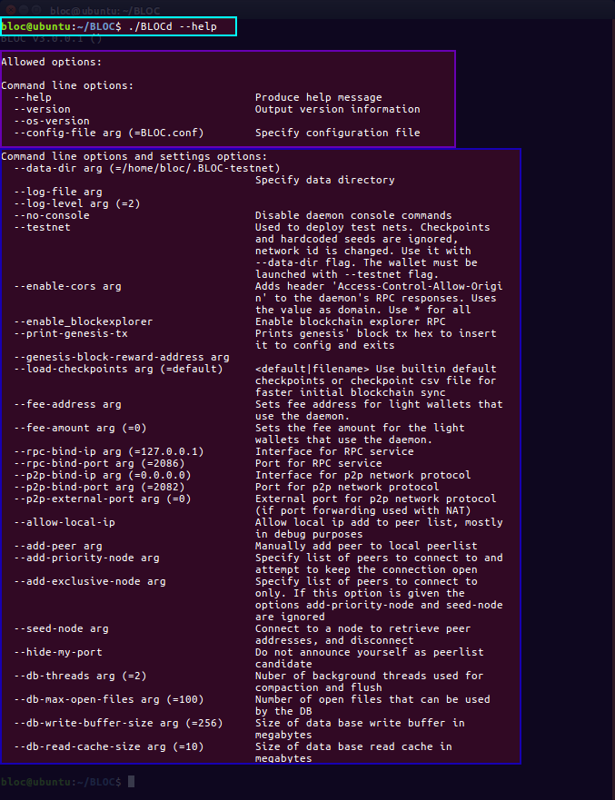
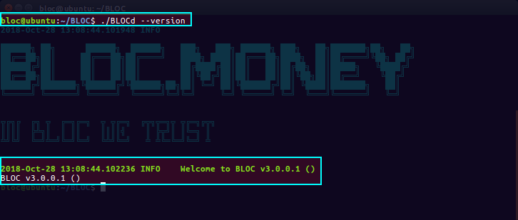
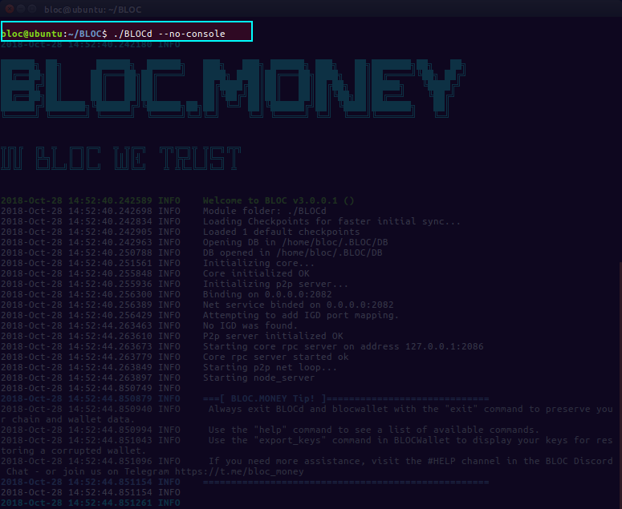
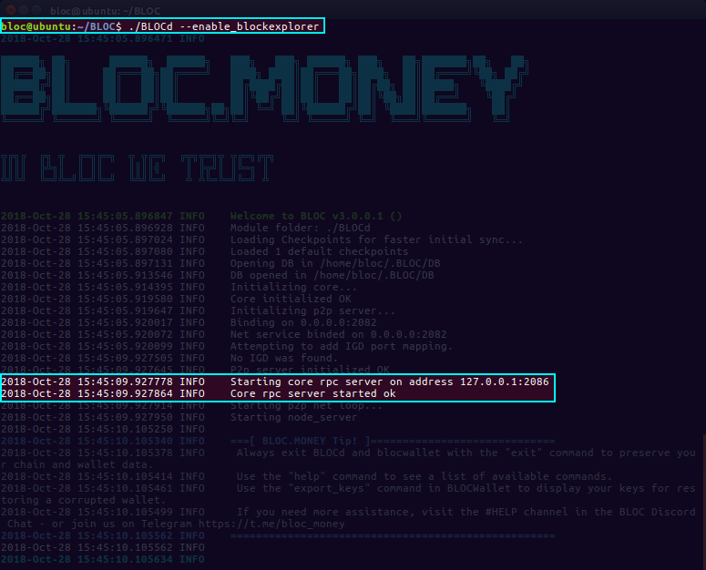
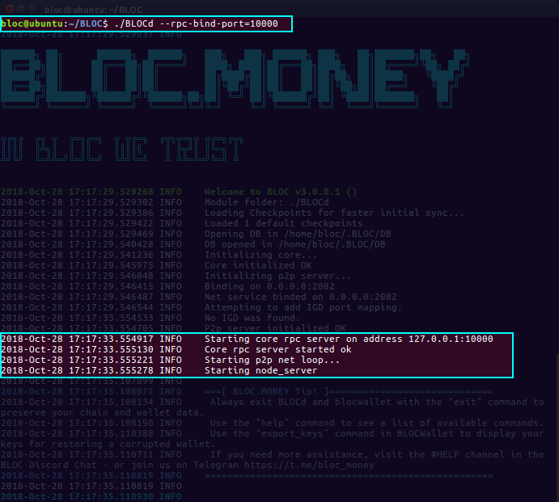

# BLOCd Command line options

The following exemples are made using a Linux system but the concept is the same for all the OS supported by the BLOCd.

**BLOCd Screenshot**


## Command line options:

This is the command line options available since the BLOCd v3.0

```
  --help                                Produce help message
  --version                             Output version information
  --os-version 
  --config-file arg (=BLOC.conf)        Specify configuration file
```

### --help

Display the help message and configuration settings.

#### Exemple

```
./BLOCd --help
```

**Expected results**




### --version

Display the version information

#### Exemple

```
./BLOCd --version
```

**Expected results**




### --os-version

Display the operating system version information

#### Exemple

```
./BLOCd --os-version
```

**Expected results**


### --config-file arg (=BLOC.conf)

Specify a configuration file to start BLOCd. This is much more simple to use if you have a particular configuration and you do not want to type all the arguments while launching BLOCd.

#### Exemple

```
./BLOCd --config-file=BLOC.conf
```

**Expected results**


## Create .CONF file

* Create a txt file with your favorite text editor and open it.
* Check all your required parameters and enter them like in this exemple
* You need to type the arguments without the '--'
* Place this file next to BLOCd

#### Example

```
enable-cors=*
fee-address=abLoc8oL14r8DUdzXBPwN8LPMSBJfS3BaFG96gQPhFWRNBw2g6AHpFoJyuYP7h83cPEcLYxKAgMs9L27S3tBNEHaMkR6JhDsLt5
fee-amount=5
rpc-bind-ip=0.0.0.0
enable_blockexplorer=yes
```
[Download Example](images/BLOCd/command-line-options/BLOC.conf).

**Expected results**


## Command line options and settings options


This is the command line options available since the BLOCd v3.0

```
  --data-dir arg (=/home/bloc/.BLOC)  Specify data directory
  --log-file arg
  --log-level arg (=2)
  --no-console                        Disable daemon console commands
  --testnet                           Used to deploy test nets. Checkpoints and
                                      hardcoded seeds are ignored, network id 
                                      is changed. Use it with --data-dir flag. 
                                      The wallet must be launched with 
                                      --testnet flag.
  --enable-cors arg                   Adds header 'Access-Control-Allow-Origin'
                                      to the daemon's RPC responses. Uses the 
                                      value as domain. Use * for all
  --enable_blockexplorer              Enable blockchain explorer RPC
  --print-genesis-tx                  Prints genesis' block tx hex to insert it
                                      to config and exits
  --genesis-block-reward-address arg
  --load-checkpoints arg (=default)   <default|filename> Use builtin default 
                                      checkpoints or checkpoint csv file for 
                                      faster initial blockchain sync
  --fee-address arg                   Sets fee address for light wallets that 
                                      use the daemon.
  --fee-amount arg (=0)               Sets the fee amount for the light wallets
                                      that use the daemon.
  --rpc-bind-ip arg (=127.0.0.1)      Interface for RPC service
  --rpc-bind-port arg (=2086)         Port for RPC service
  --p2p-bind-ip arg (=0.0.0.0)        Interface for p2p network protocol
  --p2p-bind-port arg (=2082)         Port for p2p network protocol
  --p2p-external-port arg (=0)        External port for p2p network protocol 
                                      (if port forwarding used with NAT)
  --allow-local-ip                    Allow local ip add to peer list, mostly 
                                      in debug purposes
  --add-peer arg                      Manually add peer to local peerlist
  --add-priority-node arg             Specify list of peers to connect to and 
                                      attempt to keep the connection open
  --add-exclusive-node arg            Specify list of peers to connect to only.
                                      If this option is given the options 
                                      add-priority-node and seed-node are 
                                      ignored
  --seed-node arg                     Connect to a node to retrieve peer 
                                      addresses, and disconnect
  --hide-my-port                      Do not announce yourself as peerlist 
                                      candidate
  --db-threads arg (=2)               Nuber of background threads used for 
                                      compaction and flush
  --db-max-open-files arg (=100)      Number of open files that can be used by 
                                      the DB
  --db-write-buffer-size arg (=256)   Size of data base write buffer in 
                                      megabytes
  --db-read-cache-size arg (=10)      Size of data base read cache in megabytes
```

### --data-dir arg (=/home/bloc/.BLOC)

* Specify another data directory than the original one set by BLOCd.
* The data directory contains the blockchain files from BLOC.
* Creating a new empty data directory will resynch the blockchain from 0.

#### Exemple

```
./BLOCd --data-dir=/home/bloc/.MYFOLDER
```

**Expected results**


**Possible Errors**
```
ERROR   Exception: Directory does not exist: /home/bloc/.MYFOLDER
```
Remark: Make sure you have created the folder you want to use before start BLOCd


### --log-file arg (=test.log)

* Specify another log file than the original one created by BLOCd named (BLOCd.log)
* The specified log file will be created in the same folder where BLOCd was started

#### Exemple

```
./BLOCd --log-file=test.log
```

**Expected results**


File created next to BLOCd:


### --log-level arg (=2)

* Specify another log file than the original one created by BLOCd with a level 2
* There is 5 different level. The higher you choose, the more details you get.
* Log level must be 0...5

#### Exemple

```
./BLOCd --log-level=2
```

**Expected results**


### --no-console

* Disable the BLOCd daemon console.
* Can be usefull in case you do not want to allow anyone to run commands through the BLOCd daemon
* As you can see on the screenshot, nothing happen when running the 'help' command

#### Exemple

```
./BLOCd --no-console
```

**Expected results**




### --testnet

* Used to deploy test nets. Checkpoints and hardcoded seeds are ignored, network id is changed. Use it with --data-dir flag. The wallet must be launched with --testnet flag.
* We are not using this function since BLOC has a dedicated [TESTNET](../API/BLOC-TESTNET.md)


### --enable-cors arg

* Adds header 'Access-Control-Allow-Origin' to the daemon's RPC responses.
* Uses the value as domain
* Use * for all

#### Exemple

```
./BLOCd --enable-cors=*
./BLOCd --enable-cors=yourdomain.com
```

**Expected results**


**Response Headers**
```
HTTP/1.1 200 OK
Access-Control-Allow-Origin: *
Content-Length: 123
Content-Type: application/json
Server: CryptoNote-based HTTP server

or

HTTP/1.1 200 OK
Access-Control-Allow-Origin: yourdomain.com
Content-Length: 123
Content-Type: application/json
Server: CryptoNote-based HTTP server
```

### --enable_blockexplorer

* To enable block explorer API access (like for getblocks, gettransactionpool, etc.)

#### Exemple

```
./BLOCd --enable_blockexplorer
```

**Expected results**




### --print-genesis-tx

* Prints genesis' block tx hex to insert it to config and exits
* Use this method if you like to fork BLOC to generate a new 'GENESIS_COINBASE_TX_HEX' and create your own cryptocurrency
* More details can be found in the CryptoNoteConfig.h

#### Exemple

```
./BLOCd --print-genesis-tx
```

**Expected results**


### --genesis-block-reward-address arg

* Premine wallet address
* Use this method combined with the previous one if you like to generate a premine wallet into your new created cryptocurrency
* More details can be found in the CryptoNoteConfig.h

#### Exemple

```
./BLOCd --print-genesis-tx --genesis-block-reward-address=abLoc9fgn3Lcirw7U6nthwTBgwoffUJajEHr3vtSb9nPPL91XWG1Brt5TNCKRZojEbCGhMdSSjpCQfiMnfGEzMQbfs25N6HC6JR
```

**Expected results**


### load-checkpoints arg (=default) <default|filename>

* Use builtin default checkpoints
* Or use checkpoint csv file for faster initial blockchain sync

#### Exemple

```
./BLOCd --load-checkpoints=checkpoints.csv
```

**Expected results**

[Cick here](../using-check-points-with-BLOCd.md).


### --fee-address arg

* This is a new feature implemented in BLOC v3.0
* Read more about [Nodes Fees](../wallets/Using-remote-nodes.md).
* Sets fee address for light wallets that use the daemon
* Make sure you combine this argument with --fee-amount

#### Exemple

```
./BLOCd --fee-address=abLoc9fgn3Lcirw7U6nthwTBgwoffUJajEHr3vtSb9nPPL91XWG1Brt5TNCKRZojEbCGhMdSSjpCQfiMnfGEzMQbfs25N6HC6JR
```


### --fee-amount arg (=0)

* This is a new feature implemented in BLOC v3.0
* Read more about [Nodes Fees](../wallets/Using-remote-nodes.md).
* Sets fee amount for light wallets that use the daemon
* Make sure you combine this argument with --fee-address
* Remember we are using Atomic Units
* --fee-amount=1 means 0.0001 BLOC fees will be sent to the --fee-address specified
* --fee-amount=1000 means 1 BLOC fees will be sent to the -fee-address specified

#### Exemple

```
./BLOCd --fee-address=abLoc9fgn3Lcirw7U6nthwTBgwoffUJajEHr3vtSb9nPPL91XWG1Brt5TNCKRZojEbCGhMdSSjpCQfiMnfGEzMQbfs25N6HC6JR --fee-amount=1
```

**Expected results**


### --rpc-bind-ip arg (=127.0.0.1)

* Interface for RPC service
* Started by default on 127.0.0.1 when running ./BLOCd
* If you want to use local only : 127.0.0.1
* if you want to open to public : 0.0.0.0
* More details about the [HTTP RPC API](../daemon-http-rpc-api.md)
* More details about the [JSON RPC API](../daemon-json-rpc-api.md)

#### Exemple

```
(Public)
./BLOCd --rpc-bind-ip=0.0.0.0

(Local)
./BLOCd --rpc-bind-ip=127.0.0.1
```

**Expected results**


### --rpc-bind-port arg (=2086)

* Port for the RPC service
* Started by default on 2086 when running ./BLOCd
* You can change this port here
* More details about the [HTTP RPC API](../daemon-http-rpc-api.md)
* More details about the [JSON RPC API](../daemon-json-rpc-api.md)

#### Exemple

```
./BLOCd --rpc-bind-port=10000
```

**Expected results**




### --p2p-bind-ip arg (=0.0.0.0) 

* Interface for p2p network protocol
* Started by default on 0.0.0.0 when running ./BLOCd
* If you want to use local only : 127.0.0.1
* if you want to open to public : 0.0.0.0

#### Exemple

```
(Public)
./BLOCd --p2p-bind-ip=0.0.0.0

(Local)
./BLOCd --p2p-bind-ip=127.0.0.1
```
**Expected results**


### --p2p-bind-port arg (=2082)

* Port for p2p network protocol
* Started by default on 2082 when running ./BLOCd
* You can change this port here

#### Exemple

```
./BLOCd --p2p-bind-port=3000
```

**Expected results**


### --p2p-external-port arg (=0)

* External port for p2p network protocol (if port forwarding used with NAT)

#### Exemple

```
./BLOCd --p2p-external-port=5000
```

**Expected results**


### --allow-local-ip

* Allow local ip add to peer list, mostly in debug purposes

#### Exemple

```
./BLOCd --allow-local-ip
```

**Expected results**


### --add-peer arg

* Manually add peer to local peerlist

#### Exemple

```
./BLOCd --add-peer=PEER.IP.ADDRESS
```


### --add-priority-node arg

* Specify list of peers to connect to and attempt to keep the connection open

#### Exemple

```
./BLOCd --add-priority-node=NODE.IP.ADDRESS
```


### --add-exclusive-node arg

* Specify list of peers to connect to only.
* If this option is given the options add-priority-node and seed-node are ignored

#### Exemple

```
./BLOCd --add-exclusive-node=NODE.IP.ADDRESS
```


### --seed-node arg

* Connect to a node to retrieve peer addresses, and disconnect

#### Exemple

```
./BLOCd --seed-node=NODE.IP.ADDRESS
```


### --hide-my-port

* Do not announce yourself as peerlist candidate

#### Exemple

```
./BLOCd --hide-my-port
```


### --db-threads arg (=2)

* Number of background threads used for compaction and flush
* Default is 2

#### Exemple

```
./BLOCd --db-threads=2
```


### --db-max-open-files arg (=100)

* Number of open files that can be used by the DB
* Default is 100

#### Exemple

```
./BLOCd --db-max-open-files=100
```


### --db-write-buffer-size arg (=256)

* Size of data base write buffer in megabytes
* Default is 256

#### Exemple

```
./BLOCd --db-write-buffer-size=256
```


### --db-read-cache-size arg (=10)

* Size of data base read cache in megabytes
* Default is 10

#### Exemple

```
./BLOCd --db-read-cache-size=10
```


[BLOC](https://bloc.money) believes that the cryptocurrency era will require a broader development community than just a few leading crypto platforms. For this reason, **BLOC** is providing an open platform that enables companies to build their own products using **BLOC API**. It is very easy to integrate **BLOC** payment into your website/ecommerce/phisical store/application.

**BLOC** has unfolded and advanced a set of key methods to portray universal and integrated access to act as an alternative or replace the current banking system in regards to the expensive and restricted POS contactless terminals.

We also have some specific language bindings to make integration easier. You can find more details on the [Ressources page](../API/Resources.md).

## BLOC-DEVELOPER

Make sure you visit the dedicated website [BLOC-DEVELOPER.com](https://bloc-developer.com) to find out more details and test your application.

If anything is missing or seems incorrect, please check the [GitHub issues](https://github.com/furiousteam/BLOC-wiki/issues) for existing known issues or [create a new one](https://github.com/furiousteam/BLOC-wiki/issues/new).