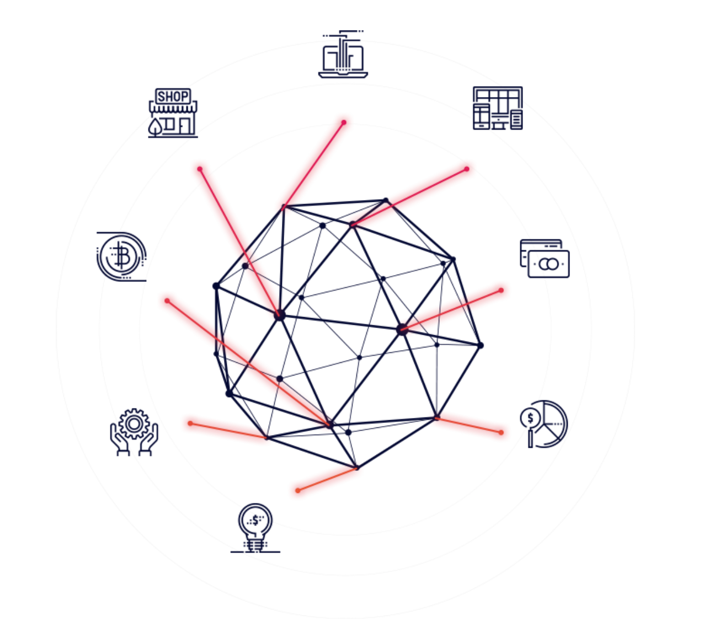
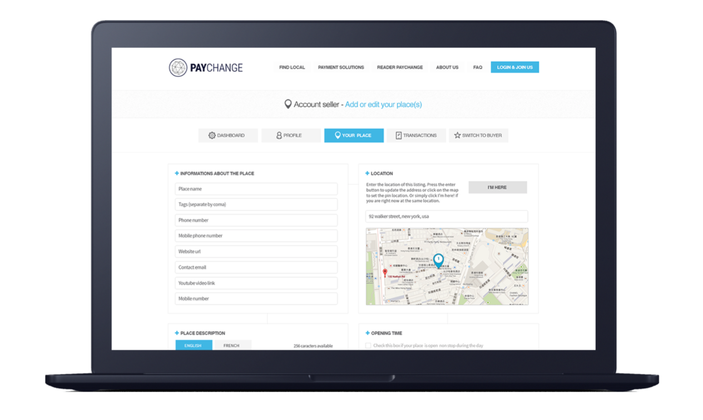
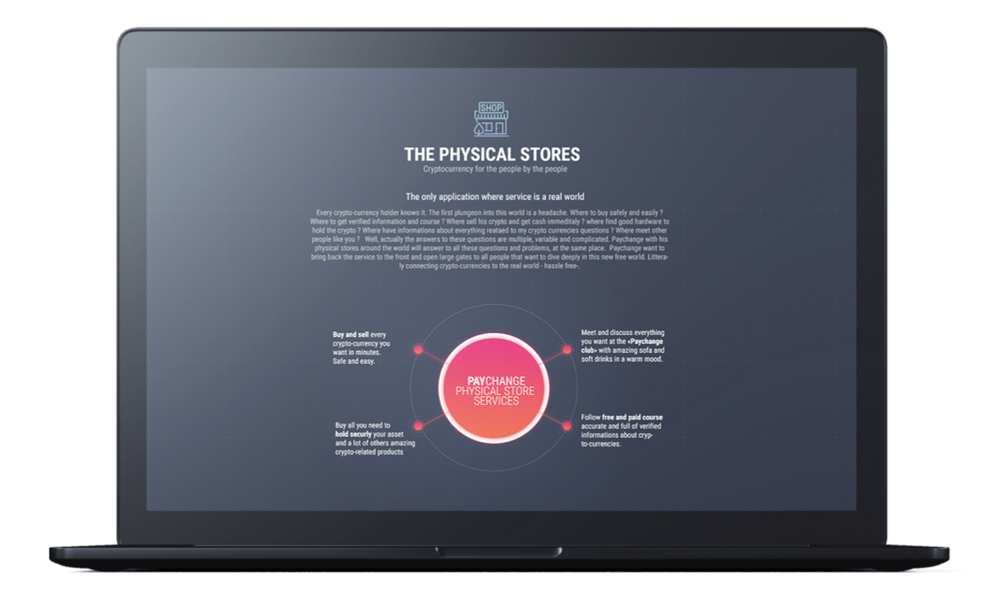

# **Connecting the real world to crypto-currencies**

BLOC is building the ecosystem for the Cryptocurrency era. People will be able to use, spend, exchange any type of cryptocurrency in the same way as they could with any other currency, but in a quicker, cheaper and more secure environment than it is currently possible in any traditional bank or other current exchange.

BLOC with PAYCHANGE will be the core which will interlock the limited financial world in today's societies and a future Cryptoeconomy with limitless nationwide possibilities.

"Most of the technology for this financial revolution already exists: Apple Pay, Samsung Pay, Alipay; the world’s biggest banks and payment platforms have already installed more than 42 million contactless payment terminals throughout the world, a number that is proliferating."

PAYCHANGE will fully take advantage of the global contactless phenomenon and provide the use of cryptocur- rencies instead of conventional payment cards using fiat currencies through mobile devices.

PAYCHANGE aims to provide services required to change the way we pay and get paid in our everyday life, by delivering one of the best Cryptocurrency online secure platforms to use, buy, sell, and transfer, while connec- ting buyers and sellers.

## **Cryptocurrencies mass adoption is near.**
**PAYchange is the trigger**

It’s not easy to understand how to buy and store securely cryptocurrencies online or in the real life for people that are not familiar with this digital universe.

There is no product that combine cryptocurrencies and standard payment methods like wire transfer, Credit/debit card, Coinbase and that allow you to choose how you would like to proceed with the payment and where you would like to receive the payment.

There is no website and application where you can find a worldwide map with all the places accepting crypto-currencies in a very effective and simple way to redirect from buyers to the sellers.

There is no physical place around the world where you can follow information classes or a place where to buy cryptocurrencies locally, while getting answers to all the questions a customer might have

PAYCHANGE focuses on creating bridges between the real world and crypto-currencies. This ables individuals to buy and/or sell online or in real life while using cryptocurrencies in a simple and effective manner with an innovative approach.

**PAYCHANGE will have physical stores in different country’s** around the world where you can buy, sell cryptocur- rencies hassle free but also get informations, courses, buy accessories (hardware wallet) and more Paychange application for mobile and website will allow you to pay directly with BLOC and any cryptocurren- cies account through the different API of Coinbase, Bittrex, Binance but also your visa credit/debit card or your bank account.

PAYCHANGE application and website will allow businesses owners to get paid with any cryptocurrency or standard payment method like bank transfer, credit /debit card and let you choose where you want to receive the payment (in crypto, on your bank account in fiat)

PAYCHANGE is not a crypto bank and not a wallet. **We do not store our customer's assets**. PAYCHANGE focus on services and will change the way we use payment forever by bringing and connecting the cryptocurrencies and other standard payment methods to the real everyday world, for everyone with a modern, secure, and practical approach.

Every cryptocurrency enthusiast knows it. The first dive into this world is a headache. Where is the best place to buy safely and efficiently? Where to get verified information and who to trust ? Where to sell cryptocurrencies and get cash immediately? Which hardware to use to store my cryptocurrencies? Where to meet people like you?

PAYCHANGE is the answer to all these questions. PAYCHANGE will bring back the service to the streets and open large gates to all the people that are ready to jump in the cryptocurrencies Era.

## **PAYCHANGE’s Functionality**

### PAYCHANGE website phase 1 (early 2019).

- Cryptocurrencies listing with description details and price charts.
- PAYCHANGE Swap gives you the power to quickly swap your cryptocurrency assets in the most easy and secure environment.
- PAYCHANGE is not a wallet, as we do not store assets.
- The PAYCHANGE engine is developed by our team allowing us the make almost instant transactions between cross blockchain.
- Integrating most secure cryptocurrencies wallet service such as Coinbase, Binance ...
- Buy/sell cryptocurrency with fiat using wire bank transfer.
- Integrating standard payment method such as Apple Pay, Visa credit/debt card, bank wire transfer.
- Choose the way you want to pay and get paid while visiting a PayChange partner.
- International transfers to any blockchain wallet’s account, including bank cards, without limits or restrictions (other than those applied for anti-money-laundering purposes).

### Buyer’s account:

- Search and find your favorite store where you can pay the way you want Interact with the business page, leave comments, like, feedback Receipt of your purchase at any Paychange partner store
- Access to PayChange Swap
- Receive notifications including geo-notifications & discounts from your favorite store

### Seller’s account:

- Business page management. Business owners will be able to add their business to the Paychange revolutionary listing increasing instantly the brand awareness of your business and getting access to the soon largest cryptocurrencies buyers database.
- Interact with customers using notification from your business page
- Complete statistics such as reviews, transactions, checkin, notifications ...
- All your transactions in one place including a receipt

##**Release date**

We plan to release the 1st version of PAYCHANGE before the end of this year.

**Decentralised Fuel to Power the Engine**
All the PAYCHANGE products and services will be invoiced in the currency BLOC.

Almost 2 years of hard work to be able to bring this project to life. We are pleased to introduce today a beta version of [TRAAKX](http://traakx.com/traakx/). The world most advanced sport community combined with artificial intelligence. Extract impressive data from any [GoPro footage](https://gopro.com) footage to compare yourself with other riders from the same sport and increase your level.

Later we are going to release a [TRAAKX custom hardware](TRAAKX-hardware.md) to get more precise data than the GoPro.

How height did you go ? How fast ? Watch out [impressive runs with synchronised data](http://traakx.com/traakx/run/details?id=237). There is no lies anymore. A new proof of training is born. Welcome to a new era for athletes with endless possibilities.

Blockchain offers an unprecedented level of transparency for transactions: you don’t need to rely on a middleman to make sure that a certain transaction took place and was processed correctly. This allows creating a decentralized system that makes crowdfunding easier. So much so that sports players, especially young athletes, will be able to boost their careers by getting public support — and their growing professionalism will in turn bring in more and more money.

**TRAAKX** the first project to tokenize athletes, aims to do exactly that: revolutionize the sport talent management system by using custom developed hardware to track athletes performances and blockchain technology to decentralize it and facilitate support for athletes, then share the value with the community.

## **What is TRAAKX ?**

**TRAAKX** was created by the [FuriousTeam](https://furiousteam.com) and is part of the [BLOC Ecosystem](Ecosystem.md). We started this project long time ago but it tooks us so much work, money and ennergy including many failure, a very long path to be able to write this post today.

Every service or products to buy/sell from the TRAAKX community will be available in the cryptocurrency [BLOC](https://bloc.money) only.

**TRAAKX** is the first social network dedicated to athletes and sports men. Share your training session on TRAAKX, follow the pros and their advices, improve your skills, get instant access to all your runs, a worldwide rank and many more in our application that you will be able to download for free on the App Store and Google Play Store.

## **TRAAKX Custom Hardware**

Having so much data from a GoPro is cool but the sensors used on the GoPro are not accurate enough to be able to analize a complete run, specially if you are using it on the water. The GPS takes a lot of time to calibrate and can sometime gives bad data until it found the correct calibration.

For this reason we decided to build a dedicated hardware. [TRAAKX custom hardware](TRAAKX-hardware.md) is a device which is able to record movement and position in multiple axes. All this is done using a micro controller which gathers data from the sensors and stores it on a micro SD card in order to communicate over wifi and send the data for analysis procedures to the TRAAKX server and then receive the extracted data and display them in a graphical user interface.

## **How does it look in real life ?**

We have tested TRAAKX on [Franky Zapata](https://twitter.com/frankyzapata). You may have seen him already with [multi millions views on Youtube](https://www.youtube.com/watch?v=-kB-BGMXxZc) riding his Flyboard Air. Franky is a French entrepreneur and it was a great experience to test **TRAAKX** during the last RedBull Air Race in Cannes.

Check out the video:

You can see the impressive run data [on the TRAAKX website](http://traakx.com/traakx/run/details?id=237). Franky Zapata Reaching 158 km/h + on a flying jetpack called the Flyboard Air ! **The future is NOW**.

## **How does it work ?**

It’s easy. It works with a GoPro. All you need to do is record yourself while you are doing your sport. Jump as high as you can, run or ride as fast as you can.
**To make it short: Just send it ! We call this a run.**

Once you have recorded your run you can use the [TRAAKX website](http://traakx.com/traakx/) or the TRAAKX app for iPhone (curently only available in BETA) to upload your run to generate impressive data you never seen before, share it with the community and compare yourself with other athletes.

## **What kind of data it is ?**

We are using the GoPro sensors such as the GPS, accelerometer.. and a private algorithm to convert this raw data and synchronise them together on a nice and easy to use interface showing charts such as distance, altitude, Gforce, GPS track, Roll, Pitch and much more details.

## **A new Proof Of Training is born**

Now it’s easy to track the progress of an athlete, make sure he’s training properly and regulary. Just watch the video embedded with the TRAAKX datas and check out the training session. [TRAAKX website](http://traakx.com/traakx/).

## **Athletes Will Be Viewed As Assets**

Much like companies that trade on a stock market, every athlete will have a market price in BLOC following his market dominance. The price of a share will increase as the athlete makes progress.

There will be lots of factors influencing the token price: a lucrative deal with a big brand will cause it to skyrocket, while a massive loss to a weaker opponent will make his market dominance slump. In addition to success in sports, there will be other ways for athletes to enhance their value, including a strong social media presence, charitable initiatives, sponsorship contracts, and licensing their name to a brand.

For athletes to be listed on the **TRAAKX** market: it can be done automatically at some stage of career development (reaching a certain level by uploading a **TRAAKX run**), or voluntarily when an athlete decides to get listed.

Also, there is bound to be speculation, long-term and short-term investments, data mining and complex models to determine profitable strategies, and other features of the stock market.

When you buy a [BLOC](https://bloc.money) coin, you help to support an athlete; BLOC coin can then be redeemed to get a share of their income, endorsements at a significant discount, training time, sponsoring, and other goodies. This new approach has the potential to change the whole industry in just a decade.

## **Tokenization Will Fuel Interest In The Greater Domain Of Sports**

As bitcoins and other cryptocurrencies are becoming revolutionary, individuals who previously had no particular interest in blockchain are now always kept up to date with the development of these advanced technologies.

As more individuals will be willing to invest in sports cryptocurrency, the market will grow, and a similar situation as the bitcoin will happen to the domain of sports. Therefore, the growing audience across a global scale will create a boost in the sports market.

## **Future of TRAAKX**

Once the iPhone app will be available on the app store it will be already a huge progress. Then we will have to work on implementing the new features of TRAAKX to include the blockchain layer part. In the same time we need to finish the hardware. This is still a long time process but we are on the right path.

Are you ready for the challenge ? Dream big. Ride bigger with [TRAAKX](http://traakx.com) and [BLOC](https://bloc.money).

## **Release date**

We plan to release the 1st version of the TRAAKX APP before the end of this year. The hardware is still under development at this stage.

## **Decentralised Fuel to Power the Engine**

All the TRAAKX products and services will be invoiced in the currency [BLOC](https://bloc.money).