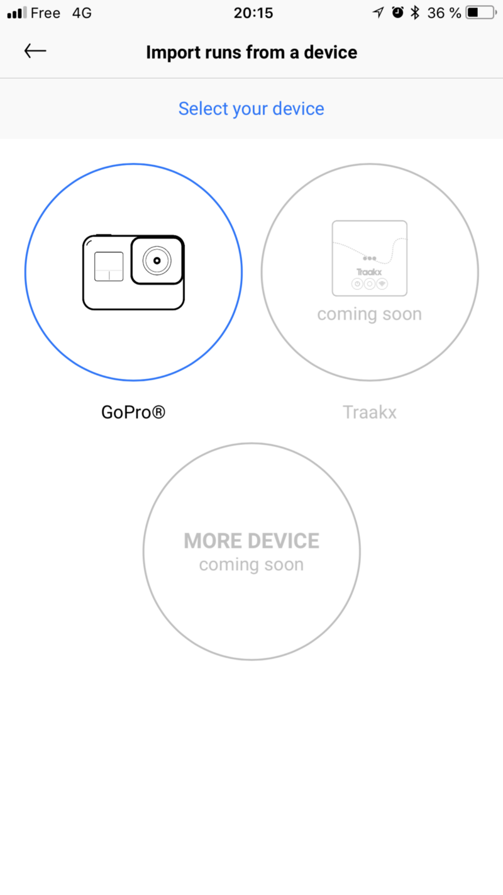
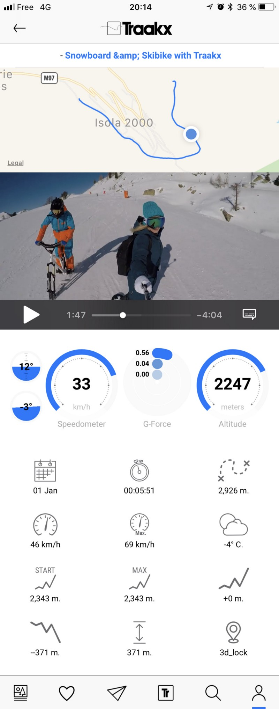

# **How to access the beta version of TRAAKX**

The TRAAKX website beta version is online.

1. Go on the [TRAAKX website](http://traakx.com/traakx/) and create your account
2. Login to your account
3. Go the [Upload GoPro video](http://traakx.com/traakx/run/upload_gopro_video)
4. Enter the name, description, and run tags if you like to
5. Select your GoPro video file and click Save button

It might takes some time following the size of your video file and your internet connexion speed. Just be patient and wait until the end of the process. Once your run will be upload you will get a notification with the link of your run containing the video and all the data.

## **Video**

## **TRAAKX for iPhone**

The TRAAKX iPhone app was just published today accepting beta tester. If you would like to test the feature of TRAAKX you can contact us and we will give you a link to test the beta version.

Connect your GoPro with the TRAAKX app and upload your run directly from your iPhone without having to touch a computer. This is another exclusive feature of TRAAKX. Not even GoPro itself support this feature.

## **We are looking for TRAAKX ambassadors**

Do you ride big ? Do you fly high ? Or maybe you just like hicking or walking ? We love all the sport activity and we are looking for a brand ambassador for each of the sports we are going to include in TRAAKX, this means a lot of ambassador.

You can do extra money just by doing what you love ! Your favorite sport. Upload your run on **TRAAKX** and get rewarded in [BLOC](http://bloc.money) crypto currency. Simple as that ! In the same time you will increase awareness and engage your fans in a completely new way to follow your best session like never before !

