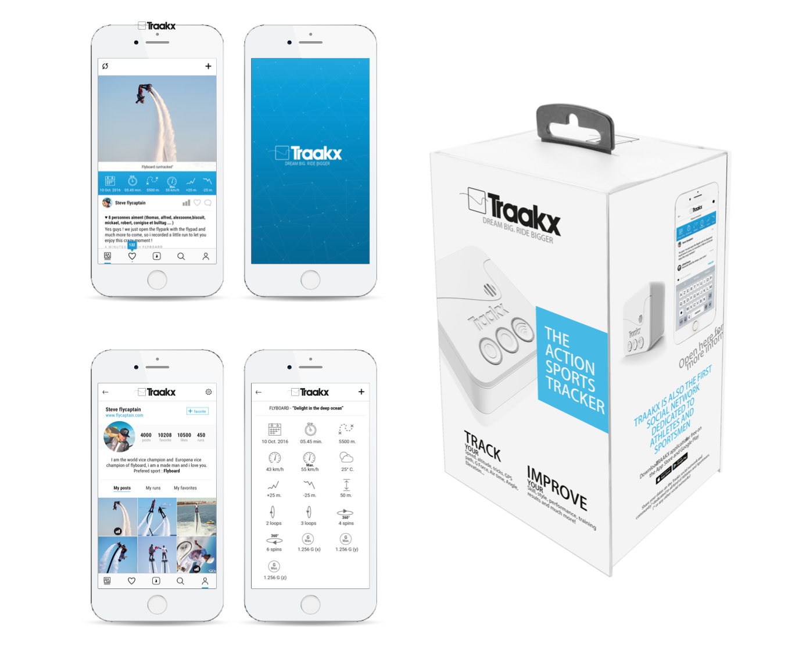
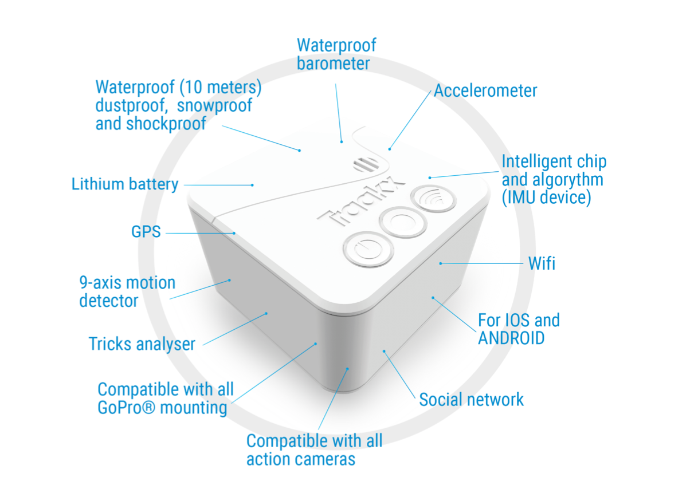
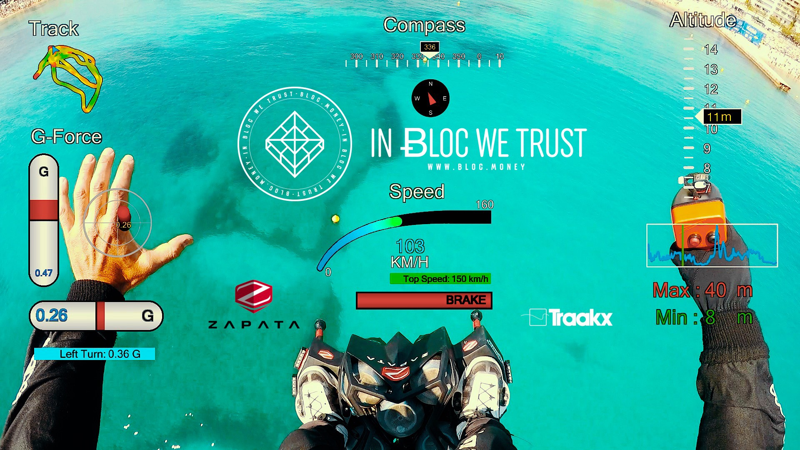

# **TRAAKX custom hardware**

[TRAAKX](http://traakx.com/traakx/) is a device which is able to record movement and position in multiple axes. All this is done using a micro controller which gathers data from the sensors and stores it on a micro SD card in order to communi- cate over wifi and send the data for analysis procedures.

### **The device contains the following components**

- a micro controller to command all the sensors (ARM 32 bit)
- an IMU (inertial measurement unit) that measures and reports a specific acceleration, angular rate, and the magnetic field (LSM303).
- a high precision gyroscope which senses the angular velocity from the Coriolis force applied to the device (L3GD20H)
- a waterproofed barometer (HP206)
- a GPS (MTK3339)
- a micro controller drived wifi card (ESP8266)
- a micro SD card reader (Memory Socket, Micro SD)
- 3 buttons to input commands for the device
- 2 multicolour led lights to show the status of the device and to give a visual guide for the user once commands are inputed

In competitions is quite hard to judge the figures made by the competitors (for example the maximum height a competitor achieves can only be approximated, or the angular velocity can only be measured using a stopwatch to count how many rotations have been made in a defined timeframe) so having a device which can track and display the data for analysis is quite useful for the judges. The data can also tell the competitors where they have to work harder, and help them understand how they can achieve better performances.

Of course having a simple accelerometer could achieve most of those tasks but every IMU (inertial measure- ment unit) will have some error. All those errors add up over time to the point that their output becomes useless. So to prevent this we enclosed in the system 2 other sensors: gyroscope and GPS. GPS has long term accuracy while the gyroscope has a fairly good short term accuracy. The gyroscope is very precise, but also tends to drift in time. The accelerometer is a bit unstable, but does not drift.

Using the data provided by an IMU (both accelerometer and magnetometer sensors) is easy to determine the user's position but in order to be able to compensate for sensor drifts we included in the system a barometer which offers a redundant information used to calculate the position (having the pressure we can determine the height/depth the device has reached thus).

In order to be able to track the device movement in and outside water we incased the whole device in a waterproof case and we used a waterproof barometer which works both outside and inside water.

But this device is not complete without the server part where we analyze and compare the data. Because the device has to record each second multiple times the data provided by the sensors (this is why we opted for a high speed micro controller), it lacks the computing power to analyze large chunks of data to determine the figures the device (competitor) performed, so we consider the server a part of our system. There data can be analyzed differently for each sport because in each sport there are specific movements which can be interpre- ted in different ways depending on the sport that is practiced.

## **Compatibility**

While developing our own hardware for **TRAAKX** we found that it would be great to add some of the coolest hardware already existing on the market for sports and include their data into the [TRAAKX](http://traakx.com/traakx/) platform. So we included the option to import GoPro video directly into the TRAAKX platform and be able to extract and display some amazing data.

An example of this prototype can be found here while we made the test on [Franky Zapata](https://twitter.com/frankyzapata) while flying the FLYBOARD AIR.

