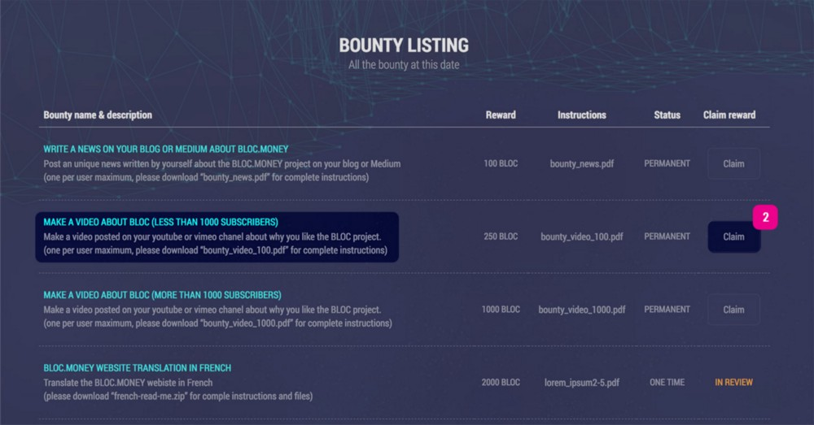
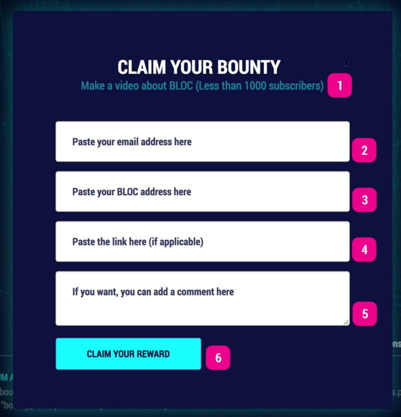
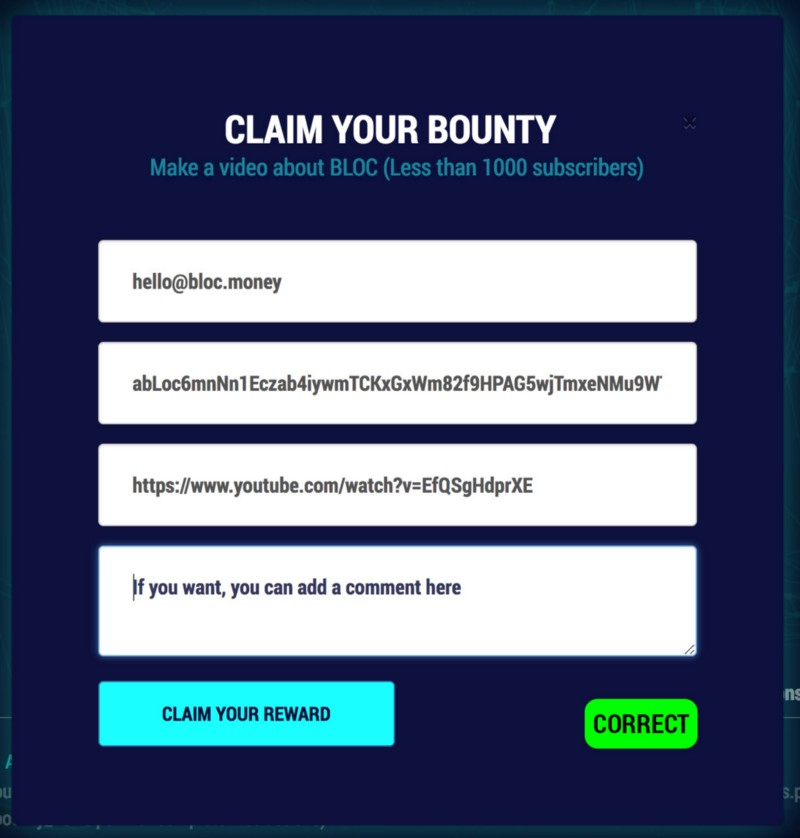
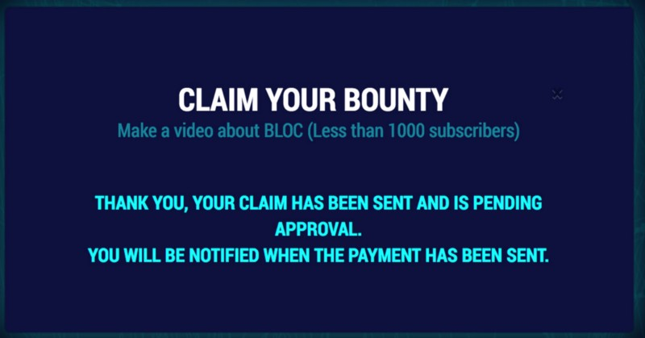
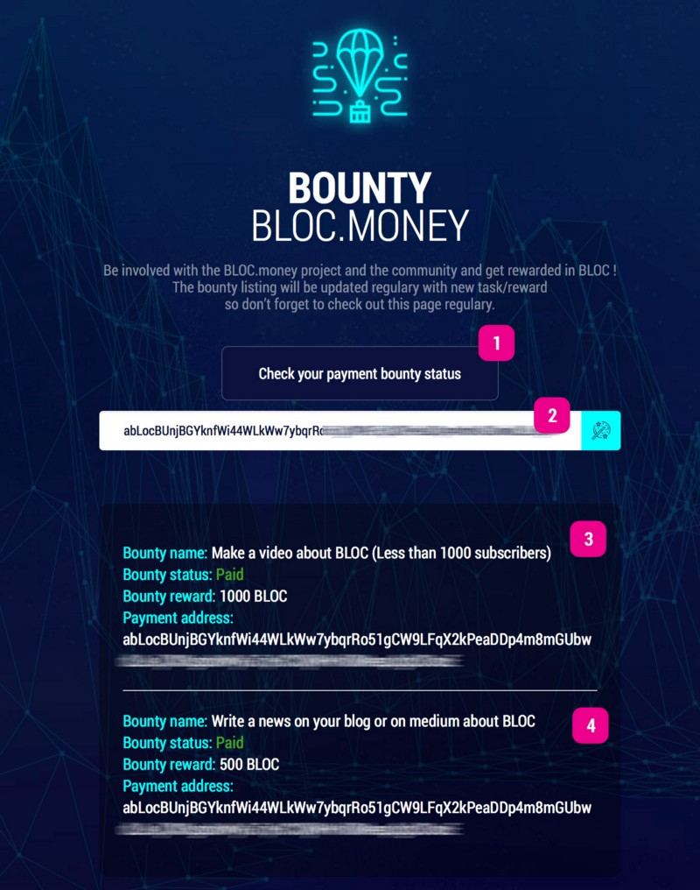

# How to Bootstrap the BLOC Blockchain

We are pleased to announce the [BLOC.MONEY](https://bloc.money) bounty program OPEN. Be involved with the BLOC project and the community & get rewarded in BLOC. The bounty listing will be updated regulary with new task/reward so don’t forget to check out [The BOUNTY page](https://bloc.money/bounty) on the official website regulary.

## BOUNTY Details

### Type

Right now we are offering 2 types of bounty:

* **PERMANENT**: Can be redeem more than one time by different users. No expiration date.
* **ONE TIME**: Can be redeem only one time by only one user. Expire as soon as claimed. If the first claim is rejected, the bounty is back in pending.

### Task & Reward

Most of the bounty programm right now is simple task like writing a blog post about [BLOC.MONEY](https://bloc.money). Posting a video on Youtube or simple translation services. Make sure to check [The BOUNTY page](https://bloc.money/bounty) daily not miss any bounty mission.

## How to claim a bounty

We have made a short tutorial to show you how to claim a bounty.

1. Go to [the BLOC.MONEY BOUNTY page](https://bloc.money/bounty)
2. Select your desired bounty from the left column and click the `Claim` button on the right column

A pop-up windows will now appears with the following details:

1. Make sure to verify the BOUNTY task is correct before submitting your bounty claim
2. Enter your email address
3. Paste your BLOC wallet address. It must start with `abLoc`
4. Enter the link of your Blog post, Video, PDF or Zip file related to this bounty
5. You can add a comment here. Not mandatory.
6. Once everything looks good simply click the `CLAIM YOUR REWARD` button.

This is how it should looks for a correct submission form to claim a bounty :

Once your claim has been reviewed you will get a notification by email.

## Track your payement

You can also track anytime the progress of review and payment details :

1. Click the `Check your payment bounty` status button
2. Enter your BLOC wallet address that you entered when submitted your bounty
3. Verify the progress and payment details
4. If you have more than one bounty claim they will appears one under the others.

It is simple as that to claim a bounty. A great way to contribute in the project and help increase the popularity of BLOC.MONEY while getting rewarded rewarded BLOC.