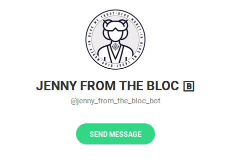

# Telegram Group Airdrop Mission

Join us on the official BLOC [Telegram Group](https://t.me/bloc_money) and receive 0.2 BLOC

## Requirements

You need to have Telegram installed on your device. If you do not have Telegram yet you can go on the official [Telegram website](https://telegram.org) to find out more details and download the application. Telegram messages are heavily encrypted and cloud based. Telegram is fast, free, powerful and secure with endless possiblity.

### Monitored by Jenny

Jenny from the BLOC is a Telegram bot programmed to manage different things at the BLOC. She will guide you to make sure you follow the correct process and unlock the rewards.


## Follow this guide
1. Click on the button `Not claimed` under the Telegram Airdrop Mission.
    

2. Click `SEND MESSAGE`

    

    !!! note
        If the folder doesn't exist, just go to `%APPDATA%` instead and create a folder named `BLOC`.


3. Delete the following if they exist:
    * blockindexes.bin
    * blocks.bin
    * "DB" folder


    ---
    
    **Note**: In case it is unable to delete the files due to them being used by some other program, follow these steps:
    
    * Open Task Manager with the shortcut `Ctrl + Shift+ Escape`.
      
    * Click on `Processes`.
      
    * Click on `Image Name`.
      
    * Scroll to the bottom.
      
    * Click on `bloc-service.exe`
      
    * Click on `End Process`.
      
    * Click on `End Process` again.
      
    * Try to delete them again.
    
    
    
    ---


4. [Download](#) the latest snapshot of the blockchain.

5. Move the two new downloaded files to the `%APPDATA%\BLOC` folder.

6. Start `BLOCd.exe` or the GUI wallet like you normally do.

7. See [Expected Results](#ExpectedResults) section below.


## Mac & Linux
1. Make sure `BLOCd`, `bloc-service`, and/or the GUI wallet are not running.

2. Open `Finder`.

3. Use the shortcut `Command + Shift + G` to bring up `Go to Folder`: 


4. Delete the following if they exist: 

    * blockindexes.bin 

    * blocks.bin 

    * "DB" folder 


5. [Download](#) the latest snapshot of the blockchain.

6. Move the two new downloaded files, `blockindexes.bin` and `blocks.bin` into the `~/.BLOC/` folder.

7. Start `BLOCd` or the GUI like you normally do.

8. See the [Expected Results](#ExpectedResults) section below.

## Expected Results if Done Correctly <a name="ExpectedResults"></a>

When you start `BLOCd` you should see this. Note that the blocksize (100246) in this example will be a different number:
```
2018-Feb-01 18:43:37.216471 INFO    Initializing core...
2018-Feb-01 18:43:37.225492 INFO    Importing blocks from blockchain storage
2018-Feb-01 18:43:37.741587 INFO    Imported block with index 1000 / 100246
2018-Feb-01 18:43:38.258202 INFO    Imported block with index 2000 / 100246
2018-Feb-01 18:43:38.928033 INFO    Imported block with index 3000 / 100246
2018-Feb-01 18:43:39.454094 INFO    Imported block with index 4000 / 100246
2018-Feb-01 18:43:40.142969 INFO    Imported block with index 5000 / 100246
2018-Feb-01 18:43:40.830674 INFO    Imported block with index 6000 / 100246
```

After it completes it will start syncing incrementally like so:
```
2018-Feb-01 18:47:48.075930 INFO    Imported block with index 100000 / 100246
2018-Feb-01 18:47:48.860470 INFO    Core initialized OK
2018-Feb-01 18:47:48.860470 INFO    Initializing p2p server...
```

If you are using the GUI wallet, you can instead view the progress by opening `walletd.log` and scrolling to the bottom.
