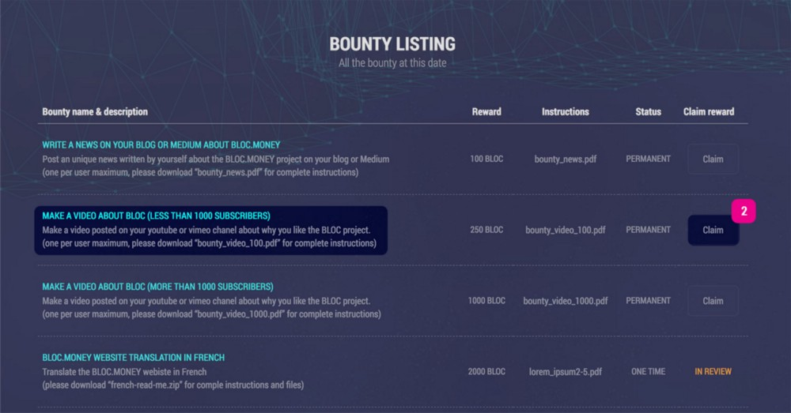
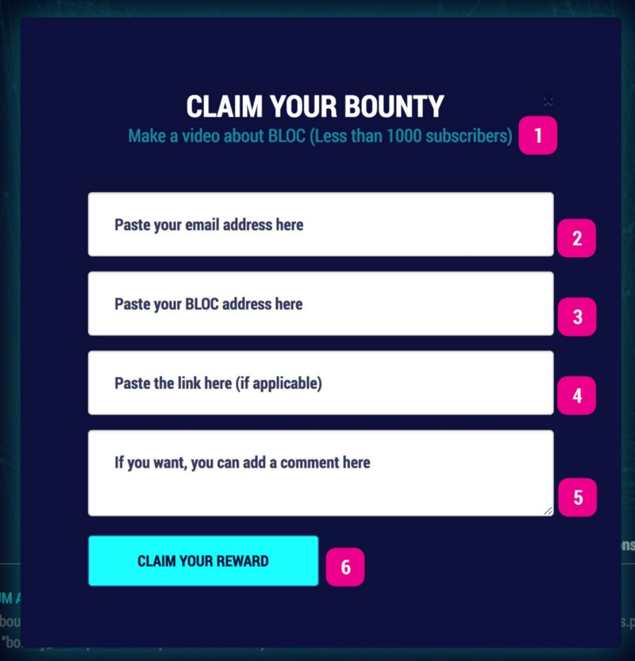
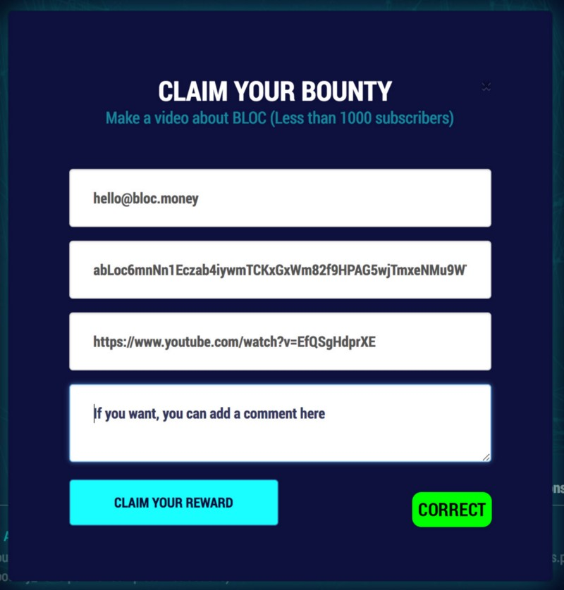
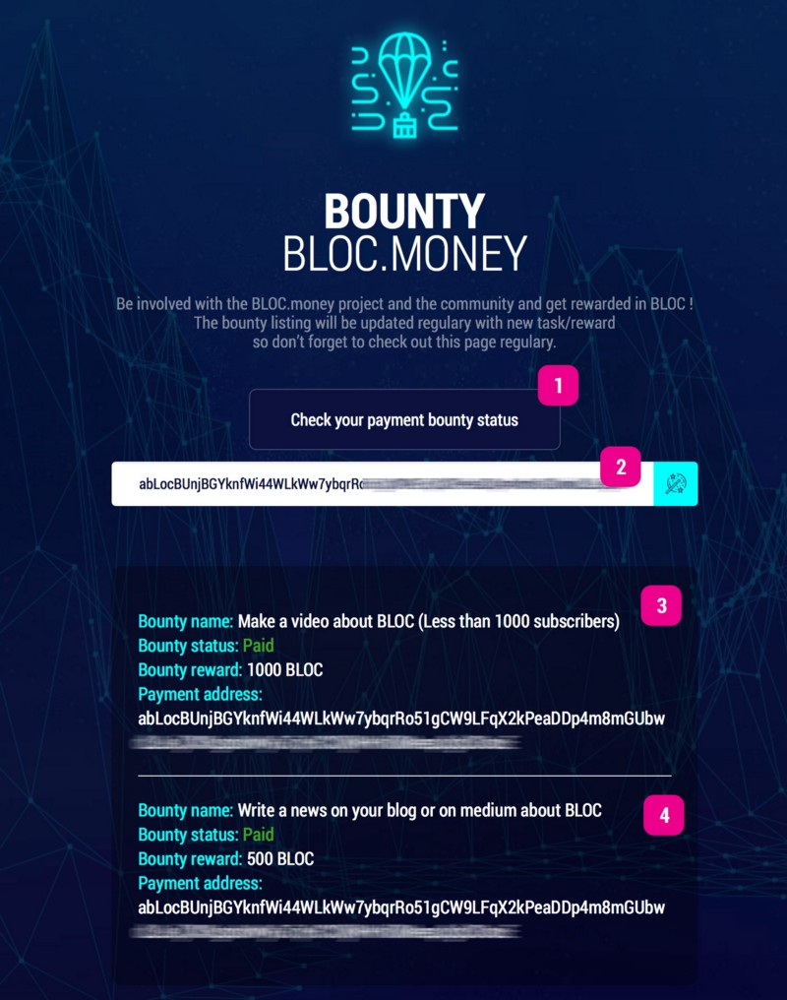

# Running A Public Node For Fun & Profit

A lot of people ask us about ways to make some extra [BLOC.MONEY](https://bloc.money) on the side without fancy mining hardware or waiting for tips or bounties. We have your answer now, and we think you’re going to like how easy it is! 

You might be thinking this is already over your head, but fear not. If you have synced the whole blockchain before on your home computer, then you already know how to do this.

## What is a public node?

A public node, or public daemon is a computer that a user can connect to safely and sync their wallet without downloading the whole blockchain at home. The node operator doesn’t know which wallet or who is connecting, and they also can’t see balances or passwords.

## How do I use a public node to make money?

In the beginning, community members ran public nodes for free. This is a great thing to do for the community, but as with all things that are free, they do have a cost for someone, and can often be congested. Free nodes will still be allowed if someone wants to run one, but you can now set a per-transaction fee quite easily, for people who connect to your node. This guide will help you get a public node set up, and the fee is up to you.

Free nodes can sometimes be busy because they get lots of users connecting to them. Nodes that charge a fee can sometimes offer faster service because not many are willing to pay a fee to send a transaction. A free market is emerging to allow nodes to set their own prices and let the community use the nodes that fit best for them.

## Is this a Masternode?

No. Masternodes are used in non-cryptonote networks to mix coins to make up for what they lack in native privacy. Every BLOC daemon mixes internally, automatically using Borromean Ring Signatures, so we have no need for Masternodes. Masternodes are a risk for privacy, and have nothing to do with what we are talking about in this article. If someone told you that BLOC has Masternodes, then they likely don’t know what they’re talking about.

Nobody can steal your password or use your information by running a public node, and you will not harm someone else if your node goes down. No worries!

## Let’s Get Started

1. Connect to your node and install TurtleCoin. 
You can follow the compile guide on https://github.com/turtlecoin/turtlecoin or download a Release from http://latest.turtlecoin.lol

2. Decide on a fee, and launch the daemon
Let’s say I want to charge 500 TRTL per transaction sent, I can launch my daemon like this:
./TurtleCoind --fee-amount 50000 --fee-address TRTLuxEnfjdF46cBoHhyDtPN32weD9fvL43KX5cx2Ck9iSP4BLNPrJY3xtuFpXtLxiA6LDYojhF7n4SwPNyj9M64iTwJ738vnJk

NOTE: I highlighted the amount 50000 because we said we were going to charge 500 TRTL per transaction, but I just typed 50000, so what gives? TRTL is only measured in “coins” to make sense to humans, but to the network, everything is measured in shells, which are 0.01 TRTL, so for 500 TRTL, we need to charge 50,000 Shells, or “atomic units” as we call them. 

## What Do We Do Next?
Get your node listed on Github and TurtleTurtle.org so that people know you exist!

* https://github.com/turtlecoin/turtlecoin-nodes-json/blob/master/turtlecoin-nodes.json
This is a list we use to fetch data from all of the public nodes for displaying on pools and explorers. Putting your information here can mean free advertising on a lot of TRTL services.

* https://github.com/turtlecoin/turtleturtle.org/blob/master/index.md
This is the community directory TurtleTurtle.org which is a website where every Turtle Service is free to list their TRTL site or project for other users to see.

How Can I Get More Users?
Some people do a web frontend with stats, like https://turtlenode.io or https://turtlenode.net using IBMCD’s frontend software https://github.com/turtlecoin/turtlenode.io  which shows the status and user load of each node you operate.

Users love something they can look at, but they love uptime even more. In part 2 of this article, Iburnmycd will walk you through how to use TurtleCoind-HA, a program he made to monitor and restart your high availability node if it ever goes down or gets slow.

We are pleased to announce the [BLOC.MONEY](https://bloc.money) bounty program OPEN. Be involved with the BLOC project and the community & get rewarded in BLOC. The bounty listing will be updated regulary with new task/reward so don’t forget to check out [The BOUNTY page](https://bloc.money/bounty) on the official website regulary.

## Bounty Details

### Type

Right now we are offering 2 types of bounty:

* **PERMANENT**: Can be redeem more than one time by different users. No expiration date.
* **ONE TIME**: Can be redeem only one time by only one user. Expire as soon as claimed. If the first claim is rejected, the bounty is back in pending.

### Task & Reward

Most of the bounty programm right now is simple task like writing a blog post about BLOC. Posting a video on Youtube or simple translation services. Make sure to check [The BOUNTY page](https://bloc.money/bounty) daily not miss any bounty mission.

## How to claim a bounty

We have made a short tutorial to show you how to claim a bounty.

1. Go to [the BLOC.MONEY BOUNTY page](https://bloc.money/bounty)
2. Select your desired bounty from the left column and click the `Claim` button on the right column

A pop-up windows will now appears with the following details:

1. Make sure to verify the BOUNTY task is correct before submitting your bounty claim
2. Enter your email address
3. Paste your BLOC wallet address. It must start with `abLoc`
4. Enter the link of your Blog post, Video, PDF or Zip file related to this bounty
5. You can add a comment here. Not mandatory.
6. Once everything looks good simply click the `CLAIM YOUR REWARD` button.

This is how it should looks for a correct submission form to claim a bounty :

Once your claim has been reviewed you will get a notification by email.

## Track your payement

You can also track anytime the progress of review and payment details :

1. Click the `Check your payment bounty` status button
2. Enter your BLOC wallet address that you entered when submitted your bounty
3. Verify the progress and payment details
4. If you have more than one bounty claim they will appears one under the others.

It is simple as that to claim a bounty. A great way to contribute in the project and help increase the popularity of BLOC.MONEY while getting rewarded rewarded BLOC.