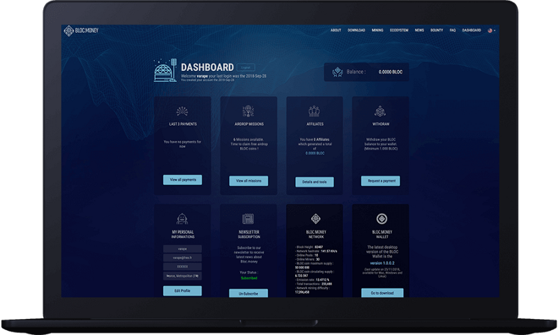
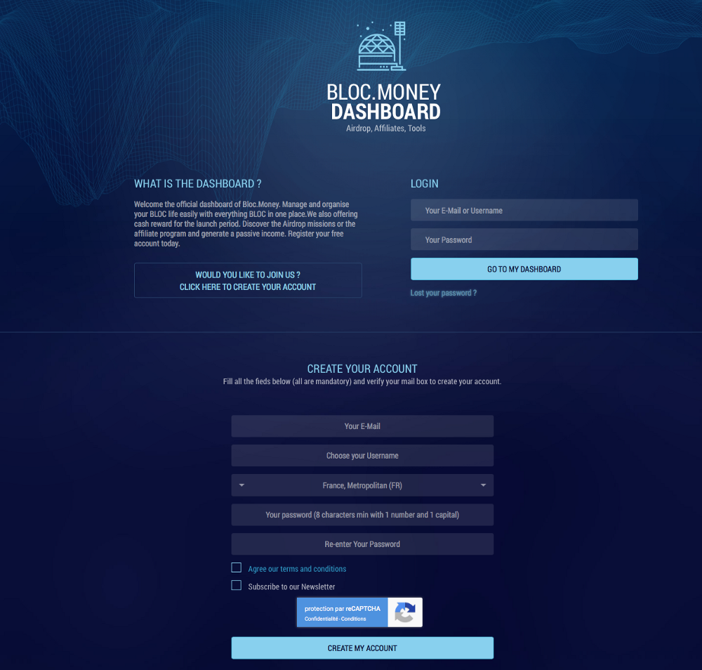
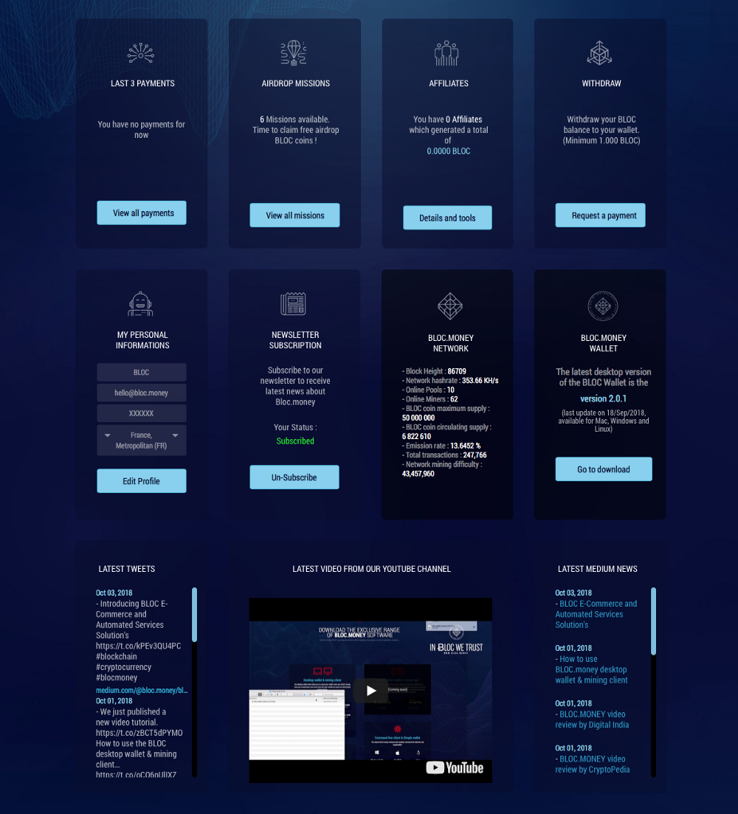
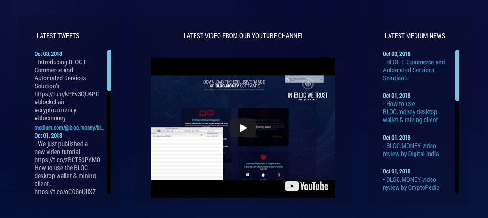
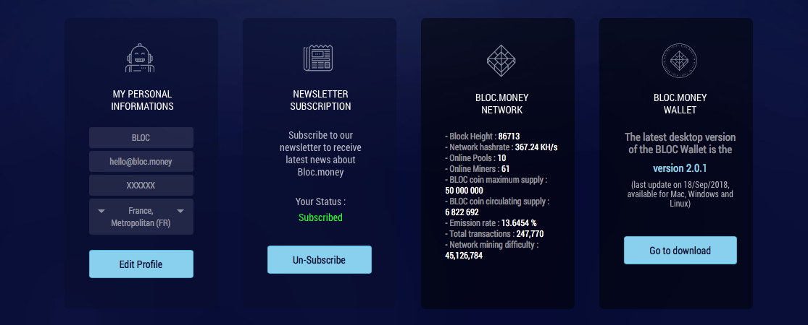
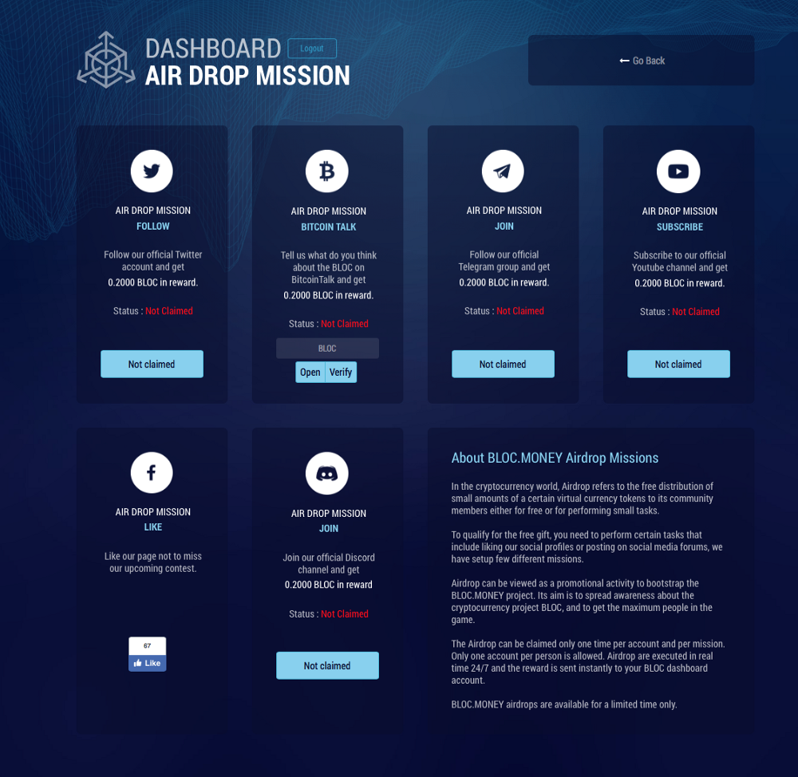
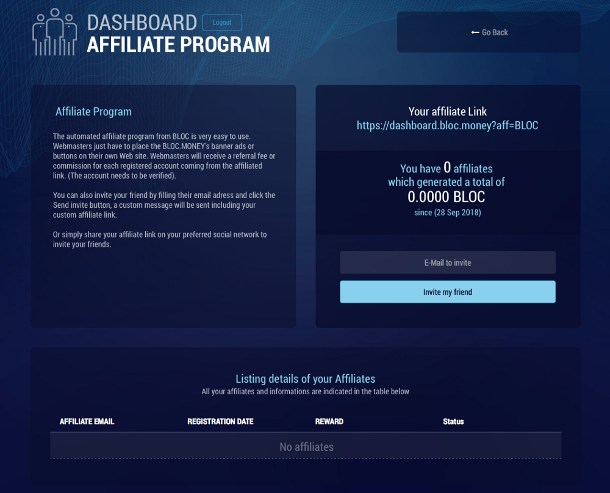
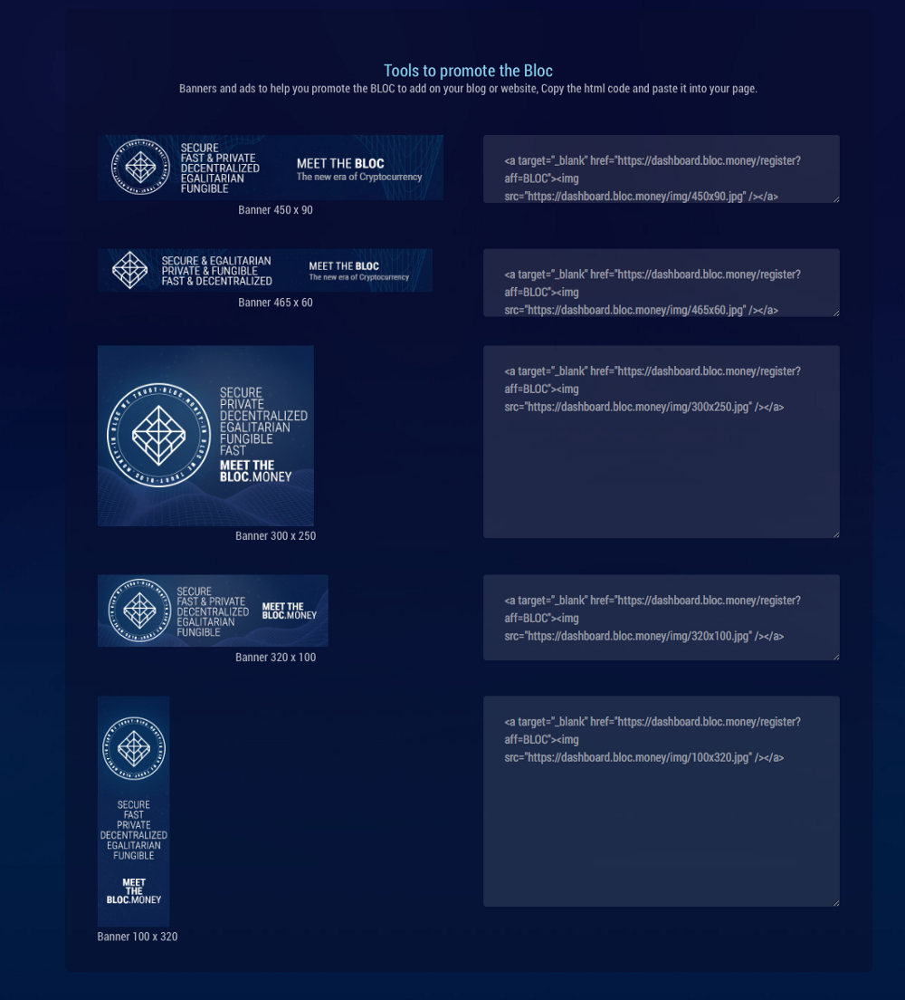
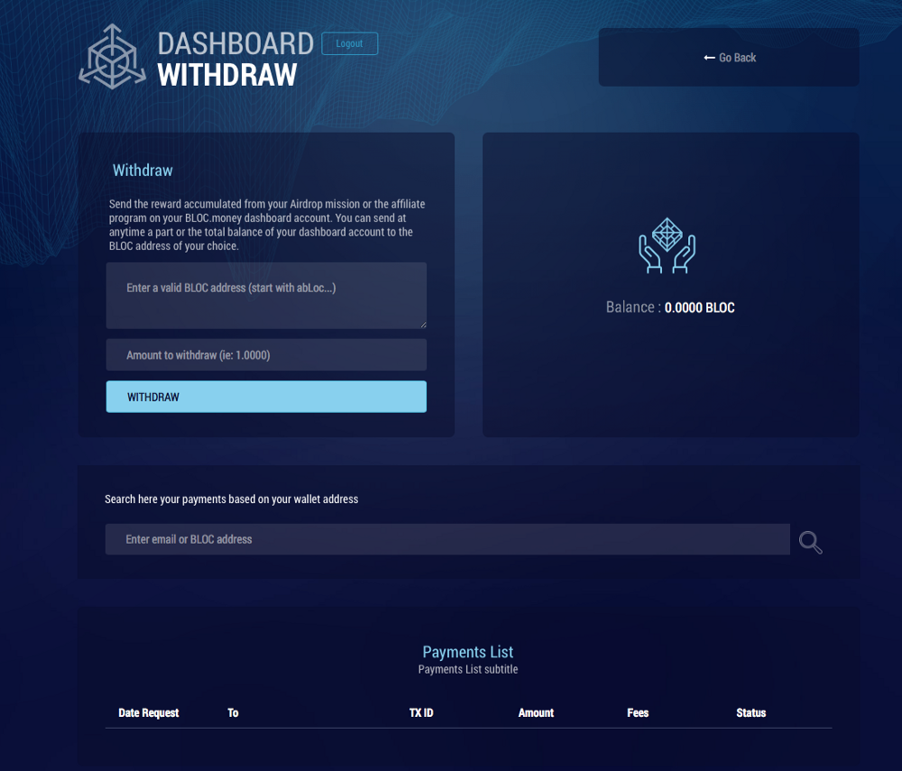

# What is the BLOC Dasboard ?

We want to make [BLOC](https://bloc.money) crypto currency easy to use and understand for everyone. As we just started our journey to change the way we pay and get paid the dashboard is one of the feature that you don’t want to miss for your favorite crypto currency **BLOC**.

Manage and organise your **BLOC** life easily with the [BLOC Dashboard](https://dashboard.bloc.money).

## Clean and effective
Every single website or application from the **BLOC** ecosystem is handcrafted by our team from scratch. We take a different approach from other crypto currencies by inovating new kind of tools to improve the BLOC ecosystem.

Find on your dashboard everything you want to know about the **BLOC** in one single click. Stay connected with the latest news and video from our Youtube channel and latest tweets. There is also a short but most important informations about the BLOC network and the current version of the BLOC wallet in use. Some of the problems coming from other crypto currencies is miss-informations. The dashboard guarantee you to keep up to date with our community.

## Register your account

Privacy is in the DNA of BLOC. For this reason we ask only to enter your email (so you can receive news from us), choose a username of your choice and select your country (this is just for analytics reason to see from where are coming the BLOC users). We do not ask anything else and we will not store your data and share it with someone else.

## Your dashboard account

All the latest informations at first glance

View our latest post from [BLOC](https://twitter.com/bloc_money), read the latest news from our [BLOC](https://medium.com/@bloc.money) or view the latest video from our [Youtube Channel](https://www.youtube.com/channel/UCdvnEPWhqGtZUEx3EFBrXvA)

## The most important informations in one place

* Edit your profile such as your password or your email address
* Subscribe/Unsubscribe to the BLOC newsletter
* [BLOC](https://bloc.money) network informations. Block heigh, Network hash rate, Online pools, Online miners, BLOC Maximum supply, BLOC circulating supply, emission rate, total transactions and network mining difficulty
* The latest version available of the BLOC.MONEY desktop wallet

## What is Air Drop Mission ?

In the cryptocurrency world, Airdrop refers to the free distribution of small amounts of a certain virtual currency tokens to its community members either for free or for performing small tasks.

To qualify for the free gift, you need to perform certain tasks that include liking our social profiles or posting on social media forums, we have setup few different missions.
Airdrop can be viewed as a promotional activity to bootstrap the [BLOC](https://bloc.money) project. Its aim is to spread awareness about the cryptocurrency project **BLOC**, and to get the maximum people in the game.

The Airdrop can be claimed only one time per account and per mission. Only one account per person is allowed. Airdrops are executed in real time 24/7 and the reward is sent instantly to your [BLOC Dashboard account](https://dashboard.bloc.money).

**[BLOC](https://bloc.money) airdrops are available for a limited time only.**

## Affiliate Program

The automated affiliate program from BLOC is very easy to use. Webmasters just have to place the **BLOC** banner ads or buttons on their own Web site.

Webmasters will receive a referral fee or commission for each registered account coming from the affiliated link. (The account needs to be verified and validate at least 1 AirDrop mission.

You can also invite your friend by filling their email adress and click the Send invite button, a custom message will be sent including your custom affiliate link.

Or simply share your affiliate link on your preferred social network to invite your friends.

## Withdraw your BLOC 24/7

Send the reward accumulated from your Airdrop mission or the affiliate program on your [BLOC Dashboard account](https://dashboard.bloc.money). You can send at anytime a part or the total balance of your dashboard account to the BLOC address of your choice.

## Coming soon

Much more features will be added to the dashboard in the near future. This is only the 1st version to escort the new [BLOC](https://bloc.money) users with care into the new crypto currency era.