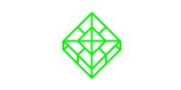

# Welcome to BLOC Wiki

This wiki is the main source of documentation for newcomers to the [BLOC](https://bloc.money) project. If this is your first time hearing about [BLOC](https://bloc.money), we recommend starting with the [BLOC.MONEY](https://bloc.money) website.

## What is BLOC?
**[BLOC.MONEY](https://bloc.money)** | Symbol: **Ƀ** - Ticker: **[BLOC](https://bloc.money)** is a fully decentralized cryptocurrency - Egalitarian Proof Of Work with Cryptonight Haven algorithm & ASIC resistant- based on open source Cryptonote technology using low & fix rate fees per transaction allows to send money worldwide immediately and without costly intermediaries using the blockchain technology.

Launched in May 2018 one of BLOC's main goals is to focus on accessibility, security and simplicity to make the use of cryptocurrency easy in the everyday life for everyone by creating a cryptocurrency which is attractive and fun to use. [BLOC](https://bloc.money) is the cryptocurrency for the people by the people with respect of your privacy. Nobody can seize your BLOC.money. You are the only reponsible of your fund. You and only you can control your fund. You are your own bank.

## Quick Navigation

| **About BLOC** | **Wallets** | **Mining** | **Contributing** |
|:----------------------:|:-------------:|:------------:|:------------------:|
|  |  |  |  |
| [About BLOC](about/index.md) | [Setting up a New Wallet](Getting-Started#new-wallet) | [Mining BLOC](Getting-Started#mining) | [Contributing to BLOC](about/Contributing) |
| Learn more about BLOC and the community | A guide on setting up a BLOC wallet to start receiving BLOC money! | A step-by-step guide to start mining BLOC | Information on contributing to BLOC

