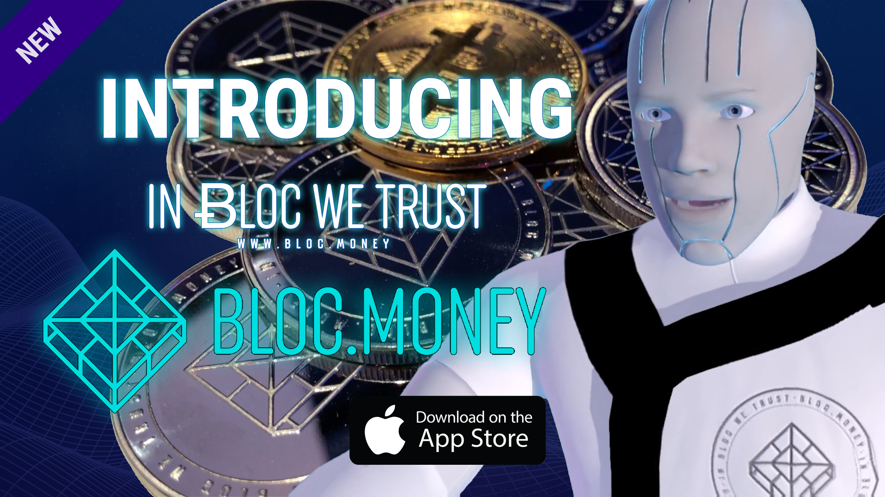

# **Welcome to BLOC.MONEY (BLOC) Wiki**
This wiki is the main source of documentation for newcomers to the [BLOC Project](https://github.com/furiousteam/BLOC). If this is your first time hearing about BLOC, we recommend starting by visiting the official [BLOC.MONEY](https://bloc.money) website.

## **What is BLOC.MONEY (BLOC) ?**

The [BLOC.MONEY](https://bloc.money) - Ticker: [(BLOC)](https://github.com/furiousteam/BLOC) Project has been established to develop and popularise the Blockchain Technology as well as the use of cryptocurrencies in the everyday life while respecting the environment.

BLOC is a fast, easy to use and private decentralized cryptocurrency without involvement of financial institutions. BLOC is based on the same open-source Cryptonote technology used by Monero and runs on a secure peer-to-peer network to operate with no central authority.

BLOC enables untraceable and anonymous transactions. Using a distributed public ledger, the sender, the receiver and the transacted amount are kept anonymous. You control the private keys to your funds.

BLOC is set to disrupt the mobile industry in the developing world, as our blockchain technology is revolutionizing the financial services industry by empowering users across the globe to be rewarded in return of its use but also pay and be paid anytime, anywhere, without costly intermediaries.

BLOC aims to develop an innovation-friendly and sustainable ecosystem that will enable bridging the gap between the cryptocurrencies and the everyday life. [Community](about/Community.md) driven and truly decentralized, no one owns BLOC, everyone can take part. BLOC was created without an Initial Coin Offering.

BLOC eco-friendly Proof of Work Cryptonight Haven algorithm ensures that affordable hardware is no impediment to success: everyone can mine BLOC with roughly equal efficiency, making BLOC.money a uniquely egalitarian currency. **BLOC** is easy to mine and makes [getting started](Getting-Started.md) with cryptocurrencies easier than ever.

It's about time to take back the control of your money. Free your life today, enjoy the BLOC lifestyle. [Learn more about BLOC](about/Home.md). Join us.

## **Video**

Everything you want to know about the cryptocurrency **BLOC.MONEY** - **BLOC** in 5 minutes.

