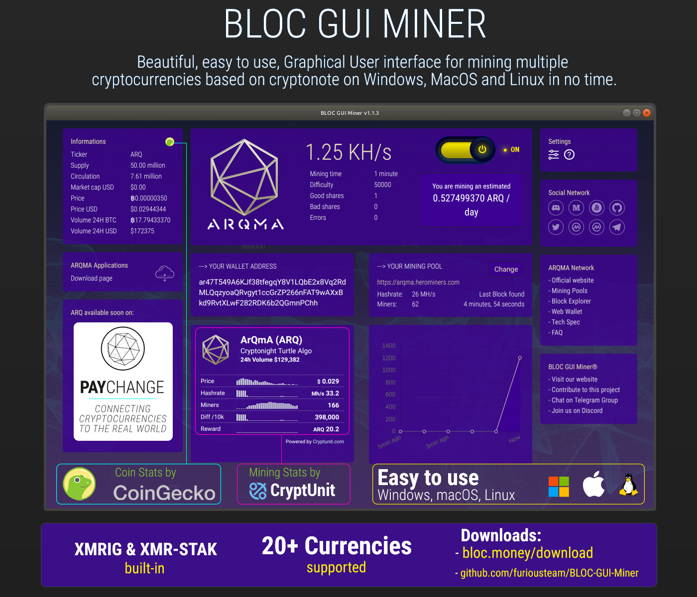
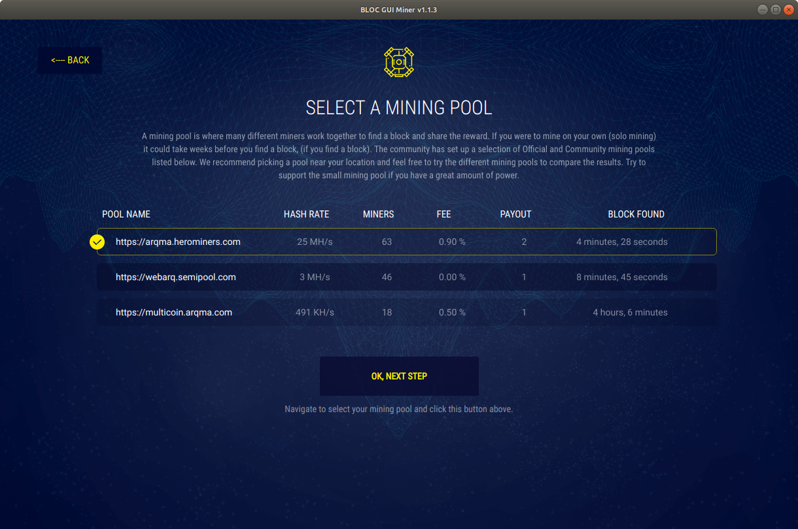
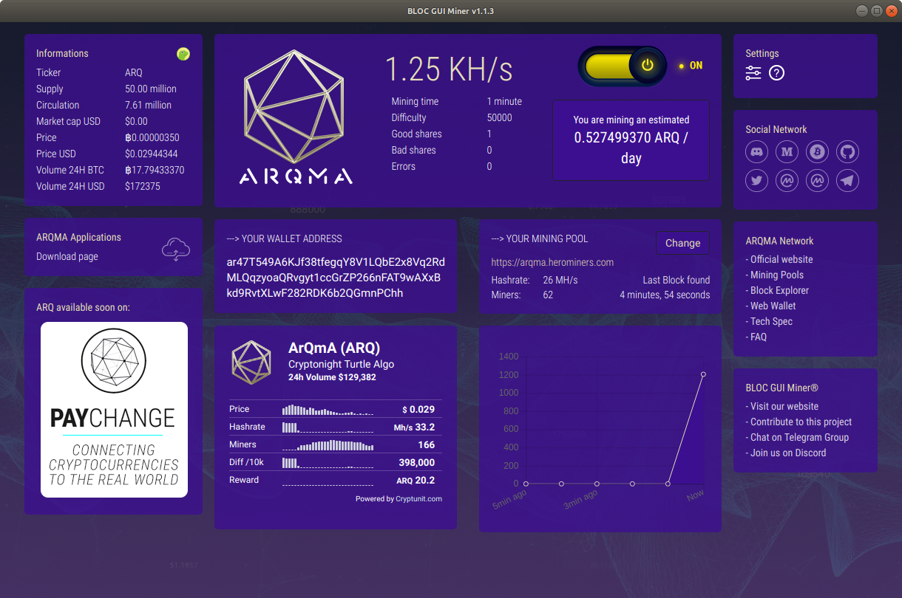
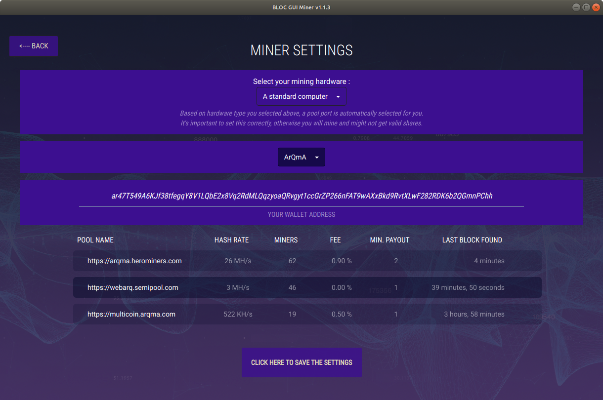
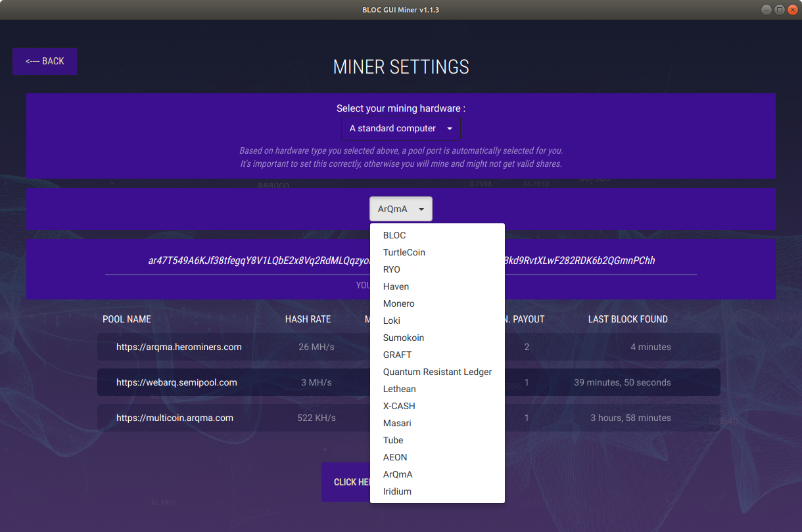
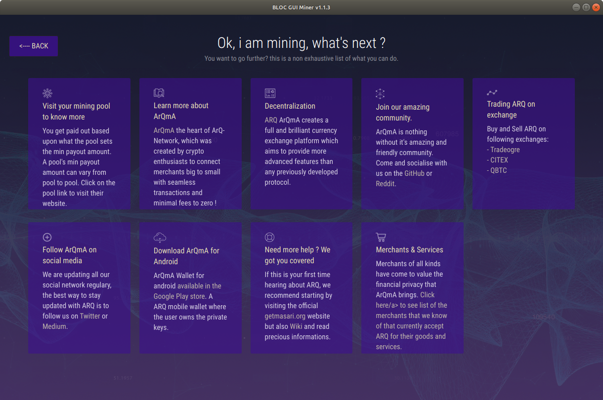

# **How to mine ArQmA (ARQ) with BLOC GUI Miner**

[ARQMA](https://arqma.com) **(ARQ)** the heart of ArQ-Network, which was created by crypto enthusiasts to connect merchants big to small with seamless transactions and minimal fees to zero ! ArQmA creates a full and brilliant currency exchange platform which aims to provide more advanced features than any previously developed protocol.

[BLOC GUI Miner](../mining/BLOC-GUI-Miner.md) is a beautiful, easy to use, Graphical User interface for mining multiple cryptocurrencies based on cryptonote. The BLOC GUI Miner is easy to use and makes you getting started with mining cryptocurrency on Windows, MacOS and Linux in no time.

It is aimed at getting people that have never tried mining before with a focus on accessibility, security and simplicity.

## **Install BLOC GUI Miner**

Some antivirus packages detect cryptocurrency miners as malware and will remove the miner as soon as it's started. In order for the BLOC GUI miner to function, you'll need to exclude the miner from being scanned by your antivirus software.

Download and Install:

- From BLOC.MONEY [Download Area](https://bloc.money/download)
- From [GitHub](https://github.com/furiousteam/GUI-miner/releases/latest)
- Follow [instructions for your system](../mining/BLOC-GUI-Miner-using.md) Windows, macOS or Linux 

## **Mining ArQmA (ARQ)**

It is now very easy and fun to mine ArQmA (ARQ) using the BLOC GUI Miner.

### **Launch the BLOC GUI Miner**

Launch the BLOC GUI Miner and select **I want to mine other cryptocurrencies**

### **Select ArQmA (ARQ)**

Select ArQmA (ARQ)

### **ArQmA (ARQ)Address**

Enter your ArQmA (ARQ) wallet address. It must start with **ar** and click **OK, NEXT STEP**.

### **Choose Mining Pool**

We suggest you to select the nearest mining pool following your location for the best mining experience and results.

Select your favorite mining pool from the list and click **OK, NEXT STEP**.

### **Antivirus**

Some antivirus packages detect cryptocurrency miners as malware and will remove the miner as soon as it's started.

In order for the BLOC GUI miner to function, you'll need to exclude the miner from being scanned by your antivirus software.

Once you are ready click **OK,I'VE ALLOWED THE MINER**

### **Configuring**

BLOC GUI Miner will auto configure your mining hardware with the best capabilities in the most cases. The configuration process is almost instant or take few seconds.

### **Mining**

Congratulations ! You are mining **ArQmA (ARQ)** cryptocurrency. This is the overview of the BLOC GUI Miner. You can see the complete informations of your mining activity and some more details about the BLOC ecosystem.

- You can change the mining pool by clicking here. It will open the settings page.

### **Settings** 

The settings page allow you to customize the miner settings:

- Choose another coin to mine
- Modify your wallet mining address
- Choose a different mining pool

- Select another coin to mine from the selector
    * Enter your wallet address
    * Choose your mining pool

Once you have made the change click the button **CLICK HERE TO SAVE THE SETTINGS**.

### **Help**

Do you need more help ? Make sure you visit this section to find out more about ArQmA (ARQ), join the community, checkout the latest updates, watch videos and much more.

## **I have an issue not listed here**

If you have an issue not listed here or if you would like to add a new feature to the BLOC GUI Miner pelase visit us on [GitHub](https://github.com/furiousteam/GUI-miner) and log a new issue, alternatively, you can [contact us](../about/Community.md).