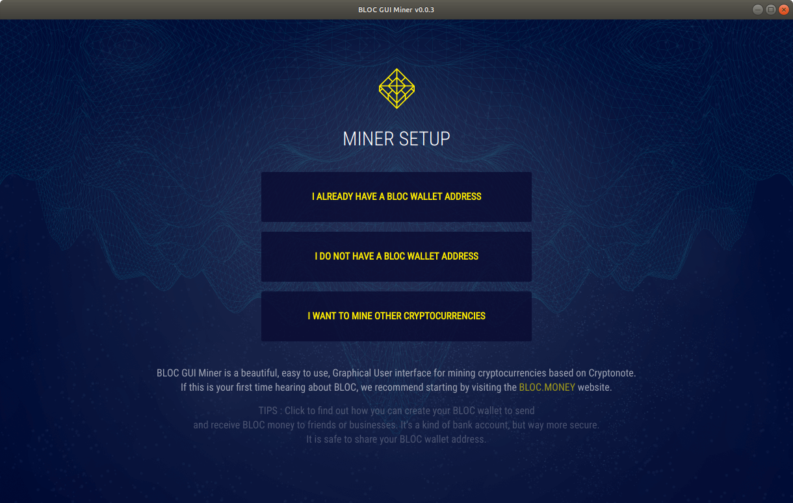
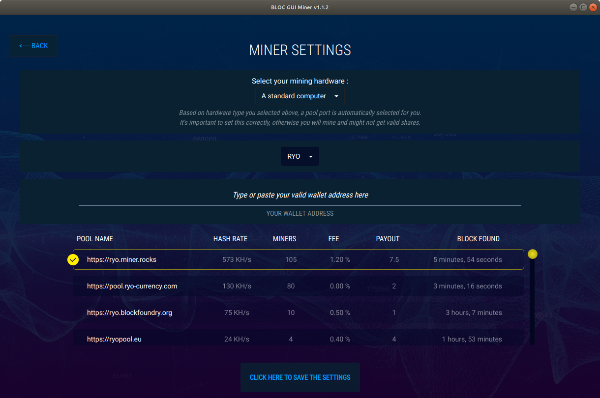

# **How to mine RYO with BLOC GUI Miner**

[RYO](https://ryo-currency.com) RYO Currency confidently transact with the highest degree of anonymity.

## **Install BLOC GUI Miner**

Some antivirus packages detect cryptocurrency miners as malware and will remove the miner as soon as it's started. In order for the BLOC GUI miner to function, you'll need to exclude the miner from being scanned by your antivirus software.

- From the [Download Area](https://bloc.money/download) of BLOC.MONEY
- Download and install BLOC GUI Miner for [Windows, Mac and Linux](https://github.com/furiousteam/GUI-miner/releases/latest) from GitHub

## **Mining RYO**

It is now very easy and fun to mine RYO using the BLOC GUI Miner.

### **Launch the BLOC GUI Miner**

Launch the BLOC GUI Miner and select **I want to mine other cryptocurrencies**

### **Select RYO**

Select RYO

### **RYO Address**

Enter your RYO wallet address. It must start with **RYo** and click **OK, NEXT STEP**.

### **Choose Mining Pool**

We suggest you to select the nearest mining pool following your location for the best mining experience and results.

Select your favorite mining pool from the list and click **OK, NEXT STEP**.

### **Antivirus**

Some antivirus packages detect cryptocurrency miners as malware and will remove the miner as soon as it's started.

In order for the BLOC GUI miner to function, you'll need to exclude the miner from being scanned by your antivirus software.

Once you are ready click **OK,I'VE ALLOWED THE MINER**

### **Configuring**

BLOC GUI Miner will auto configure your mining hardware with the best capabilities in the most cases. The configuration process is almost instant or take few seconds.

### **Mining**

Congratulations ! You are mining **(RYO)** Ryo cryptocurrency. This is the overview of the BLOC GUI Miner. You can see the complete informations of your mining activity and some more details about the BLOC ecosystem.

- You can change the mining pool by clicking here. It will open the settings page.

### **Settings** 

The settings page allow you to customize the miner settings:

- Choose another coin to mine
- Modify your wallet mining address
- Choose a different mining pool

- Select another coin to mine from the selector
    * Enter your wallet address
    * Choose your mining pool

Once you have made the change click the button **CLICK HERE TO SAVE THE SETTINGS**.

### **Help**

Do you need more help ? Make sure you visit this section to find out more about Ryo, join the community, checkout the latest updates, watch videos and much more.

## **I have an issue not listed here**

If you have an issue not listed here or if you would like to add a new feature to the BLOC GUI Miner pelase visit us on [GitHub](https://github.com/furiousteam/GUI-miner) and log a new issue, alternatively, you can [contact us](../about/Community.md).