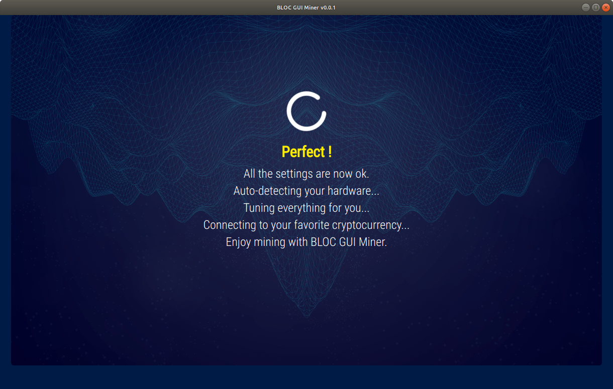
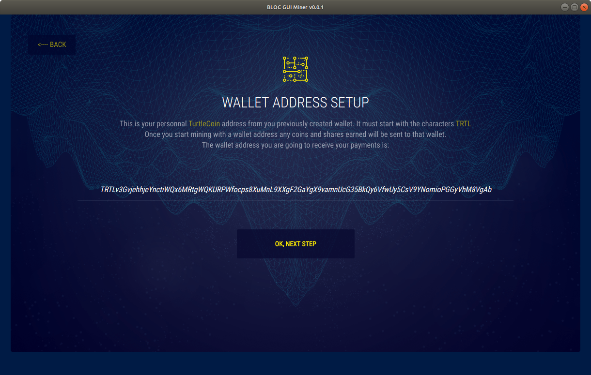

# **How to use BLOC GUI Miner**

If you want to learn about cryptocurrencies, [mining](../mining/What-is-mining.md) is a great place to start!

This page describe how to use the BLOC GUI Miner and getting started mining cryptocurrency on [Windows](../mining/BLOC-GUI-Miner.md#windows), [Mac OS](../mining/BLOC-GUI-Miner.md#mac) and [Linux](../mining/BLOC-GUI-Miner.md#linux) using CPU and/or GPU hardware.

[Start mining](../mining/BLOC-GUI-Miner-using.md#start-mining) today and get rewarded in your favorite cryptocurrency.

## **Download binaries and source code**

Download binaries and source code from the [BLOC GUI Miner](https://github.com/furiousteam/BLOC-GUI-Miner) GitHub rep.

## **Linux**<a name="linux">

Choose the best miner following your hardware. We have 4 available binaries for Linux. 

- BLOC GUI Miner with [XMR-STAK CPU](https://github.com/furiousteam/GUI-miner/releases/latest) binaries for **CPU** mining
- BLOC GUI Miner with [XMR-STAK OPENCL GPU](https://github.com/furiousteam/GUI-miner/releases/latest) binaries for **OPENCL GPU** mining
- BLOC GUI Miner with [XMR-STAK NVIDIA GPU](https://github.com/furiousteam/GUI-miner/releases/latest) binaries for **NVIDIA GPU** mining
- BLOC GUI Miner with [XMRIG CPU](https://github.com/furiousteam/GUI-miner/releases/latest) binaries for **CPU** mining

In this example we are going to use BLOC GUI Miner with **XMRIG CPU** mining only.

- Unzip the file to your desktop

It must looks like this:


Inside the miner folder:


Double click on the icon **BLOC GUI Miner v0.0.3** to launch the miner.

You are now ready to start mining. Make sure you follow the next steps to [start mining](../mining/BLOC-GUI-Miner.md#start-mining).

If you would like to use your own binaries for XMRSTAK and/or XMRRIG inside the miner folder. Simply follow [this procedure](../mining/BLOC-GUI-Miner.md#use-my-binaries).

## **Mac OS**<a name="mac">

BLOC GUI Miner for macOS comes with **XMRIG** binaries already built-in for **CPUmining** only.

- Download [BLOC-GUI-Miner-macOS-Downloader.zip](https://bloc.money/files/BLOC-GUI-Miner/BLOC-GUI-Miner-macOS-Downloader.zip)
- Double click on the icon to unzip the file

It must looks like this:


Now double click on the **BLOC-GUI-Miner-macOS-Downloader** application. It will open a new window like this:


Click on the Apple logo top left and select **system preferences...**


Click on the **Security & Privacy** icon


Select the General tab and click on **Open Anyway**


This will finally open the software. You are now downloading and installing the BLOC GUI Miner for macOS.
You should see a windows like this:


Once the installation process is complete you can see the following files created.


Double click on the icon **BLOC GUI Miner v0.0.3.app** to launch the miner.

You are now ready to start mining. Make sure you follow the next steps to [start mining](../mining/BLOC-GUI-Miner.md#start-mining).

If you would like to use the GPU mining feature on macOS you will have to compile XMR-STAK or XMRIG and use your binaries inside the miner folder.
Simply follow [this procedure](../mining/BLOC-GUI-Miner.md#use-my-binaries).

## **Windows**<a name="windows">

Choose the best miner following your hardware. We have 2 available binaries for Windows.

- BLOC GUI Miner with [XMR-STAK](https://github.com/furiousteam/GUI-miner/releases/latest) binaries for **CPU** + **OPENCL** + **NVIDIA** **GPU** mining
- BLOC GUI Miner with [XMRIG](https://github.com/furiousteam/GUI-miner/releases/latest) binaries for **CPU** mining

- Download and install [BLOC GUI Miner for Windows](https://github.com/furiousteam/GUI-miner/releases/latest) from GitHub
- Unzip the file to your desktop

It must looks like this:


Inside the miner folder:


Double click on the icon BLOC GUI Miner to launch the miner.

You are now ready to start mining. Make sure you follow the next steps to [start mining](../mining/BLOC-GUI-Miner.md#start-mining).

If you would like to use your own binaries for XMRSTAK and/or XMRRIG inside the miner folder. Simply follow [this procedure](../mining/BLOC-GUI-Miner.md#use-my-binaries).

## **Start Mining**<a name="start-mining"></a>

- Windows: Double click the icon **BLOC GUI Miner.exe**
- Linux: Double click the icon app image **BLOC GUI Miner.App**
- MacOs: Double click the icon **BLOC GUI Miner**

### **Welcome screen**


This is the welcome screen. Click on the yellow link **Ok, we can start the setup now, Let's go!**

### **Miner Setup**


1. You have a wallet.

2. You do not have a wallet:


You will be redirected to the available options for to [create your BLOC wallet](../../wallets/Making-a-Wallet).

- [Paper Wallet](../wallets/paper-wallet.md)
- Desktop Wallets. [CLI Wallet](../wallets/BLOCWallet-how-to-use.md) or [GUI Wallet](../wallets/Making-a-GUI-Wallet.md)
- [iPhone Wallet](BLOC-iOS-wallet.md)
- [Telegram Wallet](../wallets/BLOC-Telegram-Wallet.md)

Once you have created your wallet come back to the BLOC GUI Miner and select the option 1. You have a wallet.

### **Address Setup**

Enter your BLOC wallet address and click **OK, NEXT STEP**.


### **Choose your mining pool**

You can find a complete list of the BLOC mining pools available on the [BLOC MINING](https://bloc.money/mining) section of our website. We suggest you to select the nearest mining pool following your location for the best mining experience and results.

Select your favorite mining pool from the list and click **OK, NEXT STEP**.


### **Antivirus**

Some antivirus packages detect cryptocurrency miners as malware and will remove the miner as soon as it's started. In order for the BLOC GUI miner to function, you'll need to exclude the miner from being scanned by your antivirus software.

Once you are ready click **OK,I'VE ALLOWED THE MINER**


### **Configuring**

BLOC GUI Miner will auto configure your mining hardware with the best capabilities in the most cases. The configuration process is almost instant or take few seconds.



### **Mining**

Congratulations ! You are mining [BLOC cryptocurrency](https://bloc.money/mining). This is the overview of the BLOC GUI Miner. You can see the complete informations of your mining activity and some more details about the [BLOC Ecosystem](https://bloc.money/ecosystem).

- You can change the mining pool by clicking here. It will open the [settings page](../mining/BLOC-GUI-Miner.md#settings)


### **Settings** <a name="settings"></a>

The settings page allow you to customize the miner settings:

- Modify your wallet mining address
- Choose a different mining pool

**Note**: *The % for CPU mining works only with XMRIG.*


- Select another coin to mine from the selector
    * Enter your wallet address
    * Choose your mining pool


Once you have made the change click the button **CLICK HERE TO SAVE THE SETTINGS**.

### **Help**

Do you need more help ? Make sure you visit this section to find out more about BLOC, join the community, checkout the latest guides and updates, watch videos and much more.


## **How to check your payouts**

You get paid out based upon what the pool sets the min payout amount. A pool’s min payout amount can vary from pool to pool.

Visit the mining pool you are mining from to checkout your actual payouts.

### Example if you are mining from [BLOC-MINING Pool Europe](https://bloc-mining.eu)

* Go to the [BLOC-MINING Pool Europe](https://bloc-mining.eu).

* Scroll down to **Your Stats & Payment History**


* Enter your **BLOC** address
* Click search
* All your payments will be displayed here


## **Mining TurtleCoin TRTL**

It is now very easy and fun to mine TurtleCoin using the BLOC GUI Miner.

### **Launch the BLOC GUI Miner**

Launch the BLOC GUI Miner and select **I want to mine other cryptocurrencies**


### **Select TurtleCoin**

Select TurtleCoin


### **TRTL Address**

Enter your TRTL wallet address. It must start with **TRTL** and click **OK, NEXT STEP**.



### **Choose Mining Pool**

We suggest you to select the nearest mining pool following your location for the best mining experience and results.

Select your favorite mining pool from the list and click **OK, NEXT STEP**.


### **Antivirus**

Some antivirus packages detect cryptocurrency miners as malware and will remove the miner as soon as it's started.

In order for the BLOC GUI miner to function, you'll need to exclude the miner from being scanned by your antivirus software.

Once you are ready click **OK,I'VE ALLOWED THE MINER**


### **Configuring**

BLOC GUI Miner will auto configure your mining hardware with the best capabilities in the most cases. The configuration process is almost instant or take few seconds.


### **Mining**

Congratulations ! You are mining **(TRTL)** TurtleCoin cryptocurrency. This is the overview of the BLOC GUI Miner. You can see the complete informations of your mining activity and some more details about the BLOC ecosystem.

- You can change the mining pool by clicking here. It will open the [TurtleCoin miner settings page](../mining/BLOC-GUI-Miner.md#trtl-settings)


### **Settings** <a name="trtl-settings"></a>

The settings page allow you to customize the miner settings:

- Modify your wallet mining address
- Choose a different mining pool

**Note**: *The % for CPU mining works only with XMRIG.*


- Select another coin to mine from the selector
    * Enter your wallet address
    * Choose your mining pool


Once you have made the change click the button **CLICK HERE TO SAVE THE SETTINGS**.

### **Help**

Do you need more help ? Make sure you visit this section to find out more about TurtleCoin, join the community, checkout the latest updates, watch videos and much more.


## **XMR-STAK Settings and configuration**

XMR-Stak will save your configuration in **config.txt** in the same directory from which it was first run.

Your configuration for pools(algorithm to mine, address, port etc) will be saved in **pools.txt**
The configuration of the device it mines(CPU/AMD/NVIDIA) will be saved in **cpu.txt**, **amd.txt** or **nvidia.txt**, respectively.

Run XMR-Stak again from the same directory to reuse the configuration.

## **Default Developer Donation**

By default, the XMR-STAK will donate 2% of the hashpower (2 minutes in 100 minutes) to XMR-stak developers pool.
If you want to change that, edit [donate-level.hpp](https://github.com/fireice-uk/xmr-stak/blob/master/xmrstak/donate-level.hpp) before you build the binaries. We strongly recommend to leave this donation fee at least 1% to help the **XMR-stak** developers by providing regular updates. To find how to build XMR-STAK on your system follow [this guide](../mining/XMR-Stak-index.md).

## **I have my own miner**<a name="use-my-binaries"></a>

You are welcome to use your own [xmr-stak](https://github.com/fireice-uk/xmr-stak) or [xmrig](https://github.com/xmrig/xmrig) binaries as long as it is the same version compatible with the BLOC GUI Miner available on this page.

Use the standard procedure to compile your favorite miner and place the binaries file inside the miner folder next to the BLOC GUI Miner application. Once you are ready simply double click the BLOC GUI Miner icon to launch the application and [start mining](../mining/BLOC-GUI-Miner.md#start-mining).

For the mining stats to display correctly you need to enable the API for each miner by doing the following:

Compiling XMR-STAK with option: **-DMICROHTTPD_ENABLE=ON**

Ensure you have the following in you config.txt file

`"httpd_port" : 16000,`

Compiling XMRIG with option: by default **-DWITH_HTTPD=ON** should be enabled.

Ensure you have the following in you config.json file
```
"api":{
  "port":16000,
  "access-token":null,
  "worker-id":null
}
```

## **Mining Tuning Intensity and threads configuration**

XMR-STAK gives too many options for tuning to get the best results out of your hardware. By default the miner creates config file for CPU, NVIDIA and AMD GPU. You can edit the values within these text files and see which works best for your mining hardware. Change the value of intensity, work-size, threads and blocks. You can add more GPUs and also lower the power mode of your CPU.

For more information on Tuning and configuring your hardware in XMR-stak we suggest you to read [this guide](https://github.com/fireice-uk/xmr-stak/blob/master/doc/tuning.md)

## **I'm on Linux and get the error**

`creating window failed: canceller.cancelled`.
This seems to be because of missing libraries on Ubuntu 17.10 and higher, also impacts other Ubuntu flavours.
To resolve the issue, a GNOME package needs to be installed, run the following:

`sudo apt-get install libgconf-2-4`

## **I keep getting the 'no compatible miner found' error**

Your antivirus most likely removed the miner before you could exclude the folder from being scanned. If you followed the antivirus guides in the initial setup you can simply extract the miner again, replacing the current files, and run the GUI miner again.

If you haven't exluded the miner's folder from being scanned, do so now and run the GUI miner again.

If you built your own version of xmr-stak or xmrig you need to rename the binaries to xmr-stak and xmrig respectively.

## **I'd like to use a pool that is not listed**

We currently only list pools we have tested in the miner. You are free to change the config for xmrig and xmr-stak to rather use a pool you want.

XMRIG
Edit the config.json file in the miner folder
```
"pools":[
	{
		"url":"pool.example:6666",
		"user":"your-BLOC-address",
		"pass":"BLOC GUI Miner",
		"keepalive":true,
		"nicehash":false,
		"variant":"xhv"
	}
],
```
              
XMR-STAK
Edit the pools.txt file in the miner folder
```
"pool_list":
[
  {
    "pool_address" : "pool.example:3333",
    "wallet_address" : "your-BLOC-address",
    "rig_id" : "",
    "pool_password" : "BLOC GUI Miner",
    "use_nicehash" : false,
    "use_tls" : false,
    "tls_fingerprint" : "",
    "pool_weight" : 1
  },
],
"currency" : "cryptonight_haven",
```

## **I have an issue not listed here**
If you have an issue not listed here or if you would like to add a new feature to the BLOC GUI Miner pelase visit us on [GitHub](https://github.com/furiousteam/GUI-miner) and log a new issue, alternatively, you can [contact us](../about/Community.md).


### **Help**

Make sure you visit the **help** section to find out more about your favorite cryptocurrency, join the community, checkout the latest updates, watch videos and much more.

