# **How to use BLOC GUI Miner**

If you want to learn about cryptocurrencies, [mining](../mining/What-is-mining.md) is a great place to start!

This page describe how to use the BLOC GUI Miner and getting started mining cryptocurrency on [Windows](../mining/BLOC-GUI-Miner.md#windows), [Mac OS](../mining/BLOC-GUI-Miner.md#mac) and [Linux](../mining/BLOC-GUI-Miner.md#linux) using CPU and/or GPU hardware.

[Start mining](../mining/BLOC-GUI-Miner-using.md#start-mining) today and get rewarded in your favorite cryptocurrency.

## **Download binaries and source code**

Download binaries and source code from the [BLOC GUI Miner](https://github.com/furiousteam/BLOC-GUI-Miner) GitHub rep.

## **Windows**<a name="windows">

Unfortunately because of some bad people using mining software in malware, most antivirus software will detect the programs below as unsafe.

It is **likely** you will need to add exceptions and exclusions to your antivirus software in order to make things work properly.

Make sure you have disabled your antivirus and Windows defender before downloading the BLOC GUI Miner else Windows will keep delete the downloaded file.

Choose the best miner following your hardware. We have 2 available binaries for Windows.

- BLOC GUI Miner with [XMR-STAK](https://github.com/furiousteam/GUI-miner/releases/latest) binaries for **CPU** + **OPENCL** + **NVIDIA** **GPU** mining
- BLOC GUI Miner with [XMRIG](https://github.com/furiousteam/GUI-miner/releases/latest) binaries for **CPU** mining

In this example we are going to use BLOC GUI Miner with XMRSTAK CPU + NVIDIA GPU mining.

- Unzip the file to your desktop
- It must looks like this:

Inside the miner folder:

**Right click on the icon BLOC GUI Miner and select Open as Administrator for the 1st time running the appication**.
Next time you will only have to double click on the icon BLOC GUI Miner to launch the application.

You are now ready to start mining. Make sure you follow the next steps to [start mining](../mining/BLOC-GUI-Miner.md#start-mining).

If you would like to use your own binaries for XMRSTAK and/or XMRRIG inside the miner folder. Simply follow [this procedure](../mining/BLOC-GUI-Miner.md#use-my-binaries).

## **Mac OS**<a name="mac">

[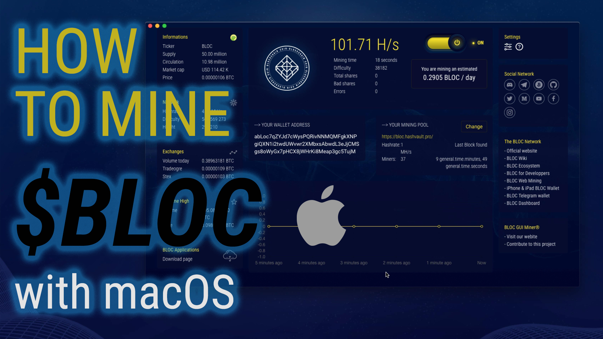](https://www.youtube.com/watch?v=uIAjgrjawmQ)

BLOC GUI Miner for macOS comes with **XMRIG** binaries already built-in for **CPUmining** only.

- Download [BLOC-GUI-Miner-macOS-Downloader.zip](https://bloc.money/files/BLOC-GUI-Miner/BLOC-GUI-Miner-macOS-Downloader.zip)
- Double click on the icon to unzip the file

It must looks like this:

Now double click on the **BLOC-GUI-Miner-macOS-Downloader** application. It will open a new window like this:

Click on the Apple logo top left and select **system preferences...**

Click on the **Security & Privacy** icon

Select the General tab and click on **Open Anyway**

This will finally open the software. You are now downloading and installing the BLOC GUI Miner for macOS.
You should see a windows like this:

Once the installation process is complete you can see the following files created.

Double click on the icon **BLOC GUI Miner v0.0.3.app** to launch the miner.

You are now ready to start mining. Make sure you follow the next steps to [start mining](../mining/BLOC-GUI-Miner.md#start-mining).

If you would like to use the GPU mining feature on macOS you will have to compile XMR-STAK or XMRIG and use your binaries inside the miner folder.
Simply follow [this procedure](../mining/BLOC-GUI-Miner.md#use-my-binaries).

## **Linux**<a name="linux">

Choose the best miner following your hardware. We have 4 available binaries for Linux. 

- BLOC GUI Miner with [XMR-STAK CPU](https://github.com/furiousteam/GUI-miner/releases/latest) binaries for **CPU** mining
- BLOC GUI Miner with [XMR-STAK OPENCL GPU](https://github.com/furiousteam/GUI-miner/releases/latest) binaries for **OPENCL GPU** mining
- BLOC GUI Miner with [XMR-STAK NVIDIA GPU](https://github.com/furiousteam/GUI-miner/releases/latest) binaries for **NVIDIA GPU** mining
- BLOC GUI Miner with [XMRIG CPU](https://github.com/furiousteam/GUI-miner/releases/latest) binaries for **CPU** mining

In this example we are going to use BLOC GUI Miner with **XMRIG CPU** mining only.

- Unzip the file to your desktop
- It must looks like this:

Inside the miner folder:

Double click on the icon **BLOC GUI Miner v0.0.3** to launch the miner.

You are now ready to start mining. Make sure you follow the next steps to [start mining](../mining/BLOC-GUI-Miner.md#start-mining).

If you would like to use your own binaries for XMRSTAK and/or XMRRIG inside the miner folder. Simply follow [this procedure](../mining/BLOC-GUI-Miner.md#use-my-binaries).

## **Start Mining**

- Windows: Double click the icon **BLOC GUI Miner.exe**
- Linux: Double click the icon app image **BLOC GUI Miner.App**
- MacOs: Double click the icon **BLOC GUI Miner**

### **Welcome screen**

This is the welcome screen. Click on the yellow link **Ok, we can start the setup now, Let's go!**

### **Miner Setup**

1. You have a wallet.

2. You do not have a wallet:

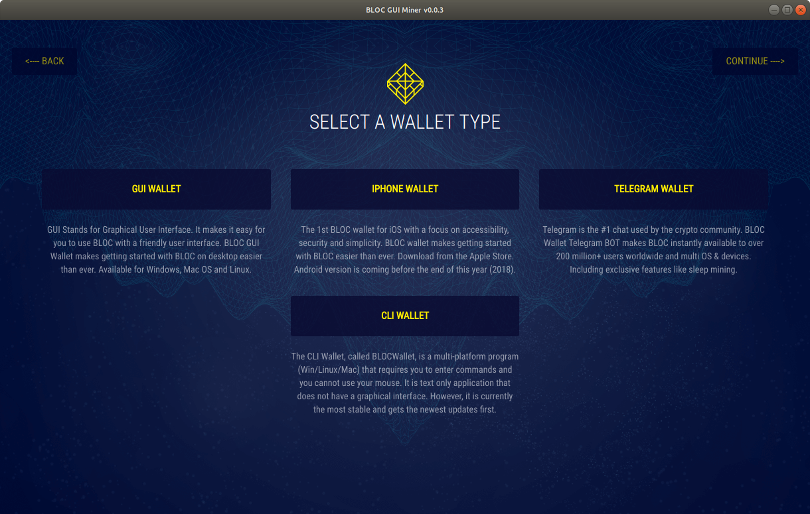

You will be redirected to the available options for you to [create your BLOC wallet](../../wallets/Making-a-Wallet).

- [Paper Wallet](../wallets/Making-a-paper-wallet.md)
- **Desktop Wallets**: [CLI Wallet](../wallets/BLOCWallet-how-to-use.md) or [GUI Wallet](../wallets/Making-a-GUI-Wallet.md)
- [iPhone & iPad Wallet](../wallets/BLOC-iOS-wallet-index.md)
- [Telegram Wallet](../wallets/BLOC-Telegram-Wallet.md)

Once you have created your wallet come back to the BLOC GUI Miner and select the option 1.
**I have a wallet**.

### **Address Setup**

Enter your BLOC wallet address and click **OK, NEXT STEP**.

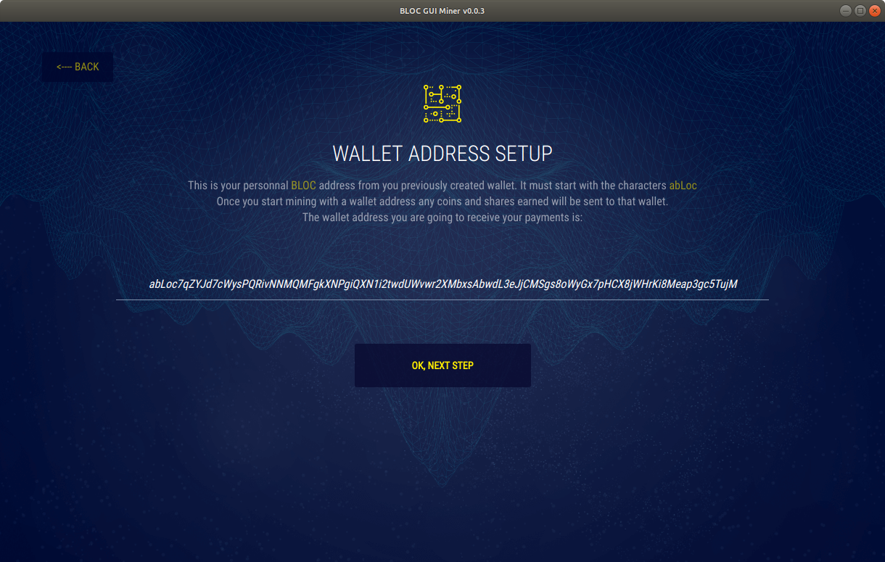

### **Choose your mining pool**

You can find a complete list of the BLOC mining pools available on the [BLOC MINING](https://bloc.money/mining) section of our website.
We suggest you to select the nearest mining pool following your location for the best mining experience and results.

Select your favorite mining pool from the list and click **OK, NEXT STEP**.

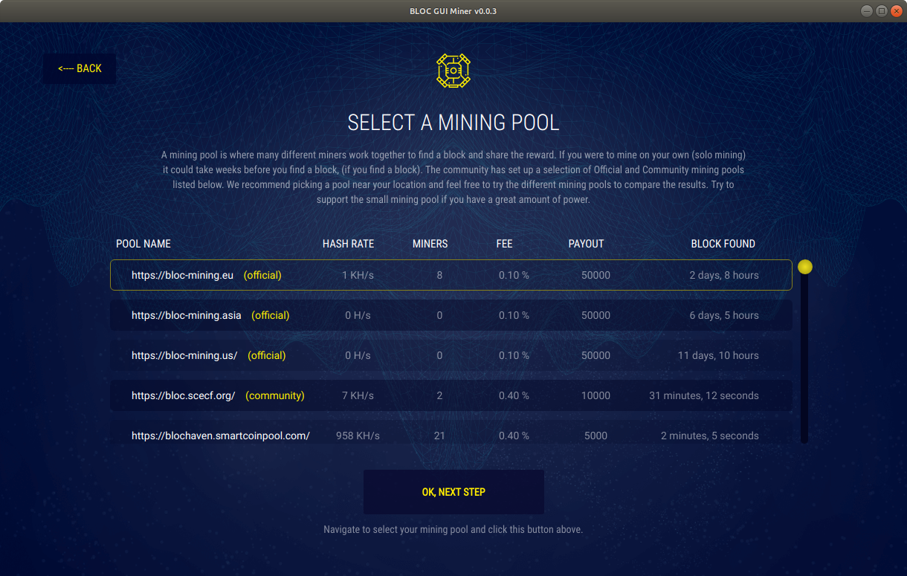

### **Antivirus**

Some antivirus packages detect cryptocurrency miners as malware and will remove the miner as soon as it's started. In order for the BLOC GUI miner to function, you'll need to exclude the miner from being scanned by your antivirus software.

Once you are ready click **OK,I'VE ALLOWED THE MINER**

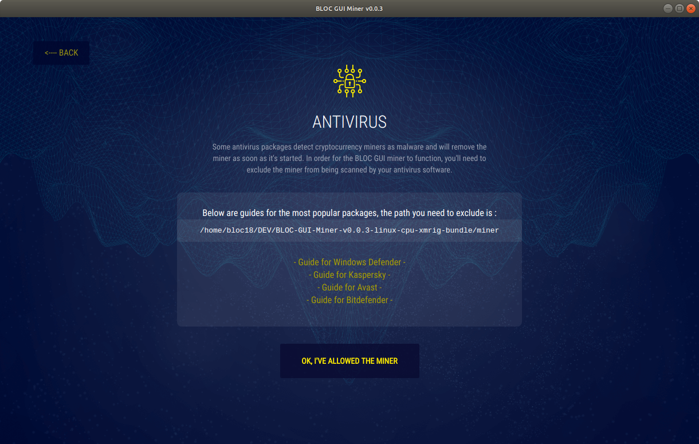

### **Configuring**

BLOC GUI Miner will auto configure your mining hardware with the best capabilities in the most cases. The configuration process is almost instant or take few seconds.

### **Mining**

Congratulations ! You are mining [BLOC cryptocurrency](https://bloc.money/mining) ! This is the overview of the BLOC GUI Miner. You can see the complete informations of your mining activity and some more details about the [BLOC Ecosystem](https://bloc.money/ecosystem).

- You can change the mining pool by clicking here. It will open the [settings page](../mining/BLOC-GUI-Miner.md#settings)

### **Settings** 

The settings page allow you to customize the miner settings:

- Modify your wallet mining address
- Choose a different mining pool

**Note**: *The % for CPU mining works only with XMRIG.*

- Select another coin to mine from the selector
    * Enter your wallet address
    * Choose your mining pool

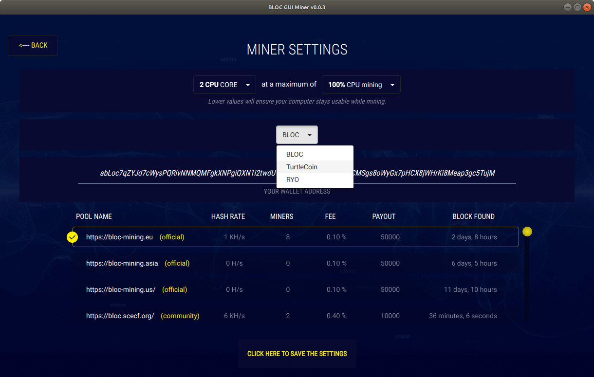

Once you have made the change click the button **CLICK HERE TO SAVE THE SETTINGS**.

### **Help**

Do you need more help ? Make sure you visit this section to find out more about BLOC, join the community, checkout the latest guides and updates, watch videos and much more.

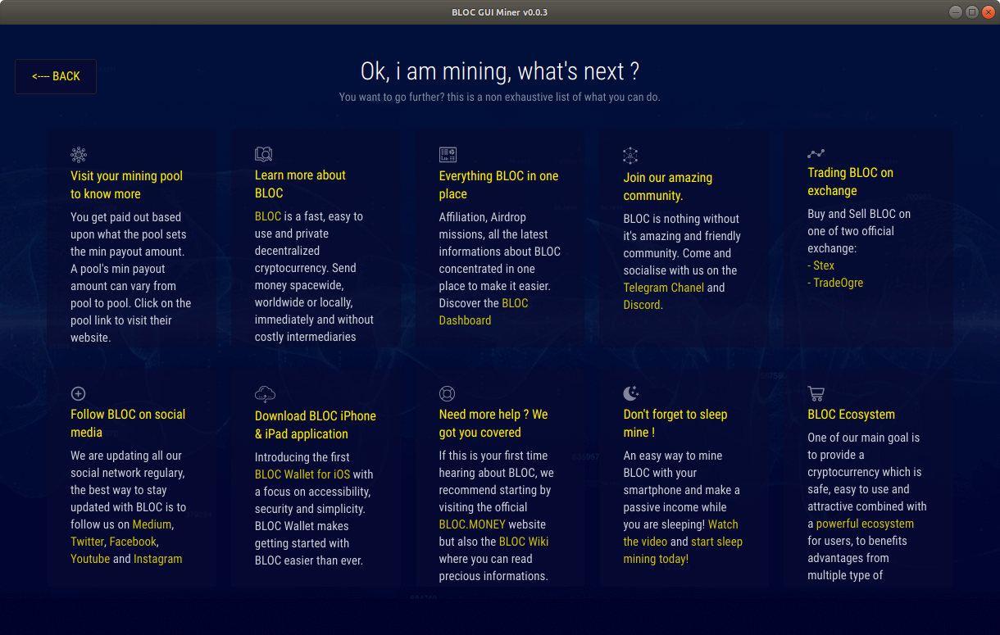

## **How to check your payouts**

You get paid out based upon what the pool sets the min payout amount. A pool’s min payout amount can vary from pool to pool.

Visit the mining pool you are mining from to checkout your actual payouts.

### Example if you are mining from [BLOC-MINING Pool Europe](https://bloc-mining.eu)

* Go to the [BLOC-MINING Pool Europe](https://bloc-mining.eu).

* Scroll down to **Your Stats & Payment History**

* Enter your **BLOC** address
* Click search
* All your payments will be displayed here

## **Mining TurtleCoin TRTL**

It is now very easy and fun to mine TurtleCoin using the BLOC GUI Miner.

### **Launch the BLOC GUI Miner**

Launch the BLOC GUI Miner and select **I want to mine other cryptocurrencies**

### **Select TurtleCoin**

Select TurtleCoin

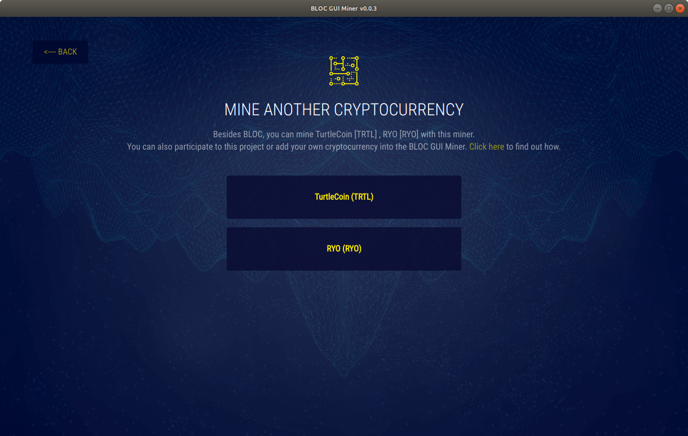

### **TRTL Address**

Enter your TRTL wallet address. It must start with **TRTL** and click **OK, NEXT STEP**.

### **Choose Mining Pool**

We suggest you to select the nearest mining pool following your location for the best mining experience and results.

Select your favorite mining pool from the list and click **OK, NEXT STEP**.

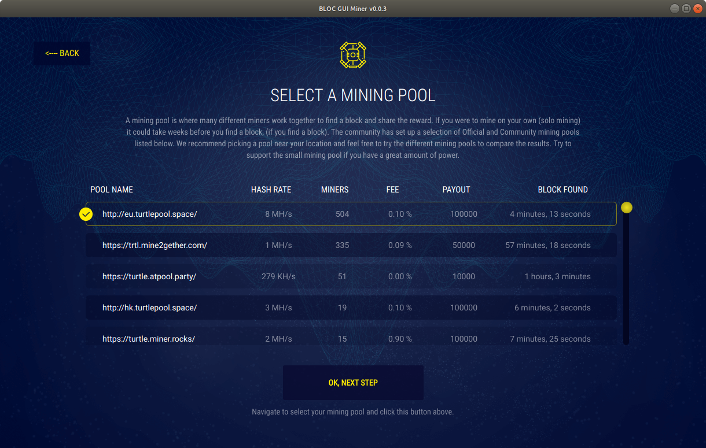

### **Antivirus**

Some antivirus packages detect cryptocurrency miners as malware and will remove the miner as soon as it's started.

In order for the BLOC GUI miner to function, you'll need to exclude the miner from being scanned by your antivirus software.

Once you are ready click **OK,I'VE ALLOWED THE MINER**

### **Configuring**

BLOC GUI Miner will auto configure your mining hardware with the best capabilities in the most cases. The configuration process is almost instant or take few seconds.

### **Mining**

Congratulations ! You are mining **(TRTL)** TurtleCoin cryptocurrency. This is the overview of the BLOC GUI Miner. You can see the complete informations of your mining activity and some more details about the BLOC ecosystem.

- You can change the mining pool by clicking here. It will open the [TurtleCoin miner settings page](../mining/BLOC-GUI-Miner.md#trtl-settings)

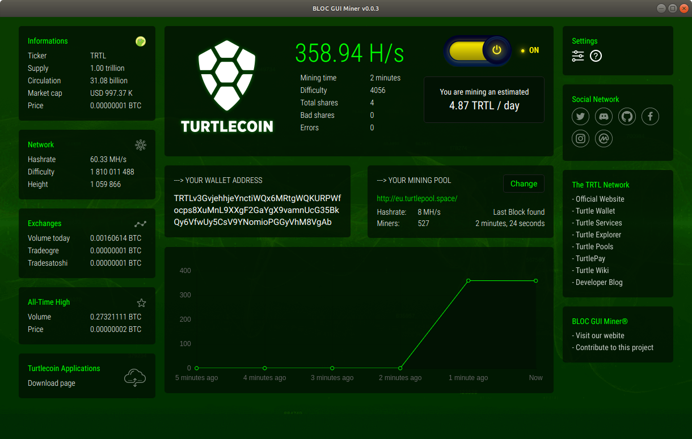

### **Settings** 

The settings page allow you to customize the miner settings:

- Modify your wallet mining address
- Choose a different mining pool

**Note**: *The % for CPU mining works only with XMRIG.*

- Select another coin to mine from the selector
    * Enter your wallet address
    * Choose your mining pool

Once you have made the change click the button **CLICK HERE TO SAVE THE SETTINGS**.

### **Help**

Do you need more help ? Make sure you visit this section to find out more about TurtleCoin, join the community, checkout the latest updates, watch videos and much more.

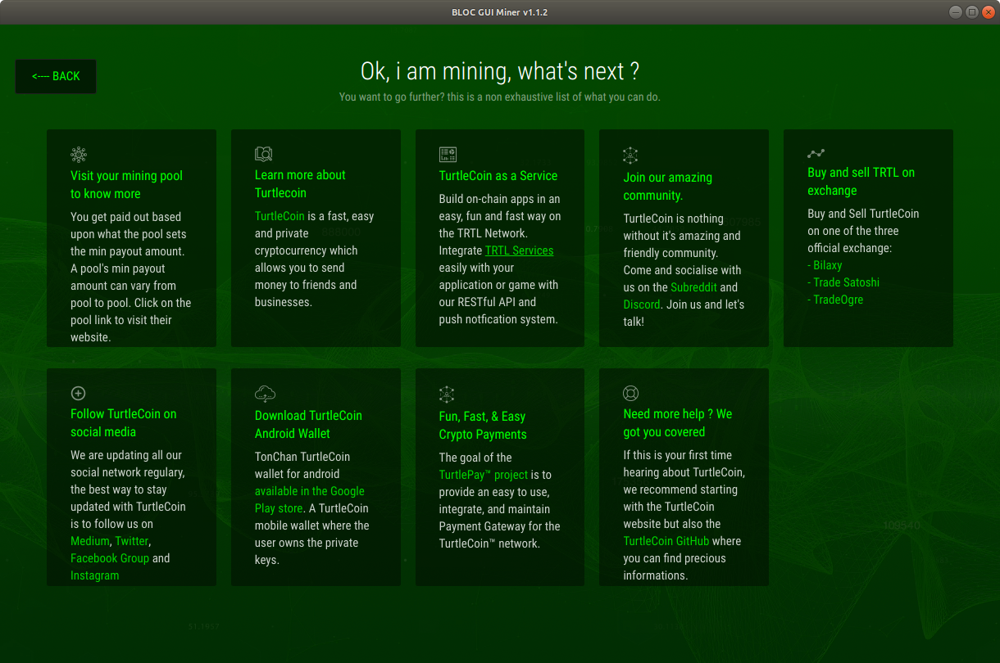

## **I have an issue not listed here**

If you have an issue not listed here or if you would like to add a new feature to the BLOC GUI Miner pelase visit us on [GitHub](https://github.com/furiousteam/GUI-miner) and log a new issue, alternatively, you can [contact us](../about/Community.md).