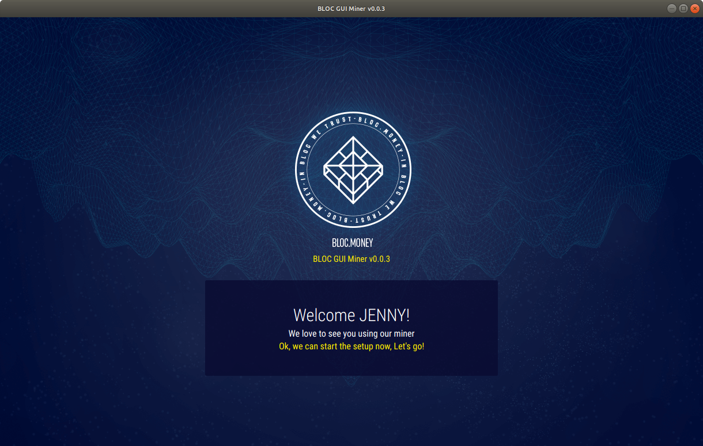
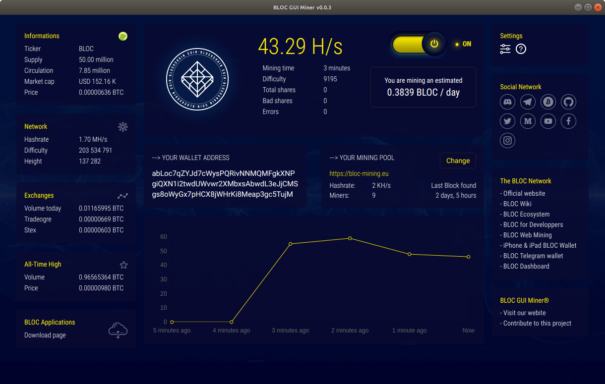
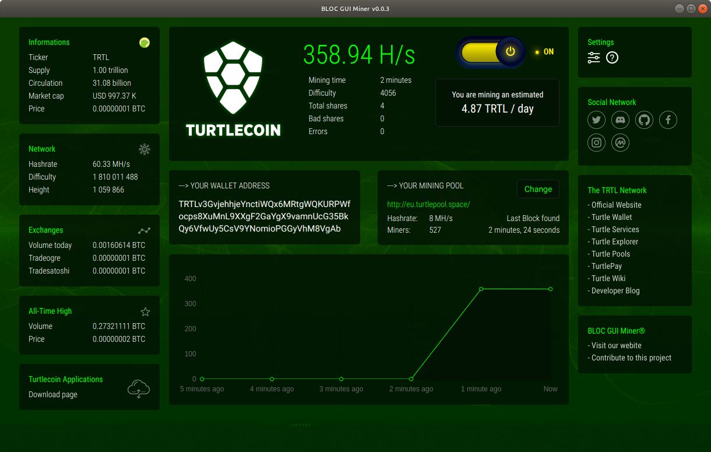

# **BLOC GUI Miner**

[BLOC GUI Miner](https://github.com/furiousteam/BLOC-GUI-Miner) is a beautiful, easy to use, Graphical User interface for mining multiple cryptocurrencies based on cryptonote.

It is aimed at getting people that have never tried mining before with a focus on accessibility, security and simplicity.

BLOC GUI Miner support two very popular miner backends: [xmr-stak](https://github.com/fireice-uk/xmr-stak) and [xmrig](https://github.com/xmrig/xmrig)

BLOC GUI Miner comes with **XMR-STAK 2.7.1** and XMRIG **2.8.3** already built-in, including configuration files for CPU and GPU mining in most of the cases.

If you want to learn about cryptocurrencies, [mining](../mining/What-is-mining.md) is a great place to start!

[Start mining](../mining/BLOC-GUI-Miner-using.md#start-mining) today and get rewarded in your favorite cryptocurrency.

## **Screenshots**

*Home*



*Select Coin to Mine*


*Mining BLOC*



*Mining TurtleCoin*



## **Supported Cryptocurrency**

Everyone can add their own cryptocurrency to the BLOC GUI Miner as long as it is supported by **XMR-STAK** and **XMRIG**.
In the same time everyone can add/edit a mining pool into the BLOC GUI Miner.

Curently we support :

- [BLOC.MONEY](https://bloc.money) **(BLOC)**
- [TurtleCoin](https://turtlecoin.lol) **(TRTL)**
- [RYO](https://ryo-currency.com) **(RYO)**

If you would like to contribute to this project by adding or editing a mining pool but also to add a new cryptonote currency please checkout the [instructions available](https://github.com/furiousteam/BLOC-GUI-Miner/tree/master/coins).

## **Supported Miners**

BLOC GUI Miner comes with **XMR-STAK** and **XMRIG** already built-in, including configuration files for CPU and GPU mining in most of the cases.

1. [xmr-stak](../mining/XMR-Stak-index.md) **v2.7.1**
2. [xmrig](../mining/XMRIG-index.md) **v2.8.3** (note: [xmrig-nvidia](https://github.com/xmrig/xmrig-nvidia) and [xmrig-amd](https://github.com/xmrig/xmrig-amd) are not yet implented

## **Guides**

- [How to compile the BLOC GUI Miner](../mining/BLOC-GUI-Miner-Compile.md)
- [How to use the BLOC GUI Miner to mine BLOC](../mining/BLOC-GUI-Miner-Compile.md)
- [How to mine TurtleCoin](../mining/BLOC-GUI-Miner-Compile.md)

## **Make sure you have a wallet**

You need to [create your wallet](../../wallets/Making-a-Wallet) before start mining.

We offer different possibility for you to create a **BLOC wallet** once you start the BLOC GUI Miner and follow the installation process.

If you would like to use the BLOC GUI Miner to mine other cryptocurrency than BLOC please prepare your wallet address to use for mining.

## **I have my own miner**<a name="use-my-binaries"></a>

You are welcome to use your own [xmr-stak](https://github.com/fireice-uk/xmr-stak) or [xmrig](https://github.com/xmrig/xmrig) binaries as long as it is the same version compatible with the BLOC GUI Miner available on this page.

Use the standard procedure to compile your favorite miner and place the binaries file inside the **miner** folder next to the BLOC GUI Miner application. Once you are ready simply double click the **BLOC GUI Miner** icon to launch the application and [start mining](../mining/BLOC-GUI-Miner-using.md#start-mining).

For the mining stats to display correctly you need to enable the API for each miner by doing the following:

Compiling XMR-STAK with option: **-DMICROHTTPD_ENABLE=ON**

Ensure you have the following in you config.txt file

`"httpd_port" : 16000,`

Compiling XMRIG with option: by default **-DWITH_HTTPD=ON** should be enabled.

Ensure you have the following in you config.json file
```
"api":{
  "port":16000,
  "access-token":null,
  "worker-id":null
}
```

## **Mining Tuning Intensity and threads configuration**

### XMR-STAK

[xmr-stak](https://github.com/fireice-uk/xmr-stak) gives too many options for tuning to get the best results out of your hardware. By default the miner creates config file for **CPU**, **NVIDIA** and **AMD GPU**. You can edit the values within these text files and see which works best for your mining hardware. Change the value of intensity, work-size, threads and blocks. You can add more GPUs and also lower the power mode of your CPU.

XMR-Stak will save your configuration in **config.txt** in the same directory from which it was first run.

Your configuration for pools(algorithm to mine, address, port etc) will be saved in **pools.txt**
The configuration of the device it mines(CPU/AMD/NVIDIA) will be saved in **cpu.txt**, **amd.txt** or **nvidia.txt**, respectively.

For more information on Tuning and configuring your hardware in XMR-stak we suggest you to read [this guide](https://github.com/fireice-uk/xmr-stak/blob/master/doc/tuning.md)

### XMRIG

Use [config.xmrig.com](https://config.xmrig.com/xmrig) to generate, edit or share configurations.

## **Default Developer Donation**

### XMR-STAK

By default, the XMR-STAK will donate 2% of the hashpower (2 minutes in 100 minutes) to XMR-stak developers pool.
If you want to change that, edit [donate-level.hpp](https://github.com/fireice-uk/xmr-stak/blob/master/xmrstak/donate-level.hpp) before you build the binaries.

### XMRRIG

By default, the XMRIG will donate 5% of the hashpower (5 minutes in 100 minutes) to XMRIG developers pool.
If you want to change that, edit `config.json` before you start mining.

The BLOC GUI Miner did not change this settings as we are using the binaries from the official XMRSTAK and XMRIG GitHub rep except for macOS that was built by us and we recommend to keep the donation level as it is to support the developers of both miners.

## **I have an issue not listed here**

If you have an issue not listed here or if you would like to add a new feature to the BLOC GUI Miner pelase visit us on [GitHub](https://github.com/furiousteam/GUI-miner) and log a new issue, alternatively, you can [contact us](../about/Community.md).