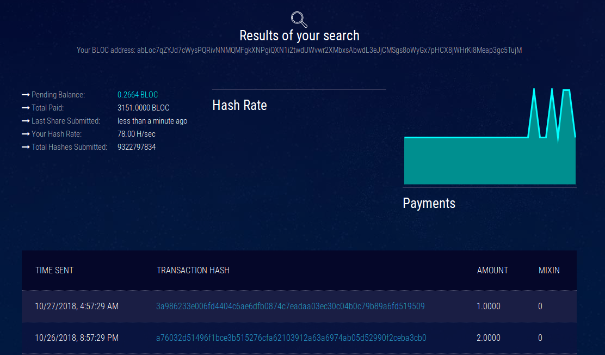

# **How to Mine BLOC with an SBC**

This guide will get you started mining BLOC on a Raspberry Pi or similar SBC (single-board computer).

Mining from a Rasberry Pi is not really efficient but it is more for the fun and there is a lot of improvements that can be done.

## **The fastest miner available for Raspbian on Raspberry Pi**

The miner [rPi-xmrig-gcc7.3.0](https://github.com/auto-joe/rPi-xmrig-gcc7.3.0) is a compilation of [Raspbian](../mining/XMRIG-index.md) version 2.8.3, compiled with gcc/g++ 7.3.0 specifically for Raspbian Stretch on Raspberry Pi3 b published by [auto-joe](https://github.com/auto-joe).

## **Setup**

Make sure you've already created a wallet. You'll need the wallet address to store any coins you mine. Follow the guide [here](../wallets/Making-a-Wallet.md) to get started and create your wallet.

For the SBC, download the latest non-desktop version of [Raspbian](https://www.raspberrypi.org/downloads). Follow their installation guide on how to write the OS image onto the MicroSD card. Once you've plugged in the SD Card, booted the Raspberry Pi, and connected it to the internet, run the following commands:

```
sudo apt-get update && sudo apt-get upgrade
```

This may take a few minutes. Next, we'll have to install some required tools to compile and run the miner.

Enter this command:

```
sudo apt-get install git automake autoconf pkg-config libcurl4-openssl-dev libjansson-dev libssl-dev libgmp-dev make g++ unzip
```

## **Install the Miner**

Next, we need to obtain a CPU miner. We'll use `rPi-xmrig-gcc7.3.0`

1. Download the `.zip` source code from the [Releases page](https://github.com/auto-joe/rPi-xmrig-gcc7.3.0/releases/latest)

```
wget https://github.com/auto-joe/rPi-xmrig-gcc7.3.0/archive/2.8.3.zip
```

2. Download it to a directory of your choice and extract it to a folder called `rPi-xmrig`, or anything of your choice.

```
unzip 2.8.3.zip
```

## **Configure and Run the Miner**

Open the file `start.sh` with a text editor and replace the existing parameters with these-

```
nano start.sh
```

This is what you need to enter with your pool address and correct abLoc mining address:

```
./xmrig -a cryptonight-heavy -k -o stratum+tcp://pool.address:port -u BLOCADDRESS -p x -k --variant=xhv --av=0 -t 4
```

A real exemple:

```
./xmrig -a cryptonight-heavy -k -o stratum+tcp://bloc-mining.eu:4444 -u abLoc7qZYJd7cWysPQRivNNMQMFgkXNPgiQXN1i2twdUWvwr2XMbxsAbwdL3eJjCMSgs8oWyGx7pHCX8jWHrKi8Meap3gc5TujM -p x -k --variant=xhv --av=0 -t 4

```

* Instead of `BLOCADDRESS`, simply paste your BLOC wallet address it must start with `abLoc`

  If you don't have one yet, you can generate a [paper wallet](../wallets/Making-a-Wallet.md) to mine towards for now, and later import into a CLI or GUI wallet.

* In place of `[pool address]`, you'll need to choose a pool to mine towards. You can check the full list of [mining pools here](../mining/Pools.md).


Make the start file executable by running the following command:
```
chmod +x start.sh
```

Then start the miner

```shell
./start.sh
```

After entering this command, the miner will start scanning your hardware and begin to mine.

## **Expected results**

This is what you should see while mining.


## **How to check your payouts**

You get paid out based upon what the pool sets the min payout amount. A pool’s min payout amount can vary from pool to pool. Visit the mining pool you are mining from to checkout your actual payouts.

### Example if you are mining from [BLOC-MINING Pool Europe](https://bloc-mining.eu)

* Go to the [BLOC-MINING Pool Europe](https://bloc-mining.eu).

* Scroll down to `Your Stats & Payment History`


* Enter your **BLOC** address
* Click search
* All your payments will be displayed here

