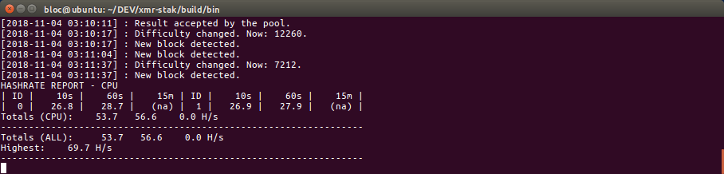
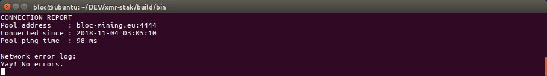

# **How to Set Up XMR-Stak on Linux**

Native binaries on linux are not available for XMR-stak.
You will need to compile yourself, follow these instructions:

If you have not yet downloaded and ran the [BLOC](https://bloc.money/download) software to sync the blockchain and create a wallet, you need to [create your wallet](../../wallets/Making-a-Wallet) before start mining.

## **Ubuntu 16.04**<a name="ubuntu-16-04"></a>

1. If you want to use your GPU for mining, do the following-

    * for AMD GPU’s-

        * Install drivers for your card

        * download the latest APP SDK from [here](http://debian.nullivex.com/amd/AMD-APP-SDKInstaller-v3.0.130.136-GA-linux64.tar.bz2). It should have the name `AMD-APP-SDKInstaller-v(version number)-GA-linux64.tar.bz2`

            * Extract it

            * Open the terminal wherever it is located

            * (optional) name it to something simpler

            * In the terminal, type `./(name).sh`

            * After installing, you should be good.

    * for nVidia GPU’s-

        * Install drivers for your card

        * Download the latest CUDA Toolkit from [here](https://developer.nvidia.com/cuda-downloads?target_os=Linux&target_arch=x86_64).

            * Download the base installer and follow the compilation instructions

            * Download every patch one-by-one in order and apply the patches

            * After that, you should be good.

2.  Open the terminal and install dependencies by running this command-

    ```
    sudo apt install libmicrohttpd-dev libssl-dev cmake build-essential libhwloc-dev
    ```

3.  Clone the package-

    `git clone https://github.com/fireice-uk/xmr-stak.git`

4.  To remove donations, type-

    `gedit xmr-stak/xmrstak/donate-level.hpp`

    * Change-

    `constexpr double fDevDonationLevel = 2.0 / 100.0;`

    * to

    `constexpr double fDevDonationLevel = 0.0 / 100.0;`

5.  Make a directory-

    `mkdir xmr-stak/build`

6.  Move over there-  

    `cd xmr-stak/build`

7.  Check build configuration

    * Make sure you check the XMR-stak [General build instructions](https://github.com/fireice-uk/xmr-stak/blob/master/doc/compile.md)
    
    * And the [Linux instructions](https://github.com/fireice-uk/xmr-stak/blob/master/doc/compile_Linux.md)

8.  Run cmake-

    `cmake ..`

    * If you don’t have nVidia GPUs, type-

    `cmake .. -DCUDA_ENABLE=OFF`

    * If you don’t have AMD GPUs, type-

    `cmake .. -DOpenCL_ENABLE=OFF`

    * If you have neither (only CPU mining) type-

    `cmake .. -DCUDA_ENABLE=OFF -DOpenCL_ENABLE=OFF`

    Example configuration on Linux for CPU mining only:

    * CMAKE_BUILD_TYPE = Release
    * MICROHTTPD_ENABLE = ON (*Enable HTML reports*)
    * OpenSSL_ENABLE = ON (*Mine from pool using https*)
    * XMR-STAK_COMPILE = generic (Use the binary on all CPU's with sse2)
    * OpenCL_ENABLE = OFF
    * CUDA_ENABLE = OFF

    `cmake .. -DCMAKE_BUILD_TYPE=Release -DMICROHTTPD_ENABLE=ON -DOpenSSL_ENABLE=ON -DXMR-STAK_COMPILE=generic -DCUDA_ENABLE=OFF -DOpenCL_ENABLE=OFF`

9.  Finish building it-

    `make install`

10. You should see a result like this.

    

10.  XMR-Stak will now be located in `/home/user/xmr-stak/build/bin`

11. Type-

    `./xmr-stak`

12. Check [XMR-Stak Setup and Configuration](#setup-and-config)

13. If you see something like this, that means it’s working and you are mining BLOC!


## **XMR-Stak Setup and Configuration**<a name="setup-and-config"></a>

Upon first launching XMR-Stak, the software will ask you several setup and configuration questions.

1.  `Please enter: - Do you want to use the HTTP interface? Unlike the screen display, browser interface is not affected by the GPU lag. If you don't want to use it, please enter 0, otherwise enter port number that the miner should listen on`


    Enter `0`, if you do not need to remotely check your hashrate.

    If you do need to, then enter a port number.
    Let's take the port number as `16000` and your IP address as `88.20.105.14` as an example.

    To check the hashrate, enter in the address bar of your web browser, `<88.20.105.14>:<16000>`. It should show a page with your rig's hashrate.  
    If you are checking from the same IP address, you can alternatively enter, `localhost:<16000>`

    Make sure to enter your own IP address if you enable this feature. You can choose any port you want!

2.  
   ```
    Please enter:

    - Please enter the currency that you want to mine: 
	- aeon7
	- bbscoin
	- bittube
	- cryptonight
	- cryptonight_bittube2
	- cryptonight_masari
	- cryptonight_haven
	- cryptonight_heavy
	- cryptonight_lite
	- cryptonight_lite_v7
	- cryptonight_lite_v7_xor
	- cryptonight_v7
	- cryptonight_v8
	- cryptonight_v7_stellite
	- graft
	- haven
	- intense
	- masari
	- monero
	- qrl
	- ryo
	- stellite
	- turtlecoin

   ```

    Enter `cryptonight_haven`

3.  `- Pool address: e.g. pool.example.com:3333 `

    Choose a pool from any of the [available pools](https://bloc.money/mining) that is **closest to you** and enter its URL (you will be able to add more later).

4.  `- Username (Wallet address or pool login):`  

    If you have not yet downloaded and ran the BLOC software to sync the blockchain and create a wallet, you can [create your wallet](../../wallets/Making-a-Wallet) before start mining.

5.  `- Password (mostly empty or x):`  

    Leave it empty and press enter.

6.  `- Rig identifier for pool-side statistics (needs pool support). Can be empty:`

    Leave it empty and press enter.

7.  `- Does this pool port support TLS/SSL? Use no if unknown. (y/N)`  

    In most cases, `N` is fine.

8.  `- Do you want to use nicehash on this pool? (y/n)`  

    Enter `n`(in case you do, enter `y`).

9.  `- Do you want to use multiple pools? (y/n)`  

    * Enter `y` if you would like to add more pools.
    * Give them all a weight of `10` if you're tired of reading, or if you want the best experience, give the pools nearest to you a higher number, and the ones further from you a lower number.  
    * XMR-Stak will prioritize the highest weight pool, and fall back to the others if it cannot connect.
    * If they are all given the same weight, it will connect to them in order of how they are listed, form top to bottom, in the configuration file.
    * If you are on Windows 7/8, it will ask for administrator permission again. Click `Yes` to grant it permission.
    * If you are on Windows 10, it will not ask for it again.

Done! The miner will now start scanning your hardware and will begin mining. Awesome!

## How to check hashrate and results in xmr-stak

To check the hashrate and results in xmr stak you have 2 options. Command line option and HTML reports.

### Command Line option

* Type `h` in the command line window to display your hashrate



* Type `r` to display the share results.


* Type `c` to display the connection details.



### HTML Reports

 If you want clean looking reports to display your hashrate then you can use the HTML reports option.

 To configure the reports you need to edit the `httpd_port variable`. Then enable wifi on your phone and navigate to `[miner ip address]:[httpd_port]` in your phone browser. If you want to use the data in scripts, you can get the JSON version of the data at url `[miner ip address]:[httpd_port]/api.json`

This is how it looks :


## **How to check your payouts**

You get paid out based upon what the pool sets the min payout amount. A pool’s min payout amount can vary from pool to pool. Visit the mining pool you are mining from to checkout your actual payouts.

### Example if you are mining from [BLOC-MINING Pool Europe](https://bloc-mining.eu)

* Go to the [BLOC-MINING Pool Europe](https://bloc-mining.eu).

* Scroll down to `Your Stats & Payment History`


* Enter your **BLOC** address
* Click search
* All your payments will be displayed here


## Settings and configuration

XMR-Stak will save your configuration in `config.txt`  in the same directory from which it was first run.

Your configuration for pools(algorithm to mine, address, port etc) will be saved in `pools.txt`
The configuration of the device it mines(CPU/AMD/NVIDIA) will be saved in `cpu.txt`, `amd.txt` or `nvidia.txt`, respectively.

Run XMR-Stak again from the same directory to reuse the configuration.

## Mining Tuning Intensity and threads configuration

XMR-STAK gives too many options for tuning to get the best results out of your hardware. By default the miner creates config file for CPU, NVIDIA and AMD GPU. You can edit the values within these text files and see which works best for your mining hardware. Change the value of intensity, work-size, threads and blocks. You can add more GPUs and also lower the power mode of your CPU.

For more information on Tuning and configuring your hardware in XMR-stak we suggest you to read [this guide](https://github.com/fireice-uk/xmr-stak/blob/master/doc/tuning.md)