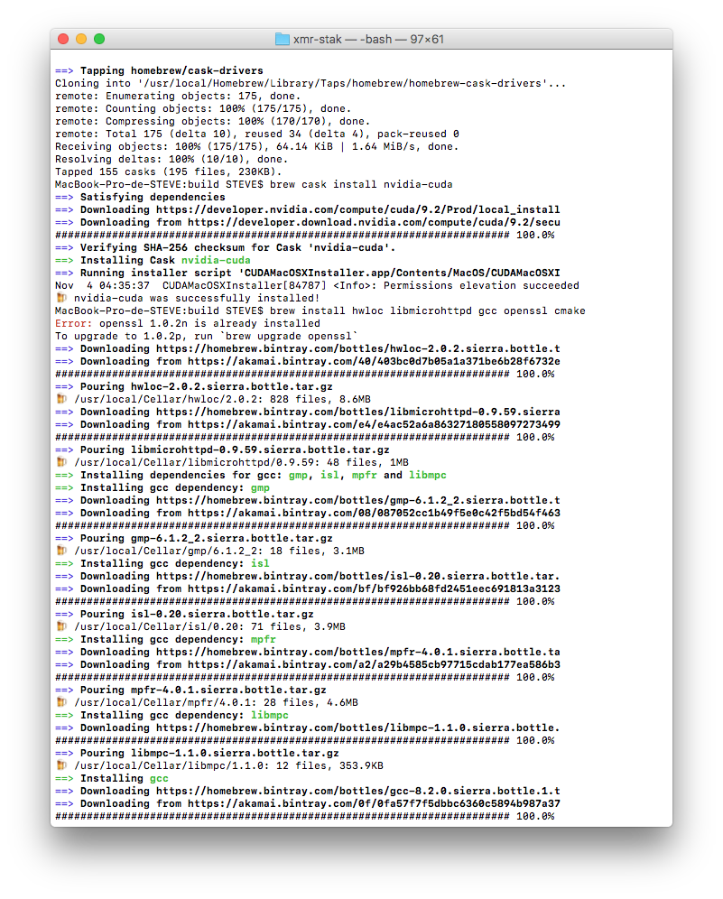
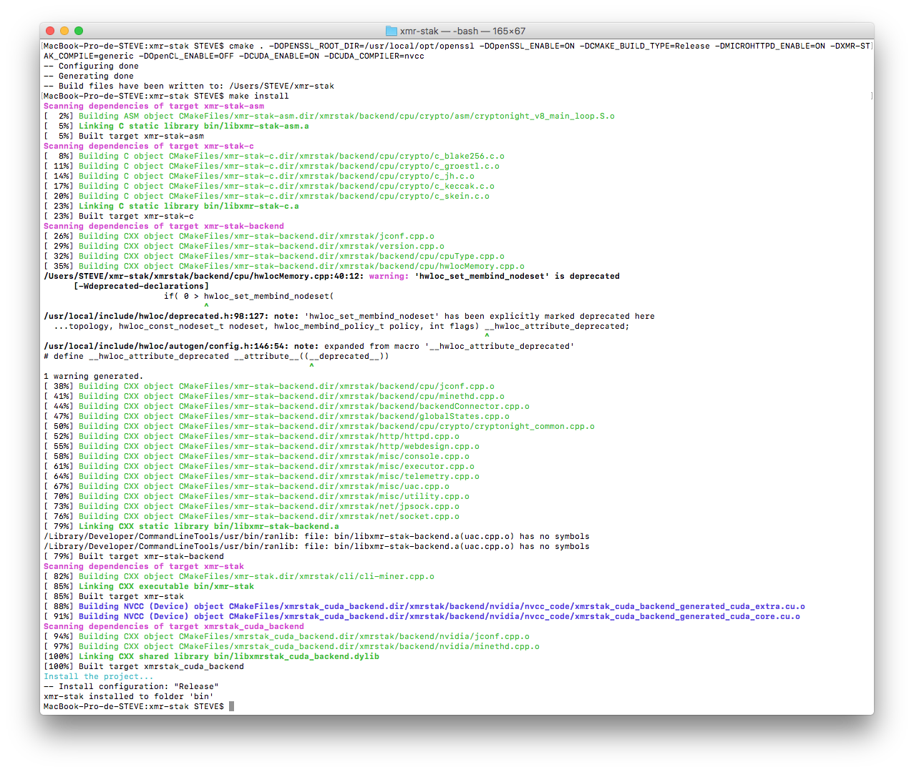
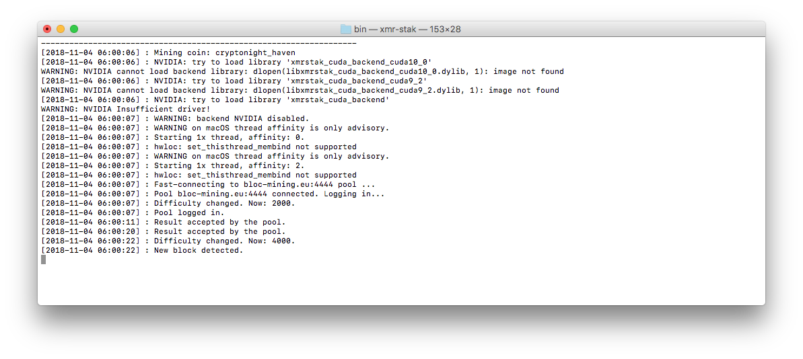
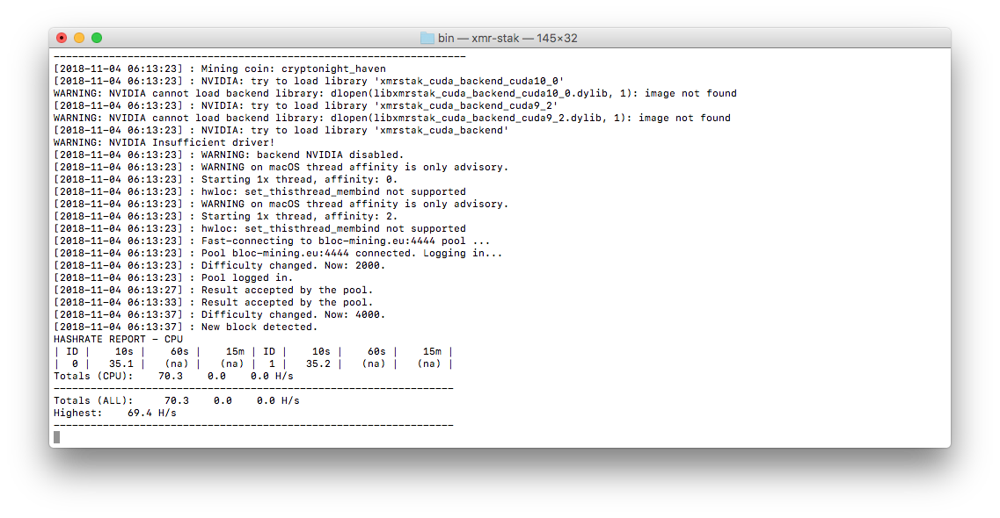
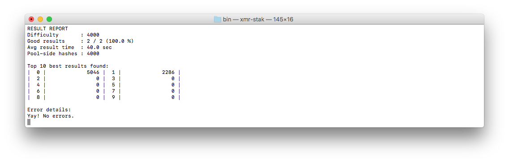
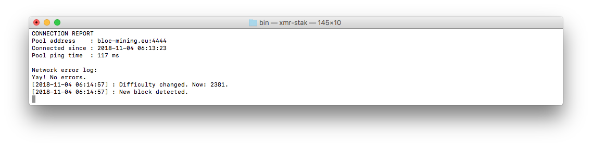
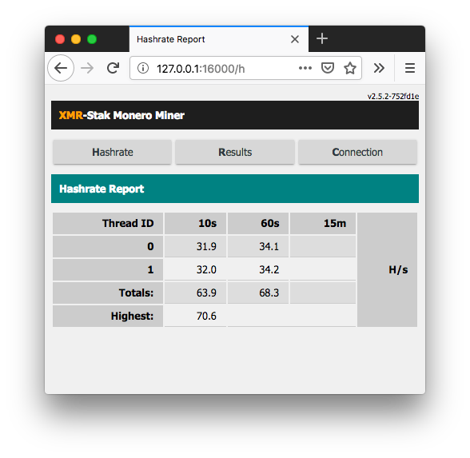
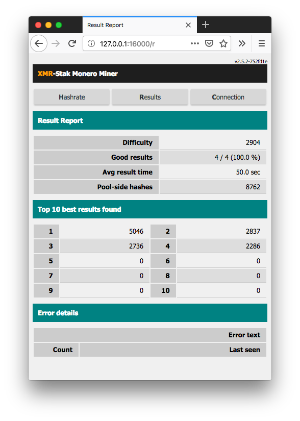
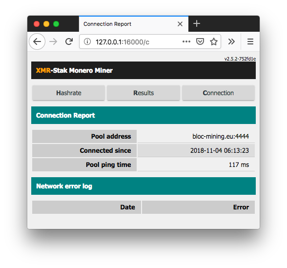

# **How to mine with XMR-Stak on Mac OS**

Native binaries on Mac OS are not available for XMR-stak.
You will need to compile yourself, follow these instructions:

## **Make sure you have a wallet**

If you have not yet downloaded and ran the [BLOC](https://bloc.money/download) software to sync the blockchain and create a wallet, you need to [create your wallet](../../wallets/Making-a-Wallet) before start mining.

## **Choose your mining pool**

You can find a complete list of the BLOC mining pools available on the [BLOC MINING](https://bloc.money/mining) section of our website. We suggest you to select the nearest mining pool following your location for the best mining experience and results.

## **Default Developer Donation**

By default, the XMR-STAK will donate 2% of the hashpower (2 minutes in 100 minutes) to XMR-stak developers pool.
If you want to change that, edit [donate-level.hpp](https://github.com/fireice-uk/xmr-stak/blob/master/xmrstak/donate-level.hpp) before you build the binaries. We strongly recommend to leave this donation fee at least 1% to help the **XMR-stak** developers by providing regular updates.

## **Mac OS**</a>

### Dependencies

Assuming you already have [Homebrew](https://brew.sh/) installed, the installation of dependencies is pretty straightforward and will generate the xmr-stak binary in the bin/ directory.

1. If you want to use your GPU for mining, do the following-

    * for nVidia GPU’s-

        ```
        brew tap caskroom/drivers
        brew cask install nvidia-cuda
        brew install hwloc libmicrohttpd gcc openssl cmake
        cmake . -DOPENSSL_ROOT_DIR=/usr/local/opt/openssl -DOpenCL_ENABLE=OFF
        make install
        ```
    
    Make sure you check all available [Cmake Options](https://github.com/fireice-uk/xmr-stak/blob/master/doc/compile.md#nvidia-build-options)

    * for AMD GPU’s-

        * OpenCL is bundled with Xcode, so no other depedency then the basic ones needed. Just enable OpenCL via the -DOpenCL_ENABLE=ON CMake option.
        
        ```
        brew install hwloc libmicrohttpd gcc openssl cmake
        cmake . -DOPENSSL_ROOT_DIR=/usr/local/opt/openssl -DCUDA_ENABLE=OFF -DOpenCL_ENABLE=ON
        make install
        ```
    * for CPU's only-

         ```
        brew install hwloc libmicrohttpd gcc openssl cmake
        cmake . -DOPENSSL_ROOT_DIR=/usr/local/opt/openssl -DCUDA_ENABLE=OFF -DOpenCL_ENABLE=OFF
        make install
        ```
    
    Make sure you check all available [Cmake Options](https://github.com/fireice-uk/xmr-stak/blob/master/doc/compile.md#cpu-build-options)

2.  Open the terminal

3.  Clone the package-

    `git clone https://github.com/fireice-uk/xmr-stak.git`

4.  To remove donations, type-

    `sudo open -a TextEdit xmr-stak/xmrstak/donate-level.hpp`

    * Change-

    `constexpr double fDevDonationLevel = 2.0 / 100.0;`

    * to

    `constexpr double fDevDonationLevel = 0.0 / 100.0;`

    * Save by using `Command + S` and close the file.

5.  Go to the directoy xmr-stak

    `cd xmr-stak`

6.  Check build configuration

    * Make sure you check the XMR-stak [General build instructions](https://github.com/fireice-uk/xmr-stak/blob/master/doc/compile.md#build-system)
    
    * And the [Mac instructions](https://github.com/fireice-uk/xmr-stak/blob/master/doc/compile_macOS.md)

7.  Run cmake-

    `cmake ..`

    * If you use nVidia GPUs, type-

    `cmake . -DOPENSSL_ROOT_DIR=/usr/local/opt/openssl -DOpenCL_ENABLE=OFF`

    * If you have AMD GPUs, type-

    `cmake . -DOPENSSL_ROOT_DIR=/usr/local/opt/openssl -DCUDA_ENABLE=OFF -DOpenCL_ENABLE=ON`

    * If you have neither (only CPU mining) type-

    `cmake . -DOPENSSL_ROOT_DIR=/usr/local/opt/openssl -DCUDA_ENABLE=OFF -DOpenCL_ENABLE=OFF`

    Example configuration on Mac OS for GPU mining with nVidia:

    * CMAKE_BUILD_TYPE = Release
    * MICROHTTPD_ENABLE = ON (*Enable HTML reports*)
    * OpenSSL_ENABLE = ON (*Mine from pool using https*)
    * XMR-STAK_COMPILE = generic (Use the binary on all CPU's with sse2)
    * OpenCL_ENABLE = OFF (not an AMD)
    * CUDA_ENABLE = ON (Nvidia)
    * CUDA_COMPILER = nvcc (Compiler)

    `cmake . -DOPENSSL_ROOT_DIR=/usr/local/opt/openssl -DOpenSSL_ENABLE=ON -DCMAKE_BUILD_TYPE=Release -DMICROHTTPD_ENABLE=ON -DXMR-STAK_COMPILE=generic -DOpenCL_ENABLE=OFF -DCUDA_ENABLE=ON -DCUDA_COMPILER=nvcc`

8.  Finish building it-

    `make install`

9. You should see a result like this.

    

    And:

    

10.  XMR-Stak will now be located in `/home/user/xmr-stak/bin`

11. Type-

    `./xmr-stak`

12. Check [XMR-Stak Setup and Configuration](#setup-and-config)

13. If you see something like this, that means it’s working and you are mining BLOC!



## **XMR-Stak Setup and Configuration**<a name="setup-and-config"></a>

Upon first launching XMR-Stak, the software will ask you several setup and configuration questions.

1.  `Please enter: - Do you want to use the HTTP interface? Unlike the screen display, browser interface is not affected by the GPU lag. If you don't want to use it, please enter 0, otherwise enter port number that the miner should listen on`


    Enter `0`, if you do not need to remotely check your hashrate.

    If you do need to, then enter a port number.
    Let's take the port number as `16000` and your IP address as `88.20.105.14` as an example.

    To check the hashrate, enter in the address bar of your web browser, `<88.20.105.14>:<16000>`. It should show a page with your rig's hashrate.  
    If you are checking from the same IP address, you can alternatively enter, `localhost:<16000>`

    Make sure to enter your own IP address if you enable this feature. You can choose any port you want!

2.  
   ```
    Please enter:

    - Please enter the currency that you want to mine: 
	- aeon7
	- bbscoin
	- bittube
	- cryptonight
	- cryptonight_bittube2
	- cryptonight_masari
	- cryptonight_haven
	- cryptonight_heavy
	- cryptonight_lite
	- cryptonight_lite_v7
	- cryptonight_lite_v7_xor
	- cryptonight_v7
	- cryptonight_v8
	- cryptonight_v7_stellite
	- graft
	- haven
	- intense
	- masari
	- monero
	- qrl
	- ryo
	- stellite
	- turtlecoin

   ```

    Enter `cryptonight_haven`

3.  `- Pool address: e.g. pool.example.com:3333 `

    Choose a pool from any of the [available pools](https://bloc.money/mining) that is **closest to you** and enter its URL (you will be able to add more later).

4.  `- Username (Wallet address or pool login):`  

    If you have not yet downloaded and ran the BLOC software to sync the blockchain and create a wallet, you can [create your wallet](../../wallets/Making-a-Wallet) before start mining.

5.  `- Password (mostly empty or x):`  

    Leave it empty and press enter.

6.  `- Rig identifier for pool-side statistics (needs pool support). Can be empty:`

    Leave it empty and press enter.

7.  `- Does this pool port support TLS/SSL? Use no if unknown. (y/N)`  

    In most cases, `N` is fine.

8.  `- Do you want to use nicehash on this pool? (y/n)`  

    Enter `n`(in case you do, enter `y`).

9.  `- Do you want to use multiple pools? (y/n)`  

    * Enter `y` if you would like to add more pools.
    * Give them all a weight of `10` if you're tired of reading, or if you want the best experience, give the pools nearest to you a higher number, and the ones further from you a lower number.  
    * XMR-Stak will prioritize the highest weight pool, and fall back to the others if it cannot connect.
    * If they are all given the same weight, it will connect to them in order of how they are listed, form top to bottom, in the configuration file.
    * If you are on Windows 7/8, it will ask for administrator permission again. Click `Yes` to grant it permission.
    * If you are on Windows 10, it will not ask for it again.

Done! The miner will now start scanning your hardware and will begin mining. Awesome!

## **How to check hashrate and results in xmr-stak**

To check the hashrate and results in xmr stak you have 2 options. Command line option and HTML reports.

### Command Line option

* Type `h` in the command line window to display your hashrate



* Type `r` to display the share results.



* Type `c` to display the connection details.



### HTML Reports

 If you want clean looking reports to display your hashrate then you can use the HTML reports option.

 To configure the reports you need to edit the `httpd_port variable`. Then enable wifi on your phone and navigate to `[miner ip address]:[httpd_port]` in your phone browser. If you want to use the data in scripts, you can get the JSON version of the data at url `[miner ip address]:[httpd_port]/api.json`

This is how it looks :







## **How to check your payouts**

You get paid out based upon what the pool sets the min payout amount. A pool’s min payout amount can vary from pool to pool. Visit the mining pool you are mining from to checkout your actual payouts.

### Example if you are mining from [POOL.BLOC.MONEY](https://pool.bloc.money)

* Go to the [POOL.BLOC.MONEY](https://pool.bloc.money).

* Scroll down to `Your Stats & Payment History`


* Enter your **BLOC** address
* Click search
* All your payments will be displayed here


## **Settings and configuration**

XMR-Stak will save your configuration in `config.txt`  in the same directory from which it was first run.

Your configuration for pools(algorithm to mine, address, port etc) will be saved in `pools.txt`
The configuration of the device it mines(CPU/AMD/NVIDIA) will be saved in `cpu.txt`, `amd.txt` or `nvidia.txt`, respectively.

Run XMR-Stak again from the same directory to reuse the configuration.

## **Mining Tuning Intensity and threads configuration**

XMR-STAK gives too many options for tuning to get the best results out of your hardware. By default the miner creates config file for CPU, NVIDIA and AMD GPU. You can edit the values within these text files and see which works best for your mining hardware. Change the value of intensity, work-size, threads and blocks. You can add more GPUs and also lower the power mode of your CPU.

For more information on Tuning and configuring your hardware in XMR-stak we suggest you to read [this guide](https://github.com/fireice-uk/xmr-stak/blob/master/doc/tuning.md)

## **Bug and report**

We were not able to run XMR-stak with the GPU capabilities on this example due to our current OS version not supported by the Nvidia drivers.

It seems you need to have at least 10.13.x and download the [NVIDIA display driver and GeForce Experience application](https://github.com/fireice-uk/xmr-stak/blob/master/doc/tuning.md). We are running a 10.12.6 at the time of this guide.

An update should be posted soon.