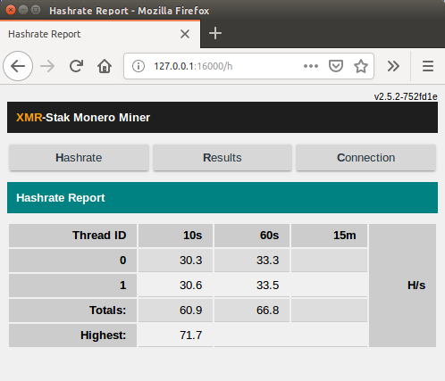
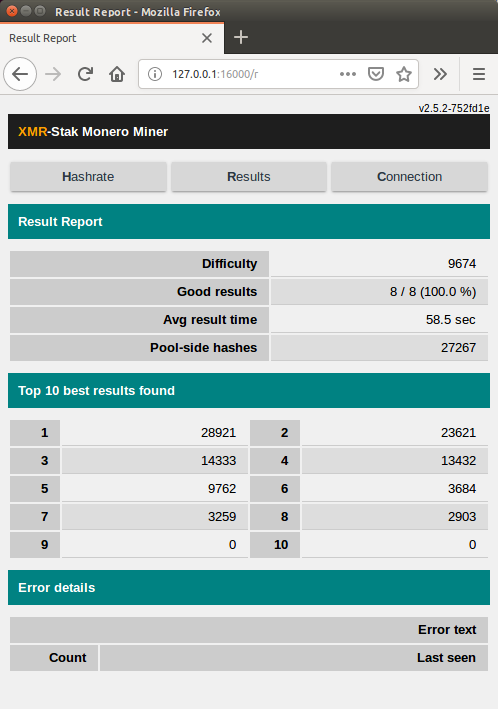
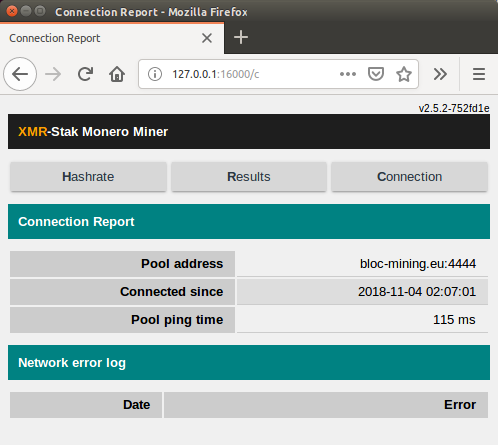

# **What is XMR-STAK ?**

XMR-Stak - Cryptonight All-in-One Mining Software

XMR-STAK is the only program that supports mining with CPU, NVIDIA GPUs and AMD GPUs. Also it is available for Windows, Linux and MacOS. XMR-Stak is a universal stratum pool miner to mine crypto currencies like Monero, Electroneum, [BLOC](https://bloc.money) and basically any coins that are powered by cryptonight and cryptonight_lite algorithm.

XMR Stak is well optimized and it is known to significantly generate more hashrates than any other miners. Here in this beginners guide we’ll be showing you how to use XMR-STAK and start mining [BLOC](https://bloc.money).

## **Features**

* support all common backends (CPU/x86, AMD-GPU and NVIDIA-GPU)
* support all common OS (Linux, Windows and macOS)
* supports algorithm cryptonight for Monero (XMR) and cryptonight-light (AEON)
* easy to use
* guided start (no need to edit a config file for the first start)
* auto-configuration for each backend
* open source software (GPLv3)
* TLS support
* HTML statistics
* JSON API for monitoring

## **Download****

* You can find the latest releases and precompiled binaries on GitHub under [Releases](https://github.com/fireice-uk/xmr-stak/releases)
* Or compile yourself using the [Source code](https://github.com/fireice-uk/xmr-stak/releases)
* [Compile instructions](https://github.com/fireice-uk/xmr-stak/blob/master/doc/compile.md) from XMR-Stak Github.

## **Guides**

* [How to mine BLOC with XMR-Stak on Linux](../XMR-Stak-Linux-Guide.md)
* [How to mine BLOC with XMR-Stak on Windows](../XMR-Stak-windows-Guide.md)
* [How to ming BLOC with XMR-Stak on Mac](../XMR-Stak-Linux-Guide.md)

## **HTML and JSON API report configuration**

To configure the reports you need to edit the `httpd_port variable`. Then enable wifi on your phone and navigate to `[miner ip address]:[httpd_port]` in your phone browser. If you want to use the data in scripts, you can get the JSON version of the data at url `[miner ip address]:[httpd_port]/api.json`

This is how it looks :

## **Default Developer Donation**

By default, the XMR-STAK will donate 2% of the hashpower (2 minutes in 100 minutes) to XMR-stak developers pool.
If you want to change that, edit [donate-level.hpp](https://github.com/fireice-uk/xmr-stak/blob/master/xmrstak/donate-level.hpp) before you build the binaries.