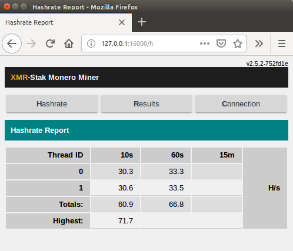
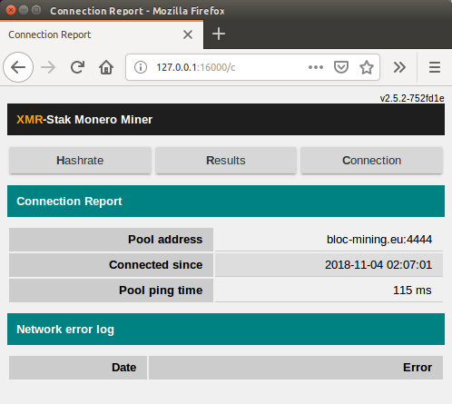

# **How to Set Up XMR-Stak for Windows**

XMR-Stak is a unified miner, which means the same program will be used to mine with both your CPU and your GPU. It will automatically detect your hardware and adjust the settings accordingly.

## **Make sure you have a wallet**

If you have not yet downloaded and ran the [BLOC](https://bloc.money/download) software to sync the blockchain and create a wallet, you need to [create your wallet](../../wallets/Making-a-Wallet) before start mining.

## **Choose your mining pool**

You can find a complete list of the BLOC mining pools available on the [BLOC MINING](https://bloc.money/mining) section of our website. We suggest you to select the nearest mining pool following your location for the best mining experience and results.

## **Default Developer Donation**

By default, the XMR-STAK will donate 2% of the hashpower (2 minutes in 100 minutes) to XMR-stak developers pool.
If you want to change that, you will need to [compile yourself XMR-stak for Windows](https://github.com/fireice-uk/xmr-stak/blob/master/doc/compile_Windows.md) and edit [donate-level.hpp](https://github.com/fireice-uk/xmr-stak/blob/master/xmrstak/donate-level.hpp) before you build the binaries.

We strongly recommend to leave this donation fee at least 1% to help the **XMR-stak** developers by providing regular updates.

If you are ok with the 2% donation to the XMR-stak developers and use their binary and you can proceed with the following:

## **Downloading and Installing**

1. Download and install [XMR-Stak Unified Miner](https://github.com/fireice-uk/xmr-stak/releases/latest). It will auto-detect your hardware, and tune everything for you.
2. Make a folder called `BLOC Miner` on your Desktop and unzip the files you just downloaded for XMR-Stak in there.
3. Double-click on `xmr-stak.exe`.

    #### To start XMR-Stak without using your CPU/GPU, follow these steps <a name= "#xmr-stak-no-cpu-gpu"> </a>

    - Open Command Prompt

    - Type `cd Desktop\BLOC Miner`

    - To start XMR-Stak without utilising the CPU, type `xmr-stak.exe --noCPU`
    - To start XMR-Stak without utilizing your nVidia GPU, type `xmr-stak.exe --noNVIDIA`
    - To start XMR-Stak without utilizing your AMD GPU, type `xmr-stak.exe --noAMD`
    - To start XMR-Stak without utilizing either of your GPU's, type `xmr-stak.exe --noAMD --noNVIDIA`

    **If you want to use both your CPU and your GPU, ignore these steps. Just launch `xmr-stak.exe`**

4. Click `Yes` when it asks if you want to run as Administrator. This is so that the program can see what hardware you're running.
5. Check [XMR-Stak Setup and Configuration](#setup-and-config)

## **XMR-Stak Setup and Configuration**<a name="setup-and-config"></a>

Upon first launching XMR-Stak, the software will ask you several setup and configuration questions.

1.  `Please enter: - Do you want to use the HTTP interface? Unlike the screen display, browser interface is not affected by the GPU lag. If you don't want to use it, please enter 0, otherwise enter port number that the miner should listen on`


    Enter `0`, if you do not need to remotely check your hashrate.

    If you do need to, then enter a port number.
    Let's take the port number as `16000` and your IP address as `88.20.105.14` as an example.

    To check the hashrate, enter in the address bar of your web browser, `<88.20.105.14>:<16000>`. It should show a page with your rig's hashrate.  
    If you are checking from the same IP address, you can alternatively enter, `localhost:<16000>`

    Make sure to enter your own IP address if you enable this feature. You can choose any port you want!

2.  
   ```
    Please enter:

    - Please enter the currency that you want to mine: 
	- aeon7
	- bbscoin
	- bittube
	- cryptonight
	- cryptonight_bittube2
	- cryptonight_masari
	- cryptonight_haven
	- cryptonight_heavy
	- cryptonight_lite
	- cryptonight_lite_v7
	- cryptonight_lite_v7_xor
	- cryptonight_v7
	- cryptonight_v8
	- cryptonight_v7_stellite
	- graft
	- haven
	- intense
	- masari
	- monero
	- qrl
	- ryo
	- stellite
	- turtlecoin

   ```

    Enter `cryptonight_haven`

3.  `- Pool address: e.g. pool.example.com:3333 `

    Choose a pool from any of the [available pools](https://bloc.money/mining) that is **closest to you** and enter its URL (you will be able to add more later).

4.  `- Username (Wallet address or pool login):`  

    If you have not yet downloaded and ran the BLOC software to sync the blockchain and create a wallet, you can [create your wallet](../../wallets/Making-a-Wallet) before start mining.

5.  `- Password (mostly empty or x):`  

    Leave it empty and press enter.

6.  `- Rig identifier for pool-side statistics (needs pool support). Can be empty:`

    Leave it empty and press enter.

7.  `- Does this pool port support TLS/SSL? Use no if unknown. (y/N)`  

    In most cases, `N` is fine.

8.  `- Do you want to use nicehash on this pool? (y/n)`  

    Enter `n`(in case you do, enter `y`).

9.  `- Do you want to use multiple pools? (y/n)`  

    * Enter `y` if you would like to add more pools.
    * Give them all a weight of `10` if you're tired of reading, or if you want the best experience, give the pools nearest to you a higher number, and the ones further from you a lower number.  
    * XMR-Stak will prioritize the highest weight pool, and fall back to the others if it cannot connect.
    * If they are all given the same weight, it will connect to them in order of how they are listed, form top to bottom, in the configuration file.
    * If you are on Windows 7/8, it will ask for administrator permission again. Click `Yes` to grant it permission.
    * If you are on Windows 10, it will not ask for it again.


Done! The miner will now start scanning your hardware and will begin mining. Awesome!


## **How to check hashrate and results in xmr-stak**

To check the hashrate and results in xmr stak you have 2 options. Command line option and HTML reports.

### Command Line option

* Type `h` in the command line window to display your hashrate


* Type `r` to display the share results.


* Type `c` to display the connection details.


### **HTML Reports**

 If you want clean looking reports to display your hashrate then you can use the HTML reports option.

 To configure the reports you need to edit the `httpd_port variable`. Then enable wifi on your phone and navigate to `[miner ip address]:[httpd_port]` in your phone browser. If you want to use the data in scripts, you can get the JSON version of the data at url `[miner ip address]:[httpd_port]/api.json`

This is how it looks :






## **How to check your payouts**

You get paid out based upon what the pool sets the min payout amount. A pool’s min payout amount can vary from pool to pool. Visit the mining pool you are mining from to checkout your actual payouts.

### Example if you are mining from [POOL.BLOC.MONEY](https://pool.bloc.money)

* Go to the [POOL.BLOC.MONEY](https://pool.bloc.money).

* Scroll down to `Your Stats & Payment History`


* Enter your **BLOC** address
* Click search
* All your payments will be displayed here


## **Settings and configuration**

XMR-Stak will save your configuration in `config.txt`  in the same directory from which it was first run.

Your configuration for pools(algorithm to mine, address, port etc) will be saved in `pools.txt`
The configuration of the device it mines(CPU/AMD/NVIDIA) will be saved in `cpu.txt`, `amd.txt` or `nvidia.txt`, respectively.

Run XMR-Stak again from the same directory to reuse the configuration.

## **Mining Tuning Intensity and threads configuration**

XMR-STAK gives too many options for tuning to get the best results out of your hardware. By default the miner creates config file for CPU, NVIDIA and AMD GPU. You can edit the values within these text files and see which works best for your mining hardware. Change the value of intensity, work-size, threads and blocks. You can add more GPUs and also lower the power mode of your CPU.

For more information on Tuning and configuring your hardware in XMR-stak we suggest you to read [this guide](https://github.com/fireice-uk/xmr-stak/blob/master/doc/tuning.md)