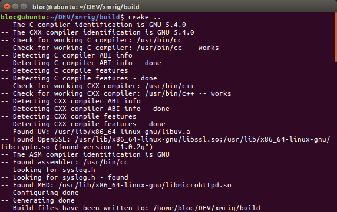
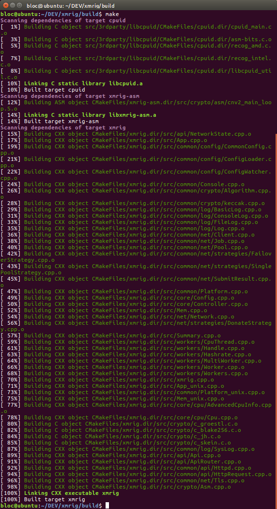
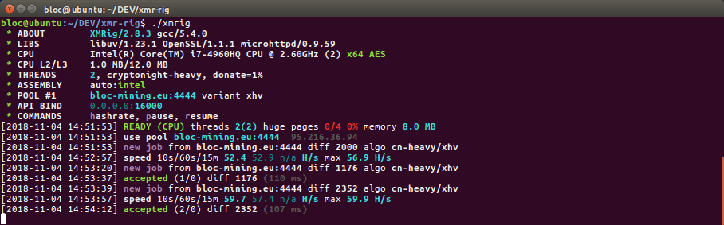
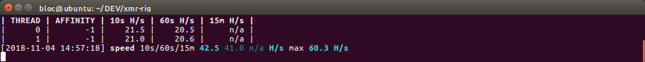
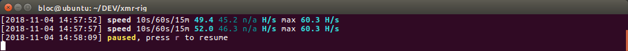
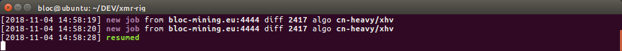
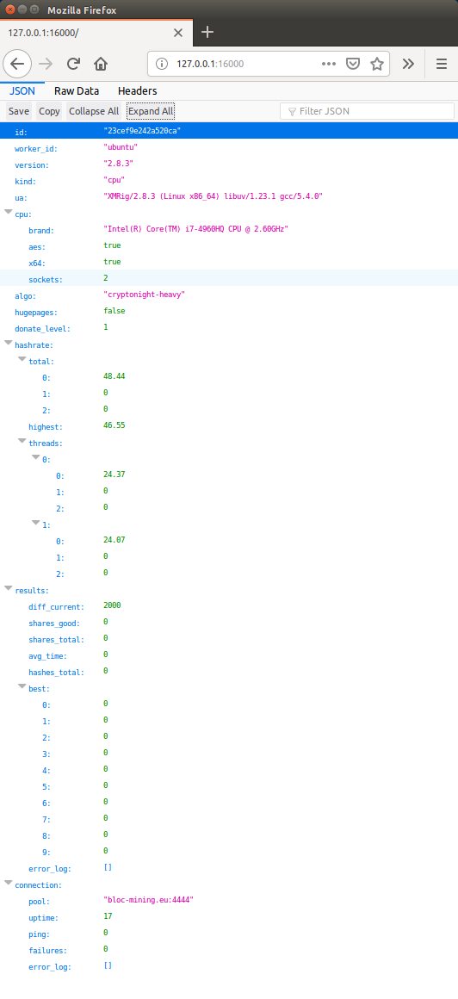
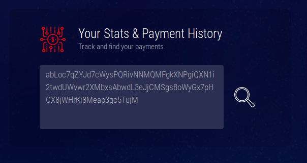

# **CPU Mine BLOC on ubuntu with XMRig**

XMRig uses separate miners for CPU and GPU, you need to download a CPU and GPU miner separately and run two separate instances on your computer.

## **BLOC Mining Network**

You can find a complete list of the BLOC mining pools available on the [BLOC MINING](https://bloc.money/mining) section of our website.

## **Make sure you have a wallet**

If you have not yet downloaded and ran the [BLOC](https://bloc.money/download) software to sync the blockchain and create a wallet, you need to [create your wallet](../../wallets/Making-a-Wallet) before start mining.

## **Default Developer Donation**

By default, the XMRIG will donate 5% of the hashpower (5 minutes in 100 minutes) to XMRIG developers pool.
If you want to change that, edit `config.json` before you start mining.
We strongly recommend to leave this donation fee at least 1% to help the XMRIG developers by providing regular updates.

## **Downloading and Installing for Linux**

Download and install for CPU mining only

You can directly use the pre-built binaries for XMRig CPU. Download the `xmrig-*-xenial-amd64.tar.gz` file [here](https://github.com/xmrig/xmrig/releases).  

 Run the file using `./xmrig`.

## **Compile and installing for Linux**

### CPU Mining

If you wish to compile yourself xmrig make sure you visit the [Ubuntu Build Instructions](https://github.com/xmrig/xmrig/wiki/Ubuntu-Build) and follow this guide:

1.  Open the terminal and install dependencies by running this command-

    ```
    sudo apt-get install git build-essential cmake libuv1-dev libmicrohttpd-dev libssl-dev
    ```

2.  Clone the package-

    `git clone https://github.com/xmrig/xmrig.git`

3.  Make a directory-

    `mkdir xmrig/build`

4.  Move over there-  

    `cd xmrig/build`

5.  Check build configuration

    * Make sure you check the [Ubuntu Build Instructions](https://github.com/xmrig/xmrig/wiki/Ubuntu-Build)
    * Including the [Additional CMake options](https://github.com/xmrig/xmrig/wiki/Ubuntu-Build)

6.  Run cmake-

    `cmake ..`

    Example:

    

    * Optionally you can use gcc 7 to small performance increase.

      ```
      sudo add-apt-repository ppa:jonathonf/gcc-7.1
      sudo apt-get update
      sudo apt-get install gcc-7 g++-7
      ```
    * When run cmake manually specify C and C++ compiler:

    `cmake .. -DCMAKE_C_COMPILER=gcc-7 -DCMAKE_CXX_COMPILER=g++-7`

7.  Finish building it-

    `make`

8. You should see a result like this:

    * Standard build option:

    

9.  xmrig will now be located in `/home/user/xmrig/build/bin`

10. Type-

    `./xmrig`

11. Check [xmrig Setup and Configuration](#setup-and-config)

12. If you see something like this, that means it’s working and you are mining BLOC!



### GPU Mining

XMRig needs to be compiled for nVidia and AMD. Instructions for compiling are linked below(Ubuntu):

* [XMRig GPU Nvidia Miner](https://github.com/xmrig/xmrig-nvidia/wiki/Ubuntu-Build) 
* [XMRig GPU AMD Miner](https://github.com/xmrig/xmrig-amd/wiki/Ubuntu-Build)

## **XMRig Setup and Configuration**<a name="setup-and-config"></a>

1.  Unzip the file and extract the files into a new folder (Make sure your anti-virus doesn't delete the files)
2.  Open the `config.json` file with Notepad
3.  Find and change the following lines:

      * `"algo: "cryptonight-lite"`
       Change to: `cryptonight-heavy`

      * `"url: "donate.v2.xmrig.com:3333"`
      Change to: `[pooladdress:port]`. You'll need to choose a pool to mine towards. You can check the full list [here](https://bloc.money/mining). Make sure to keep the `"`s!

      * `"user: "YOUR_WALLET_ADDRESS"`
      Instead of `[wallet address]`, simply paste your BLOC wallet's address. Make sure to keep the `"`! 

      * `"variant": -1`  
       Change to: `"xhv"` Make sure to **ADD** the **`"`**
      
      * `"donate-level": 5,`
      Change to: `1`. Changing this to 0 will set the default donate-level to 5 

4.  Save the file

## **Start mining**

if you want to mine with both your CPU and your GPU you must have both programs open at the same time!

* start `./xmrig` if you're mining with your CPU,
* `./xmrig-amd`. if you're mining with an AMD GPU,
* or `./xmrig-nvidia` if you're mining with a nVidia GPU.

xmrig should start by default using the config.json placed near the xmrig binary.

You can build different config files following different configuration and then start xmrig like this:

```
`./xmrig`--config=my-config.json`
```

## **How to check hashrate and results in xmrig**

To check the hashrate and results in xmrig you have 2 options. Command line option and HTML reports.

### Command Line option

* Type `h` in the command line window to display your hashrate



* Type `p` to pause the mining.



* Type `r` to resume mining.



### **HTTP API**

 If you build miner from source, libmicrohttpd dependency is added. If you want use API you need to choose a port where the internal HTTP server will listen for incoming connections.

Exemple code to add in the config.json

```
"api": {
    "port": 16000,
    "access-token": "Optional Bearer Token used for authorization",
    "worker-id": "Optional miner name"
}
```
If you prefer use command line options instead of config file, you can use options:

```
--api-port, --api-access-token and --api-worker-id.
```

Make sure you check the [API details](https://github.com/xmrig/xmrig/wiki/API) from the official XMRig Github repository.

Let's take the port number as `16000` and your IP address as `88.20.105.14` as an example.

    To check the hashrate, enter in the address bar of your web browser, `<88.20.105.14>:<16000>`.
    It should show a page with your rig's hashrate.  
    If you are checking from the same IP address, you can alternatively enter, `localhost:<16000>`

    Make sure to enter your own IP address if you enable this feature. You can choose any port you want!

This is how it looks :



## **How to check your payouts**

You get paid out based upon what the pool sets the min payout amount. A pool’s min payout amount can vary from pool to pool. Visit the mining pool you are mining from to checkout your actual payouts.

### Example if you are mining from [BLOC-MINING Pool Europe](https://bloc-mining.eu)

* Go to the [BLOC-MINING Pool Europe](https://bloc-mining.eu).

* Scroll down to `Your Stats & Payment History`



* Enter your **BLOC** address
* Click search
* All your payments will be displayed here


## **Mining with XMRIG**

XMRIG gives too many options for tuning to get the best results out of your hardware. By default the miner creates config file for CPU, NVIDIA and AMD GPU. You can edit the values within these text files to customize your mining options.

For more information on XMRIG make sure you visit the [Official XMRIG Github repository](https://github.com/xmrig/xmrig)