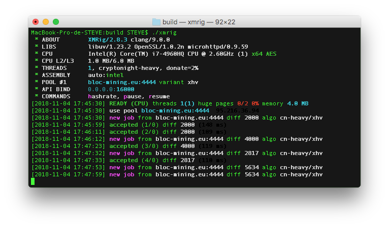
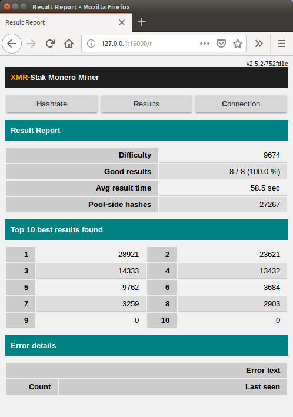

# **What is XMRIG ?**

[XMRig](https://github.com/xmrig/xmrig) is a high performance Monero (XMR) CPU miner, with official support for Windows, Mac Linux and more. Originally based on cpuminer-multi with heavy optimizations/rewrites and removing a lot of legacy code, since version 1.0.0 completely rewritten from scratch on C++.

This is the CPU-mining version, there is also a NVIDIA GPU version and AMD GPU version.

## **Features**

* High performance.
* Official Windows support.
* Small Windows executable, without dependencies.
* x86/x64 support.
* Support for backup (failover) mining server.
* keepalived support.
* Command line options compatible with cpuminer.
* CryptoNight-Lite support for AEON.
* Smart automatic CPU configuration.
* Nicehash support
* It's open source software.

## **Download**

* You can find the latest releases and precompiled binaries on GitHub under [Releases](https://github.com/xmrig/xmrig/releases)
* Or compile yourself using the [Source code](https://github.com/xmrig/xmrig)
* [Compile instructions](https://github.com/xmrig/xmrig/wiki/Build) from XMRig Github.

## **Config files**

* [Download this config file example](../mining/xmrig/config.json)
* Use [config.xmrig.com](https://config.xmrig.com/xmrig) to generate, edit or share configurations.
* [Usage](https://github.com/xmrig/xmrig#usage)
* [Algorythm varations](https://github.com/xmrig/xmrig#usage)

## BLOC Configuration

* algo: **`cryptonight-heavy`**
* variant: **`"xhv"`** Make sure to **ADD** the **`"`**

## **Guides**

* [How to mine BLOC with XMRig on Linux](../mining/XMRIG-Guide-cpu-linux.md)
* [How to mine BLOC with XMRig on Windows](../mining/XMRIG-Guide-cpu-windows.md)
* [How to ming BLOC with XMRig on Mac](../mining/XMRIG-Guide-cpu-mac.md)

## **HTML and JSON API report configuration**

To configure the reports you need to edit the `httpd_port variable`. Then enable wifi on your phone and navigate to `[miner ip address]:[httpd_port]` in your phone browser. If you want to use the data in scripts, you can get the JSON version of the data at url `[miner ip address]:[httpd_port]/api.json`

This is how it looks :

## **Default Developer Donation**

By default, the XMR-STAK will donate 2% of the hashpower (2 minutes in 100 minutes) to XMR-stak developers pool.
If you want to change that, edit [donate-level.hpp](https://github.com/fireice-uk/xmr-stak/blob/master/xmrstak/donate-level.hpp) before you build the binaries.