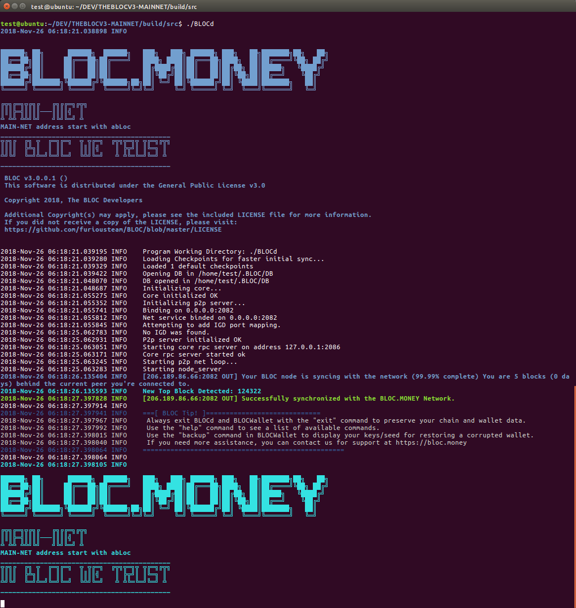

# **What is BLOCd**

A daemon is a program that runs in the background. The [BLOC Wallet](../wallets/Making-a-Wallet.md) requires a node running **BLOCd** to connect to. That process: **BLOCd**, is the daemon.

It can run on your computer or on a remote computer. Think of a daemon as a service. Its doing stuff in the background so you can do stuff in the foreground.

**BLOCd** is responsible for P2P connections and consensus for any communication with the network :

- Interaction with the blockchain, e.g. blocks relaying, getting informations about the block
- It can assemble transactions into blocks and check transactions validity
- Peer list & Connections look up
- Transaction pool information and relaying
- Synchronize and grow blockchain
- But it cannot look inside transactions to see transfers between addresses, because this requires access to user secrets wallets to do so.

**BLOCd** daemon provides a [Command Line Interface](BLOCd-daemon-cli-options.md)  with [Command Line Arguments](BLOCd-daemon-arguments.md) but also an [HTTP RPC API](BLOCd-daemon-http-rpc-api.md) and a [JSON RPC API](BLOCd-daemon-json-rpc-api.md) to receive informations from the blockchain allowing it to be controlled locally or remotely which makes it useful for integration with other software or in larger payment systems.

Various commands are made available by the API described on [BLOCd for developers](https://bloc-developer.com/api_BLOCd).

## **Screenshot**

Here's a quick image of `BLOCd MAIN NET` in action:



Here's a quick image of `BLOCd TEST NET` in action:


## **Source code**

* Download [BLOC Source Code](https://github.com/furiousteam/BLOC.git) from GitHub

## **BLOCd API**

The [BLOC-DEVELOPER](https://bloc-developer.com) website documents the public [API of BLOCd](https://bloc-developer.com/api_BLOCd).
You can test your application with your own BLOCd node and view code examples in different programming language.

- Testing tool and documentation for [BLOCd Daemon Command Line Arguments](https://bloc-developer.com/api_BLOCd/cli_arguments)
- How to use the [BLOCd Daemon Command Line Arguments](BLOCd-daemon-arguments.md)


- Testing tool and documentation for [BLOCd Command Inline Options](https://bloc-developer.com/api_BLOCd/options)
- How to use the [BLOCd Command Inline Options](BLOCd-daemon-cli-options.md)


- Testing tool and documentation for [BLOCd JSON RPC API](https://bloc-developer.com/api_BLOCd/json)
- How to use the [BLOCd JSON RPC API](BLOCd-daemon-json-rpc-api.md)


- Testing tool and documentation for [BLOCd HTTP RPC API](https://bloc-developer.com/api_BLOCd/http)
- How to use the [BLOCd HTTP RPC API](BLOCd-daemon-http-rpc-api.md)


## **BLOCd RPC Clients**

Currently we support the following official client bindings:

* [Javascript](https://github.com/furiousteam/bloc-rpc): A JavaScript wrapper for the BLOCd daemon RPC interface.
* [NodeJS](https://www.npmjs.com/package/bloc-rpc): This project is designed to make it very easy to interact with various RPC APIs available within the BLOC  Project. This entire project uses Javascript Promises to make things fast, easy, and safe.
* [Go](https://github.com/furiousteam/bloc-rpc-go): A Golang wrapper for the BLOCd RPC API. This project makes it easy to send requests to particular RPC server and returns a clear response without any abrupt termination.
* [PHP](https://github.com/furiousteam/bloc-rpc-php): A PHP wrapper for BLOC's RPC interfaces.

See [Daemon HTTP RPC API](BLOCd-daemon-http-rpc-api.md) and [Daemon JSON RPC API](BLOCd-daemon-json-rpc-api.md) for usage.

## **Downloading**

If you wish to compile **BLOCd** yourself you can download the [source Code](https://github.com/furiousteam/BLOC.git).

Binary distributions can be found: [here](https://github.com/furiousteam/BLOC/releases/latest).

Select the appropriate file for the target platform (Windows, Mac, Linux).

Binaries are provided in `.zip` format, while source code is provided in `.zip` and `.tar.gz` format.

## **Installing**

### Installing on Windows

Extract the *.zip* file (`BLOC-...-windows.zip`).

### Installing on Mac

Extract the *.zip* file:

```bash
unzip BLOC-...-mac.zip
```

### Installing on Linux

Extract the *.zip* file:

```bash
unzip BLOC-...-linux.zip
```

## **Starting BLOCd**

Make sure you visit the [BLOCd Command Line Arguments](BLOCd-daemon-arguments.md) to find how to start BLOCd following different configurations.

## **Synchronizing the Blockchain**

Running `BLOCd` will start the **BLOCd** network daemon, which will connect to the network and begin downloading and verifying the BLOC blockchain.  

Because the blockchain is constantly growing, the file size always increases (the blockchain is currently over 2 GB), and **BLOCd must verify every block**, which is both CPU and disk intensive. An SSD with at least this much free disk space is recommended, unless you plan to use [remote nodes](../wallets/Using-remote-nodes.md). 

### Using Checkpoints

You can sync a fresh chain from block 0 much quicker by using checkpoints. Follow [this guide](/Using-checkpoints-for-BLOCd.md) to learn more.