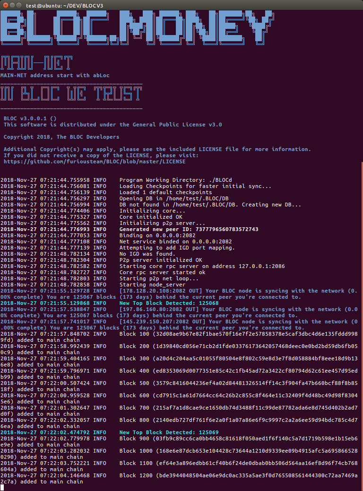
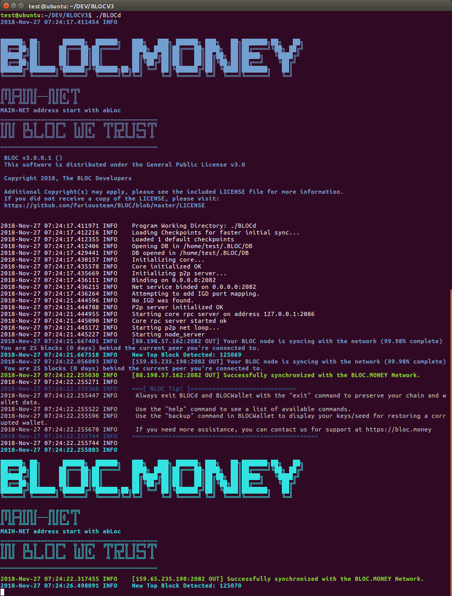
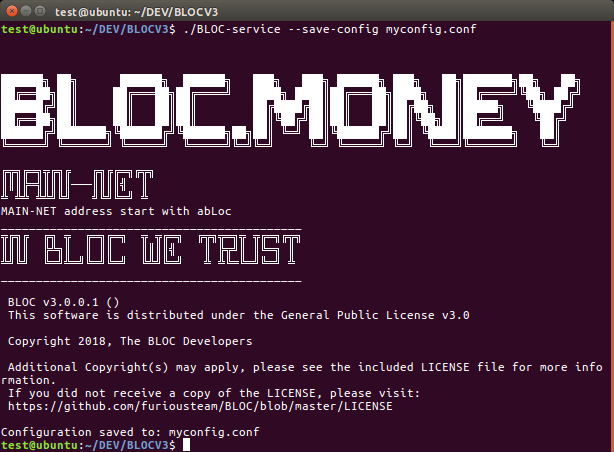
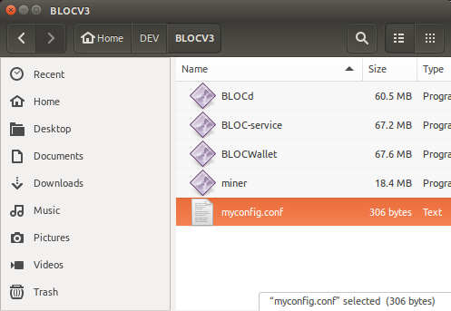
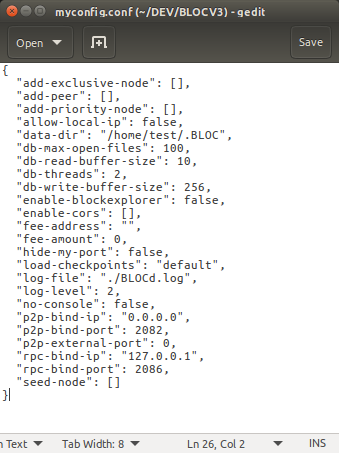
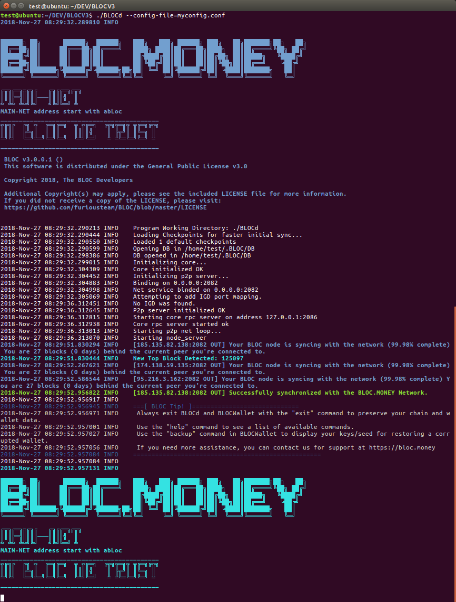

# **BLOCd Command Line Arguments**

This section describes BLOCd daemon starting process with correct arguments enabling access to the BLOCd [Command Line Interface](BLOCd-daemon-cli-options.md) , the [HTTP RPC API](BLOCd-daemon-http-rpc-api.md) and/or the [JSON RPC API](BLOCd-daemon-json-rpc-api.md).
 
[BLOCd](BLOCd-Overview.md) can accept settings through a configuration file and/or command line.
 
Almost all of the command line options can be defined through the configuration file. If a parameter is defined in the config and was also indicated in the command line, two behaviors are possible:
 
- If the parameter accepts one value only (e.g., [rpc-bind-ip](https://bloc-developer.com/api_BLOCd/cli_arguments#--rpc-bind-ip), the command line value will be used, since it has a higher priority
- If the parameter accepts several values (e.g., [add-priority-node](https://bloc-developer.com/api_BLOCd/cli_arguments#--add-priority-node)), then command line and configuration file values will be merged
- If some of the options are not defined in the config, the default values will be applied
- By default config file's name is BLOC.conf, which is located in the binaries folder.
- You may adjust the destination to the file via `[--config-file](https://bloc-developer.com/api_BLOCd/cli_arguments#--config-file)` option in the command line.
 
 Also:

- Config files, where used, now use **JSON** formatted files instead of INI
- Config files will be automatically upgraded to JSON and overwritten on first use

We are going to describe on this page how to generate your own config file, place it next to BLOCd and start it like this:

*Windows:* : BLOCd.exe --config-file=BLOC.conf
*Mac and Linux* : ./BLOCd --config-file=BLOC.conf


## **BLOC-DEVELOPER**

This page is only a short guide how to get you started with BLOCd configuration. Please visit the [dedicated section on the BLOC-DEVELOPER](https://bloc-developer.com/api_BLOCd/cli_arguments) website to view and test all the features available from the [BLOCd Daemon](BLOCd-Overview.md).


## **Getting Started**

We are going to describe here the most standard configuration to start BLOCd. For the full list and options make sure you visit the [dedicated section on the BLOC-DEVELOPER](https://bloc-developer.com/api_BLOCd/cli_arguments).


## **Launch BLOCd for the 1st time**

Open a command prompt in the same directory as BLOCd.

*Windows:*

This can easily be done by moving to the BLOCd directory in Windows Explorer, then typing `cmd` in the search bar and hitting enter:

Finally, type `BLOCd.exe`

*Mac and Linux*

You can use the cd command to change to this directory. For example, cd Downloads/BLOC/

Finally, type `./BLOCd`

Since this is your first time starting BLOCd you will have to wait for the blockchain to synchronise. This depends of the speed of your internet and connexion and the size of the blockchain. At this time of this post 27 November 2018 (2.7 GB)

You should see a message like this while the blockchain is synchronising:



Once the synchronisation is done you will get a notification like this:




## **Create and customize your config file**

### Create

The first thing to do after you have synchronised the blockchain is to setup your configuration file so you can run BLOCd using custom features and options.

Lanch BLOCd with the [--save-config](https://bloc-developer.com/api_BLOCd/cli_arguments#save-config) argument will save the default configuration file next to your BLOCd software.

```
Mac and Linux:

./BLOCd --save-config myconfig.conf

Windows:

BLOCd.exe --save-config myconfig.conf

```
Screenshot:



A new file myconfig.conf should have been created as follow:



Open this file with any text editor:



You can view an example here:

```
{
  "add-exclusive-node": [],
  "add-peer": [],
  "add-priority-node": [],
  "allow-local-ip": false,
  "data-dir": "/home/test/.BLOC",
  "db-max-open-files": 100,
  "db-read-buffer-size": 10,
  "db-threads": 2,
  "db-write-buffer-size": 256,
  "enable-blockexplorer": false,
  "enable-cors": [],
  "fee-address": "",
  "fee-amount": 0,
  "hide-my-port": false,
  "load-checkpoints": "default",
  "log-file": "./BLOCd.log",
  "log-level": 2,
  "no-console": false,
  "p2p-bind-ip": "0.0.0.0",
  "p2p-bind-port": 2082,
  "p2p-external-port": 0,
  "rpc-bind-ip": "127.0.0.1",
  "rpc-bind-port": 2086,
  "seed-node": []
}
```
### Edit

Edit the config file following your needs. We are going to cover the most standard configuration on this page.

- Check the complete list of [BLOCd Command Line Arguments](https://bloc-developer.com/api_BLOCd/cli_arguments) available.

## **Examples**

To start BLOCd just for yourself so you can connect your wallet through it you do not need to modify anything in the configuration file. It will use the standard configuration and it will works just fine.

If you would like to run an open public remote BLOCd node and start accepting transaction through this node, so you can make an extra passive income, you will need to edit:

- "[fee-address](https://bloc-developer.com/api_BLOCd/cli_arguments#--fee-address)": "enter your abLoc address here",
- "[fee-amount](https://bloc-developer.com/api_BLOCd/cli_arguments#--fee-amount)": 1, (Amount in BLOC Atomic Unit)
- "[rpc-bind-ip](https://bloc-developer.com/api_BLOCd/cli_arguments#--rpc-bind-ip)": "0.0.0.0", (Everyone can connect to your node)

* 1 means 0.0001 BLOC fees will be sent to the --fee-address specified
* 1000 means 1 BLOC fees will be sent to the --fee-address specified

If you would like to run an open public remote BLOCd node with the block-explorer options enabled:

- "[enable-blockexplorer](https://bloc-developer.com/api_BLOCd/cli_arguments#--enable-blockexplorer)": true,

Wants to go private ? Do not announce yourself as a peerlist candidate

- "[hide-my-port](https://bloc-developer.com/api_BLOCd/cli_arguments#--hide-my-port)": true,

Are you running a BLOC Mining Pool ?

- You can use the standard configuration already built in. Just start BLOCd.

Are you running a BLOC Exchange ?

- You can use the standard configuration already built in. Just start BLOCd.

Click on each argument to get more informations of how to use it and make sure your browse the complete list of [BLOCd Command Line Arguments](https://bloc-developer.com/api_BLOCd/cli_arguments) from the BLOC-DEVELOPER website.


## **Launch BLOCd with configuration file**

Once you are happy and modified your configuration file as you need simply copy your configuration file next to the BLOCd software, open the command line inside the folder where is located BLOCd:

Finally, type `BLOCd.exe --config-file=myconfig.conf`

You can use the cd command to change to this directory. For example, cd Downloads/BLOC/

Finally, type `./BLOCd --config-file=myconfig.conf`

You should see a result like this:




Congratulations! You have now properly setup BLOCd and you are ready to use the [BLOCd Command Line Interface](BLOCd-daemon-cli-options.md) , the [BLOCd HTTP RPC API](BLOCd-daemon-http-rpc-api.md) or/and the [BLOCd JSON RPC API](BLOCd-daemon-json-rpc-api.md)


## BLOC-DEVELOPER

Make sure you visit the dedicated website [BLOC-DEVELOPER.com](https://bloc-developer.com) to find out more details and test your application.

If anything is missing or seems incorrect, please check the [GitHub issues](https://github.com/furiousteam/BLOC-wiki/issues) for existing known issues or [create a new one](https://github.com/furiousteam/BLOC-wiki/issues/new).
