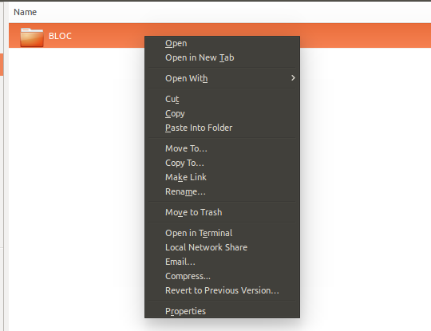

# **Checkpoints**
Since versions 3+ you can sync a fresh chain from 0 much quicker by loading "checkpoints" with your daemon.

## **How to synchronise the blockchain faster and better**

Download the complete checkpoints list from the [BLOC-checkpoints GitHub repository](https://github.com/furiousteam/BLOC-checkpoints)
**This list is updated automatically every day at 12 am (UTC+1)**

## **Setup**

- Right click [this link](https://raw.githubusercontent.com/furiousteam/BLOC-checkpoints/master/checkpoints.csv) and choose `Save link as...` to download the latest checkpoints.csv.
- Place checkpoints.csv in the same folder as your BLOCd daemon
- You can get BLOCd from here if you don't have it already: https://bloc.money/download
- Make sure you shut down any GUI wallets, or any other instances of BLOCd.

It should looks like this:


### **Usage**

#### Windows

- First, open a command prompt in the same directory as BLOCd.
- This can easily be done by moving to the BLOCd directory in Windows Explorer, then typing `cmd` in the search bar and hitting enter:

- Finally, type `BLOCd.exe --load-checkpoints checkpoints.csv` in the command prompt.

#### Linux, Apple

- First, open a command prompt in the same directory as BLOCd.
- You can use the `cd` command to change to this directory. For example, `cd Downloads/BLOC`
- Alternatively, your file manager may provide the ability to open a terminal in your current directory. Navigate to the folder with BLOCd in, and try right clicking, to see if you can open a terminal there:



- Finally, type `./BLOCd --load-checkpoints checkpoints.csv` in the terminal.

### **Expected Output**

If you did the steps correctly, you should see something like this output.

```
2019-Jan-09 07:09:16.687959 INFO    Program Working Directory: ./BLOCd
2019-Jan-09 07:09:16.688363 INFO    Loading Checkpoints for faster initial sync...
2019-Jan-09 07:09:16.762279 INFO    Loaded 155590 checkpoints from checkpoints.csv
2019-Jan-09 07:09:16.762798 INFO    Opening DB in /home/test/.BLOC/DB
2019-Jan-09 07:09:16.764290 INFO    DB not found in /home/test/.BLOC/DB. Creating new DB...
2019-Jan-09 07:09:16.782948 INFO    Initializing core...
2019-Jan-09 07:09:16.784083 INFO    Core initialized OK
```


- BLOCd will then start syncing from checkpoints.
- If you are using the CLI wallet, then you can just wait for it to finish syncing, and open your wallet.
- If you are using a GUI wallet, let it finish syncing, close it down by typing `exit` in the window, then open your GUI wallet.

Once the synchronisation is finished you should see a message like this:


### **Common Errors**

#### Invalid checkpoint file format

```
2018-May-13 12:10:08.325056 INFO    Loading Checkpoints for faster initial sync...
2018-May-13 12:10:08.339667 ERROR   Invalid checkpoint file format
2018-May-13 12:10:08.341758 ERROR   Exception: Failed to load checkpoints
```

- If you see output like the above, the file you are opening is either not a .csv file, or hasn't been downloaded correctly.
- Ensure you downloaded the file by right clicking, and choosing `Save link as...`.
- If you incorrectly chose the wrong file, you can accidentally  download a html page instead.
- When you open up the file, it should have lots of lines like this:

```
0,acd5682403287ad25d94769adb80fbcd45de591ecfd5c86d5176bb9a10ff5baa
1,8e2a9807eddd072ab88476e2b96f894f8de83afaae594adc42bc41478cbf6ba0
2,05001da5fd9f0923f52511271805223610c4419e369050696a223f6ce3b3201a
3,55ce2be7b8b63ad2d8075c93c5541d3cb3e069e47f3ba02862b56b0d10240f86
```

- If you absolutely can't get it working, you can make a new text file, copy all the content from here into it: https://raw.githubusercontent.com/furiousteam/BLOC-checkpoints/master/checkpoints.csv
- Then save as checkpoints.csv (Select filetype: all files in windows)

#### Failed to load checkpoints

```
2018-May-13 12:14:57.544286 INFO    Loading Checkpoints for faster initial sync...
2018-May-13 12:14:57.544569 ERROR   Could not load checkpoints file: checkpoints.csv
2018-May-13 12:14:57.544823 ERROR   Exception: Failed to load checkpoints
```

- If you see output like the above, it means the file isn't present in the directory you are in.
- Make sure you have placed the checkpoints.csv file in the same directory as BLOCd.

#### BLOCd.exe is not recognized / No such file or directory

```
C:\Users\username>BLOCd.exe --load-checkpoints checkpoints.csv
'BLOCd.exe' is not recognized as an internal or external command,
operable program or batch file.
```

`bash: ./BLOCd: No such file or directory`

- If you see output like one of the above, it means your terminal isn't in the same folder as the BLOCd program.
- You can type `pwd` to see what folder you are currently in.
- Try following the steps above to get into the right folder, then try again.
- If you type `ls`, you should see the BLOCd program, if you are in the correct folder:

```
[BLOC] ls
miner  BLOC-service  BLOCWallet  BLOCd
```

#### IO error

```
2018-May-13 11:58:40.857058 INFO    Opening DB in /home/user/.BLOC/DB
2018-May-13 11:58:40.858174 ERROR   DB Error. DB can't be opened in /home/zacuserh/.BLOC/DB. Error: IO error: While lock file: /home/user/.BLOC/DB/LOCK: Resource temporarily unavailable
2018-May-13 11:58:40.873692 ERROR   Exception: IO error
```

- If you see output like the above, something else has got the database open already.
- Make sure you have closed down any other BLOCd's, GUI wallets, and BLOC-service.
- Use a task manager to help you find any which might be running in the background, then try again.