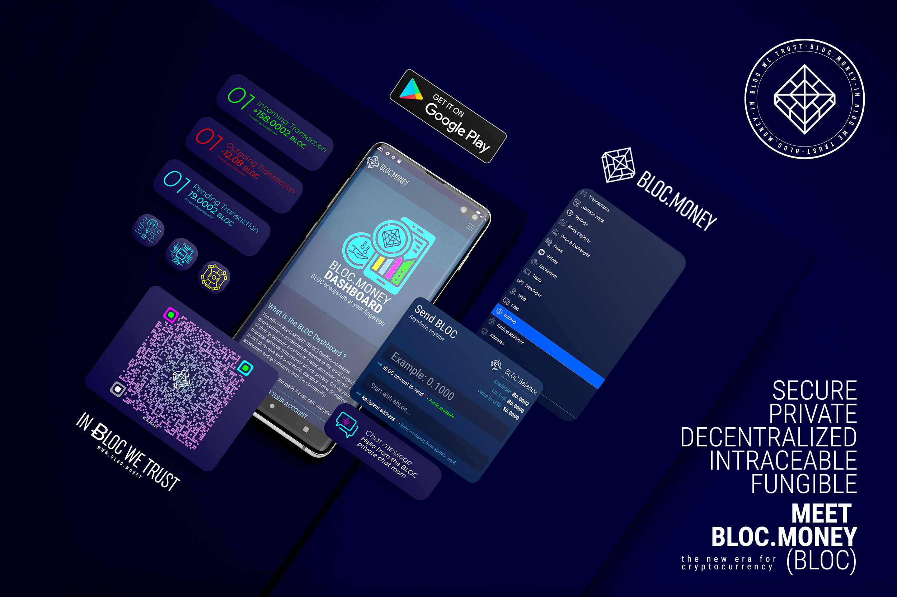
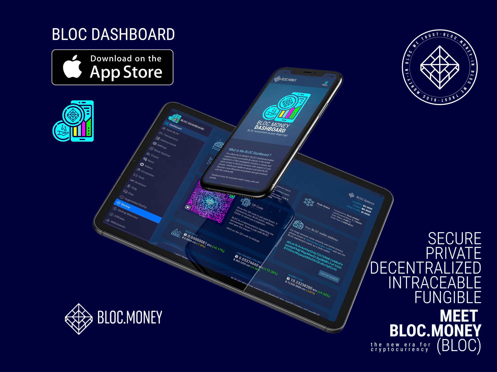
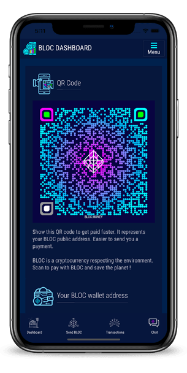
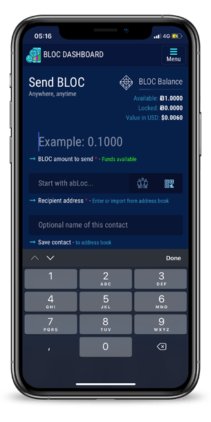
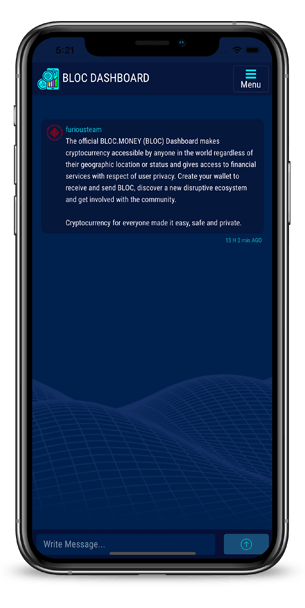
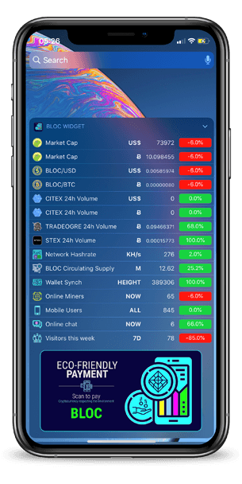

# **What is the BLOC Dashboard ?**

The official BLOC.MONEY [(BLOC) Dashboard](https://dashboard.bloc.money) makes cryptocurrency accessible by anyone in the world regardless of their geographic location or status and gives access to financial services with respect of user privacy. Create your wallet to receive and send BLOC, discover a new disruptive ecosystem and get involved with the community.

Cryptocurrency for everyone made it easy, safe and private.

* [BLOC Dashboard App is available on the App Store and Play Store](https://medium.com/@bloc.money/bloc-dashboard-app-is-available-on-the-app-store-and-play-store-5b5db063a7d9)

## **Features**

- Send and receive BLOC at the touch of a button, anytime, anywhere and to anyone.
- Backup and recover your wallet on any device with the recovery keys by the app.
- Even if you loose your phone you will not lose your BLOC.
- Pay and get Paid using the QR code feature without having to know the recipient BLOC address
- Receive notifcations for transactions
- Use the BLOC Widget to get real time informations about BLOC
- Join the BLOC community on the private chat room

Spin and roll the BLOC coin in augmented reality including 3 different colors and 2 animation with sound (require iOS 12)

- They aren't any hidden servers to backup or store your coins, you are in control 100%
- A simplified codebase makes BLOC Dashboard quick, lightweight and responsive
- Connect directly to the BLOC network without having the need to download the full blockchain on your phone

## **BLOC world at your fingertips**

By registering an account on the BLOC dashboard you will have access to the following services:

- Complete informations about the BLOC network in one simple and clean view
- Create a BLOC wallet
- Send / Receive BLOC
- Transactions list
- Address Book
- Built-in block explorer
- Charts with market cap, trading volume and price
- Latest news from the BLOC
- Videos
- Ecosystem - projects using BLOC
- Tools - Direct to all BLOC softwares
- Developer Area
- Help with tutorials and guides
- Access to the private BLOC chatroom
- Backup your wallet and restore it on your computer

## **Available for multiple devices**

Access the same BLOC Dashboard account from multiple devices easily.

- Android version for mobile phone and tablet
- iOS version for iPhone and iPad
- Web version for any device using a web browser

## **Screenshots**

Android App

iOS App

**Notes**

Each BLOC wallet gets a unique set of 64 characters private keys called spendSecretKey and viewSecretKey.

- Write down your private keys. It is the only way to restore your wallet.
- Keep it secret and safe. If you save it an insecure location you might loose your funds.
- Do not store on your smartphone, tablet or computer. Only you are responsible for the security of your funds.

This is a web wallet created by BLOC Dashboard. For large amount, more security and better privacy please create a cold-storage [paper walet](../wallets/Making-a-paper-wallet.md) and use the BLOC dashboard wallet as a daily wallet. The BLOC Dashboard is safe and secure but it is an online wallet. The less funds available on this wallet, the better it is.

## **Download**

* Visit [BLOC Dashboard](https://dashboard.bloc.money) from any device with a web browser and login to your account
* Download [BLOC Dashboard for iOS](https://apps.apple.com/app/bloc-dashboard/id1483066028) from the Apple App Store
* Download [BLOC Dashboard for Android](https://play.google.com/store/apps/details?id=money.dashboard.bloc.android) from the Google Play Store
* Download [BLOC Dashboard for Android with mining included](https://bloc.money/download) from BLOC.MONEY website

## **Register an account**

1. In order to use the BLOC Dashboard you need to register an account. Go to [Register an account](https://dashboard.bloc.money/en/register) and fill the form with the required details then tap create your account.
2. Check your email and confirm your account creation by clicking the link from the email we sent you.
3. You should get a confirmation message: `your account is now confirmed.` You can now sign-in into your account.

## **Sign-In to an account**

1. Go to [Sign-in to an account](https://dashboard.bloc.money/)
2. Enter your email or username
3. Enter your password
4. Click Sign-in

In case you are using `Two factors authentifiation` you will have to check your email and enter the verification code to sign-in to your account.

## **Password Lost**

In case you have lost your password you can use the recover form to reset your password.

1. Go to [Recover my password](https://dashboard.bloc.money/en/forgot-password)
2. Enter the email address you used to create your account and tap `Send my credentials` button
3. Check your email and click on the link to reset your password
4. Enter your new password and Sign-in to your account

## **Dashboard Overview**

Find all the latest and important BLOC informations at a glance on the Dashboard overview. 

### **Create a new wallet**

If this is your 1st time using BLOC dashboard you will be able to create a BLOC wallet.

Quickly create a BLOC wallet address to start receiving funds and enable all the features from the BLOC Dashboard.

Customise your own QR code with two colours and support Eco friendly payment with BLOC.

1. Select your favorite colors. (Can not be changed)
2. Click `Create a new wallet`
3. Your BLOC address is now created
4. Share your custom QR code to receive BLOC payment into your address
5. Save the private keys of your wallet. This is the only way to recover access to your funds.

### **Import a new wallet**

If you already created a BLOC wallet on this same BLOC dashboard you can re-import your wallet with the private keys.
BLOC wallet created using another software can not be imported into the BLOC dashboard. You need to create a new wallet.
Only the `private spend key` is required to restore your wallet on the BLOC Dashboard

1. Tap `restore a wallet`
2. Make sure the `private spend key` you enter here belongs to a BLOC dashboard wallet ONLY, else another address will be generated.
3. Click import
4. Your wallet should be imported with the same custom QR code you created

## **Send BLOC**

Send BLOC anywhere, anytime

1. Enter the amount you would like to sent. (BLOC use 4 decimal)
2. Enter the BLOC recipient address
3. Tap on the `Contact icon` to import the BLOC address from your address book
4. Tap on the `Contact icon` to scan a BLOC QR code address using the camera of your device
5. Add this contact to your address book directly so you do not have to remember the BLOC address of your contact next time
6. Enter an optional payment id provided by the recipient
7. Enter optional informations about this transaction. (School fees, Restaurant etc...) (Max 255 characters)
8. BLOC network fees are set automatically
9. Click `SEND BLOC`
10. Check all the details are ok and click `CONFIRM`
11. Your transaction will be processed in real time
12. Get the transaction hash instantly by notification
13. Checkout the status of your transaction in `Transactions`

## **Transactions**

The transactions list display all the transactions related to your account.

### **Pending Transaction**

- A pending transaction means the transaction is currently being confirmed.
- BLOC require 2 block confirmations to be able to validate the transaction on the blockchain.
- All pending transactions sent or receive will appears here
- Once the transation has been confirmed, it is moved to the transaction history list and disapear from pending list

### **Transaction History**

- Find here all the confirmed transactions made from/to this address.
- Click on the transaction hash to display the transaction details
- View the transaction on the BLOC-EXPLORER

*Note: The information field is available ONLY on the BLOC dashboard. If you restore your wallet using another softwaren the information field will not be available.*

## **Address Book**

Save the BLOC address of your contact so you can send BLOC faster without typing the address.

1. Enter the BLOC address of your contact
2. Enter the contact name
3. Tap `Add Contact`
4. From now you can select this contact while sending a transaction and do not need to remember the BLOC address 

## **Settings**

Manage your BLOC dashboard settings

1. Your username can not be changed. If you want to change the username you will need to create a new account with that username
2. Changing your email address require verification, confirm the new email address to change your email.
3. Select your country and the prefered language to receive email and notifications
4. Use `2FA (Two-factor auth.` to secure your account. If enabled, you will have to enter a custom code each time you woud like to login into your account. The custom code will be sent into your email
5. Notification settings let you which informations you would like to receive or not from the BLOC Dashboard. By default all the notifications are enabled.
6. Once you are ready with your custom settings, click `Save settings`. You should get confirmations that the settings has been saved.
7. To change your password tap `Change password` enter your old password, enter your new password, confirm your new password and tap `Change Password`
8. Subscribe or Un-subscribe the newsletter

## **Block Explorer**

The crypto currency BLOC explorer shows the latest blocks in the blockchain. Clicking on a specific network block will provide you with more information regarding its size, when it was found, and more importantly, which transactions it contains.

Our BLOC explorer is also a valuable tool to see how the current block reward is distributed to the miners. BLOC explorer can also search for Payment IDs, Block hash, Block height, Transaction hash.

The BLOC explorer quickly become your best friend to verify transactions on the Ƀ BLOC blockchain network.

## **Mining**

Mining is available only from the [BLOC Dashboard website](https://dashboard.bloc.money) or from the [BLOC Dashboard for Android with mining included](https://bloc.money/download)

The advantages of the miner built-in the BLOC Dashboard:

- The miner is not be detected as virus like any other mining software
- Very easy to use with 1 click button to start mining using your built-in BLOC address
- Complete mining stats provided
- Mining from the official POOL.BLOC.MONEY.
- CPU Mining only

Once the mining is made easy, this is not the best solution if you want to mine regulary BLOC. If you are interested about mining and looking for a more efficient solution we suggest you to look at [How to mine BLOC](../mining/How-to-mine-BLOC.md)

1. Switch the button to start mining
2. Your BLOC Dashboard address will be used to mine from the [Official BLOC Mining Pool](https://pool.bloc.money)
3. Checkout your stats in real time
4. If you close the page mining will automatically stops

## **Charts**

The BLOC charts show the market capitalization, trading volume and trading price for BLOC on the available exchanges.
Get 24h data and advanced charts for a year.

## **News**

All the latest news embedded directly from [BLOC Medium Blog](https://medium.com/@bloc.money)

## **Videos**

All the latest videos embedded directly from [BLOC Youtube Channel](https://www.youtube.com/channel/UCdvnEPWhqGtZUEx3EFBrXvA)

## **Ecosystem**

Ecosystem display projects using BLOC. If you have a project that you would like to be added here. Contact us.

## **Tools**

Tools gives you access to all other [BLOC softwares](https://medium.com/@bloc.money)

## **Developer**

The developer area allow you to connect your website with your BLOC dashboard wallet address and receive instant notification

## **Help**

Get help for using BLOC with tutorials and videos from this BLOC wiki

## **Chat**

Private chat room reserved for the BLOC Dashboard members

## **Back-up**

This is a web wallet created by BLOC Dashboard. For large amount, more security and better privacy please create a cold-storage paper wallet and use the BLOC dashboard wallet as a daily wallet. The BLOC Dashboard is safe and secure but it is an online wallet. The less funds available on this wallet, the better it is.

- Each BLOC wallet gets a unique set of 64 characters private keys called spendSecretKey and viewSecretKey.
- Write down your private keys. It is the only way to restore your wallet.
- Keep it secret and safe. If you save it an insecure location you might loose your funds.
- Do not store on your smartphone, tablet or computer. Only you are responsible for the security of your funds.

You can delete your wallet here

## **Air Drop Missions**

In the cryptocurrency world, Airdrop refers to the free distribution of small amounts of a certain virtual currency tokens to its community members either for free or for performing small tasks.

To qualify for the free gift, you need to perform certain tasks that include liking our social profiles or posting on social media forums, we have setup few different missions.

Airdrop can be viewed as a promotional activity to bootstrap the BLOC.MONEY project. Its aim is to spread awareness about the cryptocurrency project BLOC, and to get the maximum people in the game.

The Airdrop can be claimed only one time per account and per mission. Only one account per person is allowed. 

Airdrop are executed in real time 24/7 and the reward is kept in pending balance until you ask for withdraw. BLOC airdrops are available for a limited time only.

### **Chat AirDrop**

- ⬇️ Download the BLOC Dashboard app for Android or iOS
- 📳 Register an account
- 🔑 Create your BLOC wallet
- 🚀 Go AirDrop mission menu and select Chat achievement
- ✋ Come say hello on the private BLOC Chat room
- 💎 Get 1.0000 BLOC added to your affiliate account as welcome bonus
- ✅ Checkout airdrop section and get more rewards

**Error**: This account already connected and got rewards for this mission:

- The device you are using already claimed a reward for this airdrop mission using another username. Only 1 reward per device is allowed.

### **CryptoCanary Review AirDrop**

Write a review about BLOC and give 5 stars rating on CryptoCanary website

- ⬇️ Download the BLOC Dashboard app for Android or iOS
- 📳 Register an account
- 🔑 Create your BLOC wallet
- 🚀 Go AirDrop mission menu and select CryptoCanary Review
- ✋ Tap Claim. (You will need to register an account on CryptoCanary)
- ⭐️ Rate 5 stars and enter your review
- ⏱Wait for 30 minutes before verify your username
- 📲 Go back to the BLOC Dashboard AirDrop Mission and verify your CryptoCanary username
- 💎 Get 1.0000 BLOC added to your affiliate account as welcome bonus
- ✅ Checkout airdrop section and get more rewards

**Error**: Username not found on Cryptocanary website:

- Make sure you have wait at least 30 minutes before verifying your username
- Verify the username is correct including spaces and special characters if any

**Error**: This account already connected and got rewards for this mission:

- The device you are using already claimed a reward for this airdrop mission using another username. Only 1 reward per device is allowed.

**Note: To withdraw your reward click Withdrawals menu and enter your BLOC address where to withdraw your BLOC coins.**

## **Affiliating System**

The automated affiliate program from BLOC is very easy to use. Webmasters just have to place the BLOC.MONEY's banner ads or buttons on their own Web site. Webmasters will receive a referral fee or commission for each registered account coming from the affiliated link. (The account needs to be verified and complete 2 airdrop missions to receive the reward).

You can also invite your friend or business partner by filling their email address and click the Send invite button, a custom message will be sent including your custom affiliate link.

Or simply share your affiliate link on your preferred social network to invite your friends.

**Listing details of your Affiliates**
All your affiliates rewards indicated in the table below

- Pending : Your affiliate invitation was sent but the user did not registered
- Confirmed : The user registered using your invitation
- Completed : The user has done the minimum airdrop mission. The reward got added into your pending balance.

**Tools to promote the BLOC**
Banners and ads to help you promote the BLOC to add on your blog or website, Copy the html code and paste it into your page.

## **Withdrawals**

You can withdraw at anytime a part or the total balance of your affiliate and airdrop earnings balance to the BLOC address of your choice. Your BLOC address from the dashboard will be automatically used.

Specify the amount and click withdraw, this will automatically trigger to send coins to your wallet address and your will obtain a transaction hash. The minimum amount to withdraw is 0.3 BLOC.

Withdrawals are processed and verified manually every 48 hours.	

Warning ! Your Withdraw Wallet address cannot be changed.
