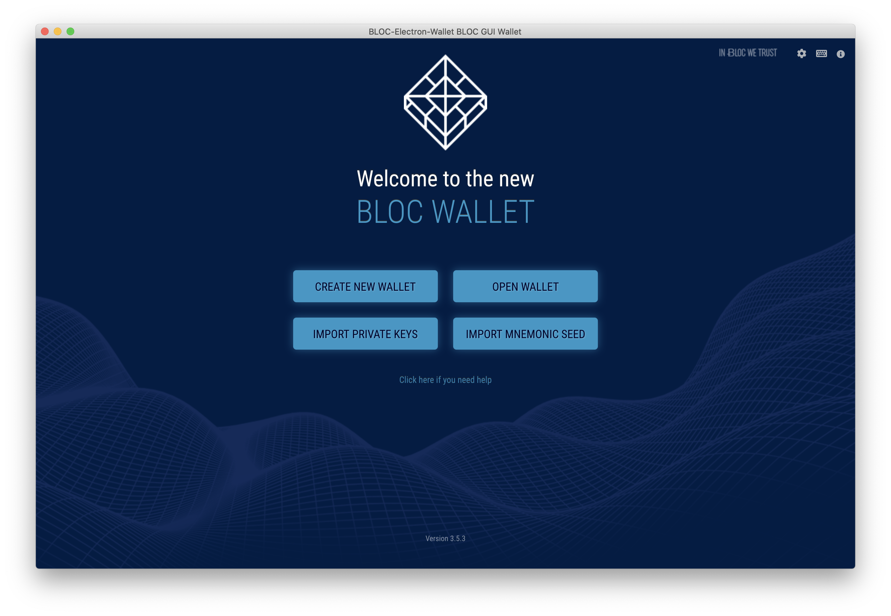
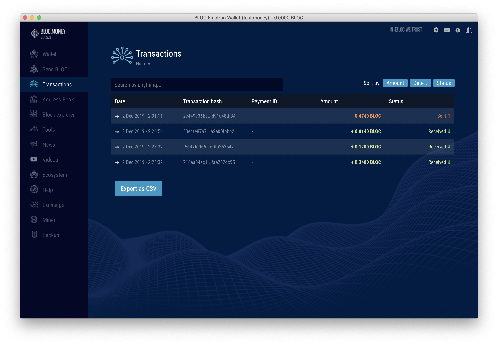
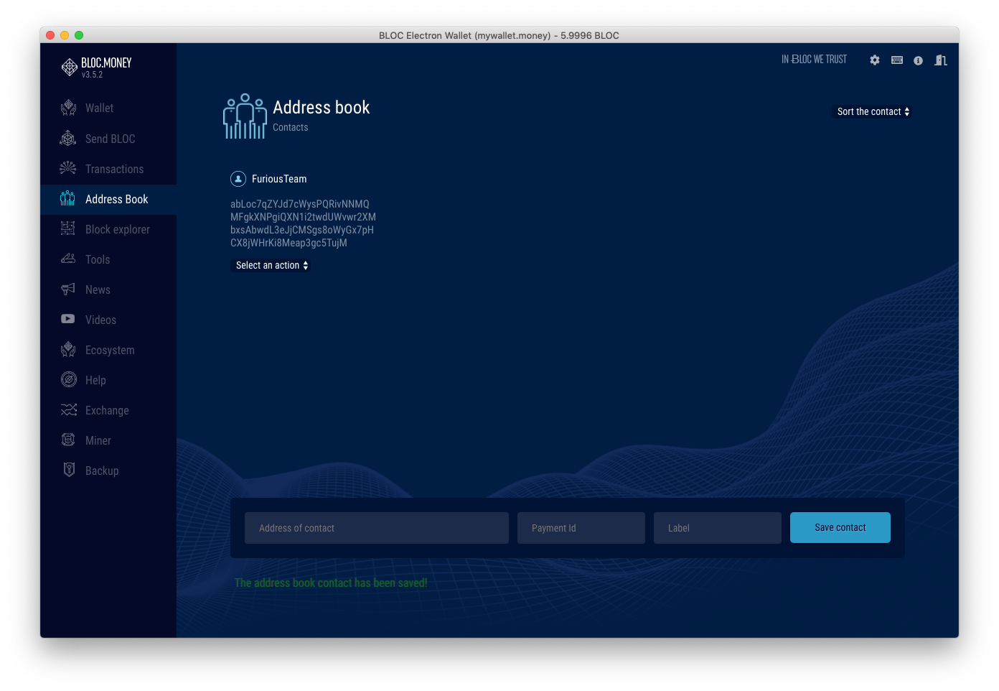
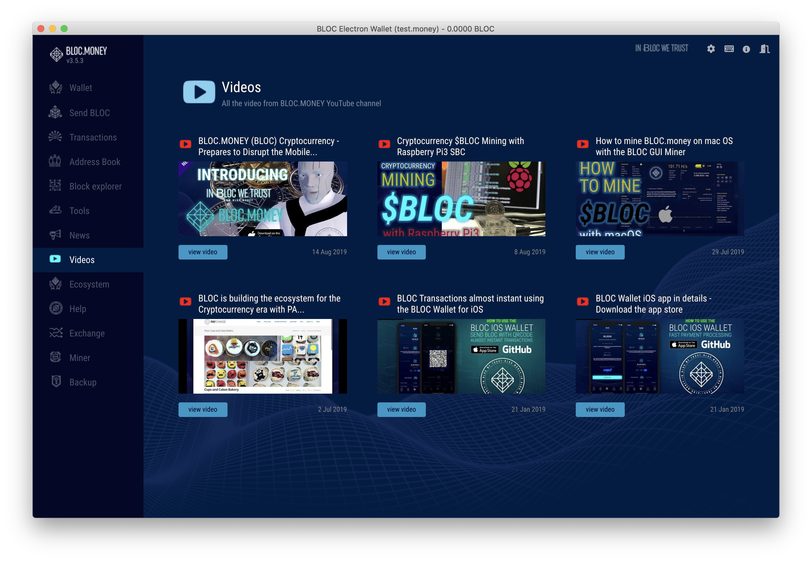
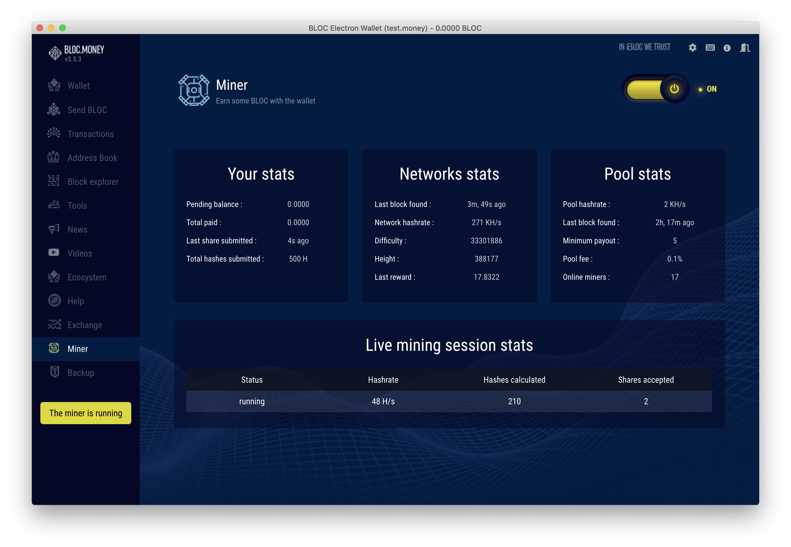

# **What is the BLOC Dashboard ?**

The official BLOC.MONEY [(BLOC) Dashboard](https://dashboard.bloc.money) makes cryptocurrency accessible by anyone in the world regardless of their geographic location or status and gives access to financial services with respect of user privacy. Create your wallet to receive and send BLOC, discover a new disruptive ecosystem and get involved with the community.

Cryptocurrency for everyone made it easy, safe and private. 

## **Features**

Send and receive BLOC at the touch of a button, anytime, anywhere and to anyone.
Backup and recover your wallet on any device with the recovery keys by the app.
Even if you loose your phone you will not lose your BLOC.
Pay and get Paid using the QR code feature without having to know the recipient BLOC address
Receive notifcations for transactions
Use the BLOC Widget to get real time informations about BLOC
Join the BLOC community on the private chat room

Spin and roll the BLOC coin in augmented reality including 3 different colors and 2 animation with sound (require iOS 12)

They aren't any hidden servers to backup or store your coins, you are in control 100%
A simplified codebase makes BLOC Dashboard quick, lightweight and responsive
Connect directly to the BLOC network without having the need to download the full blockchain on your phone

## **BLOC world at your fingertips**

By registering an account on the BLOC dashboard you will have access to the following services:

- Complete informations about the BLOC network in one simple and clean view
- Create a BLOC wallet
- Send / Receive BLOC
- Transactions list
- Address Book
- Built-in block explorer
- Charts with market cap, trading volume and price
- Latest news from the BLOC
- Videos
- Ecosystem - projects using BLOC
- Tools - Direct to all BLOC softwares
- Developer Area
- Help with tutorials and guides
- Access to the private BLOC chatroom
- Backup your wallet and restore it on your computer

## **Available for multiple devices**

Access the same BLOC Dashboard account from multiple devices easily.

- Android version for mobile phone and tablet
- iOS version for iPhone and iPad
- Web version for any device using a web browser

Presentation:

## **Screenshot**

**Notes**

Each BLOC wallet gets a unique set of 64 characters private keys called spendSecretKey and viewSecretKey.

- Write down your private keys. It is the only way to restore your wallet.
- Keep it secret and safe. If you save it an insecure location you might loose your funds.
- Do not store on your smartphone, tablet or computer. Only you are responsible for the security of your funds.

This is a web wallet created by BLOC Dashboard. For large amount, more security and better privacy please create a cold-storage [paper walet](../wallets/Making-a-paper-wallet.md) and use the BLOC dashboard wallet as a daily wallet. The BLOC Dashboard is safe and secure but it is an online wallet. The less funds available on this wallet, the better it is.

## **Download**

* Visit [BLOC Dashboard](https://dashboard.bloc.money) from any device with a web browser and login to your account
* Download [BLOC Dashboard for Android](https://dashboard.bloc.money) from the Google Play Store
* Download [BLOC Dashboard for iOS](https://dashboard.bloc.money) from the Apple App Store

## **Register an account**

1. In order to use the BLOC Dashboard you need to register an account. Go to [Register an account](https://dashboard.bloc.money/en/register) and fill the form with the required details then tap create your account.
2. Check your email and confirm your account creation by clicking the link from the email we sent you.
3. You should get a confirmation message: `your account is now confirmed.` You can now sign-in into your account.

## **Sign-In to an account**

1. Go to [Sign-in to an account](https://dashboard.bloc.money/)
2. Enter your email or username
3. Enter your password
4. Click Sign-in

In case you are using `Two factors authentifiation` you will have to check your email and enter the verification code to sign-in to your account.

## **Password Lost**

In case you have lost your password you can use the recover form to reset your password.

1. Go to [Recover my password](https://dashboard.bloc.money/en/forgot-password)
2. Enter the email address you used to create your account and tap `Send my credentials` button
3. Check your email and click on the link to reset your password
4. Enter your new password and Sign-in to your account

## **Dashboard Overview**

Find all the latest and important BLOC informations at a glance on the Dashboard overview. 

### **Create a new wallet**

If this is your 1st time using BLOC dashboard you will be able to create a BLOC wallet.

Quickly create a BLOC wallet address to start receiving funds and enable all the features from the BLOC Dashboard.
Customise your own QR code with two colours and support Eco friendly payment with BLOC.

1. Select your favorite colors. (Can not be changed)
2. Click `Create a new wallet`
3. Your BLOC address is now created
4. Share your custom QR code to receive BLOC payment into your address
5. Save the private keys of your wallet. This is the only way to recover access to your funds.

### **Import a new wallet**

If you already created a BLOC wallet on this same BLOC dashboard you can re-import your wallet with the private keys.
BLOC wallet created using another software can not be imported into the BLOC dashboard. You need to create a new wallet.
Only the `private spend key` is required to restore your wallet on the BLOC Dashboard

1. Tap `restore a wallet`
2. Make sure the `private spend key` you enter here belongs to a BLOC dashboard wallet ONLY, else another address will be generated.
3. Click import
4. Your wallet should be imported with the same custom QR code you created

## **Send BLOC**

Send BLOC anywhere, anytime

1. Enter the amount you would like to sent. (BLOC use 4 decimal)
2. Enter the BLOC recipient address
3. Tap on the `Contact icon` to import the BLOC address from your address book
4. Tap on the `Contact icon` to scan a BLOC QR code address using the camera of your device
5. Add this contact to your address book directly so you do not have to remember the BLOC address of your contact next time
6. Enter an optional payment id provided by the recipient
7. Enter optional informations about this transaction. (School fees, Restaurant etc...) (Max 255 characters)
8. BLOC network fees are set automatically
9. Click `SEND BLOC`
10. Check all the details are ok and click `CONFIRM`
11. Your transaction will be processed in real time
12. Get the transaction hash instantly by notification
13. Checkout the status of your transaction in `Transactions`

## **Transactions*

The transactions list display all the transactions related to your account.

### **Pending Transaction**

A pending transaction means the transaction is currently being confirmed.
BLOC require 2 block confirmations to be able to validate the transaction on the blockchain.
All pending transactions sent or receive will appears here
Once the transation has been confirmed, it is moved to the transaction history list and disapear from pending list

### **Transaction History**

Find here all the confirmed transactions made from/to this address.
Click on the transaction hash to display the transaction details
View the transaction on the BLOC-EXPLORER

*Note: The information field is available ONLY on the BLOC dashboard. If you restore your wallet using another softwaren the information field will not be available.*

* To use a local BLOC node running on the same machine as the BLOC Electron wallet enter `127.0.0.1` as Daemon address with RPC Port: `2086`

* if you are using BLOC public remote node, you might get a notification displaying the node fee price.

You are now ready to use your wallet. Please follow the next instructions on how to use your wallet.

## **Import Private Keys to restore a wallet**

If you already have BLOC wallet address you can import your private keys using this method.

[How to import my wallet from the BLOC Wallet iOS app. Click here](../wallets/BLOC-iOS-wallet.md#from-iphone-to-desktop)

If you were using the previous BLOC Wallet v2.0.2 you can checkout [this guide to find out how to export your wallet private keys](../wallets/BLOC-GUI-Desktop-Wallet-V2.md#1-export-key-best-solution) and follow this procedure to restore your wallet:

This will restore your wallet address, funds present on it but also the complete history of your transactions. All you need is your private view key & spend key.

1. Select where the wallet file will be stored. Click on the folder icon, choose where you woud like to save your wallet, enter the name of the file and click save.
2. Set the required password to open this wallet file
3. Select the block number from where to start scanning the blockchain for transactions contains into your wallet.
4. Enter the private view key of the wallet to be imported
5. Enter the private spend key of the wallet to be imported
6. Click the button `IMPORT PRIVATE KEYS AND RESTORE THE WALLET`

You should see a message: Wallet has been imported. You can now [open the wallet](../wallets/BLOC-GUI-Electron-Wallet.md#open-wallet).

## **Import Mnemonic seed words to restore a wallet**

If you already have BLOC wallet created since the BLOC V3.0 you should already have a Mnemonic seed. You can import it using this method.

This will restore your wallet address, funds present on it but also the complete history of your transactions. All you need is your Mnemonic seed words list.

1. Select where the wallet file will be stored. Click on the folder icon, choose where you woud like to save your wallet, enter the name of the file and click save.
2. Set the required password to open this wallet file
3. Select the block number from where to start scanning the blockchain for transactions contains into your wallet.
4. Enter the Mnemonic seed words of the wallet to be imported
5. Click the button `IMPORT MNEMONIC SEED AND RESTORE THE WALLET`

You should see a message: Wallet has been imported. You can now [open the wallet](../wallets/BLOC-GUI-Electron-Wallet.md#open-wallet).

## **Wallet Overview**

We will have to wait for the wallet synchronisation to finish in order to use the wallet.

The overview display all the important informations about your wallet such as:

1. `Balance` (Available and Locked)
2. `Status` gives you the synchronisation state of the wallet. (The 1st number is the actual block synched to this wallet and the second number is last known top block on the network)
3. `Connected To` display the current node you are connected to use your wallet
4. `Node fee` shows the fee amount used by this node for each transaction.
5. `Your wallet address` that can be shared to your customers/friends so they can pay you
6. `QR Code` makes it even easier to share your BLOC address. Scan to share.
6. `BLOC Price` display BLOC price from CoinGecko
6. `OPTIMIZE` button optimize your wallet to send larger amount transactions. Required if you are mining with this address and receive a lot of small transactions.

## **Send BLOC**

Send/Transfer BLOC.MONEY to any other BLOC wallet address.

1. Type the amount you would like to send
2. Enter the recipient address
3. The fees are set automatically to 0.0001 BLOC
1. If the receiver provided you with a Payment ID you can enter it here, it must contain 64 caracters
5. Once you are ready click. `PROCEED BLOC PAYMENT`

Confirm all the informations are correct.
If everything is ok click `POK SEND IT` or `CANCEL` button to return to previous screen
Transactions are sent in real time.

You can checkout the Transaction Hash (Tx. hash) provided for your transaction at the bottom part.
If an error happen it will appear here.

## **Transactions**

Transactions list all incomming and outgoing transactions from this wallet.

- Search transaction by transaction hash or payment ID
- Transactions can be sorted by amount, date or status
- Click on a transaction to get more details
- Export transactions as .csv file

You can also view the transaction on the block explorer.

## **Address Book**

Each time you send a transaction using the BLOC Electron wallet the BLOC address of the receiver will be saved into your contacts.

You can also add a beneficiary into the address book very easy. Simply enter the BLOC address, payment ID if you have one and the label to remember the name of this beneficiary. Once ready click `Save contact` button.

## **BLOC Explorer**

Our crypto currency BLOC explorer shows the latest blocks in the blockchain. Clicking on a specific network block will provide you with more information regarding its size, when it was found, and more importantly, which transactions it contains.

Our BLOC explorer is also a valuable tool to see how the current block reward is distributed to the miners.
BLOC explorer can also search for Payment IDs, Block hash, Block height, Transaction hash.

The BLOC explorer quickly become your best friend to verify transactions on the Ƀ BLOC blockchain network.

- Click the `BLOC EXPLORER WEBSITE` button to visit the official [BLOC-EXPLORER](https://bloc-explorer.com)
- If you are using Telegram® we made a [`TELEGRAM BOT EXPLORER`](https://t.me/bloc_explorer_bot) to check for a transaction and get informations without having to quit your favorite messenger.

## **Tools**

Discover and download the exlusive range of [BLOC.MONEY (BLOC) softwares](https://bloc.money/download) from the tools section.

## **News**

Stay up to date with the latest news from the official [BLOC medium blog](https://medium.com/@bloc.money).

## **Videos**

Watch the latest videos from the [BLOC.MONEY (BLOC) Youtube channel](https://www.youtube.com/channel/UCdvnEPWhqGtZUEx3EFBrXvA).

## **Ecosystem**

Use, spend, buy and sell your BLOC.money (BLOC). Discover the [powerful BLOC ecosystem](https://bloc.money/ecosystem).

## **Help**

This wiki is the main source of documentation for newcomers to the [BLOC Project](https://github.com/furiousteam/BLOC). If this is your first time hearing about BLOC, we recommend starting by visiting the official [BLOC.MONEY](https://bloc.money) website.

## **Exchange**

Find here the list where to trade BLOC with other cryptocurrencies.

## **Miner**

If you want to learn about cryptocurrencies, mining is a great place to start!. 
The BLOC Electron wallet include a built-in miner for BLOC which makes it very easy to use with a one single click button to start mining.

The advantages of the miner built-in the BLOC Electron wallet:

- The miner will not be detected as virus like any other mining software
- Very easy to use with 1 click button to start mining using your built-in BLOC address
- Complete mining stats provided
- Mining from the official [POOL.BLOC.MONEY](https://pool.bloc.money).
- CPU Mining only

Once the mining is made easy, this is not the best solution if you want to mine regulary BLOC. If you are interested about mining and looking for a more efficient solution we suggest you to look at the [BLOC GUI Miner](../mining/BLOC-GUI-Miner.md)

To start mining simply swich ON the button.

Notice a yellow box will appears on the left menu while browsing the other sections to remember you that you are mining.

## **Backup**

Backup your wallet with your private keys so you can restore your wallet anytime.

To display the private keys of your wallet click the `REVEAL THE KEYS AND MMEMONIC SEED` button.

The private keys below can restore your wallet using the BLOC Electron Wallet or the [BLOCWallet](../wallets/BLOCWallet-how-to-use.md). Never share this keys with anyone.

Click `EXPORT TO FILE` button to export the private keys of your wallet into a file.

### 25 Word Mnemonic Seed phrase not showing ?!
Some of the BLOC address do not have 25 Word Mnemonic Seed phrase because they were created inside a commun wallet container or it has been created before we implemented this feature.