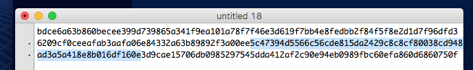

# **How to use the BLOC Wallet for Desktop**

The previous version of BLOC Wallet for desktop computer available for Windows, Mac and Linux.
**This version is no more compatible since the BLOC 3.0**

## **Source Code**

* [BLOC Wallet 2.0.2 on GitHub](https://github.com/BLOC-bloc-wallet)

## **Video**

## **Download**

First we need to go on the BLOC website and click on the [DOWNLOAD](https://bloc.money/download) button from the top menu.

From here, you can download the exclusive range of BLOC softwares.

Our desktop wallet client allow you to create your wallet, store your BLOC.money, view your transactions but also include our easy to use one click-button instant mining.

Select your favorite system. The [BLOC Wallet](https://bloc.money/download) is available for windows, mac and linux. For this video i’m using a MacOs so i will download the Mac OS version. Note that the Mac OS version is compatible for Mac OS Sierra and Mac OS High Sierra. (The same build works on both OS)

Once you have downloaded the file, go to your computer and double click the installation package to install the BLOC wallet.
Select the BLOC wallet application and put in where you like

## **Lanch the app**

Double click the application to open to BLOC wallet.
You might see an error message like this saying that you can not open this software because it’s coming from not identified apple developer. Simply click ok.
Simply go to the control panel of your mac, to the system, select security and then click here, open anyway.

Now the BLOC wallet is starting for the 1st time on your computer. You will note the your BLOC address has been created instantly. This is your personnal address. You can copy it by clicking this link here. Copy address.

## **Wait for synchronisation**

We will have to wait for the wallet synchronisation to finish. It depends the speed of your internet connexion. For this video it took about 2 minutes to synchronise the wallet.
Once the wallet is synchronised, we are ready to use it.

## **Overview**

Overview show the most recent activity of your wallet, including your balance, the mining status if your mining, the pending transactions in the pool and your recent transaction details.

## **Send BLOC**

Send BLOC allow you to send BLOC.MONEY to any other BLOC wallet address.
Simply enter the wallet address here, Then enter the amount you like to send, the fees are set automatically to 0.0001 BLOC. you canenter a payement ID if you have one, it must contain 64 caracters, once you are ready click SEND button

## **Transactions**

Transactions will list all your incomming and outgoing transactions

## **Block Explorer**

The BLOCK Explorer shows you blocks details from the blockchain including the transaction that it contains

## **Contacts**

Contacts is a simple but easy feature to add your friends and family address so you don’t have to remember it

## **Mining**

The mining part allow you to select your favorite mining pool following your location. We have 3 different officials mining pool with different servers to offer a better connectivity located in [Europe](https://bloc-mining.asia) (Finland), We have one in [North America](https://bloc-mining.us) (San fransisco) and another one in [Asia](https://bloc-mining.asia) (Singapore). You can simply drag and drop your favorite mining pool on the top list.

Once you are ready, click start mining.

Your hashrate will be instantly updated once you connect to the mining pool and you can see a green icon next to the mining pool. That’s it! You are mining BLOC ! Congratulations!

Now copy your bloc wallet address and let’s go the the mining pool website to check the activity of my account.
I’m mining from the BLOC europe mining pool. [BLOC-MINING Europe](https://bloc-mining.eu)

Scroll down and paste your address from your BLOC wallet and click the search icon to display the data.

We can see there the total hashes submitted including the pending balance. It still shows 0 right now because blocks from the blockchain require 50 confirmations for the mining reward to be distributed. As we know the block time is 2 minutes so this means we will be able to see the first pending balance in about 2 hours if blocks are found of course from this pool.

Ok so i left my MacBook pro mining for about 12 hours. We can see that i already received a payment from the mining pool, its’s here about 1 BLOC’. And i still have 0.2 something in the pending balance because im still mining. 

Let’s check out the transaction in the wallet.

As you we see here we received 1 BLOC. My balance is 1 BLOC everything is ok.

That’s how simple it is to mine the BLOC using the BLOC wallet with the mining features included.

I hope you enjoy this video. Thank you for watching. Don’t forget to click the like button and the subscribe button aswell. More tutorials are coming soon. Thank you.

## **Wallet Optimization**

If you are mining, it is highly recommended to enable wallet optimization (Settings > Preferences > Wallet Optimization) because you will be more prone to transition getting stuck if you’re wallet isn’t optimized. Transaction size increases if you have many small transactions amount on your wallet, and try to send a big amount in one transaction.

## **Save your wallet**

There are different methods to save and back your wallet with the BLOC Wallet Desktop 2.0.2

### 1. Export key (Best Solution)

This is maybe the best solution and the most safe. You need to have your wallet open and unlocked.

* Select the Top menu `File`
* Then select `Export Key`

This windows appears:

* MAKE SURE YOU SAVE THIS COMPLETE LONG TEXT VALUE SOMEWHERE SAFE.
* This are the private keys of your wallet.

It looks like this:

`BDCE6A63B860BECEE399D739865A341F9EA101A78F7F46E3D619F7BB4E8FEDBB2F84F5F8E2D1D7F96DFD36209CF0CEEAFAB3AAFA06E84332A63B89892F3A00EE5C47394D5566C56CDE815DA2429C8C8CF80038CD948AD3A5A418E8B016DF160E3D9CAE15706DB0985297545DDA412AF2C90E94EB0989FBC60EFA860D6860750F`

Let's understand the private keys

1. Copy and paste the key into a text editor.

2. Select the entire key and convert it to lowercase.

You should obtain a result like this:

`bdce6a63b860becee399d739865a341f9ea101a78f7f46e3d619f7bb4e8fedbb2f84f5f8e2d1d7f96dfd36209cf0ceeafab3aafa06e84332a63b89892f3a00ee5c47394d5566c56cde815da2429c8c8cf80038cd948ad3a5a418e8b016df160e3d9cae15706db0985297545dda412af2c90e94eb0989fbc60efa860d6860750f`

Understanding the key:

**Spend Public Key**: (this is 1st 64 digits of the key)
5c47394d5566c56cde815da2429c8c8cf80038cd948ad3a5a418e8b016df160e

**View Public key**: (this is 2nd 64 digits of the key)
5c47394d5566c56cde815da2429c8c8cf80038cd948ad3a5a418e8b016df160e

**Private spend key**: (this is 3rd 64 digits of the key)
5c47394d5566c56cde815da2429c8c8cf80038cd948ad3a5a418e8b016df160e

**Private view key**: (this is the last 64 digits of the long key)
3d9cae15706db0985297545dda412af2c90e94eb0989fbc60efa860d6860750f

Once again. **Make sure you save this details**. This are the **ONLY way to recover your wallet using the blockchain**. This is **much better than to save a wallet file** than can be corrupt with time, or not updated with new version or whatever the reason. **The keys are the ONLY sure 100% garanteed solution to recover your wallet**

Now that you have this 2 keys you will be able to use your wallet with the new **BLOC v3.0**

## **Backup wallet file**

Once you have saved your wallet using the 1st method you can also save your wallet file.
To do this:

* Select the Top menu `File`
* Then select `Backup Wallet`

This windows appears:

* Enter the name of your wallet
* Select the folder where to save your wallet

* Your wallet file has been saved.

**NOTE**: If your wallet contain a password make SURE you have saved this password somewhere. You will not be able to open a wallet file password protected if you do not know the password.

**NOTE2**: Make sure you have save your wallet file using the first method aswell.

**IMPORTANT** 

* Your wallet file from the BLOC Desktop Wallet v2.0.2 is compatible **ONLY** with the native new command line [BLOCWallet v3.0](../wallets/BLOCWallet-how-to-use.md)
* You will not be able to open your wallet file with the new BLOC V3.0 Desktop Wallet.

**NEXT ?**

* Create a new wallet format on the BLOC V3.0
* Open your wallet file with the new [BLOCWallet v3.0](../wallets/BLOCWallet-how-to-use.md) command line and then transfer the BLOC.MONEY to your new BLOC address.