# **BLOC Electron Wallet for Desktop**

[BLOC Electron GUI Wallet](https://bloc.money/download) - GUI Stands for Graphical User Interface. It makes it easy for you to use BLOC with a friendly user interface. The BLOC Electron Wallet client allow you to create your wallet, store and send your [BLOC](https://bloc.money), view your transactions, stay connected with the BLOC ecosystem and also CPU mine BLOC with a simple one click button. BLOC Electron GUI Wallet is available for Windows, macOS and linux desktop and laptop computers.

Presentation:
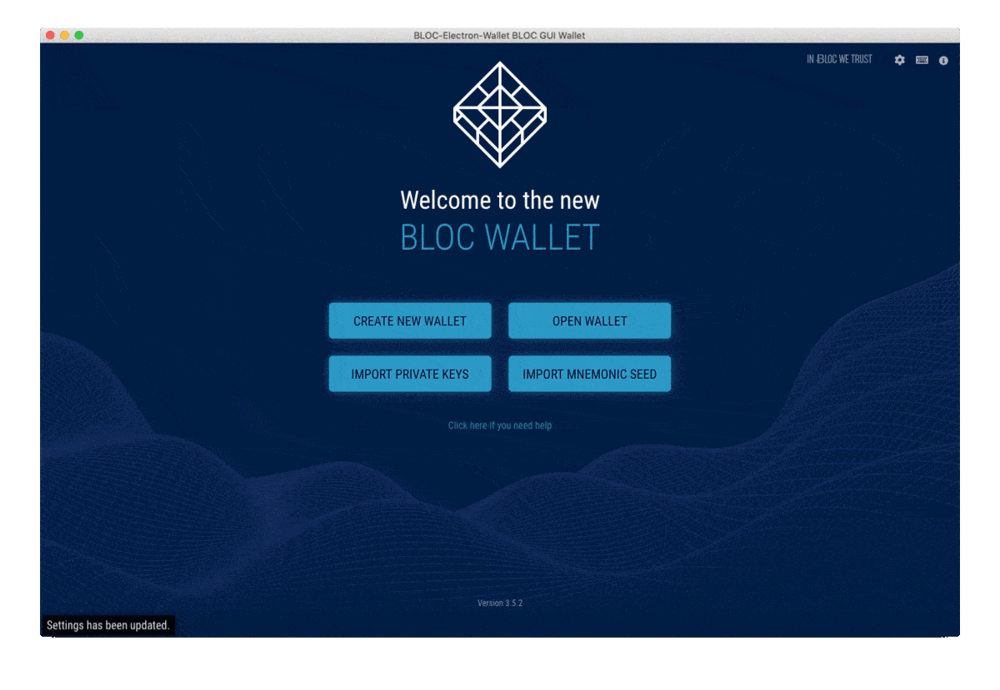

## **Screenshot**

**Notes**

BLOC Electron Wallet relies on BLOC-service to manage wallet container & rpc communication.

Release installer & packaged archived includes a ready to use BLOC-service binary, which is unmodified copy BLOC release archive.

If you don't trust the bundled BLOC-service file, you can download and use the binary from official BLOC release, which is available here: https://github.com/furiousteam/BLOC/releases or compile it yourself. Then, make sure to update your BLOC-service path setting.

## **Source Code**

* [BLOC Electron Wallet on GitHub](https://github.com/furiousteam/BLOC-electron-wallet)

## **Download**

You can download the BLOC Electron Wallet from two places

* BLOC Electron Wallet from [BLOC.MONEY](https://bloc.money/download)
* BLOC Electron Wallet from [GitHub](https://github.com/furiousteam/BLOC-electron-wallet/releases)

Once you have downloaded the file, go to your computer and double click the installation package to install the BLOC Electron wallet. Select the BLOC wallet application and place it where you like.

## **Lanch the app**

#### Windows:

1. Download the latest installer [here](https://bloc.money/download)
2. Run the installer (BLOC-Electron-Wallet-<version>-win-setup.exe) and follow the installation wizard.
3. Run as Administrator BLOC-Electron-Wallet via start menu or desktop shortcut. (right click on the app icon and select run as Administrator)

#### GNU/Linux (AppImage):

1. Download latest AppImage bundle [here](https://bloc.money/download)
2. Make it executable, either via GUI file manager or command line, e.g. `chmod +x BLOC-Electron-Wallet-<version>-linux.AppImage`
3. Run/execute the file, double click in file manager, or run via shell/command line.

See: https://docs.appimage.org/user-guide/run-appimages.html

#### macOS

1. Download latest archive [here](https://bloc.money/download)
2. Extract downloaded zip archived into your home folder
3. Open terminal and Run: `cd /Users/YOURNAME/BLOC-Electron-Wallet.app/Contents/MacOS && ./BLOC-Electron-Wallet`

## **Settings**

The settings screen will appear the 1st time you are launching the BLOC Electron Wallet. On first launch, BLOC Electron Wallet will try to detect location/path of bundled BLOC-service binary, but if it's failed, you can manually set path to the BLOC-service binary on the Settings screen.

If you are happy to use the bundled BLOC-service simply click the `SAVE` button.
If you wish to use your own binary select the path location

## **Welcome Screen**

Welcome to your BLOC wallet. There is 4 differents options available.

1. Create new wallet
2. Open an existing wallet already created by the BLOC Electron Wallet Client
3. Import private keys to restore a wallet
4. Import Mnemonic seed words to restore a wallet

## **Create new wallet**

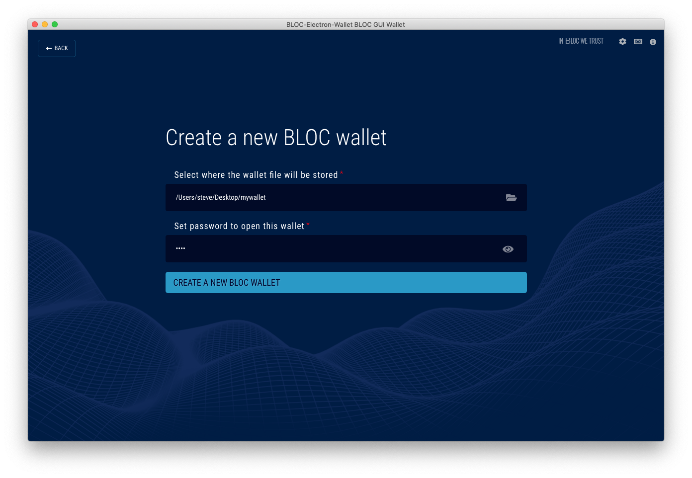

If this is your 1st time using BLOC or you just need to create a new wallet use this option.

1. Select where the wallet file will be stored. Click on the folder icon, choose where you woud like to save your wallet, enter the name of the file and click save.
2. Set the required password to open this wallet file
3. Click the button `CREATE A NEW BLOC WALLET`
4. Wallet file is saved with the following extension: `mywallet.money`

You should see a message: Wallet has been imported. You can now [open the wallet](../wallets/BLOC-GUI-Electron-Wallet.md#open-wallet).

## **Open an existing wallet file .money**

BLOC Electron Wallet require a connection to a BLOC node to be able to work.
You have two possibilities:

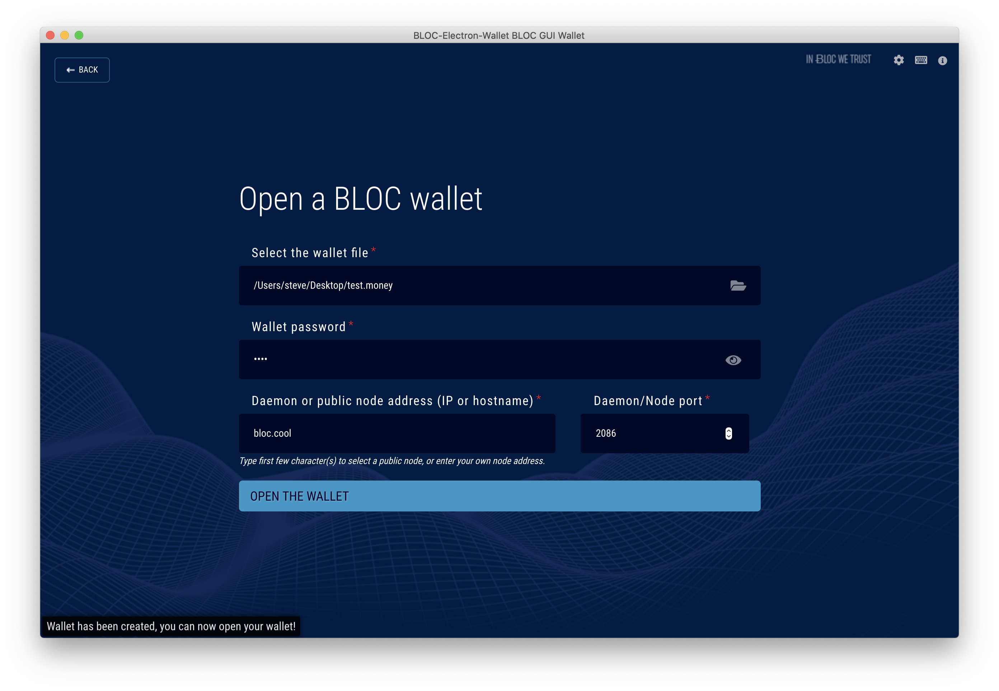

1. Create your own node - Download and start BLOCd on your machine locally or remotely then connect to it with BLOC Electron Wallet.
2. Use a public remote BLOC node and do not bother with the tech. Select your favorite BLOC public node and connect to it.

*Note:* Public remote node may charge extra fees per transaction.

Find out more about [BLOC remote nodes](../wallets/Using-remote-nodes.md) and how you could make extra passive income.

1. Click on the folder icon to open your system explorer and select your wallet file `(.money)`
2. Type the password for this wallet
3. Type hostname or IP address of the BLOC daemon or public node to connect to*
4. Enter RPC port number of the BLOC daemon or public node
5. Click the button `OPEN THE WALLET`

* To use a local BLOC node running on the same machine as the BLOC Electron wallet enter `127.0.0.1` as Daemon address with RPC Port: `2086`

* if you are using BLOC public remote node, you might get a notification displaying the node fee price.

You are now ready to use your wallet. Please follow the next instructions on how to use your wallet.

## **Import Private Keys to restore a wallet**

If you already have BLOC wallet address you can import your private keys using this method.

If you were using the previous BLOC Wallet v2.0.2 you can checkout [this guide to find out how to export your wallet private keys](../wallets/BLOC-GUI-Desktop-Wallet-V2.md#1-export-key-best-solution) and follow this procedure to restore your wallet:

This will restore your wallet address, funds present on it but also the complete history of your transactions. All you need is your private view key & spend key.

1. Select where the wallet file will be stored. Click on the folder icon, choose where you woud like to save your wallet, enter the name of the file and click save.
2. Set the required password to open this wallet file
3. Select the block number from where to start scanning the blockchain for transactions contains into your wallet.
4. Enter the private view key of the wallet to be imported
5. Enter the private spend key of the wallet to be imported
6. Click the button `IMPORT PRIVATE KEYS AND RESTORE THE WALLET`

You should see a message: Wallet has been imported. You can now [open the wallet](../wallets/BLOC-GUI-Electron-Wallet.md#open-wallet).

## **Import Mnemonic seed words to restore a wallet**

If you already have BLOC wallet created since the BLOC V3.0 you should already have a Mnemonic seed. You can import it using this method.

This will restore your wallet address, funds present on it but also the complete history of your transactions. All you need is your Mnemonic seed words list.

1. Select where the wallet file will be stored. Click on the folder icon, choose where you woud like to save your wallet, enter the name of the file and click save.
2. Set the required password to open this wallet file
3. Select the block number from where to start scanning the blockchain for transactions contains into your wallet.
4. Enter the Mnemonic seed words of the wallet to be imported
5. Click the button `IMPORT MNEMONIC SEED AND RESTORE THE WALLET`

You should see a message: Wallet has been imported. You can now [open the wallet](../wallets/BLOC-GUI-Electron-Wallet.md#open-wallet).

## **Wallet Overview**

We will have to wait for the wallet synchronisation to finish in order to use the wallet.

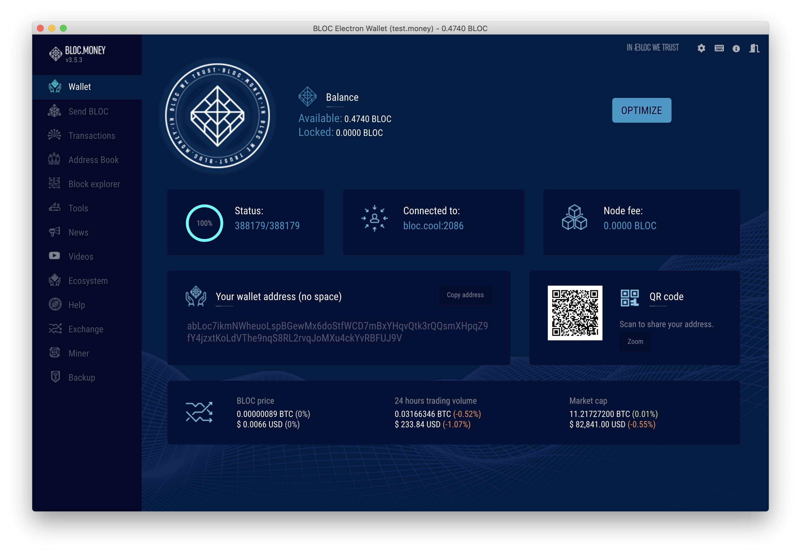

The overview display all the important informations about your wallet such as:

1. `Balance` (Available and Locked)
2. `Status` gives you the synchronisation state of the wallet. (The 1st number is the actual block synched to this wallet and the second number is last known top block on the network)
3. `Connected To` display the current node you are connected to use your wallet
4. `Node fee` shows the fee amount used by this node for each transaction.
5. `Your wallet address` that can be shared to your customers/friends so they can pay you
6. `QR Code` makes it even easier to share your BLOC address. Scan to share.
6. `BLOC Price` display BLOC price from CoinGecko
6. `OPTIMIZE` button optimize your wallet to send larger amount transactions. Required if you are mining with this address and receive a lot of small transactions.

## **Send BLOC**

Send/Transfer BLOC.MONEY to any other BLOC wallet address.

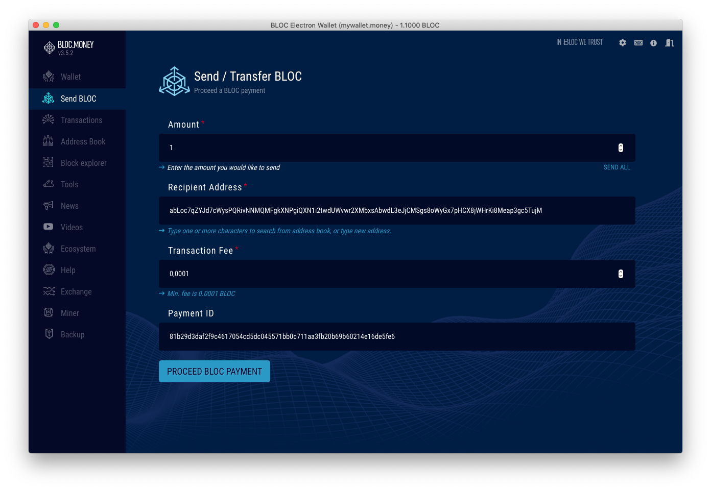

1. Type the amount you would like to send
2. Enter the recipient address
3. The fees are set automatically to 0.0001 BLOC
1. If the receiver provided you with a Payment ID you can enter it here, it must contain 64 caracters
5. Once you are ready click. `PROCEED BLOC PAYMENT`

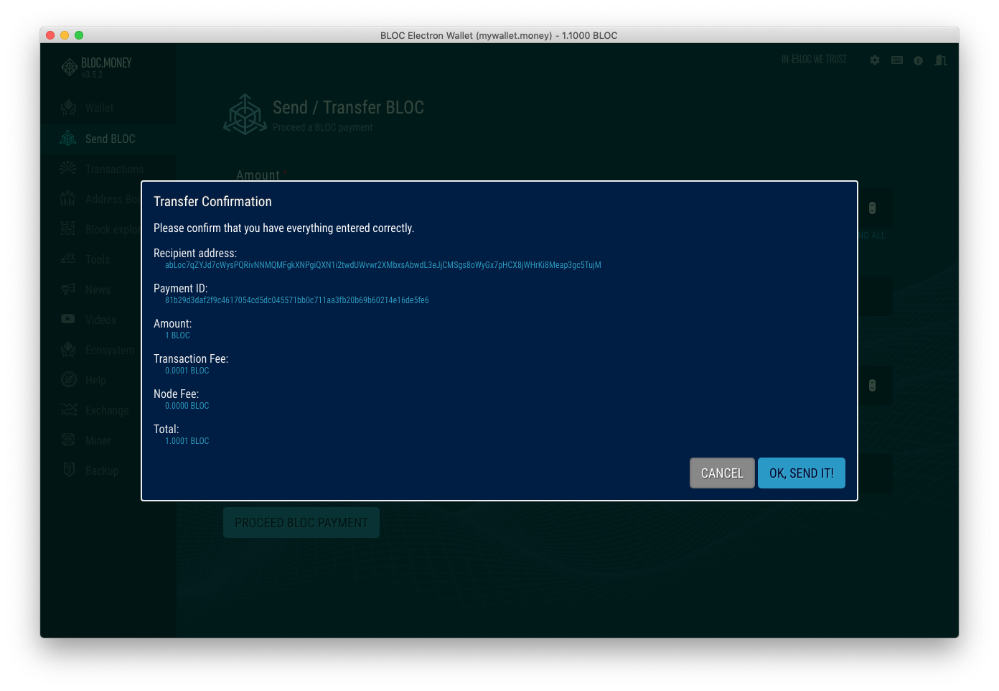

Confirm all the informations are correct.
If everything is ok click `POK SEND IT` or `CANCEL` button to return to previous screen
Transactions are sent in real time.

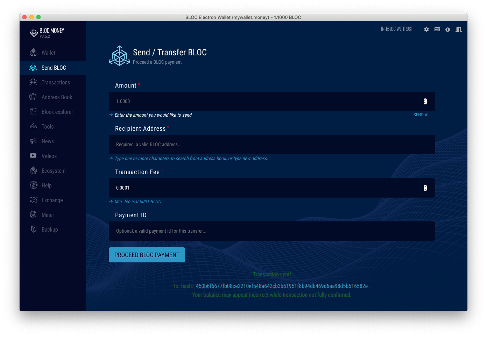

You can checkout the Transaction Hash (Tx. hash) provided for your transaction at the bottom part.
If an error happen it will appear here.

## **Transactions**

Transactions list all incomming and outgoing transactions from this wallet.

- Search transaction by transaction hash or payment ID
- Transactions can be sorted by amount, date or status
- Click on a transaction to get more details
- Export transactions as .csv file

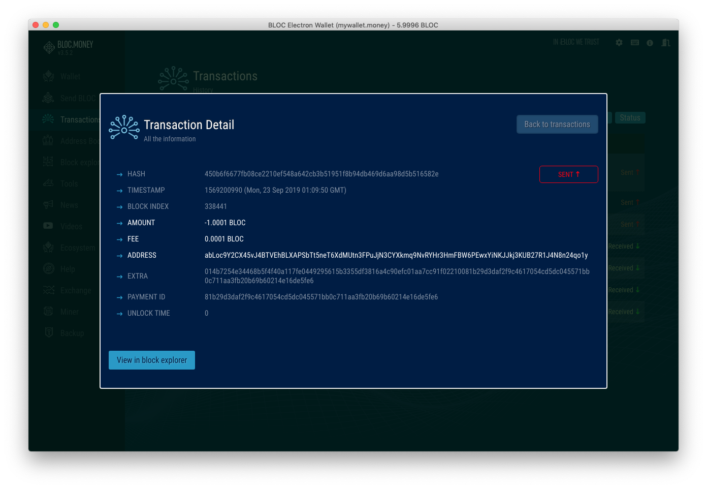

You can also view the transaction on the block explorer.

## **Address Book**

Each time you send a transaction using the BLOC Electron wallet the BLOC address of the receiver will be saved into your contacts.

You can also add a beneficiary into the address book very easy. Simply enter the BLOC address, payment ID if you have one and the label to remember the name of this beneficiary. Once ready click `Save contact` button.

## **BLOC Explorer**

Our crypto currency BLOC explorer shows the latest blocks in the blockchain. Clicking on a specific network block will provide you with more information regarding its size, when it was found, and more importantly, which transactions it contains.

Our BLOC explorer is also a valuable tool to see how the current block reward is distributed to the miners.
BLOC explorer can also search for Payment IDs, Block hash, Block height, Transaction hash.

The BLOC explorer quickly become your best friend to verify transactions on the Ƀ BLOC blockchain network.

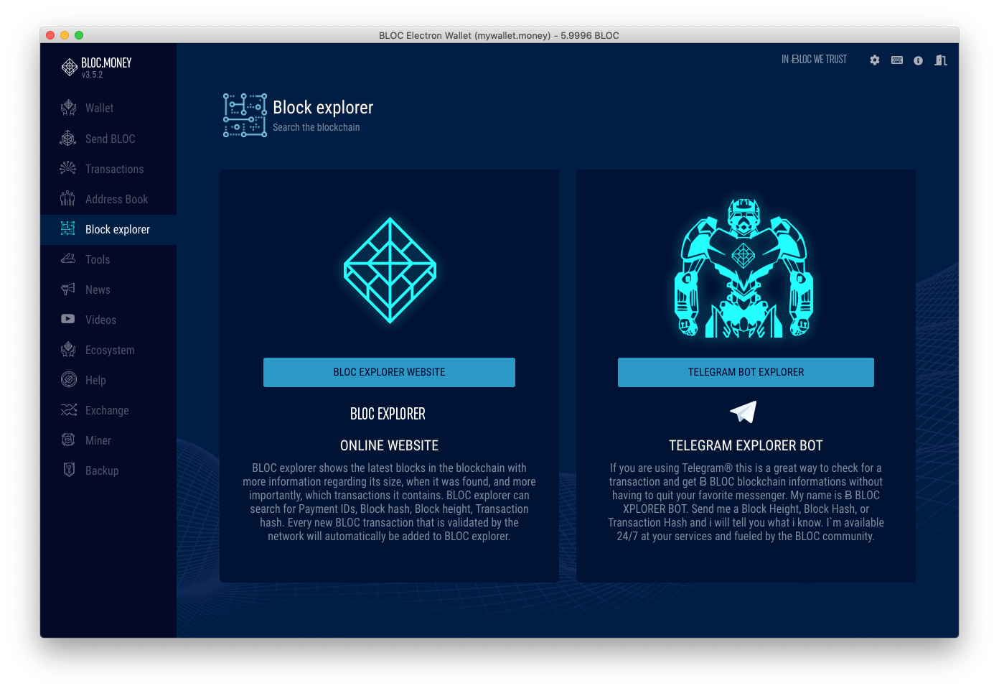

- Click the `BLOC EXPLORER WEBSITE` button to visit the official [BLOC-EXPLORER](https://bloc-explorer.com)
- If you are using Telegram® we made a [`TELEGRAM BOT EXPLORER`](https://t.me/bloc_explorer_bot) to check for a transaction and get informations without having to quit your favorite messenger.

## **Tools**

Discover and download the exlusive range of [BLOC.MONEY (BLOC) softwares](https://bloc.money/download) from the tools section.

## **News**

Stay up to date with the latest news from the official [BLOC medium blog](https://medium.com/@bloc.money).

## **Videos**

Watch the latest videos from the [BLOC.MONEY (BLOC) Youtube channel](https://www.youtube.com/channel/UCdvnEPWhqGtZUEx3EFBrXvA).

## **Ecosystem**

Use, spend, buy and sell your BLOC.money (BLOC). Discover the [powerful BLOC ecosystem](https://bloc.money/ecosystem).

## **Help**

This wiki is the main source of documentation for newcomers to the [BLOC Project](https://github.com/furiousteam/BLOC). If this is your first time hearing about BLOC, we recommend starting by visiting the official [BLOC.MONEY](https://bloc.money) website.

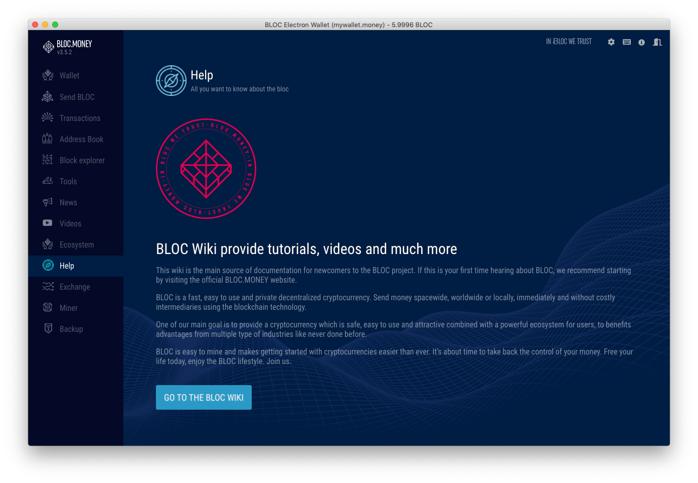

## **Exchange**

Find here the list where to trade BLOC with other cryptocurrencies.

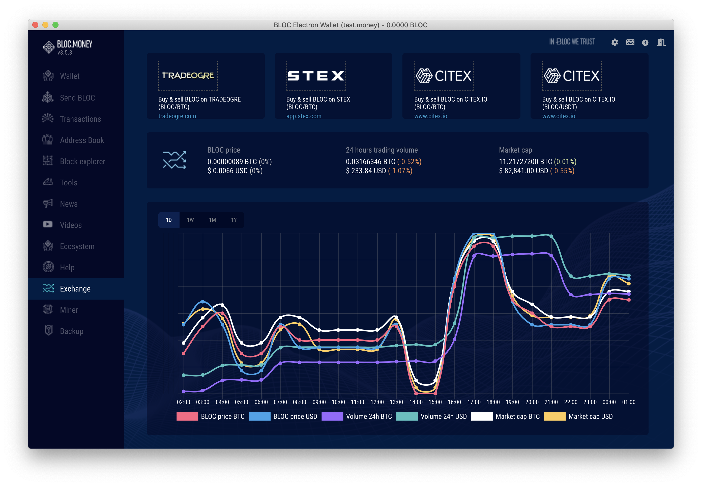

## **Miner**

If you want to learn about cryptocurrencies, mining is a great place to start!. 
The BLOC Electron wallet include a built-in miner for BLOC which makes it very easy to use with a one single click button to start mining.

The advantages of the miner built-in the BLOC Electron wallet:

- The miner will not be detected as virus like any other mining software
- Very easy to use with 1 click button to start mining using your built-in BLOC address
- Complete mining stats provided
- Mining from the official [POOL.BLOC.MONEY](https://pool.bloc.money).
- CPU Mining only

Once the mining is made easy, this is not the best solution if you want to mine regulary BLOC. If you are interested about mining and looking for a more efficient solution we suggest you to look at the [BLOC GUI Miner](../mining/BLOC-GUI-Miner.md)

To start mining simply swich ON the button.

Notice a yellow box will appears on the left menu while browsing the other sections to remember you that you are mining.

## **Backup**

Backup your wallet with your private keys so you can restore your wallet anytime.

To display the private keys of your wallet click the `REVEAL THE KEYS AND MMEMONIC SEED` button.

The private keys below can restore your wallet using the BLOC Electron Wallet or the [BLOCWallet](../wallets/BLOCWallet-how-to-use.md). Never share this keys with anyone.

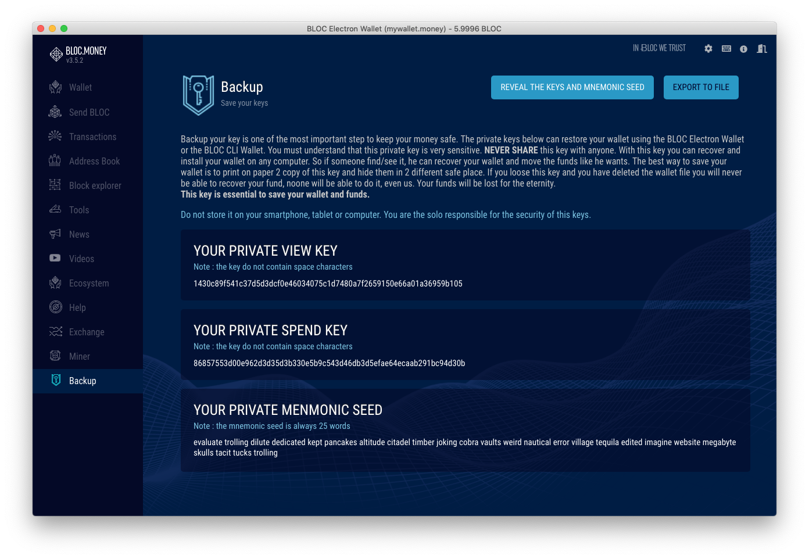

Click `EXPORT TO FILE` button to export the private keys of your wallet into a file.

### 25 Word Mnemonic Seed phrase not showing ?!
Some of the BLOC address do not have 25 Word Mnemonic Seed phrase because they were created inside a commun wallet container or it has been created before we implemented this feature.