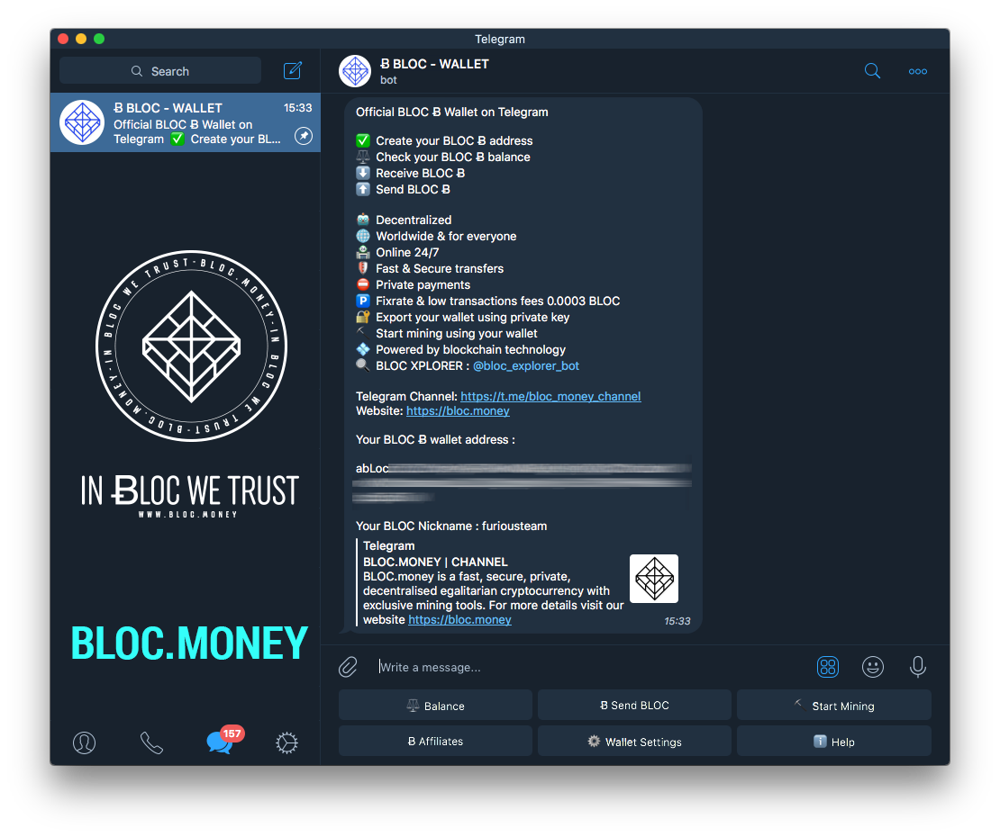
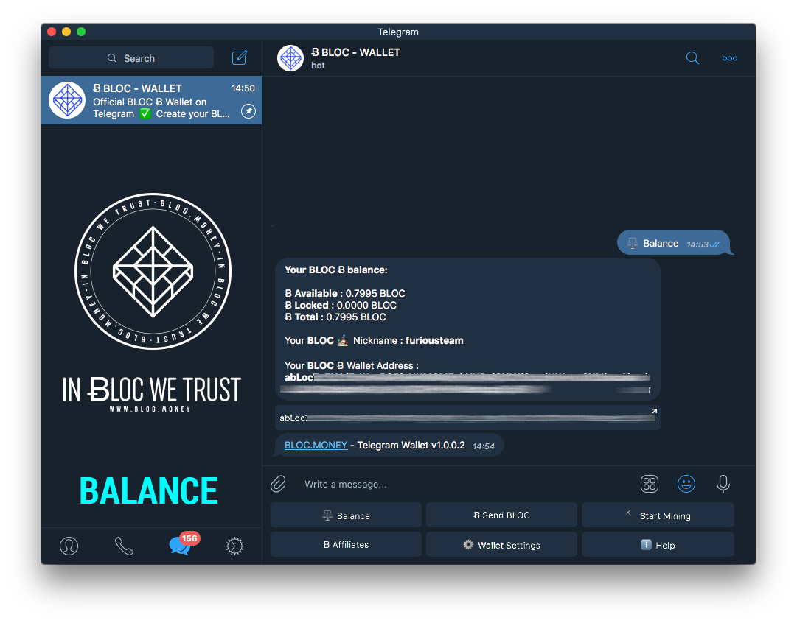
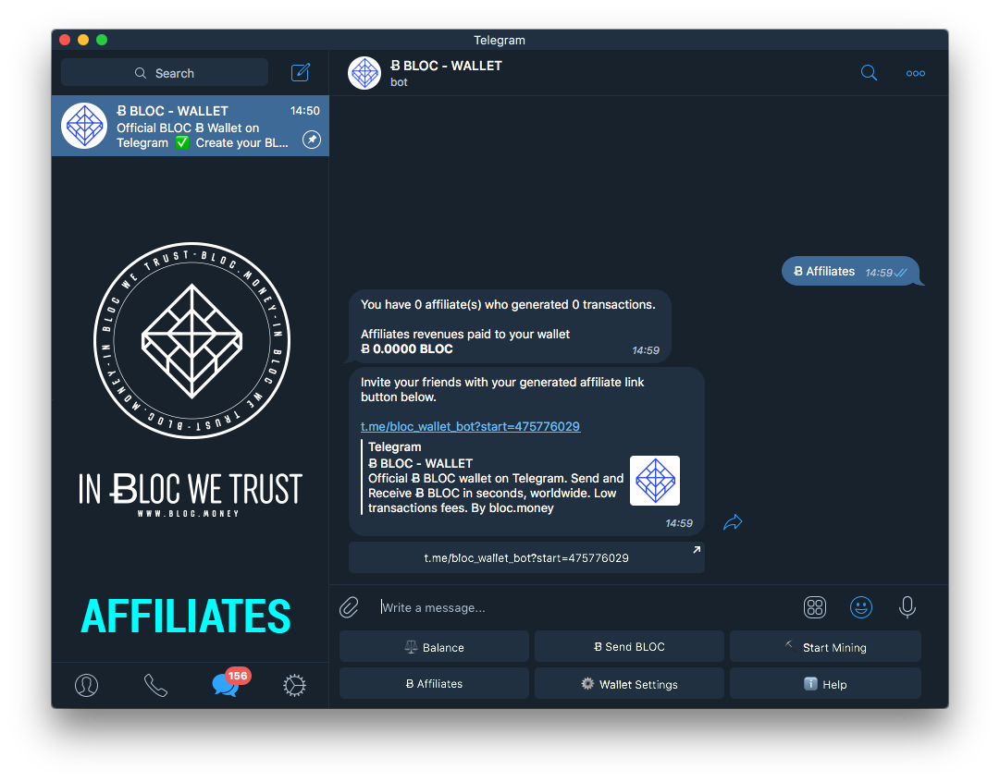
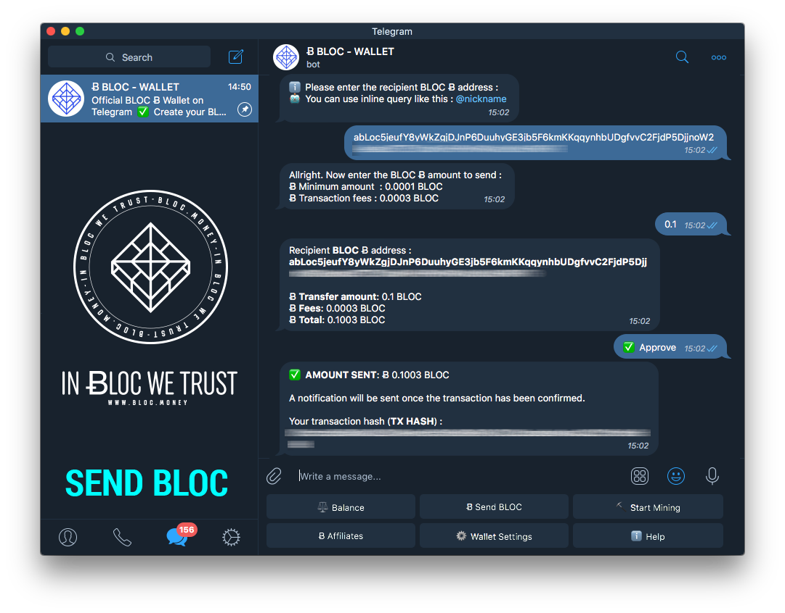
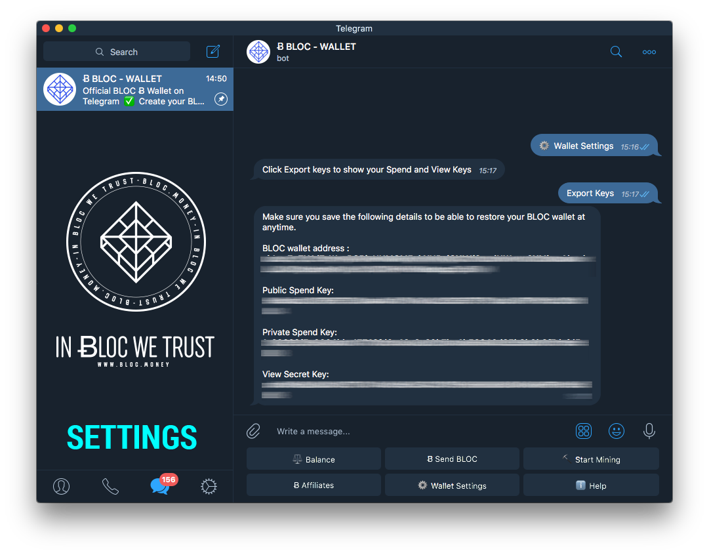
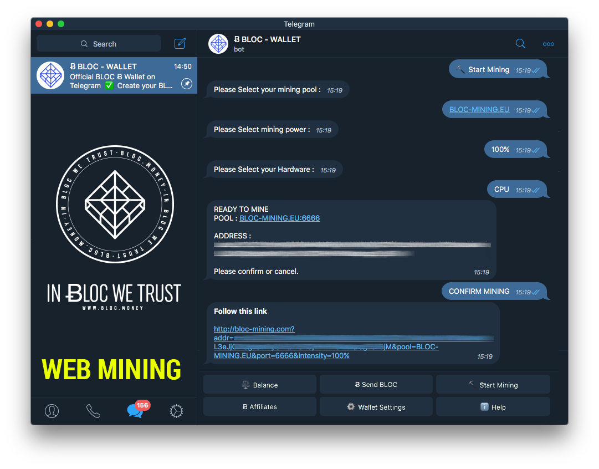

# BLOC Telegram Wallet

One of our goal at [BLOC](https://bloc.money) is to provide a complete ecosystem around the BLOC to be able to access, use, spend the BLOC anywhere, anytime. Within the last 30 days, [Telegram](https://t.me/bloc_money) was used by 200,000,000 people. This is an insane number by any standards. If Telegram were a country, it would have been the sixth largest country in the world.

This is why we have worked hard to bring the best of BLOC.MONEY on Telegram and we are happy to release the new [Telegram BLOC Wallet](https://t.me/bloc_wallet_bot) instantly available to all Telegram users worldwide. Telegram (so the BLOC Wallet) is available for Android, Apple iPhone & iPad, Windows Phone, Web browser, MacOS, Linux, Windows …

## Requirements

You need to have Telegram installed on your device. If you do not have Telegram yet you can go on the official [Telegram website](https://telegram.org) to find out more details and download the application. Telegram messages are heavily encrypted and cloud based. Telegram is fast, free, powerful and secure with endless possiblity.

## Features

* ✅ Create your Ƀ BLOC address 
* ⚖️ Check your Ƀ BLOC balance
* ⬇️ Receive Ƀ BLOC
* ⬆️ Send Ƀ BLOC
* 🤖 Decentralized
* 🌐 Worldwide & for everyone
* 🏪 Online 24/7
* 🛡️ Fast & Secure transfers
* ⛔️ Private payments
* 🅿️ Fixrate & low transactions fees Ƀ 0.0003 BLOC
* 🔐 Export your wallet using private keys
* ⛏ Start mining using your wallet
* 💠 Powered by blockchain technology

## Guide

### Installation

Once you have installed Telegram go to the [Telegram BLOC Wallet](https://t.me/bloc_wallet_bot)

* **Your Ƀ BLOC wallet address:** Once you start the BLOC Wallet for the first time, your personnal BLOC address will be generated. This is your unique address for your Telegram account. It will not change even if you change your username. Your BLOC Wallet address is linked to your Telegram user ID. You can share your BLOC address and start receive Ƀ BLOC from now.

* **Your BLOC Nickname:** If you already have a username on Telegram, this username will be linked to your BLOC Wallet. This makes recipient address easy to remember when sending Ƀ BLOC to friends or family. So if you already know the username of the beneficiary of your BLOC payment you do not need to know his BLOC Wallet address. Not everyone choose to have a Telegram username but you can find more details about Telegram username [here](https://telegram.org/faq#q-do-i-need-a-username)

### Balance

**Balance:** Click the Balance button to view your Ƀ BLOC balance including locked and total amounts. It also display your BLOC Wallet address and your Telegram / BLOC Nickname

### Affiliates

**Affiliates:** [Telegram BLOC Wallet](https://t.me/bloc_wallet_bot) use different fees as other BLOC wallet. Each transaction sent from the Ƀ BLOC Telegram Wallet cost 0.0003 BLOC per transaction

This is how it works:

* If you send 1.0000 BLOC you need to have in your wallet 1.0003 BLOC.
* 1.0000 BLOC (will be sent to the recipient address)
* 0.0001 BLOC will be used as fees to process this transaction
* 0.0001 BLOC will be sent to your Referrer
* 0.0001 BLOC will be sent to process the transaction of the Referrer
 
This is a great way for everyone to make a passive income in [BLOC](https://bloc.money) by inviting all your friends and family using the [Telegram BLOC Wallet](https://t.me/bloc_wallet_bot). This feature may not stay enable forever on BLOC it will be online as long as the community need to grow our brand our awardwess.
 
To get your [Telegram BLOC Wallet](https://t.me/bloc_wallet_bot) affiliate link, click the Affiliate button, copy paste or share your affiliate link directly to your contacts on Telegram or share the link on your website/social medias. You will get a reward of 0.0001 BLOC from every single transactions made from a user who registered using your affiliate link.

### Send BLOC

Send BLOC: Send BLOC anytime, anywhere from almost any device in few seconds. 
 
* Enter the BLOC wallet recipient or the BLOC / Telegram username. 
* Enter the amount. (Minimum is 0.0001 BLOC). 
* Verify the transaction details and. Click OK to confirm or Cancel. 
* You will get a notifications with the transactions hash once the payement has been sent.

### Wallet Settings

Because privacy and security is one of the most important thing for us. You can easily export the private keys of your [Telegram BLOC Wallet](https://t.me/bloc_wallet_bot) using the `Export Key` button, it will generate and display your **BLOC Wallet address, Public Spend Key, Private Spend Key and the View Secret Key**. Using this private keys you will be able to restore your wallet on any official BLOC wallet client. There is also an option to delete your BLOC Wallet from Telegram. Your BLOC address will be permanently deleted from the [Telegram BLOC Wallet](https://t.me/bloc_wallet_bot) and a new address will be generated. Dont forget to save your private keys to restore your wallet at any time.

### Web Mining

This is another great feature to allow you easy mining from any device directly from your Telegram wallet. Simply click `Start Mining` button. Since the webserver of the [WebMiner](https://bloc-mining.com) is hosted in Europe, we have selected by default the [BLOC-MINING Pool Europe](https://bloc-mining.eu). Follow the link, it will open your web browser on the [WebMiner](https://bloc-mining.com) with already pre-configured settings and your BLOC address ready to mine the [BLOC](https://bloc.money) in no time. All you have to do is to **SWITCH ON** the mining button once you arrive on the [BLOC-MINING.com](https://bloc-mining.com) website.

### Help

Help: Display the [Telegram BLOC Wallet](https://t.me/bloc_wallet_bot) features, links and help.