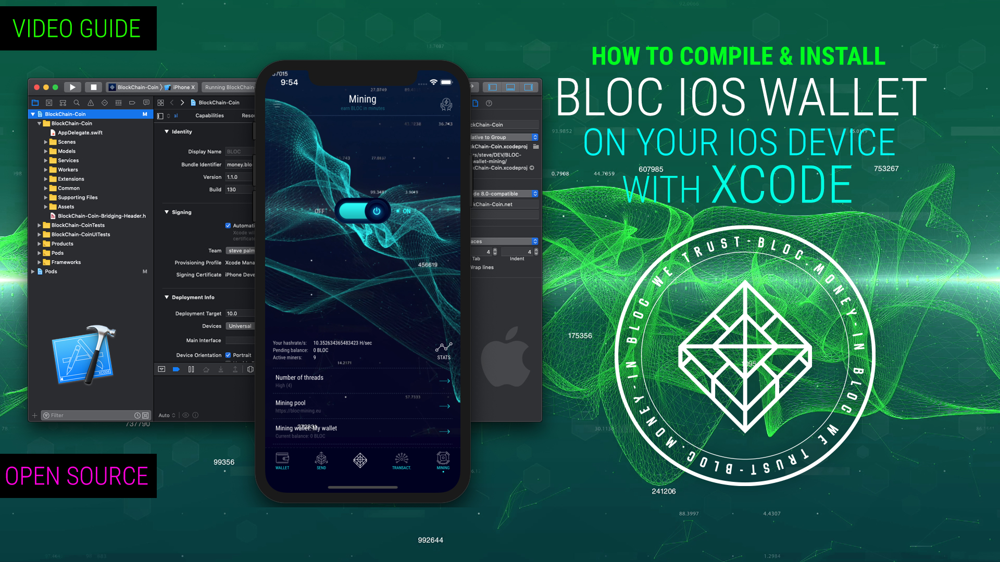

# **How to build the BLOC Wallet for iOS with Xcode**

Introducing the first open source [BLOC Wallet for iOS](https://itunes.apple.com/us/app/bloc-wallet-by-furiousteam-ltd/id1437924269?mt=8&ign-mpt=uo%3D2) with a focus on accessibility, security and simplicity. BLOC Wallet makes getting started with [BLOC](https://bloc.money) easier than ever.

We have 2 versions of the BLOC wallet for iOS

- The version in the [App Store](https://itunes.apple.com/us/app/bloc-wallet-by-furiousteam-ltd/id1437924269?mt=8&ign-mpt=uo%3D2). Easy to download and install but does not include the mining option.

- The version on [GitHub](https://github.com/furiousteam/BLOC-iOS-wallet). This version include the original version available in the app store + the  [mining option](https://github.com/furiousteam/BLOC-iOS-wallet/tree/mining) but require a developer account to be installed.

## **How to build video tutorial**

How to build the open source BLOC iOS Wallet app with Xcode

## **How to use the BLOC Wallet for iOS**

How to use the BLOC Wallet for iOS

[How to use the BLOC Wallet for iOS](../wallets/BLOC-iOS-wallet.md) 