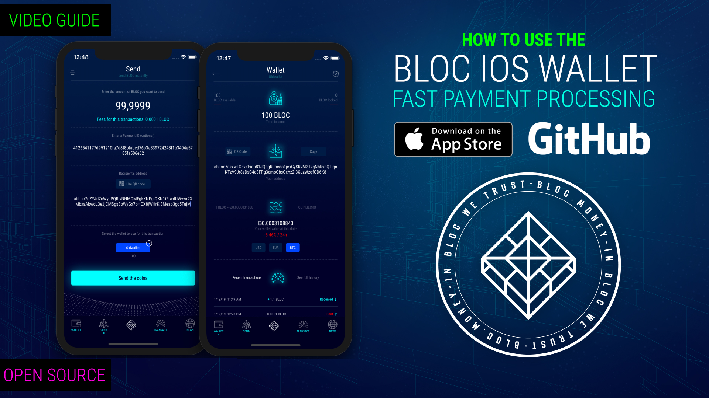
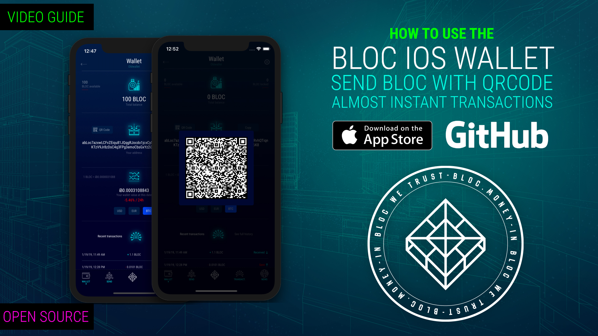
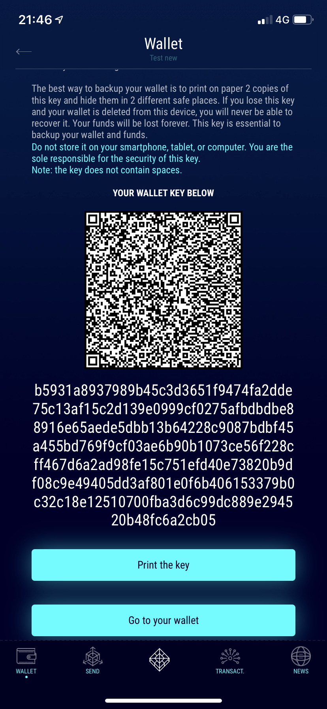
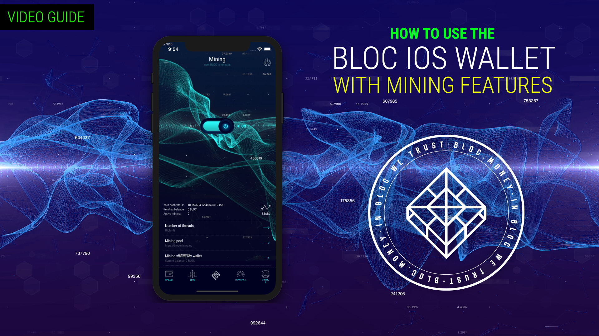

# **BLOC.MONEY - (BLOC) iOS Wallet**

Introducing the first open source [BLOC Wallet for iOS](https://itunes.apple.com/us/app/bloc-wallet-by-furiousteam-ltd/id1437924269?mt=8&ign-mpt=uo%3D2) with a focus on accessibility, security and simplicity. BLOC Wallet makes getting started with [BLOC](https://bloc.money) easier than ever.

We have 2 versions of the BLOC wallet for iOS

- The version in the [App Store](https://itunes.apple.com/us/app/bloc-wallet-by-furiousteam-ltd/id1437924269?mt=8&ign-mpt=uo%3D2). Easy to download and install but does not include the mining option.

- The version on [GitHub](https://github.com/furiousteam/BLOC-iOS-wallet). This version include the original version available in the app store + the  [mining option](https://github.com/furiousteam/BLOC-iOS-wallet/tree/mining) but require a developer account to be installed.

[](https://itunes.apple.com/us/app/bloc-wallet-by-furiousteam-ltd/id1437924269?mt=8&ign-mpt=uo%3D2)


## **How to use the BLOC Wallet for iOS**

How to install and use the BLOC Wallet for iOS

[](https://www.youtube.com/watch?v=lrYZXrH5D58)

Fast Payment Processing using the QRCODE feature

[](https://www.youtube.com/watch?v=w228SRqSJBY)

## **Supported Features**

### WALLET

* Create a new wallet
* Import a wallet (using a private key)
* Import a wallet (using a QR code)
* Backup a wallet
* Restore a wallet
* Delete a wallet
* View balance and transactions
* The restore option works from :
* iPhone to iPhone
* Export your private keys

### SEND

* Pay and get paid with BLOC QR code
* Enter the amount to send
* Enter the optional Payment ID
* Enter the receipient’s address
* Select your wallet to use to process this transaction
* Send BLOC

### TRANSACTIONS

View a complete history of your BLOC transactions

### NEWS

Stay connected with the BLOC community

### BACKUP YOUR WALLET

Make sure you save the private keys of your wallet.

That's how it looks on your iPhone or iPad:



To restore your wallet on your iPhone you will need the full key.
it must looks like this (256 characters long)

```
b5931a8937989b45c3d3651f9474fa2dde75c13af15c2d139e0999cf0275afbdbdbe88916e65aede5dbb13b64228c9087bdbf45a455bd769f9cf03ae6b90b1073ce56f228cff467d6a2ad98fe15c751efd40e73820b9df08c9e49405dd3af801e0f6b406153379b0c32c18e12510700fba3d6c99dc889e294520b48fc6a2cb05
```

### **How to backup your wallet and restore it on the BLOC Electron Wallet for Desktop ?**<a name="from-iphone-to-desktop"></a>

You need only the Private Spend Key and the Private View key to import your wallet into the [BLOC Electron Wallet](../wallets/BLOC-Electron-Wallet.md) for desktop.

The 1st 64 characters of your long key is the `spendPublicKey`:
b5931a8937989b45c3d3651f9474fa2dde75c13af15c2d139e0999cf0275afbd

The 2nd 64 characters of your long key is the `viewPublicKey`:
bdbe88916e65aede5dbb13b64228c9087bdbf45a455bd769f9cf03ae6b90b107

The 3rd 64 characters of your long key is the `spendSecretKey`:
3ce56f228cff467d6a2ad98fe15c751efd40e73820b9df08c9e49405dd3af801

The 4th 64 characters of your long key is the `viewSecretKey`:
e0f6b406153379b0c32c18e12510700fba3d6c99dc889e294520b48fc6a2cb05

Now with this details simply use the [BLOC Electron Wallet](../wallets/BLOC-Electron-wallet.md#import-private-keys) and import your iOS wallet on your desktop computer.

## **Mining from iOS**

We had to remove the mining features built in the original **BLOC** app to be able to distribute it on the official app store. It is very important for the **BLOC** to make the installation very easy and accessible to the most potential users.

That being said we are happy to publish our iOS app [open source](https://github.com/furiousteam/BLOC-iOS-wallet) including the miner so everyone can enjoy it.

[How to build the BLOC Wallet for iOS](../wallets/BLOC-iOS-wallet-xcode.md) 

How to mine using the BLOC Wallet for iOS

[](https://www.youtube.com/watch?v=4dYKJW3olOk)