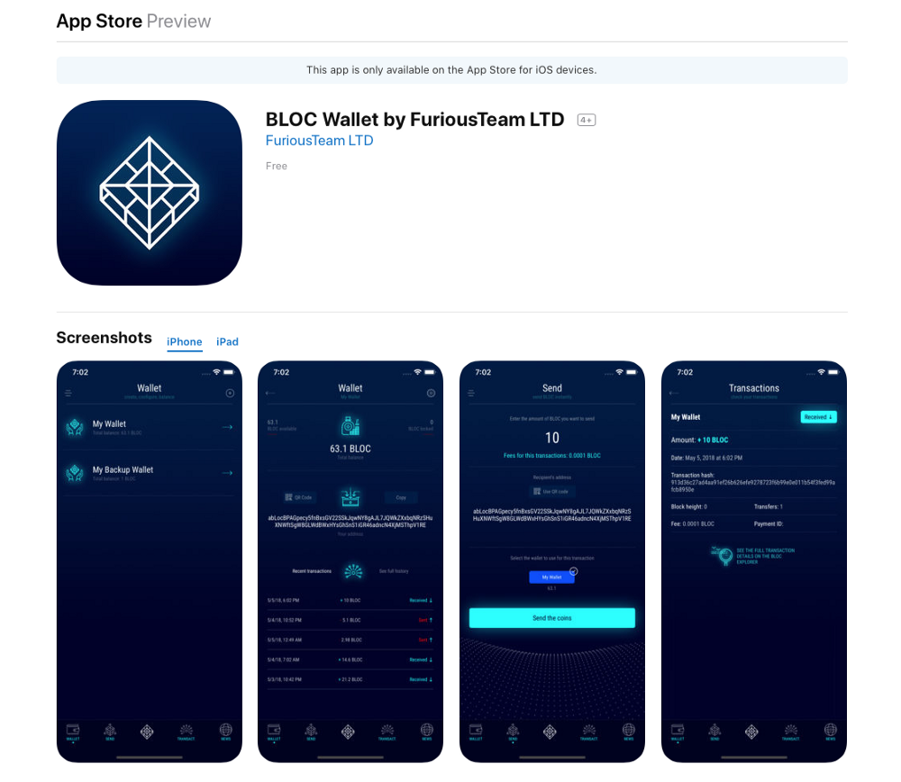

# BLOC for iPhone and iPad

Introducing the first [BLOC Wallet for iOS](https://itunes.apple.com/us/app/bloc-wallet-by-furiousteam-ltd/id1437924269?mt=8&ign-mpt=uo%3D2) with a focus on accessibility, security and simplicity. BLOC Wallet makes getting started with [BLOC](https://bloc.money) easier than ever.

## Supported Features

### WALLET

* Create a new wallet
* Import a wallet (using a private key)
* Import a wallet (using a QR code)
* Backup a wallet
* Restore a wallet
* Delete a wallet
* View balance and transactions
* The restore option works from :
* iPhone to iPhone
* iPhone to Desktop wallet

### SEND

* Pay and get paid with BLOC QR code
* Enter the amount to send
* Enter the receipient’s address
* Select your wallet to use to process this transaction
* Send BLOC

### TRANSACTIONS

View a complete history of your BLOC transactions

## NEWS

Stay connected with the BLOC community

### More coming soon

We had to remove the mining features built in the original BLOC app to be able to distribute the BLOC app on the official app store. It is very important for the BLOC to make the installation very easy and accessible to the most potential users.

That being said we are working on another method to mine from your phone without using the phone power itself. A new kind of cloud mining. We might publish the source code of the original app of BLOC including the miner but we would like to find a way easy for everyone to enjoy it.

Meanwhile we will be doing of course lot of update on our BLOC app including amazing new features never made before for a crypto currency including the release of the Android version. That is only the first version.