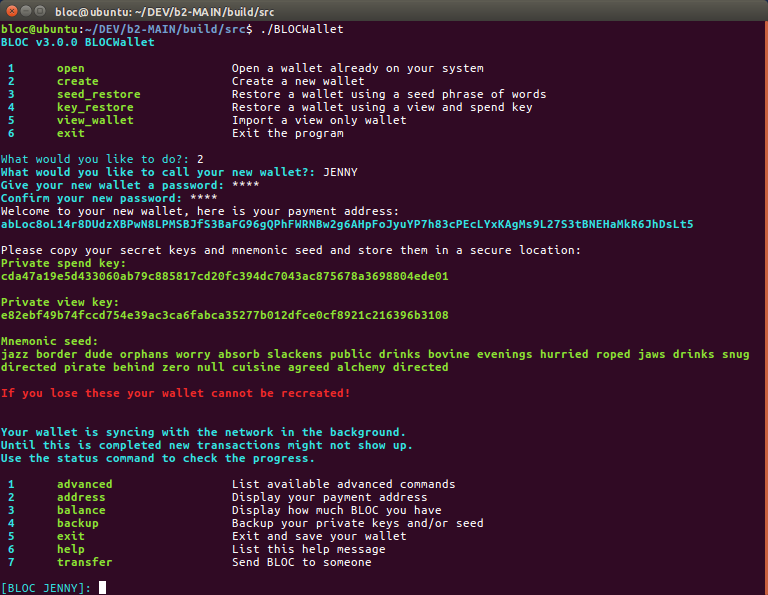

# **What is BLOCWallet**

The **CLI Wallet**, called **BLOCWallet**, is a multi-platform program (Win/Linux/Mac) that requires you to enter commands for it to work and you cannot use your mouse. It is text only application that does not have a graphical interface.

However, it is currently the **most stable** and **gets the newest updates first**.

## Screenshot



## **Source code**

* Download [BLOC Source Code](https://github.com/furiousteam/BLOC.git) from GitHub

## **Downloading**

* Binary distributions can be found: [GitHub](https://github.com/furiousteam/BLOC/releases/latest).
* Also available on our [Website](https://bloc.money/download).
* Select the appropriate file for the target platform (Windows, Mac, Linux).
* Binaries are provided in `.zip` format, while source code is provided in `.zip` and `.tar.gz` format.

## **Installing**

### Installing on Windows

Extract the *.zip* file (`BLOC-...-windows.zip`).

### Installing on Mac

Extract the *.zip* file:

```bash
unzip BLOC-...-mac.zip
```

### Installing on Linux

Extract the *.zip* file:

```bash
unzip BLOC-...-linux.zip
```

## **Synchronizing the Blockchain**

Here's a quick image of `BLOCd MAIN NET` in action:


Here's a quick image of `BLOCd TEST NET` in action:


Running `BLOCd` will start the *BLOCd* network daemon, which will connect to the network and begin downloading and verifying the BLOC blockchain.  

Because the blockchain is constantly growing, the file size always increases (the blockchain is currently over 2 GB), and *BLOCd must verify every block*, which is both CPU and disk intensive. An SSD with at least this much free disk space is recommended, unless you plan to use [remote nodes](../Using-remote-nodes). 

## **Using Checkpoints**

You can sync a fresh chain from block 0 much quicker by using checkpoints. Follow [this guide](../Using-checkpoints-for-BLOCd.md) to learn more.

### Windows

Run the `BLOCd.exe` executable extracted from the Windows binary zip:

### Mac / Linux

Run the `BLOCd` binary extracted from the `.zip` download:

```bash
./BLOCd
```

## **Using BLOCWallet**

With `BLOCd` still running in the background or another terminal/shell/command prompt, open BLOCWallet:

### Windows

Run the `BLOCWallet.exe` executable from the extracted folder.

### Mac / Linux

```bash
./BLOCWallet
```