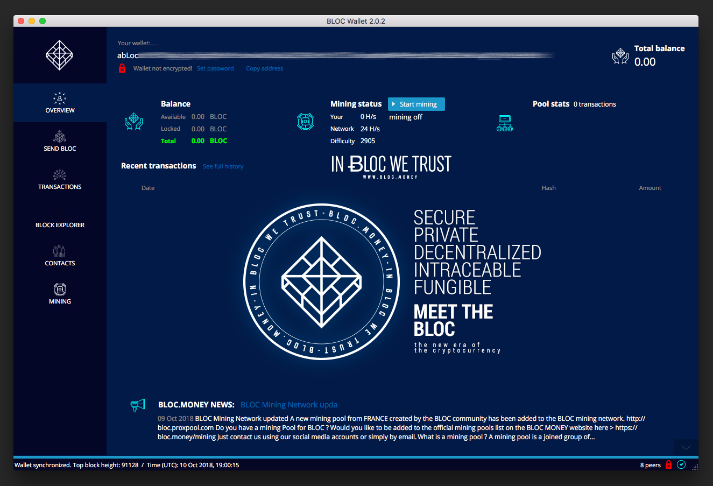

# Setting up a GUI Wallet

## BLOC Electron Wallet

We are working on a new GUI Wallet compatible with the new BLOC v3.0. It will be available soon.

Setup guide is coming soon [here](#)

## BLOC Wallet Client 2.0.2

The previous version of BLOC Wallet for desktop computer available for Windows, Mac and Linux.
**This version is no more compatible since the BLOC 3.0**

If you would like to use **BLOC Wallet v2.0.2**, you can check out [this guide](../BLOC-GUI-Desktop-Wallet-V2).

### Screenshot

Here's a quick image of BLOC Wallet for Desktop 2.0.2 in action

