# **Using BLOCWallet Cli**

The **CLI Wallet**, called **BLOCWallet**, is a multi-platform program (Win/Linux/Mac) that requires you to enter commands for it to work and you cannot use your mouse. It is text only application that does not have a graphical interface.

However, it is currently the **most stable** and **gets the newest updates first**.

Here's a quick image of [BLOCWallet](https://bloc.money/download)


## **Downloading**

* Binary distributions can be found: [GitHub](https://github.com/furiousteam/BLOC/releases/latest).
* Also available on our [Website](https://bloc.money/download).
* Select the appropriate file for the target platform (Windows, Mac, Linux).
* Binaries are provided in `.zip` format, while source code is provided in `.zip` and `.tar.gz` format.

## **Installing**

### Installing on Windows

Extract the *.zip* file (`BLOC-...-windows.zip`).

### Installing on Mac

Extract the *.zip* file:

```bash
unzip BLOC-...-mac.zip
```

### Installing on Linux

Extract the *.zip* file:

```bash
unzip BLOC-...-linux.zip
```

## **Synchronizing the Blockchain**

Here's a quick image of `BLOCd MAIN NET` in action:


Here's a quick image of `BLOCd TEST NET` in action:


Running `BLOCd` will start the *BLOCd* network daemon, which will connect to the network and begin downloading and verifying the BLOC blockchain.  

Because the blockchain is constantly growing, the file size always increases (the blockchain is currently over 2 GB), and *BLOCd must verify every block*, which is both CPU and disk intensive. An SSD with at least this much free disk space is recommended, unless you plan to use [remote nodes](../Using-remote-nodes). 

## **Using Checkpoints**

You can sync a fresh chain from block 0 much quicker by using checkpoints. Follow [this guide](../Using-checkpoints-for-BLOCd.md) to learn more.

### Windows

Run the `BLOCd.exe` executable extracted from the Windows binary zip:

### Mac / Linux

Run the `BLOCd` binary extracted from the `.zip` download:

```bash
./BLOCd
```

## **Using BLOCWallet**

With `BLOCd` still running in the background or another terminal/shell/command prompt, open BLOCWallet:

### Windows

Run the `BLOCWallet.exe` executable from the extracted folder.

### Mac / Linux

```bash
./BLOCWallet
```

## **Using BLOCWallet commands**

**BLOCWallet has a twin command system**; a *numerical shortcut* for navigating the menu, and *typed commands* you can access directly. The more you use BLOCWallet the more typed commands you'll pick up. This guide is written using the written commnand system. Feel free to use the numbers associated with the command.

## **Create** a Wallet

Create your personnal BLOC Wallet address with Private spend key, Private view key and Mnemonic seed. Everything you need to control your money.
Make sure you save this data because if you lose these keys your wallet cannot be recreated!

Here's a quick image of BLOCWallet in action after have successfully `created a wallet`:


To create a wallet, type `create` `2` or and press `enter`:

```
What would you like to do?: 2
What would you like to call your new wallet?: JENNY
Give your new wallet a password: ****
Confirm your new password: ****
Welcome to your new wallet, here is your payment address:
abLoc8oL14r8DUdzXBPwN8LPMSBJfS3BaFG96gQPhFWRNBw2g6AHpFoJyuYP7h83cPEcLYxKAgMs9L27S3tBNEHaMkR6JhDsLt5

Please copy your secret keys and mnemonic seed and store them in a secure location: 
Private spend key:
cda47a19e5d433060ab79c885817cd20fc394dc7043ac875678a3698804ede01

Private view key:
e82ebf49b74fccd754e39ac3ca6fabca35277b012dfce0cf8921c216396b3108

Mnemonic seed:
jazz border dude orphans worry absorb slackens public drinks bovine evenings hurried roped jaws drinks snug directed pirate behind zero null cuisine agreed alchemy directed

If you lose these your wallet cannot be recreated!


Your wallet is syncing with the network in the background.
Until this is completed new transactions might not show up.
Use the status command to check the progress.

 1	advanced                 List available advanced commands
 2	address                  Display your payment address
 3	balance                  Display how much BLOC you have
 4	backup                   Backup your private keys and/or seed
 5	exit                     Exit and save your wallet
 6	help                     List this help message
 7	transfer                 Send BLOC to someone

[BLOC JENNY]: 

```
## **open** a Wallet

Open an existing wallet file **created by BLOCWallet v3.0**. BLOCWallet v3.0 also supports the following :

* .wallet file created by the [BLOC Desktop Wallet & Mining Client v2](../Using-BLOCWallet#bloc-desktop-2.0.2)
* .wallet file created by the previous BLOC Simple Wallet v2
* Place the .wallet file near BLOCWallet and open it.

Here's a quick image of BLOCWallet in action after have successfully `open a wallet`:

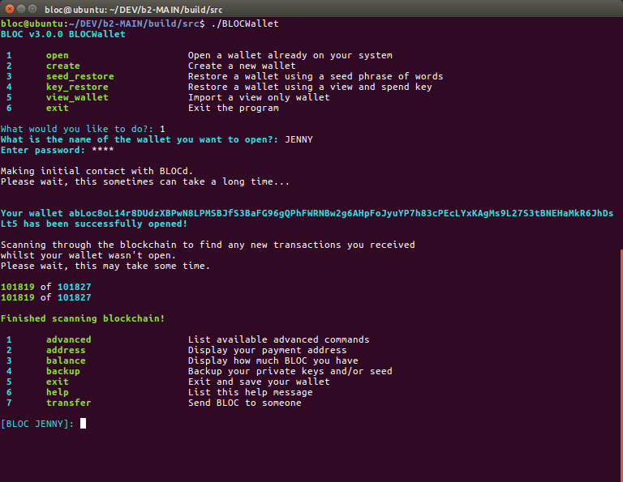

To open an existing wallet; type `open` or `1` and press `enter`:

```
 1	open                     Open a wallet already on your system
 2	create                   Create a new wallet
 3	seed_restore             Restore a wallet using a seed phrase of words
 4	key_restore              Restore a wallet using a view and spend key
 5	view_wallet              Import a view only wallet
 6	exit                     Exit the program

What would you like to do?: 1
What is the name of the wallet you want to open?: JENNY
Enter password: ****

Making initial contact with BLOCd.
Please wait, this sometimes can take a long time...


Your wallet abLoc8oL14r8DUdzXBPwN8LPMSBJfS3BaFG96gQPhFWRNBw2g6AHpFoJyuYP7h83cPEcLYxKAgMs9L27S3tBNEHaMkR6JhDsLt5 has been successfully opened!

Scanning through the blockchain to find any new transactions you received
whilst your wallet wasn't open.
Please wait, this may take some time.

101819 of 101827
101819 of 101827

Finished scanning blockchain!

 1	advanced                 List available advanced commands
 2	address                  Display your payment address
 3	balance                  Display how much BLOC you have
 4	backup                   Backup your private keys and/or seed
 5	exit                     Exit and save your wallet
 6	help                     List this help message
 7	transfer                 Send BLOC to someone

[BLOC JENNY]: 

```
## Viewing Wallet **address**

Display the BLOC address used by this wallet.

* MAIN NET BLOC address start with `abLoc`
* TEST NET BLOC address start with `TbLoc`

Here's a quick image of BLOCWallet in action after have successfully typed `address`:


To view a wallet's public address; at the menu, type `address` or `2` and press `enter`.

```
[BLOC JENNY]: address
abLoc8oL14r8DUdzXBPwN8LPMSBJfS3BaFG96gQPhFWRNBw2g6AHpFoJyuYP7h83cPEcLYxKAgMs9L27S3tBNEHaMkR6JhDsLt5
[BLOC JENNY]: 
```

## **backup** your wallet private keys

Each BLOC wallet is essentially, just a pair of keys (*View Key* and *Spend Key*) from which the public address is derived.
It is **very** important to export these keys and back them up somewhere that is safe and secure (meaning somewhere reliable/permanent that no one else can access).

In the event of a lost or corrupted wallet file, computer crash, etc., the *View Key* and *Spend Key* are the only way to restore a wallet and recover the funds it holds.

Here's a quick image of BLOCWallet in action after using the `backup` command:

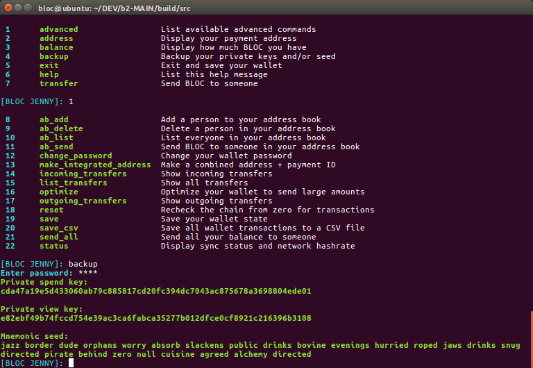

**DO NOT SHARE IT WITH ANYONE**. **Anyone who has these can *access your funds* and has *complete control* over your wallet.**

To print your keys; at the menu type `backup` or `4`and press `enter`.
The *View Key* , *Spend Key* and *Mnemonic Seed*  will appear. Copy them and store them `safely and securely`.

```
[BLOC JENNY]: backup
Enter password: ****
Private spend key:
cda47a19e5d433060ab79c885817cd20fc394dc7043ac875678a3698804ede01

Private view key:
e82ebf49b74fccd754e39ac3ca6fabca35277b012dfce0cf8921c216396b3108

Mnemonic seed:
jazz border dude orphans worry absorb slackens public drinks bovine evenings hurried roped jaws drinks snug directed pirate behind zero null cuisine agreed alchemy directed
[BLOC JENNY]: 

```

### 25 Word Mnemonic Seed phrase not showing ?!

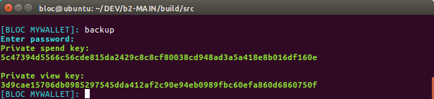

* You may wonder why you do not see the new 25 Word Mnemonic Seed phrase while typing `backup` your wallet ?
* The 25 Word Mnemonic Seed phrase was implemented after you created this wallet. This is why you do not see the 25 Word Mnemonic seed.
* You will need to create a new wallet to be able to use the 25 Word Mnemonic seed and send your BLOC to your new wallet

## Viewing Wallet **balance**

* Available balance is the funds that are available for transactions.
* Locked amount shows the funds that are not yet available (unconfirmed transactions, the coins you've mined, time-locked transaction)
* Total

Here's a quick image of BLOCWallet in action after using the `balance` command:

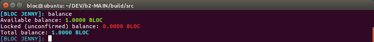

To view your wallet's balance; at the menu, type `balance` or `3` and press `enter`:

```
[BLOC JENNY]: balance
Available balance: 1.0000 BLOC
Locked (unconfirmed) balance: 0.0000 BLOC
Total balance: 1.0000 BLOC
[BLOC JENNY]:
```

##  **transfer** BLOC to someone<a name="tx-bloc"></a>

Send funds from your wallet to your friends, family or for business.

Here's a quick image of BLOCWallet in action after using the `transfer` command:

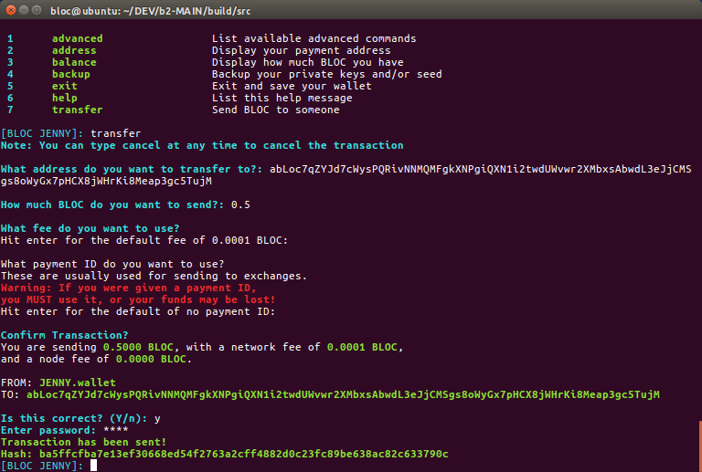

To send BLOC at the BLOCWallet menu:

- Type: `transfer` or `7` and press `enter`
- Type/paste the address you want to send the BLOC to and press `enter`
- Type the amount of BLOC you want to send (like `0.5`) and press `enter`
- Press `enter` to use the default fee of 0.0001 BLOC (or set it higher if you're sending a large amount of BLOC)
- Enter the payment ID if the recipient has provided one. Check the [payment ID section](#tx-bloc-p-id) if you're not sure when/how to use it
- If you make a mistake or need to stop the transaction, type `cancel` at any time
- Confirm that the details are correct and enter `y`. If something is amiss, enter `n` and follow the steps again
- Enter your password

Depending on the amount you transfer, you may need to wait a while for confirmation.  If you have had too many small incoming transactions, or the amount you wish to send is too large; either break up your transfer into several smaller amounts, or optimise your wallet.

## **optimize** your Wallet

* Optimizing your wallet consists to create Fusion transactions.
* Fusion transactions take all your (small) incoming payments and combine them into bigger ones, allowing you to send huge sums at once! It is strongly recommended to optimize your wallet, specially if you are mining BLOC and receiving a lot of small transactions.

Here's a quick image of BLOCWallet in action after using the `optimize` command:

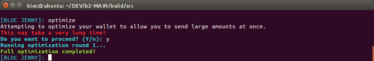

To optimize your wallet, type `optimize` and press `enter`:
```
[BLOC JENNY]: optimize
Attempting to optimize your wallet to allow you to send large amounts at once. 
This may take a very long time!
Do you want to proceed? (Y/n): y
Running optimization round 1...
Full optimization completed!
[BLOC JENNY]: 
```

When it is completed, it will print out a green message `Full optimization completed!`

## **Payment ID**<a name="tx-bloc-p-id"></a>

Because transactions on the BLOC blockchain are privatized, in some situations a payment ID is necessary for the recipient to be able to determine where the payment came from, for instance when depositing to an exchange or other service.

**You need it if you're sending BLOC to an exchange**

Here's a quick image of BLOCWallet in action after using the payment id option while sending a transaction:

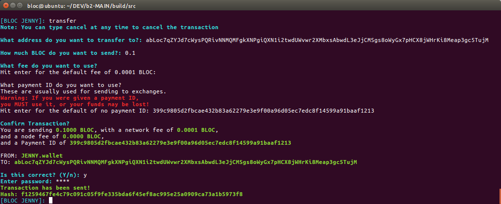

To send a transaction with a payment ID, enter it when prompted to.

Note that typically, the service/recipient will generate and provide the required payment ID.
```
[BLOC JENNY]: transfer
Note: You can type cancel at any time to cancel the transaction

What address do you want to transfer to?: abLoc7qZYJd7cWysPQRivNNMQMFgkXNPgiQXN1i2twdUWvwr2XMbxsAbwdL3eJjCMSgs8oWyGx7pHCX8jWHrKi8Meap3gc5TujM

How much BLOC do you want to send?: 0.1

What fee do you want to use?
Hit enter for the default fee of 0.0001 BLOC: 

What payment ID do you want to use?
These are usually used for sending to exchanges.
Warning: If you were given a payment ID,
you MUST use it, or your funds may be lost!
Hit enter for the default of no payment ID: 399c9805d2fbcae432b83a62279e3e9f00a96d05ec7edc8f14599a91baaf1213

Confirm Transaction?
You are sending 0.1000 BLOC, with a network fee of 0.0001 BLOC,
and a node fee of 0.0000 BLOC, 
and a Payment ID of 399c9805d2fbcae432b83a62279e3e9f00a96d05ec7edc8f14599a91baaf1213

FROM: JENNY.wallet
TO: abLoc7qZYJd7cWysPQRivNNMQMFgkXNPgiQXN1i2twdUWvwr2XMbxsAbwdL3eJjCMSgs8oWyGx7pHCX8jWHrKi8Meap3gc5TujM

Is this correct? (Y/n): y
Enter password: ****
Transaction has been sent!
Hash: f1259467fe4c79c091c05f9fe335bda6f45ef8ac995e25a0909ca73a1b5973f8
[BLOC JENNY]: 
```

## **exit** the Wallet

Wallets loaded into the *BLOCWallet* client must be synced with the blockchain in order to properly calculate balance, view transaction history, etc.

It is important to properly save the wallet data before exiting *BLOCWallet* so that the synchronized data is not lost.

Here's a quick image of BLOCWallet in action after using the `exit` option while closing BLOCWallet :

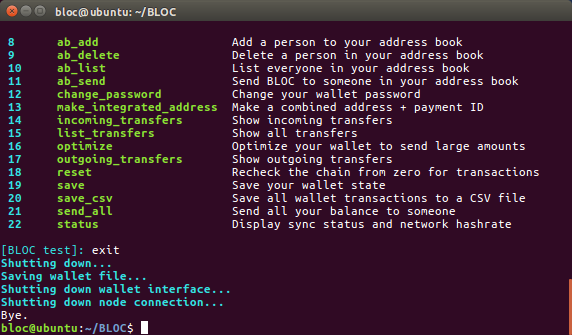

To save a wallet's data and exit; at the menu, type `exit` or `5` and press `enter`:

```
[BLOC JENNY]: exit
Shutting down...
Saving wallet file...
Shutting down wallet interface...
Shutting down node connection...
Bye.
```

## **Recovering your Wallet**

* Recovering your wallet on BLOC is easy and fast
* Recover all your incoming/outgoing transactions
* Restore your address book
* Even if you deleted your wallet file

### With Private Spend and View Keys<a name="recover-spend-view-keys"></a>

That method use the Private Spend key and the Private View key to restore you wallet. You must be in possession of this key if you created a BLOC Wallet.

Here's a quick image of BLOCWallet in action after using the `key_restore` command while restoring a wallet:

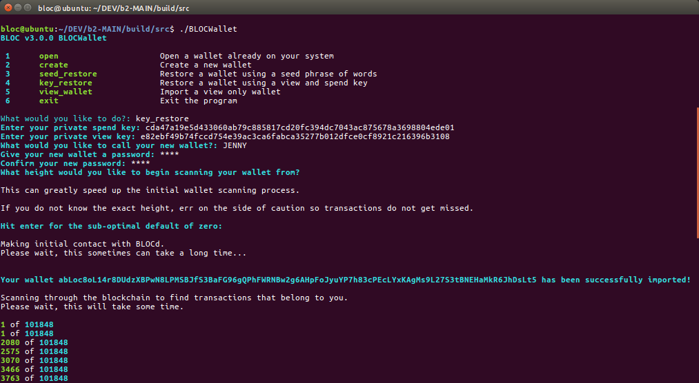

To restore a wallet using spend and view keys; at the menu type `key_restore` or `4` and press `enter`:

```
 1	open                     Open a wallet already on your system
 2	create                   Create a new wallet
 3	seed_restore             Restore a wallet using a seed phrase of words
 4	key_restore              Restore a wallet using a view and spend key
 5	view_wallet              Import a view only wallet
 6	exit                     Exit the program

What would you like to do?: key_restore
Enter your private spend key: cda47a19e5d433060ab79c885817cd20fc394dc7043ac875678a3698804ede01
Enter your private view key: e82ebf49b74fccd754e39ac3ca6fabca35277b012dfce0cf8921c216396b3108
What would you like to call your new wallet?: JENNY
Give your new wallet a password: ****
Confirm your new password: ****
What height would you like to begin scanning your wallet from?

This can greatly speed up the initial wallet scanning process.

If you do not know the exact height, err on the side of caution so transactions do not get missed.

Hit enter for the sub-optimal default of zero: 

Making initial contact with BLOCd.
Please wait, this sometimes can take a long time...

Your wallet abLoc8oL14r8DUdzXBPwN8LPMSBJfS3BaFG96gQPhFWRNBw2g6AHpFoJyuYP7h83cPEcLYxKAgMs9L27S3tBNEHaMkR6JhDsLt5 has been successfully imported!

Scanning through the blockchain to find transactions that belong to you.
Please wait, this will take some time.

1 of 101848
1 of 101848
....
101377 of 101850
101575 of 101850
101773 of 101850

New transaction found!

Incoming transfer:
Hash: c4e2d9b972a2e70a209428fe5e6b367b632a3407f0d1486949ed8da75642cf10
Block height: 101833
Timestamp: 2018-10-25 14:29
Amount: 1.0000 BLOC

Finished scanning blockchain!

 1	advanced                 List available advanced commands
 2	address                  Display your payment address
 3	balance                  Display how much BLOC you have
 4	backup                   Backup your private keys and/or seed
 5	exit                     Exit and save your wallet
 6	help                     List this help message
 7	transfer                 Send BLOC to someone

[BLOC JENNY]: 

```

### With mnemonic phrase (25 words)<a name="recover-seed"></a>

* The 25 Word Mnemonic Seed phrase was implemented early november 2018
* You will need to create a new wallet to be able to use the 25 Word Mnemonic seed and send your BLOC to your new wallet if you want to use the mnemonic phrase feature.

Here's a quick image of BLOCWallet in action after using the `seed_restore` command while restoring a wallet:

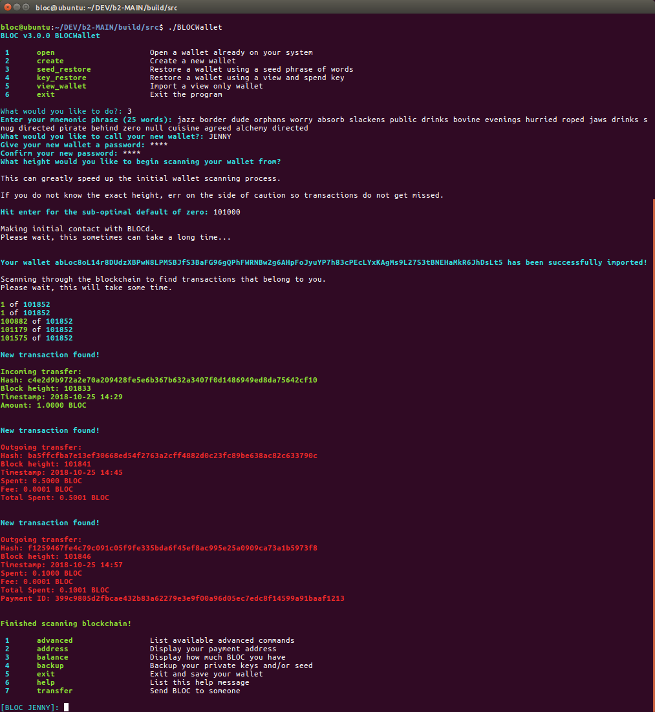

To restore a wallet using spend and view keys; at the menu type `seed_restore` or `3` and press `enter`:

```
 1	open                     Open a wallet already on your system
 2	create                   Create a new wallet
 3	seed_restore             Restore a wallet using a seed phrase of words
 4	key_restore              Restore a wallet using a view and spend key
 5	view_wallet              Import a view only wallet
 6	exit                     Exit the program

What would you like to do?: 3
Enter your mnemonic phrase (25 words): jazz border dude orphans worry absorb slackens public drinks bovine evenings hurried roped jaws drinks snug directed pirate behind zero null cuisine agreed alchemy directed
What would you like to call your new wallet?: JENNY
Give your new wallet a password: ****
Confirm your new password: ****
What height would you like to begin scanning your wallet from?

This can greatly speed up the initial wallet scanning process.

If you do not know the exact height, err on the side of caution so transactions do not get missed.

Hit enter for the sub-optimal default of zero: 101000

Making initial contact with BLOCd.
Please wait, this sometimes can take a long time...


Your wallet abLoc8oL14r8DUdzXBPwN8LPMSBJfS3BaFG96gQPhFWRNBw2g6AHpFoJyuYP7h83cPEcLYxKAgMs9L27S3tBNEHaMkR6JhDsLt5 has been successfully imported!

Scanning through the blockchain to find transactions that belong to you.
Please wait, this will take some time.

1 of 101852
1 of 101852
100882 of 101852
101179 of 101852
101575 of 101852

New transaction found!

Incoming transfer:
Hash: c4e2d9b972a2e70a209428fe5e6b367b632a3407f0d1486949ed8da75642cf10
Block height: 101833
Timestamp: 2018-10-25 14:29
Amount: 1.0000 BLOC

Finished scanning blockchain!

 1	advanced                 List available advanced commands
 2	address                  Display your payment address
 3	balance                  Display how much BLOC you have
 4	backup                   Backup your private keys and/or seed
 5	exit                     Exit and save your wallet
 6	help                     List this help message
 7	transfer                 Send BLOC to someone

[BLOC JENNY]: 

```

## **Open a old wallet file BLOC Wallet v2.0.2** <a name="bloc-desktop-2.0.2"></a>

BLOCWallet is capable to restore and open the wallet file from the previous version of the [BLOC Wallet Desktop v2.0.2](../BLOC-GUI-Desktop-Wallet-V2)

* Follow the standard procedure explained on this page and launch the new BLOCWallet v3.0 Client

* Copy/Paste the wallet file near the BLOCWallet:

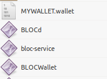

* Open BLOCWallet

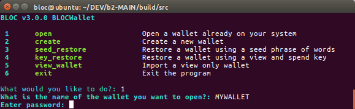

* Select Option: 1 (Open)
* Enter the name of your wallet file without the extension. Here: MYWALLET
* Enter the password

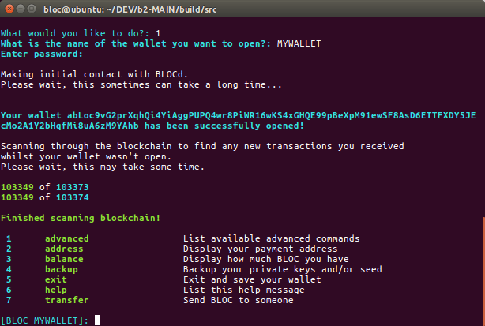

* Your wallet has been successfully synchronised.
* You can trype `balance` to check the balance of your wallet


### 25 Word Mnemonic Seed phrase not showing ?!


* You may wonder why you do not see the new 25 Word Mnemonic Seed phrase while typing `backup` your wallet ?
* The 25 Word Mnemonic Seed phrase was implemented after you created this wallet. This is why you do not see the 25 Word Mnemonic seed.
* You will need to create a new wallet to be able to use the 25 Word Mnemonic seed and send your BLOC to your new wallet

## **advanced** options

Display the advanced menu of the BLOCWallet to access more features.

Here's a quick image of BLOCWallet in action after have successfully typed `advanced`:


To display the advanced options; at the menu, type `advanced` or `1` and press `enter`.

```
 1	advanced                 List available advanced commands
 2	address                  Display your payment address
 3	balance                  Display how much BLOC you have
 4	backup                   Backup your private keys and/or seed
 5	exit                     Exit and save your wallet
 6	help                     List this help message
 7	transfer                 Send BLOC to someone

[BLOC test]: 1

 8	ab_add                   Add a person to your address book
 9	ab_delete                Delete a person in your address book
 10	ab_list                  List everyone in your address book
 11	ab_send                  Send BLOC to someone in your address book
 12	change_password          Change your wallet password
 13	make_integrated_address  Make a combined address + payment ID
 14	incoming_transfers       Show incoming transfers
 15	list_transfers           Show all transfers
 16	optimize                 Optimize your wallet to send large amounts
 17	outgoing_transfers       Show outgoing transfers
 18	reset                    Recheck the chain from zero for transactions
 19	save                     Save your wallet state
 20	save_csv                 Save all wallet transactions to a CSV file
 21	send_all                 Send all your balance to someone
 22	status                   Display sync status and network hashrate

```

## **ab_add** a person to your address book

Never forget anymore the BLOC payement addresses of your friends, family member or business partners. You can add a person into your BLOCWallet address book.

Your address book will be restored when you restore your wallet. Even if you deleted your wallet file.

Here's a quick image of BLOCWallet in action after have successfully typed `ab_add`:

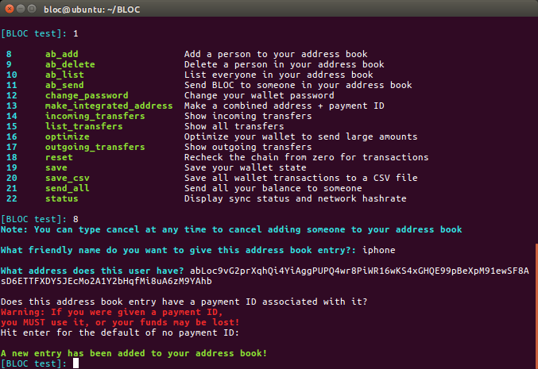

To add a person to your address book; at the menu, type `ab_add` or `8` and press `enter`.

```
[BLOC test]: 8
Note: You can type cancel at any time to cancel adding someone to your address book

What friendly name do you want to give this address book entry?: iphone

What address does this user have? abLoc9vG2prXqhQi4YiAggPUPQ4wr8PiWR16wKS4xGHQE99pBeXpM91ewSF8AsD6ETTFXDY5JEcMo2A1Y2bHqfMi8uA6zM9YAhb

Does this address book entry have a payment ID associated with it?
Warning: If you were given a payment ID,
you MUST use it, or your funds may be lost!
Hit enter for the default of no payment ID: 

A new entry has been added to your address book!
```

## **ab_delete** a person from your address book

Use this option to delete a person from your BLOCWallet address book.

Here's a quick image of BLOCWallet in action after have successfully typed `ab_delete`:

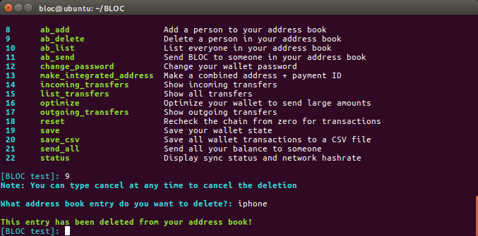

To delete a person from your address book; at the menu, type `ab_delete` or `9` and press `enter`.

```
[BLOC test]: 9
Note: You can type cancel at any time to cancel the deletion

What address book entry do you want to delete?: iphone

This entry has been deleted from your address book!
```

## **ab_list** contacts in your address book

Use this option to display all your contacts present into your BLOCWallet address book.

Here's a quick image of BLOCWallet in action after have successfully typed `ab_list`:

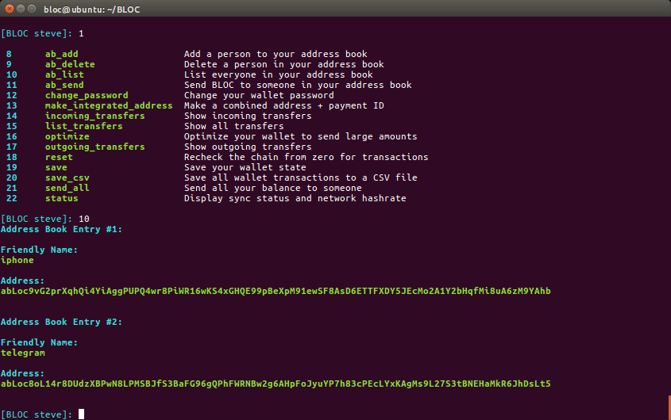

To delete a person from your address book; at the menu, type `ab_list` or `10` and press `enter`.

```
[BLOC test]: 10
Address Book Entry #1:

Friendly Name: 
iphone

Address: 
abLoc9vG2prXqhQi4YiAggPUPQ4wr8PiWR16wKS4xGHQE99pBeXpM91ewSF8AsD6ETTFXDY5JEcMo2A1Y2bHqfMi8uA6zM9YAhb


Address Book Entry #2:

Friendly Name: 
telegram

Address: 
abLoc8oL14r8DUdzXBPwN8LPMSBJfS3BaFG96gQPhFWRNBw2g6AHpFoJyuYP7h83cPEcLYxKAgMs9L27S3tBNEHaMkR6JhDsLt5
```

## **ab_send** BLOC to someone in your contacts list

Send BLOC to someone present in your BLOCWallet address book.

Here's a quick image of BLOCWallet in action after have successfully typed `ab_send`:

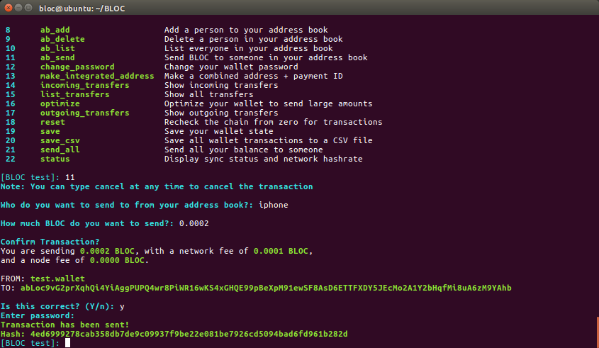

To send BLOC to a person from your address book; at the menu, type `ab_send` or `11` and press `enter`.

```
[BLOC test]: 11
Note: You can type cancel at any time to cancel the transaction

Who do you want to send to from your address book?: iphone

How much BLOC do you want to send?: 0.0002

Confirm Transaction?
You are sending 0.0002 BLOC, with a network fee of 0.0001 BLOC,
and a node fee of 0.0000 BLOC.

FROM: test.wallet
TO: abLoc9vG2prXqhQi4YiAggPUPQ4wr8PiWR16wKS4xGHQE99pBeXpM91ewSF8AsD6ETTFXDY5JEcMo2A1Y2bHqfMi8uA6zM9YAhb

Is this correct? (Y/n): y
Enter password: 
Transaction has been sent!
Hash: 4ed6999278cab358db7de9c09937f9be22e081be7926cd5094bad6fd961b282d
```

## **change_password** of your wallet

Change the password of your wallet. This is the main password. The one you are using the open your wallet and confirm transactions.

Here's a quick image of BLOCWallet in action after have successfully typed `change_password`:

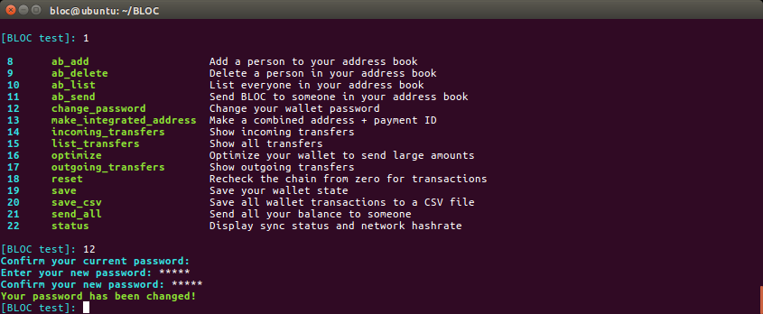

To change your password; at the menu, type `change_password` or `12` and press `enter`.

```
[BLOC test]: 12
Confirm your current password: 
Enter your new password: *****
Confirm your new password: *****
Your password has been changed!
```

## **make_integrated_address** from your wallet

Integrated address is just your normal address with some extra data bundled with it (the 64-bit payment ID). To make it easier for other people to send you funds with a payment ID that you require, you can generate an integrated address to send to them which contains both your public address and the payment ID you request them to use. Read more about the [Integrated Address](../guides/Glossary.md#integrated-address)

Before you generate your integrated address you need to copy your BLOC address that will be used to bundle the payment ID.
You also need to generate a payment id of your choice of you can use [Payement ID](../guides/Glossary.md#payment-id)

Here's a quick image of BLOCWallet in action after have successfully typed `make_integrated_address`:

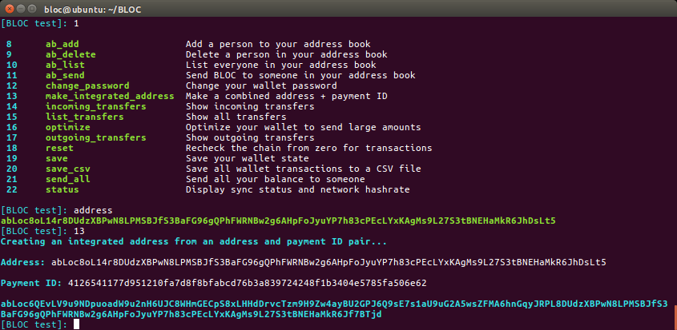

To generate a integrated address; at the menu, type `make_integrated_address` or `13` and press `enter`.

```
[BLOC test]: address
abLoc8oL14r8DUdzXBPwN8LPMSBJfS3BaFG96gQPhFWRNBw2g6AHpFoJyuYP7h83cPEcLYxKAgMs9L27S3tBNEHaMkR6JhDsLt5
[BLOC test]: 13
Creating an integrated address from an address and payment ID pair...

Address: abLoc8oL14r8DUdzXBPwN8LPMSBJfS3BaFG96gQPhFWRNBw2g6AHpFoJyuYP7h83cPEcLYxKAgMs9L27S3tBNEHaMkR6JhDsLt5

Payment ID: 4126541177d951210fa7d8f8bfabcd76b3a839724248f1b3404e5785fa506e62

abLoc6QEvLV9u9NDpuoadW9u2nH6UJC8WHmGECpS8xLHHdDrvcTzm9H9Zw4ayBU2GPJ6Q9sE7s1aU9uG2A5wsZFMA6hnGqyJRPL8DUdzXBPwN8LPMSBJfS3BaFG96gQPhFWRNBw2g6AHpFoJyuYP7h83cPEcLYxKAgMs9L27S3tBNEHaMkR6Jf7BTjd
```
You can now provide your newly generated integrated address to your friends, family or business partner.


## **list_transfers** from/to your wallet

Every single transactions sent/from using your wallet is saved. You can list and view all your incoming and outgoing transactions.

Here's a quick image of BLOCWallet in action after have successfully typed `list_transfers`:


To view the list of incoming and outgoing transfers; at the menu, type `list_transfers` or `15` and press `enter`.

```
[BLOC test]: 15
Incoming transfer:
Hash: c4e2d9b972a2e70a209428fe5e6b367b632a3407f0d1486949ed8da75642cf10
Block height: 101833
Timestamp: 2018-10-25 23:29
Amount: 1.0000 BLOC

Outgoing transfer:
Hash: ba5ffcfba7e13ef30668ed54f2763a2cff4882d0c23fc89be638ac82c633790c
Block height: 101841
Timestamp: 2018-10-25 23:45
Spent: 0.5000 BLOC
Fee: 0.0001 BLOC
Total Spent: 0.5001 BLOC

Outgoing transfer:
Hash: f1259467fe4c79c091c05f9fe335bda6f45ef8ac995e25a0909ca73a1b5973f8
Block height: 101846
Timestamp: 2018-10-25 23:57
Spent: 0.1000 BLOC
Fee: 0.0001 BLOC
Total Spent: 0.1001 BLOC
Payment ID: 399c9805d2fbcae432b83a62279e3e9f00a96d05ec7edc8f14599a91baaf1213

Outgoing transfer:
Hash: 4ed6999278cab358db7de9c09937f9be22e081be7926cd5094bad6fd961b282d
Block height: 106530
Timestamp: 2018-11-01 13:24
Spent: 0.0002 BLOC
Fee: 0.0001 BLOC
Total Spent: 0.0003 BLOC

Total received: 1.0000 BLOC
Total spent: 0.6005 BLOC
```

## **outgoing_transfers** from your wallet

Every single transactions sent/from using your wallet is saved. You can list and view all your only your outgoing transactions with this function.

Here's a quick image of BLOCWallet in action after have successfully typed `outgoing_transfers`:

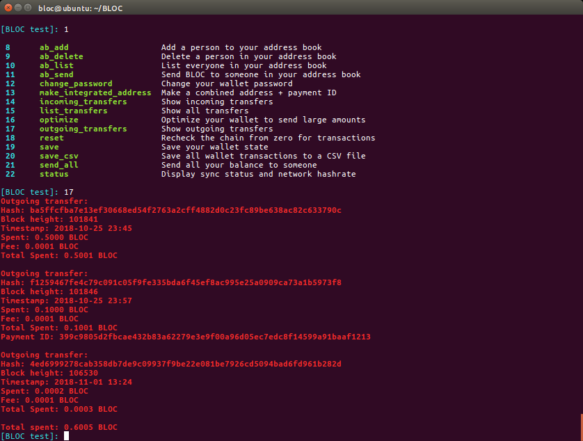

To view the list of outgoing transfers only; at the menu, type `outgoing_transfers` or `17` and press `enter`.

```
17
Outgoing transfer:
Hash: ba5ffcfba7e13ef30668ed54f2763a2cff4882d0c23fc89be638ac82c633790c
Block height: 101841
Timestamp: 2018-10-25 23:45
Spent: 0.5000 BLOC
Fee: 0.0001 BLOC
Total Spent: 0.5001 BLOC

Outgoing transfer:
Hash: f1259467fe4c79c091c05f9fe335bda6f45ef8ac995e25a0909ca73a1b5973f8
Block height: 101846
Timestamp: 2018-10-25 23:57
Spent: 0.1000 BLOC
Fee: 0.0001 BLOC
Total Spent: 0.1001 BLOC
Payment ID: 399c9805d2fbcae432b83a62279e3e9f00a96d05ec7edc8f14599a91baaf1213

Outgoing transfer:
Hash: 4ed6999278cab358db7de9c09937f9be22e081be7926cd5094bad6fd961b282d
Block height: 106530
Timestamp: 2018-11-01 13:24
Spent: 0.0002 BLOC
Fee: 0.0001 BLOC
Total Spent: 0.0003 BLOC

Total spent: 0.6005 BLOC
```

## **save** your wallet

Save your wallet at this current state.

Here's a quick image of BLOCWallet in action after have successfully typed `save`:

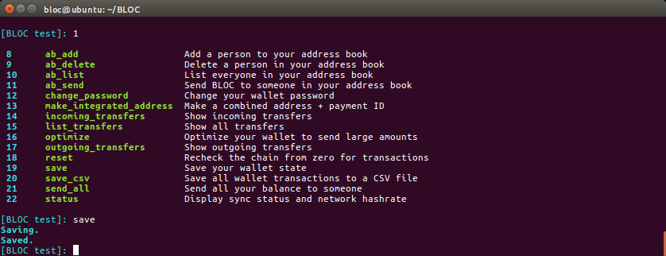

To save your wallet; at the menu, type `save` or `19` and press `enter`.

```
[BLOC test]: save
Saving.
Saved.
```

## **save_csv** export your wallet transactions

Use this features to export all your incoming and outgoing transfers from/to your wallet into a .csv format.
Doing accounting with BLOC has never been so easy.

Here's a quick image of BLOCWallet in action after have successfully typed `save_csv`:

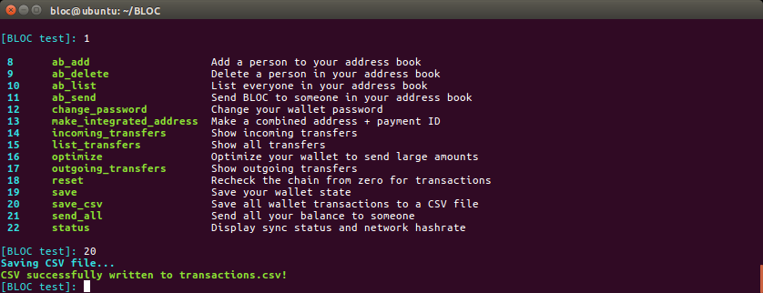

To export the transactions into a .csv format; at the menu, type `save_csv` or `20` and press `enter`.

```
[BLOC test]: 20
Saving CSV file...
CSV successfully written to transactions.csv!
```
Example of the .csv file exported:

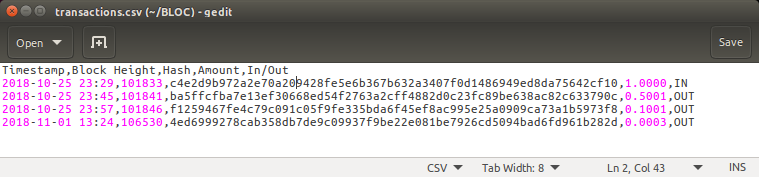


## **status** of your wallet

Display the current status of your wallet. Such as the blockchain height and synchronisation state including the network hashrate speed and peers.

Here's a quick image of BLOCWallet in action after have successfully typed `status`:

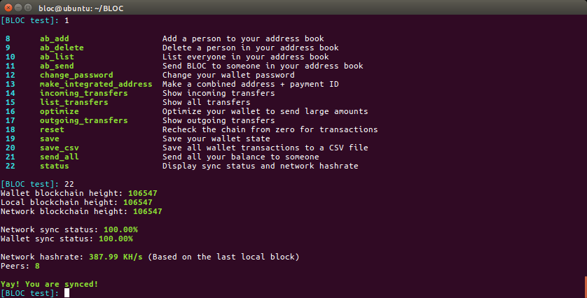

To view the status of your wallet; at the menu, type `status` or `22` and press `enter`.

```
[BLOC test]: 22
Wallet blockchain height: 106547
Local blockchain height: 106547
Network blockchain height: 106547

Network sync status: 100.00%
Wallet sync status: 100.00%

Network hashrate: 387.99 KH/s (Based on the last local block)
Peers: 8

Yay! You are synced!
```

## **send_all** your balance to someone

Use this function if you would like to send all funds available in your wallet to someone.

Here's a quick image of BLOCWallet in action after have successfully typed `send_all`:

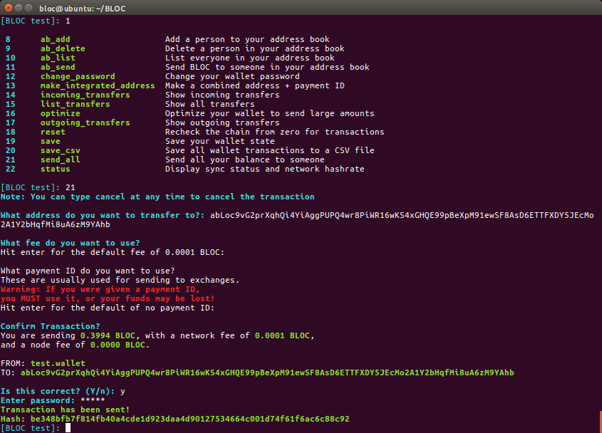

To view the status of your wallet; at the menu, type `send_all` or `21` and press `enter`.

```
[BLOC test]: 21
Note: You can type cancel at any time to cancel the transaction

What address do you want to transfer to?: abLoc9vG2prXqhQi4YiAggPUPQ4wr8PiWR16wKS4xGHQE99pBeXpM91ewSF8AsD6ETTFXDY5JEcMo2A1Y2bHqfMi8uA6zM9YAhb

What fee do you want to use?
Hit enter for the default fee of 0.0001 BLOC: 

What payment ID do you want to use?
These are usually used for sending to exchanges.
Warning: If you were given a payment ID,
you MUST use it, or your funds may be lost!
Hit enter for the default of no payment ID: 

Confirm Transaction?
You are sending 0.3994 BLOC, with a network fee of 0.0001 BLOC,
and a node fee of 0.0000 BLOC.

FROM: test.wallet
TO: abLoc9vG2prXqhQi4YiAggPUPQ4wr8PiWR16wKS4xGHQE99pBeXpM91ewSF8AsD6ETTFXDY5JEcMo2A1Y2bHqfMi8uA6zM9YAhb

Is this correct? (Y/n): y
Enter password: *****
Transaction has been sent!
Hash: be348bfb7f814fb40a4cde1d923daa4d90127534664c001d74f61f6ac6c88c92
```

## **reset** your wallet

Reset your wallet from a specified block number or from block 0. This can take some time and during the process you will not be able to send funds using your wallet.

Here's a quick image of BLOCWallet in action after have successfully typed `reset`:


To reset your wallet; at the menu, type `reset` or `18` and press `enter`.

```
[BLOC test]: reset
What height would you like to begin scanning your wallet from?

This can greatly speed up the initial wallet scanning process.

If you do not know the exact height, err on the side of caution so transactions do not get missed.

Hit enter for the sub-optimal default of zero:  

This process may take some time to complete.
You can't make any transactions during the process.

Are you sure? (Y/n): Y
Resetting wallet...
Scanning through the blockchain to find transactions that belong to you.
Please wait, this will take some time.

1 of 106547
1 of 106547
2377 of 106547
2773 of 106547
3169 of 106547
3565 of 106547
3961 of 106547
4258 of 106547
4555 of 106547
4951 of 106547
5347 of 106547
........
105832 of 106552
106030 of 106552
106327 of 106552

New transaction found!

Outgoing transfer:
Hash: 4ed6999278cab358db7de9c09937f9be22e081be7926cd5094bad6fd961b282d
Block height: 106530
Timestamp: 2018-11-01 13:24
Spent: 0.0002 BLOC
Fee: 0.0001 BLOC
Total Spent: 0.0003 BLOC


Finished scanning blockchain!
```

Reset done and wallet synchronised:


## **Help**

To see the main menu of commands; type `help` and press `enter`:

```
[BLOC JENNY]: help

 1	advanced                 List available advanced commands
 2	address                  Display your payment address
 3	balance                  Display how much BLOC you have
 4	backup                   Backup your private keys and/or seed
 5	exit                     Exit and save your wallet
 6	help                     List this help message
 7	transfer                 Send BLOC to someone

```