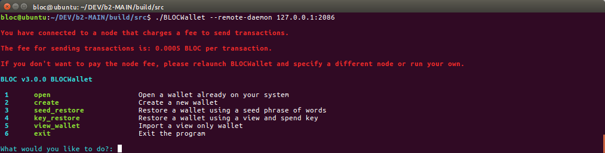

# **Using Remote Nodes**

In case you don't want to download the blockchain and verify it everytime, you can instead use a Remote Node to quickly sync the blockchain.

## **Extra Fees for Remote Nodes**

Remote nodes are run by anyone who like to support the BLOC and do an extra of passive income while hosting a BLOC public remote node on his computer or on a webserver. Remote nodes require some maintenance and updates that are managed by the node owner. Extra fees are usually required to process each transaction using this remote node. You will get the following message while connecting to a remote node using `BLOCWallet`:

```
You have connected to a node that charges a fee to send transactions.
The fee for sending transactions is: 0.0005 BLOC per transaction. 
If you don't want to pay the node fee, please relaunch BLOCWallet and specify a different node or run your own.
```
The fees are set by the node owner and can vary from one to another. These fees are different that the standard 0.0001 BLOC fee per transaction. It is added to it.

## **BLOCWallet**

1. Open up a command prompt window and navigate to the folder that contains *BLOCWallet*.
2. Use the following command to start BLOCWallet  

### Windows:

```
BLOCWallet.exe --remote-daemon host:port
```

### Mac and Linux

```
./BLOCWallet --remote-daemon host:port
```

Replace `host:port` with values from one of the public remote daemons available below.

You can now follow your normal process to access your wallet.

For example-

```
Windows:
BLOCWallet.exe --remote-daemon bloc.cool:2086

Mac and Linux:
./BLOCWallet --remote-daemon bloc.cool:2086
```

Here's a quick image of `BLOCWallet` in action while connecting to a remote node that ask for extra fees:




## **Making a Script to Do it Automatically**

1. Open NotePad/a text editor of your choice and type the following lines inside:

```text
@echo off
BLOCWallet.exe --remote-daemon host:port
pause
```

1. Replace `host:port` with one of the values from the table below
2. Save the filename as `start.bat` and save the file as `All files`.
3. Double click on the file to start the daemon.

## **BLOC Electron Wallet**

BLOC Electron wallet automatically syncs from a [remote node](#)

## Using Remote Nodes

In case you don't want to download the blockchain and verify it everytime, you can instead use a Remote Node to quickly sync the blockchain.

## **Known remote daemons**

|         Host         | Port  |        Website        |
| :------------------: | :---: | :-------------------: |
| bloc.cool | 2086 | https://bloc.money |
| asia.node.bloc | 2086 | https://comingsoon.com |
| usa.node.bloc | 2086 | https://comingsoon.com |
| europe.node.bloc | 2086 | https://comingsoon.com |
| america.node.bloc | 2086 | https://comingsoon.com |