# **BLOC-service Command Line Arguments**

This section describes [BLOC-service](bloc-service-index.md) starting process with correct arguments enabling access to the [BLOC-service JSON RPC API](bloc-service-json-api.md).
 
To start using BLOC-service you must first create a new wallet by generating a container. Container file is the only file that stores all data required to run your service. It contains user addresses and private keys required to operate them. Make sure to backup this file regularly.

To generate a new container please check at the function [--generate-container](https://bloc-developer.com/api_bloc-service/cli_arguments#--generate-container) 
 
You can also restore a wallet using private keys with the [--view-key](#using-your-private-spend-key-and-view-key) and [--spend-key](#using-your-private-spend-key-and-view-key) argument or using a 25 words phrase [--mnemonic-seed](#using-your-mnemonic-seed).

A complete guide is available on this page of [how to restore your wallet with BLOC-service](#restore-a-existing-bloc-wallet-with-bloc-service). 
 
Once you have generated your wallet you can now connect BLOC-service to a local or remote [BLOCd Daemon](../service-operators/BLOCd-Overview). You can do this using the [--daemon-address](https://bloc-developer.com/api_bloc-service/cli_arguments#--daemon-address) and [--daemon-port](https://bloc-developer.com/api_bloc-service/cli_arguments#--daemon-port) arguments.
 
To configure BLOC-service RPC wallet you can use both command line and config file. Config file allows you to configure your settings only once and use [--config](https://bloc-developer.com/api_bloc-service/cli_arguments#--config) option further.
 
We are going to describe on this page how to generate your own config file, place it next to BLOC-service and start it like this:

- *Windows: : BLOC-service.exe --config-file=BLOC.conf*

- *Mac and Linux : ./BLOC-service --config-file=BLOC.conf*

**Notes**:

- Config file's path is relative to current working directory, not server root.
- Options [--container-file](https://bloc-developer.com/api_bloc-service/cli_arguments#--container-file) and [--container-password](https://bloc-developer.com/api_bloc-service/cli_arguments#--container-password) should ALWAYS be set (in either command line or config file mode).
- [--container-file](https://bloc-developer.com/api_bloc-service/cli_arguments#--container-file) and [--log-file](https://bloc-developer.com/api_bloc-service/cli_arguments#--log-file) options are relative to [--server-root](https://bloc-developer.com/api_bloc-service/cli_arguments#--server-root). "server-root" default is the current working directory.
 
Almost all of the command line options can be defined through the configuration file. If a parameter is defined in the config and was also indicated in the command line, two behaviors are possible:
 
- If the parameter accepts one value only (e.g., [--bind-address](https://bloc-developer.com/api_bloc-service/cli_arguments#--bind-address)), the command line value will be used, since it has a higher priority
- If the parameter accepts several values, then command line and configuration file values will be merged
- If some of the options are not defined in the config, the default values will be applied
 
- You are now ready to use the bloc-service JSON RPC API to create addresses for your users, accept, send transactions and much more.

Detailed description for every BLOC-service RPC Wallet API method can be found as follow:


## **BLOC-DEVELOPER**

This page is only a short guide how to get you started with BLOCd configuration. Please visit the [dedicated section on the BLOC-DEVELOPER](https://bloc-developer.com/api_BLOCd/cli_arguments) website to view and test all the features available from the [BLOCd Daemon](BLOCd-Overview.md).


## **Getting Started**

We are going to describe here the most standard configuration to start BLOCd. For the full list and options make sure you visit the [dedicated section on the BLOC-DEVELOPER](https://bloc-developer.com/api_BLOCd/cli_arguments).


## **Command line options**

This is the command line options available since the bloc-service v3.0

```
Usage:
  ./BLOC-service [OPTION...]

 Core options:
  -h, --help                                       Display this help message
  -v, --version                                    Output software version information

 Daemon options:
      --daemon-address <ip>                        The daemon host to use for node operations (default: 127.0.0.1)
      --daemon-port <port>                         The daemon RPC port to use for node operations (default: 2086)

 Network options:
      --bind-address <ip>                          Interface IP address for the RPC service (default: 127.0.0.1)
      --bind-port <port>                           TCP port for the RPC service (default: 8070)

 RPC options:
      --enable-cors <domain>                       Adds header 'Access-Control-Allow-Origin' to the RPC responses. Uses
                                                   the value specified as the domain. Use * for all.
      --rpc-legacy-security                        Enable legacy mode (no password for RPC). WARNING: INSECURE. USE ONLY
                                                   AS A LAST RESORT.
      --rpc-password <password>                    Specify the <password> to access the RPC server.

 Service options:
  -c, --config <file>                              Specify the configuration <file> to use instead of CLI arguments
      --dump-config                                Prints the current configuration to the screen
      --log-file <file>                            Specify log <file> location (default: service.log)
      --log-level #                                Specify log level (default: 3)
      --server-root <path>                         The service will use this <path> as the working directory
      --save-config <file>                         Save the configuration to the specified <file>

 Wallet options:
      --address                                    Print the wallet addresses and then exit
  -w, --container-file <file>                      Wallet container <file>
  -p, --container-password <password>              Wallet container <password>
  -g, --generate-container                         Generate a new wallet container
      --view-key <key>                             Generate a wallet container with this secret view <key>
      --spend-key <key>                            Generate a wallet container with this secret spend <key>
      --mnemonic-seed <seed>                       Generate a wallet container with this Mnemonic <seed>
      --scan-height #                              Start scanning for transactions from this Blockchain height (default:0)
      --SYNC_FROM_ZERO                             Force the wallet to sync from 0
```

## **Remote Node options**

```
Remote Node Options:
  --daemon-address arg (=localhost)  daemon address
  --daemon-port arg (=2086)          daemon port
```

### --daemon-address arg (=127.0.0.1)
### --daemon-port arg (=2086)

Remote connection allows you to bind your **bloc-service** RPC Wallet to a remote BLOC daemon **BLOCd**. Such type of connection allows you to start **bloc-service** RPC Wallet without having to download the blockchain. Your wallet will be instantly synchronised. Always make sure that you trust the remote connection you are connecting to.

* For local daemons use localhost or 127.0.0.1 as an IP address.
* For remote daemons specify the remote daemon IP address.
* Default BLOC daemon port is 2086 (for rpc calls).

Use the following command to start **bloc-service** RPC Wallet with a remote connection: 

**Example**

```
./bloc-service --container-file=mycontainer --container-password=mypassword --daemon-address=IP.OF.YOUR.DAEMON --daemon-port=2086 --bind-address=0.0.0.0 --bind-port=8070 --rpc-password=RPCpassword
```

**Expected results**

```
You have connected to a node that charges a fee to send transactions.
The fee for sending transactions is: 0.0005 BLOC per transaction. 
If you don't want to pay the node fee, please relaunch BLOCWallet and specify a different node or run your own.
```

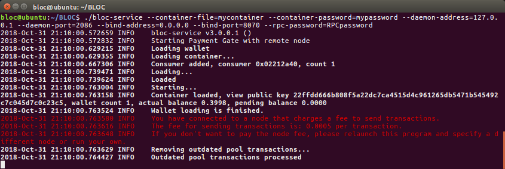


## **Command line Options**

### --help

Display the help message and configuration settings.

#### Example

```
./bloc-service --help
```

**Expected results**

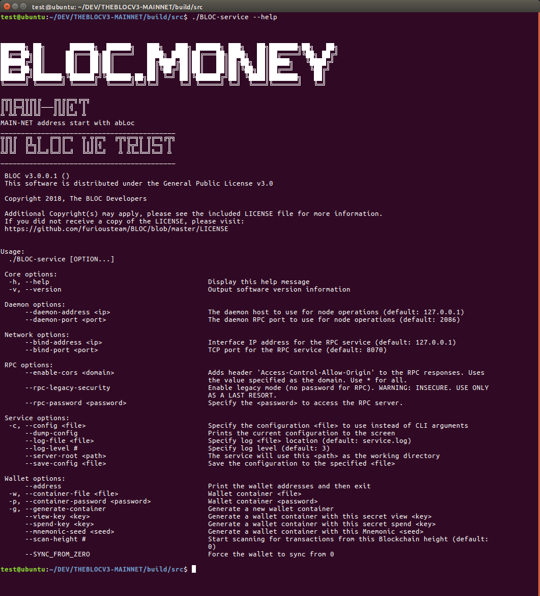


### --config arg (=myconf.conf)

Specify a configuration file to start bloc-service. This is much more simple to use if you have a particular configuration and you do not want to type all the arguments while launching bloc-service.

#### Example

```
./bloc-service --config=myconf.conf
```

### --version

Display the current version of bloc-service

#### Example

```
./bloc-service --version
```

**Expected results**

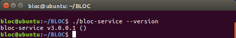


## **Command line arguments**

All the following command line options and arguments must be used when start **bloc-service**

* You can use them directly in the command line and provided examples
* Or you can use them in the config file which is the best option

### --bind-address arg (=127.0.0.1)**

* Interface for bloc-service RPC
* Started by default on 127.0.0.1 when running either you specified it `./bloc-service --config=myconf.conf`
* If you want to use local only : 127.0.0.1
* if you want to open to public : 0.0.0.0d)
* More details about the [JSON bloc-service API](../wallet-rpc-api.md)

#### Example

```
./bloc-service --bind-address=127.0.0.1 --container-file=mycontainer --container-password=mypassword --rpc-password=RPCpassword
```

### --bind-port arg (=8070)

* Port for bloc-service RPC
* Started by default on 8070 when running either you specified it `./bloc-service --config=myconf.conf`
* You can change the port here for ex 8071
* More details about the [JSON bloc-service API](../wallet-rpc-api.md)

#### Example

```
./bloc-service --bind-port=8071 --container-file=mycontainer --container-password=mypassword --rpc-password=RPCpassword
```

### --rpc-password

Setup the rpc password to connect to bloc-service

#### Example

```
./bloc-service --container-file=mycontainer --container-password=mypassword --rpc-password=RPCpassword
```

### --rpc-legacy-security arg (=8070)

* Enable legacy mode (no password for RPC). 
* **WARNING: INSECURE. USE ONLY AS A LAST RESORT.**

#### Example

```
./bloc-service --container-file=mycontainer --container-password=mypassword --rpc-legacy-security
```

### --container-file=(arg)

* Container file is the only file that stores all data required to run your bloc-service. It contains user addresses and private keys required to operate them.
* This function works only coupled with `--container-password` and `--generate-container`

### --container-password=(arg)

* Container password file is the only file that stores all data required to run your bloc-service. It contains user addresses and private keys required to operate them.
* This function works only coupled with `--container-file` and `--generate-container`

### --generate-container

* Generate a new container file with one wallet and exit.
* This function works only coupled with `--container-file` and `--container-password`

#### Example

```
./bloc-service  --container-file=mycontainer --container-password=mypassword --generate-container 
```

**Expected results**

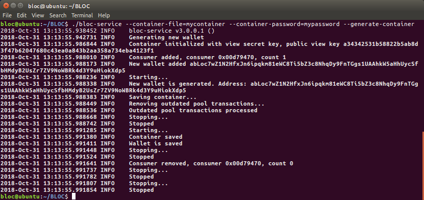

### --address

Start `bloc-service` to display the 1st wallet address in the container and exit

**Example**

```
./bloc-service --container-file=mycontainer --container-password=mypassword --rpc-password=RPCpassword --address
```

**Expected results**

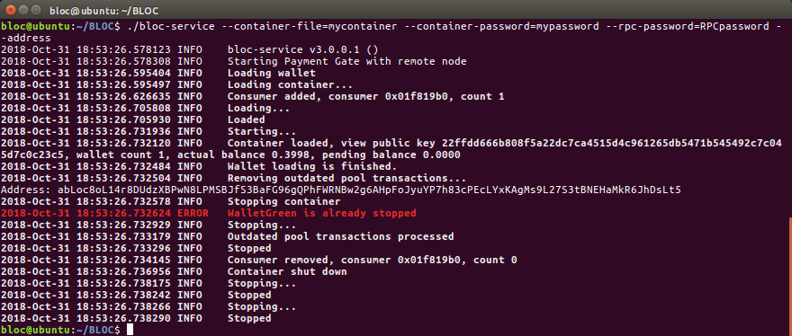


### --log-level

* Specify another log file than the original one created by BLOCd with a level 2
* There is 5 different level. The higher you choose, the more details you get.
* Log level must be 0...5

**Example**

```
./bloc-service --container-file=mycontainer --container-password=mypassword --rpc-password=RPCpassword --log-level=5
```

**Expected results**

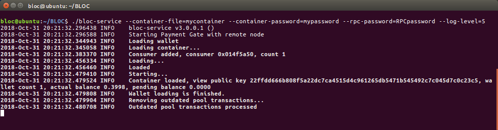


### --log-file

* Specify another log file than the original one created by BLOCd named (BLOCd.log)
* The specified log file will be created in the same folder where BLOCd was started

**Example**

```
./bloc-service --container-file=mycontainer --container-password=mypassword --rpc-password=RPCpassword --log-file=testme.log
```

**Expected results**


### --SYNC_FROM_ZERO

Re-synchronize the wallet from block 0.

**Example**

```
./bloc-service --container-file=mycontainer --container-password=mypassword --rpc-password=RPCpassword --SYNC_FROM_ZERO
```

**Expected results**


### --enable-cors arg

* Adds header 'Access-Control-Allow-Origin' to the bloc-service's RPC responses.
* Uses the value as domain
* Use * for all

**Example**

```
./bloc-service --container-file=mycontainer --container-password=mypassword --rpc-password=RPCpassword --enable-cors=*
```

**Expected results**


### --scan-height arg

The height to begin scanning for transactions at. This can greatly speed up wallet syncing time.

**Example**

```
./bloc-service --container-file=mycontainer --container-password=mypassword --rpc-password=RPCpassword --scan-height=100000
```

**Expected results**

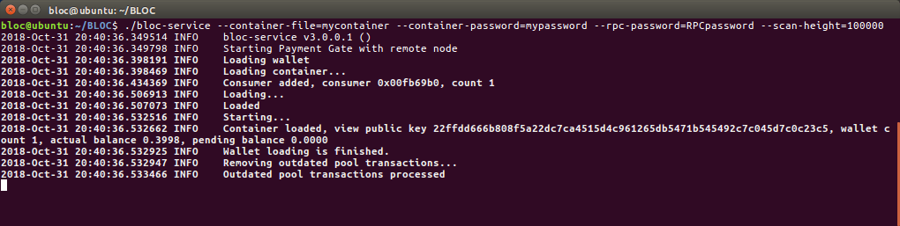


### --daemon

bloc-service RPC wallet can be started in both daemon and console modes. 

* Daemon mode - **bloc-service** RPC Wallet is launched in the background, while you can continue to work with a console window. 
* Console mode - **bloc-service** RPC Wallet is launched and prints log messages on the screen.
* BLOC RPC wallet starts in console mode by default.

**Example**

```
./bloc-service --container-file=mycontainer --container-password=mypassword --daemon --bind-address=0.0.0.0 --bind-port=2053 --rpc-password=RPCpassword
```

**Expected results**

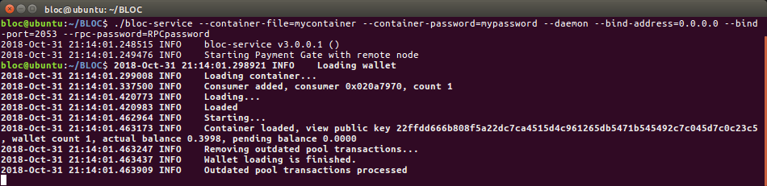


## **Create .CONF file**

* Create a txt file with your favorite text editor and open it.
* Check all your required parameters and enter them like in this example
* You need to type the arguments without the '--'

**Expected results**

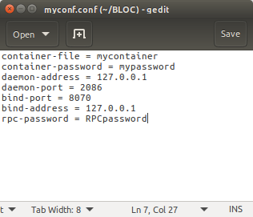

#### Example

```
container-file = mycontainer
container-password = mypassword
daemon-address = 127.0.0.1
daemon-port = 2086
bind-port = 8070
bind-address = 127.0.0.1
rpc-password = RPCpassword
```

[Download Example](images/bloc-service/myconf.conf)

* Place this file next to bloc-service
* Save it under the name `myconf.conf`

**Expected results**

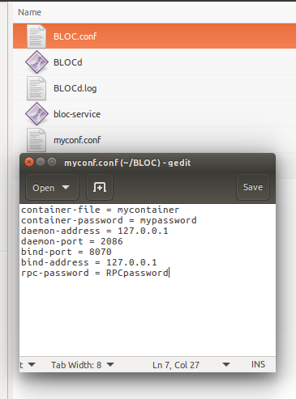

**Notes**

* Config file path is relative to current working directory, not server root.
* Options `container-file` and `container-password` should ALWAYS be set (in either command line or config file mode).
* Options `container-file` and `log-file` options are relative to `server-root`. `server-root` default is the current working directory.


## **Generate a new wallet**

To start using **bloc-service** you must first generate a container.
Container file is the only file that stores all data required to run your service. It contains user addresses and private keys required to operate them.
**Make sure to backup this file regularly**.

To generate a new container you should run the following command:

```
./bloc-service --container-file=mycontainer --container-password=mypassword --generate-container 
```

* `mycontainer` is the container file name and a path to it (relative or absolute); path is optional in this argument, specifying only a container name will result in new file located in the same folder as **bloc-service** 
* `mypassword` is a secret password for the new wallet & container file.
* `generate-container` option tells **bloc-service** to generate container file and exit.

**Expected results**


*Note: if `mycontainer` exists **bloc-service** will show you the notification and will ask you to provide a different name*

If the operation was successful you will get a corresponding message with your new **BLOC** address. At the same time **bloc-service** will save your container on the local disk (in the same folder where **bloc-service** is located and shut down.


## **Start bloc-service**

* To start **bloc-service** RPC wallet you can use both command line and config file. Config file allows you to configure your settings only once and use `--config` option further.
* The command below launches **bloc-service** RPC Wallet with a specific config file:

```
./bloc-service --config=myconf.conf
```

* You may specify BLOC config directly through console arguments. Here is the same config file as above in console: 

```
./bloc-service --container-file=mycontainer --container-password=mypassword --daemon-address=127.0.0.1 --daemon-port=2086 --bind-address=127.0.0.1 --bind-port=8070 --rpc-password=RPCpassword 
```

**Expected results**

Start with command line:

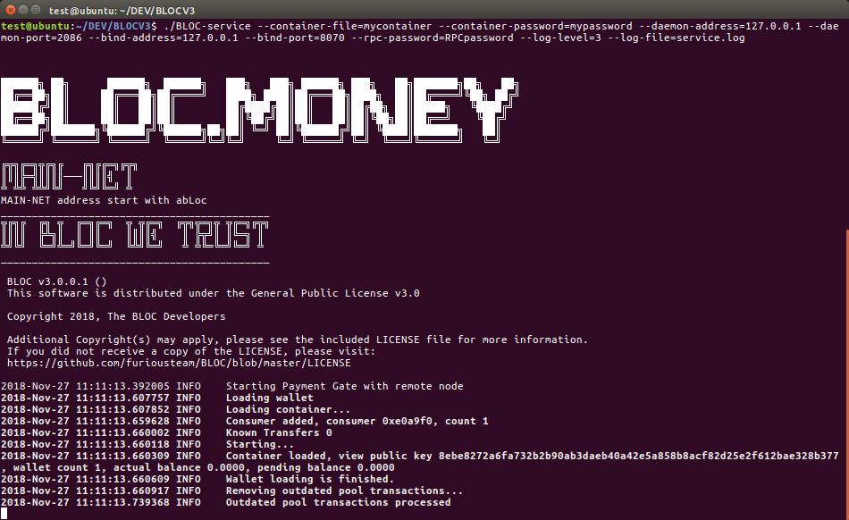

Start with myconf.conf:

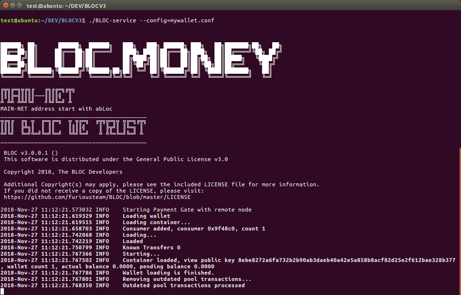

## **Restore a existing BLOC wallet with bloc-service**##

We have different option to recover a wallet using **bloc-service**

### Using a old Walletd container file

If you were using Walletd that come with the previous version of BLOC, the previous container file is compatible with the new version. This is the step to follow:

* Copy the your previous configuration file `yourfile.conf` and copy the acual container file `mycontainer`
* Paste this 2 files next to the new `bloc-service` and `BLOCd`
* Open `yourfile.conf` 
* Make sure you remove this line `testnet = no` we are not using this field anymore
* Edit like this:

```
container-file = mycontainer
container-password = mypassword
daemon-port = 2086
bind-port = 8070
bind-address = 127.0.0.1
rpc-password = RPCpassword
```
* Save the file
* Start `bloc-service` using this configuration file
* ```./bloc-service --config=myconf.conf```
* Please wait until the synchronisation is complete
* Your wallet is ready to be used with the **bloc-service** RPC API.

**Expected results**

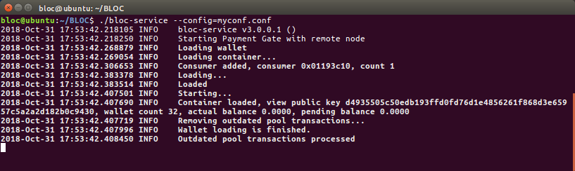


### Using your private spend key and view key

If you already have a [BLOC Wallet](../wallet/Making-a-Wallet.md) you must know your **private spend key** and your **private view key** to restore your wallet using **bloc-service**. To find how to generate view your private key using your favorite BLOC Wallet software please refer to the . [Wallet manuals available](../wallet/Making-a-Wallet.md).

* Create a txt file with your favorite text editor and open it.
* Check all your required parameters and enter them like in this example
* You need to type the arguments without the '--'
* Place this file next to bloc-service
* Save it under the name `myconf.conf`

```
container-file = mycontainer
container-password = mypassword
daemon-port = 2086
bind-port = 8070
bind-address = 127.0.0.1
rpc-password = RPCpassword
```
* Save the file

#### Generate a new container file

Generate a new container file with the following `--view-key` and `--spend-key` commands:

```
Enter your details:
./bloc-service --container-file=mycontainer --container-password=mypassword --view-key=myviewkey --spend-key=myspendkey --generate-container

Example:
./bloc-service --container-file=mycontainer --container-password=mypassword --view-key=e82ebf49b74fccd754e39ac3ca6fabca35277b012dfce0cf8921c216396b3108 --spend-key=cda47a19e5d433060ab79c885817cd20fc394dc7043ac875678a3698804ede01 --generate-container
```

**Expected results**

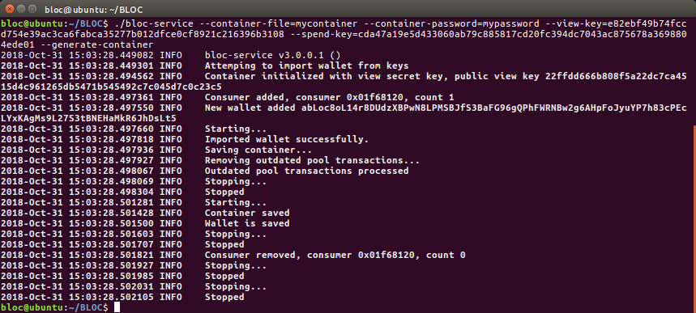


* Start `bloc-service` using your configuration file

```
./bloc-service --config=myconf.conf
```

* Your wallet is now loaded
* Please wait until the synchronisation is complete

**Expected results**

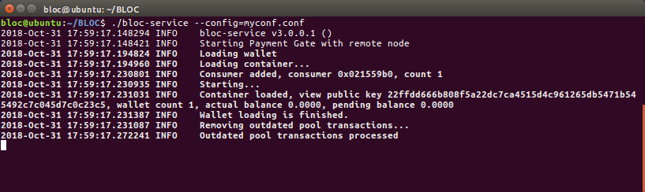


* Your wallet is ready to be used with the **bloc-service** RPC API.

**Expected results**

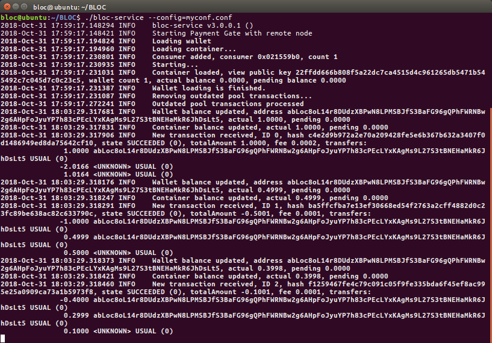


### Using your mnemonic-seed

If you already have a [BLOC Wallet](../wallet/Making-a-Wallet.md) created after the launch of the **BLOC V3.0** then you you must know your **mnemonic-seed** to restore your wallet using **bloc-service**. To find how to generate view your mnemonic-seed using your favorite **BLOC** Wallet software please refer to the [Wallet manuals available](../wallet/Making-a-Wallet.md).

* Create a txt file with your favorite text editor and open it.
* Check all your required parameters and enter them like in this example
* You need to type the arguments without the '--'
* Place this file next to bloc-service
* Save it under the name `mycontainer.conf`

```
container-file = mycontainer
container-password = mypassword
daemon-port = 2086
bind-port = 8070
bind-address = 0.0.0.0
rpc-password = RPCpassword
```
* Save the file

#### Generate a new container file

Generate a new container file with the following `--mnemonic-seed` commands:

```
Enter your details:
./bloc-service --container-file=mycontainer --container-password=mypassword --mnemonic-seed="your-mnemonic-seed" --generate-container

Example:
./bloc-service --container-file=mycontainer --container-password=mypassword --mnemonic-seed="jazz border dude orphans worry absorb slackens public drinks bovine evenings hurried roped jaws drinks snug directed pirate behind zero null cuisine agreed alchemy directed" --generate-container
```

**Expected results**

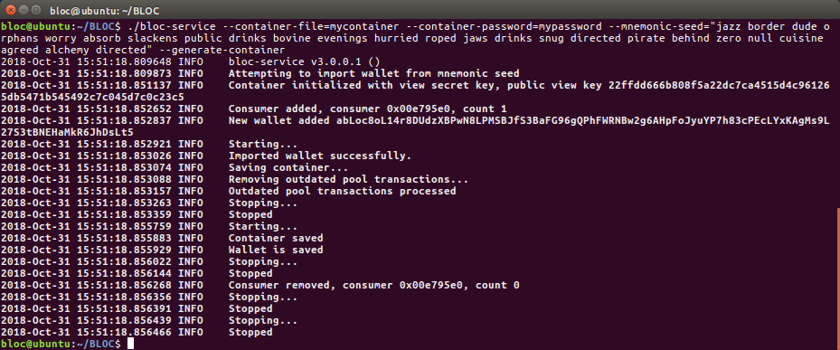


* Start `bloc-service` using your configuration file

```
./bloc-service --config=myconf.conf
```
* Your wallet is now loaded
* Please wait until the synchronisation is complete

**Expected results**

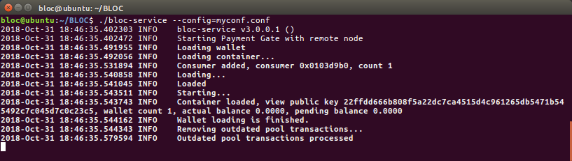

* Your wallet is ready to be used with the **bloc-service** RPC API.

**Expected results**

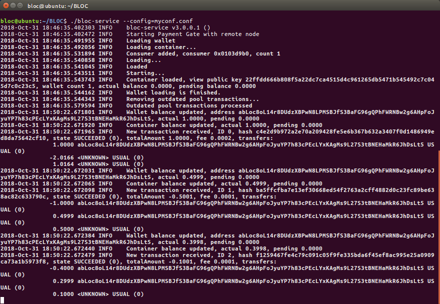


__________________________________________________________________________________________________


## BLOC-DEVELOPER

Make sure you visit the dedicated website [BLOC-DEVELOPER.com](https://bloc-developer.com) to find out more details and test your application.

If anything is missing or seems incorrect, please check the [GitHub issues](https://github.com/furiousteam/BLOC-wiki/issues) for existing known issues or [create a new one](https://github.com/furiousteam/BLOC-wiki/issues/new).