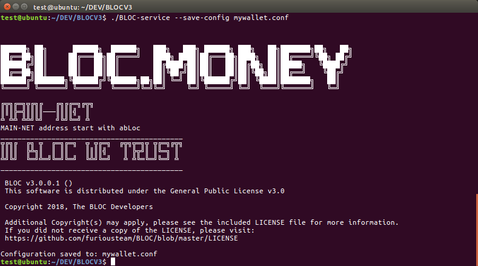
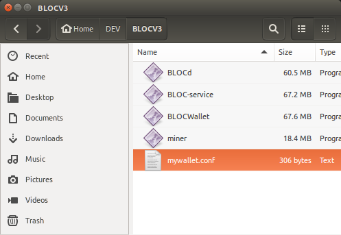
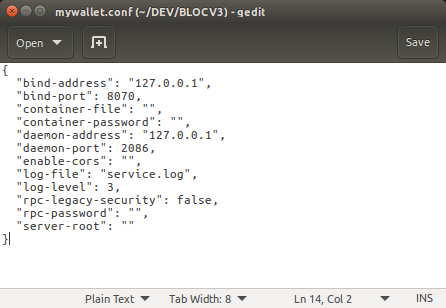

# **BLOC-service Command Line Arguments**

This section describes [BLOC-service](bloc-service-index.md) starting process with correct arguments enabling access to the [BLOC-service JSON RPC API](bloc-service-json-api.md)

To configure [BLOC-service RPC Wallet](bloc-service-index.md) you can use both command line and config file. Config file allows you to configure your settings only once and use [--config](https://bloc-developer.com/api_bloc-service/cli_arguments#--config) option further.

Almost all of the command line options can be defined through the configuration file. If a parameter is defined in the config and was also indicated in the command line, two behaviors are possible:
 
- If the parameter accepts one value only (e.g., [--bind-address](https://bloc-developer.com/api_bloc-service/cli_arguments#--bind-address)), the command line value will be used, since it has a higher priority
- If the parameter accepts several values, then command line and configuration file values will be merged
- If some of the options are not defined in the config, the default values will be applied

**Notes**:

- Config files, where used, now use JSON formatted files instead of INI
- Config files will be automatically upgraded to JSON and overwritten on first use
- Config file's path is relative to current working directory, not server root.
- Options [--container-file](https://bloc-developer.com/api_bloc-service/cli_arguments#--container-file) and [--container-password](https://bloc-developer.com/api_bloc-service/cli_arguments#--container-password) should ALWAYS be set (in either command line or config file mode).
- [--container-file](https://bloc-developer.com/api_bloc-service/cli_arguments#--container-file) and [--log-file](https://bloc-developer.com/api_bloc-service/cli_arguments#--log-file) options are relative to [--server-root](https://bloc-developer.com/api_bloc-service/cli_arguments#--server-root). "server-root" default is the current working directory.

To start using BLOC-service you must first create a new wallet by generating a container. Container file is the only file that stores all data required to run your service. It contains user addresses and private keys required to operate them. Make sure to backup this file regularly.

You can also restore a wallet using private keys with the [--view-key](#using-your-private-spend-key-and-view-key) and [--spend-key](#using-your-private-spend-key-and-view-key) argument or using a 25 words phrase [--mnemonic-seed](#using-your-mnemonic-seed).

A complete guide is available on this page of [how to restore your wallet with BLOC-service](#restore-a-existing-bloc-wallet-with-bloc-service). 

Once you have generated your wallet you can now connect BLOC-service to a local or remote [BLOCd Daemon](../service-operators/BLOCd-Overview). You can do this using the [--daemon-address](https://bloc-developer.com/api_bloc-service/cli_arguments#--daemon-address) and [--daemon-port](https://bloc-developer.com/api_bloc-service/cli_arguments#--daemon-port) arguments.
 

We are going to describe on this page how to generate your own config file, place it next to BLOC-service and start it like this:

- *Windows: : BLOC-service.exe --config-file=mywallet.conf*

- *Mac and Linux : ./BLOC-service --config-file=mywallet.conf*


## **BLOC-DEVELOPER**

This page is only a short guide how to get you started with BLOC-service configuration. Please visit the [dedicated section on the BLOC-DEVELOPER](https://bloc-developer.com/api_bloc-service/cli_arguments) website to view and test all the features available from the [BLOC-service](bloc-service-index.md).


## **Getting Started**

We are going to describe here the most standard configuration to start BLOC-service. For the full list and options make sure you visit the [dedicated section on the BLOC-DEVELOPER](https://bloc-developer.com/api_bloc-service/cli_arguments).


## **Generate a new wallet**

To start using **bloc-service** you must first generate a container using the [--generate-container](https://bloc-developer.com/api_bloc-service/cli_arguments#--generate-container) function.

Container file is the only file that stores all data required to run your service. It contains user addresses and private keys required to operate them.
**Make sure to backup this file regularly**.

To generate a new container you should run the following command:

Mac and Linux:
```
./BLOC-service --container-file=mycontainer --container-password=mypassword --generate-container
```

Windows:
```
BLOC-service.exe --container-file=mycontainer --container-password=mypassword --generate-container
```

* `mycontainer` is the container file name and a path to it (relative or absolute); path is optional in this argument, specifying only a container name will result in new file located in the same folder as **bloc-service** 
* `mypassword` is a secret password for the new wallet & container file.
* `generate-container` option tells **bloc-service** to generate container file and exit.

**Expected results**


*Note: if `mycontainer` exists **bloc-service** will show you the notification and will ask you to provide a different name*

If the operation was successful you will get a corresponding message with your new **BLOC** address. At the same time **bloc-service** will save your container on the local disk (in the same folder where **bloc-service** is located and shut down.


## **Create and customize your config file**

### Create

Once you have created your container you need to setup your configuration file so you can connect to your wallet.

Lanch BLOC-service with the [--save-config](https://bloc-developer.com/api_bloc-service/cli_arguments#--save-config) argument will save the default configuration file next to your BLOC-service software.


Mac and Linux:
```
./BLOC-service --save-config mywallet.conf
```

Windows:
```
BLOC-service.exe --save-config mywallet.conf

```

Screenshot:



A new file myconfig.conf should have been created as follow:



Open this file with any text editor:



You can view an example here:

```
{
  {
  "bind-address": "127.0.0.1",
  "bind-port": 8070,
  "container-file": "",
  "container-password": "",
  "daemon-address": "127.0.0.1",
  "daemon-port": 2086,
  "enable-cors": "",
  "log-file": "service.log",
  "log-level": 3,
  "rpc-legacy-security": false,
  "rpc-password": "",
  "server-root": ""
}
}
```
### Edit

Edit the config file following your needs. In this example we are going to use the details from our newly created container.

- Check the complete list of [BLOC-service Command Line Arguments](https://bloc-developer.com/api_bloc-service/cli_arguments) available.

- [container-file](https://bloc-developer.com/api_bloc-service/cli_arguments#--container-file): "mycontainer",
- [container-password](https://bloc-developer.com/api_bloc-service/cli_arguments#--container-password): "mypassword",
- [rpc-password](https://bloc-developer.com/api_bloc-service/cli_arguments#--container-file): "RPCpassword",

```
{
  "bind-address": "127.0.0.1",
  "bind-port": 8070,
  "container-file": "mycontainer",
  "container-password": "mypassword",
  "daemon-address": "127.0.0.1",
  "daemon-port": 2086,
  "enable-cors": "",
  "log-file": "service.log",
  "log-level": 3,
  "rpc-legacy-security": false,
  "rpc-password": "RPCpassword",
  "server-root": ""
}
```

If you would like to connect your wallet from an external IP address you need to use:

- "[bind-address](https://bloc-developer.com/api_BLOCd/cli_arguments#--bind-address)": "0.0.0.0",


## **Start bloc-service**

* To start **bloc-service** RPC wallet you can use both command line and config file. Config file allows you to configure your settings only once and use `--config` option further.
* The command below launches **bloc-service** RPC Wallet with a specific config file:

```
./BLOC-service --config=mywallet.conf
```

* You may specify BLOC config directly through console arguments. Here is the same config file as above in console: 

```
./BLOC-service --container-file=mycontainer --container-password=mypassword --daemon-address=127.0.0.1 --daemon-port=2086 --bind-address=127.0.0.1 --bind-port=8070 --rpc-password=RPCpassword --log-level=3 --log-file=service.log
```

**Expected results**

Start with command line:


Start with myconf.conf:


* Your wallet is ready to be used with the [BLOC-service JSON RPC API](bloc-service-json-api.md)


## **Restore a existing BLOC wallet with bloc-service**

We have differents options to recover a wallet using **bloc-service**

### Using a old Walletd container file

If you were using Walletd that come with the previous version of [BLOC](https://bloc.money), the previous container file is compatible with the new version. This is the step to follow:

* Copy the your previous configuration file `yourfile.conf` and copy the actual container file `mycontainer`
* Paste this 2 files next to the new `BLOC-service` and `BLOCd`
* Open `yourfile.conf` 
* Make sure you remove this line `testnet = no` we are not using this field anymore
* Edit like this:

```
container-file = mycontainer
container-password = mypassword
daemon-port = 2086
bind-port = 8070
bind-address = 127.0.0.1
rpc-password = RPCpassword
```
* Save the file

* Start `BLOC-service` using this configuration file

* `./BLOC-service --config=myconf.conf`

* Config files will be automatically upgraded to JSON and overwritten on first use

* Please wait until the synchronisation is complete

**Expected results**


* Your wallet is ready to be used with the [BLOC-service JSON RPC API](../wallet/bloc-service-json-api.md).


### Using your private spend key and view key

If you already have a [BLOC Wallet](../wallet/Making-a-Wallet.md) you must know your **private spend key** and your **private view key** to restore your wallet using **bloc-service**. To find how to generate view your private key using your favorite BLOC Wallet software please refer to the [Wallet manuals available](../wallet/Making-a-Wallet.md).

* [Create and customize your config file](#create-and-customize-your-config-file)
* [Check all your required parameters](https://bloc-developer.com/api_bloc-service/cli_arguments?lang=english) and enter them like in this example
* You need to type the arguments without the '--'
* Place this file next to BLOC-service
* Save it under the name `myconf.conf`

```
{
  "bind-address": "127.0.0.1",
  "bind-port": 8070,
  "container-file": "mycontainer",
  "container-password": "mypassword",
  "daemon-address": "127.0.0.1",
  "daemon-port": 2086,
  "enable-cors": "",
  "log-file": "service.log",
  "log-level": 3,
  "rpc-legacy-security": false,
  "rpc-password": "RPCpassword",
  "server-root": ""
}
```
* Save the file


#### Generate a new container file

Generate a new container file with your private keys using `--view-key` and `--spend-key` commands:

```
./BLOC-service --container-file=mycontainer --container-password=mypassword --view-key=myviewkey --spend-key=myspendkey --generate-container
```

```
./BLOC-service --container-file=mycontainer --container-password=mypassword --view-key=e82ebf49b74fccd754e39ac3ca6fabca35277b012dfce0cf8921c216396b3108 --spend-key=cda47a19e5d433060ab79c885817cd20fc394dc7043ac875678a3698804ede01 --generate-container
```

**Expected results**


* Start `BLOC-service` using your configuration file

```
./BLOC-service --config=myconf.conf
```

* Your wallet is now loaded
* Please wait until the synchronisation is complete

**Expected results**


**Expected results**


* Your wallet is ready to be used with the [BLOC-service JSON RPC API](bloc-service-json-api.md)


### Using your mnemonic-seed

If you already have a [BLOC Wallet](../wallet/Making-a-Wallet.md) created after the launch of the **BLOC V3.0** then you you must know your **mnemonic-seed** to restore your wallet using **bloc-service**. To find how to generate view your mnemonic-seed using your favorite **BLOC** Wallet software please refer to the [Wallet manuals available](../wallet/Making-a-Wallet.md).

* [Create and customize your config file](#create-and-customize-your-config-file)
* [Check all your required parameters](https://bloc-developer.com/api_bloc-service/cli_arguments?lang=english) and enter them like in this example
* You need to type the arguments without the '--'
* Place this file next to BLOC-service
* Save it under the name `mycontainer.conf`

```
{
  "bind-address": "127.0.0.1",
  "bind-port": 8070,
  "container-file": "mycontainer",
  "container-password": "mypassword",
  "daemon-address": "127.0.0.1",
  "daemon-port": 2086,
  "enable-cors": "",
  "log-file": "service.log",
  "log-level": 3,
  "rpc-legacy-security": false,
  "rpc-password": "RPCpassword",
  "server-root": ""
}
```
* Save the file

#### Generate a new container file

Generate a new container file with the following `--mnemonic-seed` commands:

```
Enter your details:
./BLOC-service --container-file=mycontainer --container-password=mypassword --mnemonic-seed="your-mnemonic-seed" --generate-container

Example:
./BLOC-service --container-file=mycontainer --container-password=mypassword --mnemonic-seed="jazz border dude orphans worry absorb slackens public drinks bovine evenings hurried roped jaws drinks snug directed pirate behind zero null cuisine agreed alchemy directed" --generate-container
```

**Expected results**


* Start `BLOC-service` using your configuration file

```
./BLOC-service --config=myconf.conf
```
* Your wallet is now loaded
* Please wait until the synchronisation is complete

**Expected results**


* Your wallet is ready to be used with the **bloc-service** RPC API.

**Expected results**


* Your wallet is ready to be used with the [BLOC-service JSON RPC API](bloc-service-json-api.md)


## **Remote Node options**

```
Remote Node Options:
  --daemon-address arg (=localhost)  daemon address
  --daemon-port arg (=2086)          daemon port
```

### --daemon-address arg (=127.0.0.1)
### --daemon-port arg (=2086)

Remote connection allows you to bind your **bloc-service** RPC Wallet to a remote BLOC daemon **BLOCd**. Such type of connection allows you to start **bloc-service** RPC Wallet without having to download the blockchain. Your wallet will be instantly synchronised. Always make sure that you trust the remote connection you are connecting to.

* For local daemons use localhost or 127.0.0.1 as an IP address.
* For remote daemons specify the remote daemon IP address.
* Default BLOC daemon port is 2086 (for rpc calls).

Use the following command to start **bloc-service** RPC Wallet with a remote connection: 

**Example**

```
./bloc-service --container-file=mycontainer --container-password=mypassword --daemon-address=IP.OF.YOUR.DAEMON --daemon-port=2086 --bind-address=0.0.0.0 --bind-port=8070 --rpc-password=RPCpassword
```

**Expected results**

```
You have connected to a node that charges a fee to send transactions.
The fee for sending transactions is: 0.0005 BLOC per transaction. 
If you don't want to pay the node fee, please relaunch BLOCWallet and specify a different node or run your own.
```


Congratulations! You have now properly setup BLOC-service and you are ready to use the [BLOC-service JSON RPC API](bloc-service-json-api.md)


## **BLOC-DEVELOPER**

Make sure you visit the dedicated website [BLOC-DEVELOPER.com](https://bloc-developer.com) to find out more details and test your application.

If anything is missing or seems incorrect, please check the [GitHub issues](https://github.com/furiousteam/BLOC-wiki/issues) for existing known issues or [create a new one](https://github.com/furiousteam/BLOC-wiki/issues/new).